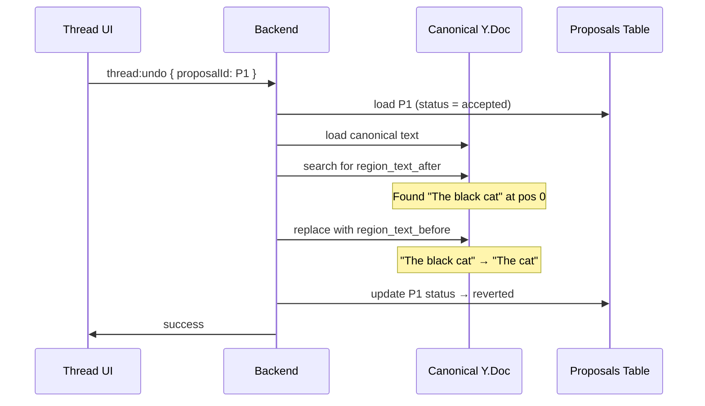

# Thread-Level Undo

## Overview

Thread-level undo lets the writer revert any individual AI edit through the conversation thread UI. Each AI `edit_document` call produces one proposal — the writer can undo that specific proposal at any time, regardless of how it was applied.

This works in both collaboration modes:
- **Auto-apply**: the edit landed automatically — writer clicks undo in thread UI to revert it
- **Manual**: the writer accepted a hunk containing the proposal — later clicks undo in thread UI to revert it

It persists across sessions and works days or weeks later, as long as the target text hasn't been modified.



It is separate from session Ctrl-Z:
- Session Ctrl-Z uses local UndoManager state and is ephemeral.
- Thread-level undo/redo uses persisted proposal text regions and status-gated backend commands.

## Storage

Thread-level operations use fields on `${TABLE_PREFIX}proposals`:

| Column | Type | Purpose |
|---|---|---|
| `region_text_before` | `TEXT NULL` | Captured at proposal creation from `edit_document` find text |
| `region_text_after` | `TEXT NULL` | Captured at proposal creation from `edit_document` replacement text |
| `status` | `TEXT` | Must be `accepted` for undo, `reverted` for redo |

No dedicated thread-undo table is required.

## Undo Flow (`accepted -> reverted`)

1. Receive `thread:undo { proposalId }`.
2. Load proposal row with `status = 'accepted'`.
3. Load canonical Y.Doc from latest checkpoint plus replayed `document_updates`.
4. Search `Y.Text('content')` for `region_text_after`.
5. If found, delete match and insert `region_text_before`.
6. Encode resulting Yjs delta as `yjs_update` and append to `document_updates`.
7. Update proposal row status to `reverted`.
8. If not found, return conflict.

## Redo Flow (`reverted -> accepted`)

1. Receive `thread:redo { proposalId }`.
2. Load proposal row with `status = 'reverted'`.
3. Load canonical Y.Doc from latest checkpoint plus replayed `document_updates`.
4. Search `Y.Text('content')` for `region_text_before`.
5. If found, delete match and insert `region_text_after`.
6. Encode resulting Yjs delta as `yjs_update` and append to `document_updates`.
7. Update proposal row status to `accepted`.
8. If not found, return conflict.

## Relationship to `_review_status`

Thread-level undo/redo does not mutate `_review_status`.

- `_review_status` exists for hunk decisions (`accepted`, `rejected`, `stale`) and session undo windows.
- Thread undo/redo is a separate post-review operation that mutates canonical text plus proposal row status (`accepted <-> reverted`).

Reverted proposals are not projection inputs. After accept, proposal CRDT items were already applied to canonical; thread undo then replaces canonical text. There is no remaining pending proposal update to project.

## Differences from Session Ctrl-Z

| Concern | Session Ctrl-Z | Thread-level undo/redo |
|---|---|---|
| Trigger | Editor keyboard action | Explicit API command |
| Scope | Recent local history | One persisted proposal |
| Mechanism | UndoManager over Yjs shared types | Text find-and-replace using stored regions |
| Status writes | `_review_status` map | Proposal DB row (`accepted`/`reverted`) |
| Persistence | No | Yes |
| Failure mode | No-op on empty stack | Conflict when target region missing |

### Example: Undo, Redo, and Conflict

```
Original: "The cat sat on the mat."
Agent proposes P1: insert "black " → region_text_before="The cat", region_text_after="The black cat"
Writer accepts P1.
Canonical: "The black cat sat on the mat."
```

**Undo (days later):**

```
1. Load P1 (status = accepted)
2. Search canonical for "The black cat" → found at pos 0
3. Replace with "The cat"
4. Canonical: "The cat sat on the mat."
5. P1 status → reverted
```

**Redo:**

```
1. Load P1 (status = reverted)
2. Search canonical for "The cat" → found at pos 0
3. Replace with "The black cat"
4. Canonical: "The black cat sat on the mat."
5. P1 status → accepted
```

**Conflict (writer edited the region):**

```
After accepting P1, writer manually changed "black cat" to "big black cat."
Canonical: "The big black cat sat on the mat."

Writer clicks Undo for P1:
  1. Search for "The black cat" → NOT FOUND
  2. Return conflict: text has been modified since accept
  3. Thread UI shows "Cannot undo — text was edited"
```

## What Does Not Exist

- No Yjs inverse column
- No Yjs snapshot dependency
- No per-hunk undo records
- No extra thread undo tables

## Cross-References

- [Session Undo Design](session-undo-design.md)
- [Architecture](architecture.md)
- [Schema Design](schema-design.md)
- [Implementation Plan](plan.md)
