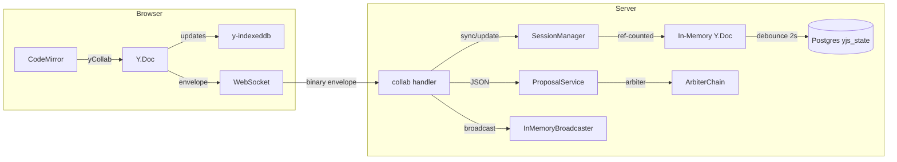
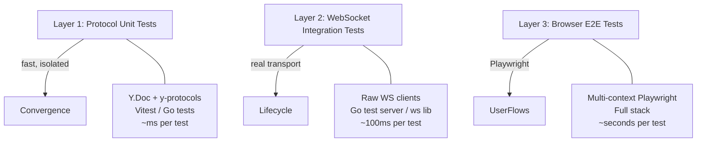
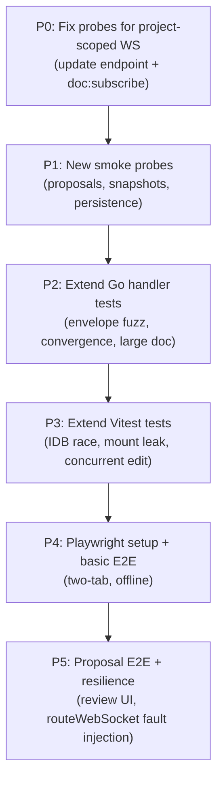

# Collab Smoke Testing Plan

**Status:** in-progress
**Scope:** Phases 1-4.6 (single-user Yjs + AI proposals over project-scoped WebSocket)

---

## Architecture Under Test



### Key Components

| Layer | Component | Key File(s) |
|---|---|---|
| Transport | Project-scoped WS, binary envelope (17-byte header) | `collab.go`, `collab_envelope.go`, `useProjectCollab.ts` |
| Sync | SyncStep1/2/Update, awareness envelope | `session_manager.go`, `cm6-collab/sync/runtime.ts` |
| Persistence | Debounced 2s write, auto-snapshot every 500 updates | `session_manager.go`, `collab/document_store.go` |
| Offline | y-indexeddb with WS race handling, 3s timeout | `useDocumentCollab.ts` |
| Proposals | AI proposal queue, arbiter auto-accept, inline diff review | `proposal_service.go`, `ProposalManager.ts` |

---

## Testing Layers



### Layer 1 — Protocol-Level (Vitest + Go)

Pure Y.Doc operations, no transport. Tests CRDT convergence invariants.

### Layer 2 — Transport Integration (Go test server + raw WS clients)

Real WebSocket connections against test server. Tests envelope protocol, auth, heartbeat, reconnect, message ordering.

### Layer 3 — Browser E2E (Playwright)

Full editor in browser. Tests IndexedDB, CodeMirror binding, proposal UI, offline/reconnect with real UX.

---

## Smoke Test Scenarios

### 1. Connection Lifecycle

| # | Scenario | Steps | Expected | Layer |
|---|---|---|---|---|
| 1.1 | Happy path connect | Open WS -> send JWT -> wait for `project:connected` | Ack received, connection stable | L2 |
| 1.2 | Bad JWT | Open WS -> send invalid JWT | Connection closed with auth error | L2 |
| 1.3 | Expired JWT | Open WS -> send expired JWT | Connection closed, client triggers token refresh | L2 |
| 1.4 | No auth within timeout | Open WS -> send nothing | Server closes after auth timeout | L2 |
| 1.5 | Heartbeat keepalive | Connect -> let heartbeat interval pass | Heartbeat sent/acked, connection stays open | L2 |
| 1.6 | Missed heartbeat | Connect -> suppress heartbeat ack | Server closes connection after timeout | L2 |
| 1.7 | Rate limiting | Send 31+ messages in 1 second | 1s mute applied, messages after mute delivered | L2 |

### 2. Document Sync (Single Client)

| # | Scenario | Steps | Expected | Layer |
|---|---|---|---|---|
| 2.1 | Subscribe fresh doc | `doc:subscribe` for new doc | SyncStep1 -> SyncStep2 -> `doc:subscribed`, empty Y.Text | L2 |
| 2.2 | Subscribe existing doc | Seed yjs_state in DB -> subscribe | SyncStep1 -> SyncStep2 with state -> client has content | L2 |
| 2.3 | Bootstrap from markdown | Doc has content but no yjs_state -> subscribe | Server bootstraps Y.Doc from markdown, client syncs | L2 |
| 2.4 | Send update after sync | Subscribe -> send Update envelope | Server applies, persists after 2s debounce | L2 |
| 2.5 | Multiple docs on one WS | Subscribe to 3 docs on same connection | Each gets independent SyncStep1/2, updates routed by doc UUID | L2 |
| 2.6 | Unsubscribe | Subscribe -> unsubscribe -> send update | Update ignored/dropped for unsubscribed doc | L2 |
| 2.7 | Subscribe/unsubscribe rapidly | Subscribe -> unsubscribe -> subscribe in <100ms | Final state is subscribed, no duplicate SyncStep1 | L2 |

### 3. Reconnection and Offline

| # | Scenario | Steps | Expected | Layer |
|---|---|---|---|---|
| 3.1 | Clean reconnect | Connect -> disconnect -> reconnect | Client replays subscriptions, SyncStep1/2 re-exchanged | L2 |
| 3.2 | Reconnect with pending edits | Connect -> disconnect -> type offline -> reconnect | Offline edits merged via Yjs sync, no data loss | L3 |
| 3.3 | Stale IndexedDB reconnect | Seed old IDB state -> connect to server with newer state | Server state wins merge, client catches up, no overwrite | L3 |
| 3.4 | Exponential backoff | Drop connection 5 times rapidly | Reconnect delays increase (up to 5s cap), no reconnect storm | L2 |
| 3.5 | Server restart | Connect + subscribe -> restart server -> wait | Client reconnects, re-subscribes, doc state intact | L2/L3 |
| 3.6 | Mid-sync disconnect | Disconnect after SyncStep1 but before SyncStep2 | Reconnect completes full sync, no partial state | L2 |
| 3.7 | Buffered frames before subscribed | Send binary update before `doc:subscribed` event | Frames buffered, flushed in order after subscribed | L2 |
| 3.8 | IndexedDB timeout | y-indexeddb takes >3s (simulate slow IDB) | WS sync proceeds, IDB loads later and merges | L3 |

### 4. Binary Envelope Protocol

| # | Scenario | Steps | Expected | Layer |
|---|---|---|---|---|
| 4.1 | Valid envelopes | Send SyncStep1/2/Update/Awareness with correct headers | Each processed correctly by type | L2 |
| 4.2 | Truncated frame | Send <17 bytes (incomplete header) | Server drops frame, connection stays alive | L2 |
| 4.3 | Wrong doc UUID | Send Update with non-subscribed doc UUID | Server drops/ignores, no crash | L2 |
| 4.4 | Unknown envelope type | Send envelope with type byte 0xFF | Server drops, logs warning, connection survives | L2 |
| 4.5 | Corrupted Yjs payload | Send valid header + random bytes as payload | Server rejects update, doc state unchanged | L2 |
| 4.6 | Duplicate update | Send same Yjs update twice | Idempotent — applied once, no duplicate content | L2 |
| 4.7 | Out-of-order updates | Send updates 3,1,2 | Yjs converges to correct state regardless of order | L2 |
| 4.8 | Zero-length payload | Send header with empty payload | Server handles gracefully, no crash | L2 |

### 5. Persistence and Snapshots

| # | Scenario | Steps | Expected | Layer |
|---|---|---|---|---|
| 5.1 | Debounced persistence | Send 10 updates in 1s -> wait 3s | Single write to DB, yjs_state + content + ai_content updated | L2 |
| 5.2 | Auto-snapshot trigger | Send 500+ updates | Snapshot created with type `auto` | L2 |
| 5.3 | Persistence after disconnect | Send updates -> disconnect -> wait 3s | Dirty state persisted even after client leaves | L2 |
| 5.4 | Content round-trip | Write content via Yjs -> persist -> load in new session | Content identical | L2 |
| 5.5 | Concurrent persistence race | Two rapid subscribe/unsubscribe cycles + updates | No lost writes, final state consistent | L2 |

### 6. AI Proposals

| # | Scenario | Steps | Expected | Layer |
|---|---|---|---|---|
| 6.1 | Proposal created and broadcast | Trigger AI edit -> proposal created | Client receives proposal event over WS | L2/L3 |
| 6.2 | Auto-accept flow | Project has auto_accept=true -> create proposal | Proposal auto-accepted, Yjs update applied, snapshot created | L2 |
| 6.3 | Manual accept | auto_accept=false -> create proposal -> accept via JSON cmd | Yjs update applied, proposal status updated | L2/L3 |
| 6.4 | Manual reject | Create proposal -> reject | Proposal discarded, doc unchanged | L2/L3 |
| 6.5 | Partial accept (hunk-level) | Multi-hunk proposal -> accept some, reject others | Only accepted hunks applied to Y.Doc | L3 |
| 6.6 | Proposal during offline | Disconnect -> AI creates proposal -> reconnect | Client receives proposal on reconnect | L2 |
| 6.7 | Concurrent human edit + proposal | User typing while AI proposal arrives | Human edits preserved, proposal shows correct diff against current state | L3 |
| 6.8 | Group accept | Multiple pending proposals -> group accept | All applied in order, no conflicts | L2 |
| 6.9 | Idempotent accept | Accept same proposal twice | Second accept is no-op (idempotency table) | L2 |

### 7. Undo/Redo

| # | Scenario | Steps | Expected | Layer |
|---|---|---|---|---|
| 7.1 | Local undo | Type text -> undo | Text removed | L3 |
| 7.2 | Local redo | Type -> undo -> redo | Text restored | L3 |
| 7.3 | Undo after AI proposal accept | Accept proposal -> undo | Only undoes tracked local operations, not the proposal | L3 |
| 7.4 | Undo stack after reconnect | Type -> disconnect -> reconnect -> undo | Undo stack preserved from Y.Doc state | L3 |

---

## Edge Cases and Failure Modes

### Critical Edge Cases

| # | Scenario | Risk | How to Test |
|---|---|---|---|
| E1 | **Stale IDB overwrites server** | y-indexeddb loads old state after WS sync, silently overwrites | Seed IDB with old snapshot, connect, verify server state preserved. Known issue: y-websocket#122, #161 |
| E2 | **Ghost awareness state** | Tab killed without graceful close, cursor remains | Kill browser process, verify awareness cleanup on remaining clients within timeout |
| E3 | **Memory leak on mount/unmount** | Y.Doc observers, WS listeners, timers not cleaned up | Mount/unmount editor 100 times, measure observer count + memory. Known issue: y-websocket#145, #150 |
| E4 | **Split-brain after partition** | Two clients isolated, both edit, partition heals | Simulate with delayed message delivery, verify CRDT merge convergence |
| E5 | **Large document initial sync** | 1MB+ Yjs state, slow initial load | Seed large doc, measure time-to-first-visible-text and memory |
| E6 | **Tombstone accumulation** | CRDT tombstones grow unbounded over thousands of edits | Make 10k edits, measure Yjs state size growth vs content size |
| E7 | **Race: subscribe during reconnect** | useDocumentCollab fires subscribe before project WS fully connected | Trigger doc open during reconnect window, verify subscription queued |
| E8 | **React StrictMode double-mount** | Double subscribe/unsubscribe in dev mode | Verify debounced subscribe handles StrictMode correctly (already addressed in code) |

### Network Edge Cases

| # | Scenario | How to Test |
|---|---|---|
| N1 | High latency (500ms+) | Playwright network throttling or `tc netem` |
| N2 | Intermittent drops (every 10s) | Programmatic WS close on timer |
| N3 | WebSocket blocked by proxy | Return 403 on upgrade request, verify graceful fallback/error |
| N4 | TLS certificate error | Connect to wrong host, verify clean error handling |
| N5 | Server sends close during active edit | Server-initiated close mid-update, verify no data loss |

### Browser Edge Cases

| # | Scenario | How to Test |
|---|---|---|
| B1 | Background tab throttling | Open doc, move tab to background, verify updates still queue |
| B2 | Multiple tabs same document | Open same doc in 2 tabs, verify both stay in sync via server |
| B3 | Browser crash recovery | Kill browser, reopen, verify IDB state loads and syncs |
| B4 | Large paste operation | Paste 100KB of text, verify single Yjs update, no chunking issues |
| B5 | Find-and-replace across synced doc | Run find-replace on large doc, verify atomic Yjs transaction |

### CodeMirror + Yjs Integration Edge Cases

| # | Scenario | How to Test |
|---|---|---|
| C1 | Cursor position after remote edit | Remote insert before cursor, verify cursor shifts correctly |
| C2 | Selection preservation during sync | Select text, remote edit arrives, verify selection adjusts |
| C3 | Decoration conflicts with Yjs markers | Apply decorations (live preview) while sync update arrives |
| C4 | Transaction ordering | Rapid local + remote edits in same CodeMirror transaction cycle |
| C5 | y-codemirror binding cleanup | Close editor, verify no lingering Y.Doc observers |
| C6 | IME composition + remote edits | CJK input mid-composition while remote insert arrives; verify no corruption |
| C7 | Bidi/emoji/surrogate pair index mapping | Unicode corpus edits; verify Yjs UTF-8 offsets match CM6 UTF-16 |

### Security Edge Cases

| # | Scenario | Severity | How to Test |
|---|---|---|---|
| S1 | **No Origin validation on WS upgrade (CSWSH)** | Critical | L2: send upgrade request with malicious Origin header; assert reject. Currently accepts all origins |
| S2 | **Token only verified at bootstrap** | High | L2: connect with valid JWT, let it expire, then send `doc:subscribe`; assert reauth required |
| S3 | **JWT replay from second client** | High | L2: capture token from client A, open client B with same token; verify session isolation |
| S4 | **Command payload fuzzing** | Medium | L2: send oversized UUIDs, nested JSON bombs, null bytes in command fields |
| S5 | **Rate-limit evasion via multi-connection** | Medium | L2: open 10 WS connections per user, flood from all; verify per-user rate limit |

### State Recovery Edge Cases

| # | Scenario | Severity | How to Test |
|---|---|---|---|
| R1 | **Corrupted/truncated yjs_state in DB** | Critical | L2: seed truncated binary blob; assert graceful fallback to markdown bootstrap, not panic |
| R2 | **Server crash before debounce flush** | High | L2: send edits, kill server before 2s debounce, restart; verify edits lost but doc intact |
| R3 | **In-memory Y.Doc diverges from persisted** | High | L2: edit, suppress persist callback, restart; compare reloaded state vs expected |
| R4 | **Snapshot restore races with live edits** | High | L2/L3: stream updates while triggering snapshot restore via REST; assert final convergence |
| R5 | **Partial persist failure (state saved, snapshot fails)** | High | L2: fault-inject snapshot store after state write; verify no stale snapshot reads |

### Protocol Deep Edge Cases (from Codex review)

| # | Scenario | Severity | How to Test |
|---|---|---|---|
| P1 | **Payload size boundary (64KB)** | High | L2: send payloads at 65535, 65536, 65537 bytes; verify no silent drops |
| P2 | **WS close code semantics** | High | L2/L3: inject close codes 1000/1001/1006/1008/1011; assert reconnect vs hard-stop |
| P3 | **Backpressure / slow consumer** | High | L2: delay reads on client side + burst broadcasts; verify heartbeat survives |
| P4 | **permessage-deflate interaction** | Medium | L2: test with compression on/off; verify binary envelope integrity |

### Multi-Tab Deep Edge Cases

| # | Scenario | How to Test |
|---|---|---|
| T1 | IDB upgrade blocked by another tab | L3: keep old tab open, force DB version bump, assert timeout/fallback |
| T2 | Tab A unsubscribes while tab B edits same doc | L3: rapid unsub/remount on A, continuous edits on B, assert no missed updates |
| T3 | 3+ tabs same doc join/leave storm | L3: 3 tabs churn subscribe/unsubscribe, verify awareness/session cleanup |
| T4 | Different docs per tab + network flap | L3: 5 docs across tabs, kill WS, verify subscription replay for all |

### Yjs-Specific Gotchas

| # | Scenario | Severity | How to Test |
|---|---|---|---|
| Y1 | **V1 vs V2 update format** | High | L1: build update corpus in both formats; verify decode handles both or rejects cleanly |
| Y2 | **gc=true vs gc=false behavioral drift** | Medium | L1: run same edit sequence both modes; verify undo/diff consistency |
| Y3 | **mergeUpdates perf cliff** | High | L1: merge 1k incremental updates; benchmark time + memory; set threshold |

---

## Test Infrastructure

### Directory Structure (top-level, cross-cutting)

```
tests/                                    # black-box tests (need running system)
  README.md                               # conventions + how to run
  smoke/                                  # fast probes against running dev server
    run.sh                                # orchestrator: token refresh, health, run all
    helpers.sh                            # shared bash: env, auth, status_code(), create_temp_*()
    collab/
      handshake/
        smoke.sh                          # auth gates + sync handshake
        probe.go                          # standalone Go WS client
      sync/
        smoke.sh                          # append + reconnect + persistence verify
        probe.go                          # standalone Go WS client with Yjs ops
      proposals/                          # (scaffolded, probe not yet written)
      snapshots/                          # (scaffolded, probe not yet written)
      persistence/                        # (scaffolded, probe not yet written)
    documents/                            # (scaffolded, REST CRUD probes)
    projects/                             # (scaffolded, REST CRUD probes)
    threads/                              # (scaffolded, SSE + REST probes)
    auth/                                 # (scaffolded, JWT probes)
  e2e/                                    # Playwright (needs frontend + backend)
    README.md                             # setup + directory plan
    collab/                               # (scaffolded, no specs yet)
  fixtures/                               # (scaffolded, seed data)
  playbooks/                              # LLM-driven exploratory testing
    README.md                             # playbook format spec
    collab/
      ws-sync-roundtrip.md               # first playbook: connect -> edit -> reconnect
```

Package-level tests stay in their existing locations:
- Go unit/integration: `backend/internal/.../*_test.go`
- Vitest unit: `frontend/tests/.../*.test.ts`

### Progress

| Item | Status |
|---|---|
| Directory structure + READMEs | Done |
| `tests/smoke/helpers.sh` (shared bash utilities) | Done |
| `tests/smoke/run.sh` (orchestrator) | Done |
| `tests/smoke/collab/handshake/` (migrated from tmp/) | Done |
| `tests/smoke/collab/sync/` (migrated from tmp/) | Done |
| `tests/playbooks/collab/ws-sync-roundtrip.md` | Done |
| Update probes for project-scoped WS (`/ws/projects/{id}` + `doc:subscribe`) | Done |
| `tests/smoke/collab/proposals/` probe | Done |
| `tests/smoke/collab/snapshots/` probe | Done |
| `tests/smoke/collab/persistence/` probe | Done |
| `tests/smoke/documents/` REST probes | Done |
| `tests/smoke/projects/` REST probes | Done |
| `tests/smoke/threads/` SSE probes | TODO |
| Playwright setup + first spec | TODO |
| Additional Vitest unit tests | TODO |

### Known Issue: Probes Use Old WS Endpoint — RESOLVED

The Go probes previously dialed `/ws/documents/{id}` (per-document endpoint).
Updated to project-scoped WS at `/ws/projects/{projectId}` with:
1. Connect to `/ws/projects/{projectId}`
2. Send JWT, wait for `project:connected` ack
3. Send `doc:subscribe` JSON command
4. Exchange binary envelopes with 17-byte header (type + 16-byte doc UUID)

---

## How Each Layer Works

### Layer 2: Go probe scripts + Go integration tests (bulk of testing)

The binary envelope protocol (17-byte header + Yjs payloads) requires real WebSocket clients -- not curl.

**Go smoke probes** (`tests/smoke/`): Standalone `package main` programs run via `go run` from bash wrappers. Each probe dials a real WS endpoint, performs a specific test sequence, prints `[smoke] PASS/FAIL`.

```
bash smoke.sh -> sources helpers.sh (env, auth, fixture creation)
              -> go run probe.go --url $WS_URL --token $TOKEN
                    |
                    +-- Dials ws://localhost:PORT/ws/projects/{id}
                    +-- Sends JWT as first text message
                    +-- Waits for "project:connected" JSON ack
                    +-- Sends doc:subscribe JSON
                    +-- Exchanges binary SyncStep1/2 envelopes
                    +-- [smoke] PASS / FAIL
```

**Go integration tests** (`backend/internal/handler/*_test.go`): In-process `httptest.NewServer` with real WS connections. Uses shared test doubles (`testJWTVerifier`, `testCollabStore`, `spySessionManager`).

**What to add (extend existing patterns):**

| New Test File | Scenarios Covered | Approach |
|---|---|---|
| `collab_envelope_fuzz_test.go` | 4.2-4.8 (truncated, corrupted, unknown type, zero-length) | Go fuzz testing against real handler |
| `collab_convergence_test.go` | E4 (split-brain), 4.6-4.7 (duplicate/out-of-order) | 3 concurrent WS clients, verify Y.Doc convergence |
| `collab_large_doc_test.go` | E5, E6 (large doc, tombstones) | Seed 1MB state, measure sync time + memory |
| `collab_persistence_test.go` | 5.1-5.5 (debounce, snapshot trigger, disconnect flush) | Spy on store write calls with timestamps |

### Layer 1: Vitest unit tests (frontend protocol logic)

Existing tests in `frontend/tests/`: `projectCollab.test.ts`, `cm6-collab/runtime-*.test.ts`, `collabProposals.test.ts`, `collabReview.test.ts`, `documentCollabTransport.test.ts`.

**What to add:**

| New Test File | Scenarios Covered | Approach |
|---|---|---|
| `idb-ws-race.test.ts` | E1, 3.3, 3.8 (stale IDB vs WS) | Mock IDB with delayed resolve, verify WS state wins merge |
| `mount-unmount-leak.test.ts` | E3, C5 (observer/timer cleanup) | Mount/unmount 100x, assert observer count = 0 |
| `proposal-concurrent-edit.test.ts` | 6.7 (human typing + proposal arrival) | Apply local Y.Text insert mid-proposal, verify both present |

### Layer 3: Playwright browser E2E (`tests/e2e/`)

Needed because Vitest can't test: IndexedDB persistence, CodeMirror rendering, real WebSocket in browser, visual proposal diff review.

Key Playwright capabilities for collab testing:

- **Multi-context**: two browser contexts = two users on same doc
- **`routeWebSocket`**: intercept/delay/drop/corrupt WS frames in-flight
- **Network interception**: `page.route` to simulate offline
- **CDP**: heap snapshots for memory leak detection

**What to add:**

| New Spec File | Scenarios Covered | Approach |
|---|---|---|
| `collab-basic.spec.ts` | 2.1-2.4, manual checklist items | Open doc, type, refresh, verify persisted |
| `collab-two-tabs.spec.ts` | B2, E4 | Two browser contexts on same doc, type in each, verify convergence |
| `collab-offline.spec.ts` | 3.2, 3.5, N5 | `page.route` to block WS, type offline, unblock, verify merge |
| `collab-proposal-review.spec.ts` | 6.1-6.5 | Trigger proposal via API, verify inline diff UI, accept/reject |
| `collab-resilience.spec.ts` | 3.6, N1-N2 | `routeWebSocket` to inject latency, mid-sync drops |

### LLM Playbooks (`tests/playbooks/`)

Structured markdown instructions for exploratory testing by LLM agents. Each playbook defines: goal, prerequisites, setup, probes with expected outcomes, invariants, teardown, and report format. Stable probes graduate into real Go/Playwright tests.

---

## Execution

### Running the Tests

```bash
# Layer 1: Vitest (frontend, no server needed)
cd frontend && pnpm run test

# Layer 2: Go integration tests (no server needed, in-process httptest)
cd backend && make test

# Layer 2: Go probe smoke tests (REQUIRES running dev server)
./scripts/get-token.sh           # refresh JWT in .env
bash tests/smoke/run.sh          # run all smoke probes
bash tests/smoke/run.sh collab   # collab only

# Layer 3: Playwright E2E (REQUIRES frontend + backend running)
npx playwright test --config tests/e2e/playwright.config.ts
```

### Existing Infrastructure to Reuse

| Existing Asset | Reuse For |
|---|---|
| `frameEnvelope()` / `unframeEnvelope()` in `collab_test.go` | All new Go handler tests |
| `testJWTVerifier`, `testCollabStore`, `spySessionManager` | All new Go handler tests |
| `MockWebSocket` in `projectCollab.test.ts` | New Vitest tests |
| `createBaseDoc()`, `buildRelativeUpdate()` in `collabReview.test.ts` | IDB race + concurrent edit tests |
| `scripts/get-token.sh` | Auth for smoke probes + Playwright |
| `tests/smoke/helpers.sh` | All new smoke probe scripts |

### Priority Order



---

## Chaos Engineering

Beyond simple network drops -- systematic fault injection for high-confidence validation:

| Scenario | What It Tests | Tool |
|---|---|---|
| Asymmetric partition (send works, receive blocked) | Split-brain perceptions, one-way sync | Toxiproxy directional drop |
| Server `SIGSTOP` during active edits | Heartbeat false timeout + replay burst on resume | `kill -STOP` / `kill -CONT` |
| Postgres I/O slowdown | Debounce flush misses, persist backlog | Inject DB latency via proxy or `pg_sleep` |
| Clock skew (+/- 5 min) | JWT expiry timing, backoff drift | `faketime` or container time offset |
| Memory pressure soak | Latent leak amplification | Heap limit + reconnect loops for 30 min |

---

## Production Monitoring (complement to smoke tests)

Smoke tests catch bugs before deploy. These metrics catch them in production:

| Metric | Detects | Alert Threshold |
|---|---|---|
| `sync_time_ms` (subscribe to first visible text) | Slow convergence | p99 > 2s |
| `ws_close_code_count{code}` | Transport instability | Spike in 1006/1011 |
| `persist_lag_seconds` (time since last dirty flush) | Pending data loss window | > 10s |
| `state_size_bytes` per document | Tombstone/memory bloat | > 5x content size |
| `idb_timeout_rate` | Offline path regressions | > 5% |
| `proposal_idempotency_conflicts` | Replay/duplicate anomalies | Any non-zero spike |

---

## Real-World Failure Modes (from Yjs GitHub Issues)

| Issue | Failure | Relevance to Meridian |
|---|---|---|
| y-websocket#122 | Mobile Safari network change causes stale local state to overwrite server | Meridian uses y-indexeddb; must verify IDB-loaded state merges correctly on reconnect |
| y-websocket#161 | Page refresh lets client overwrite server-reloaded doc | Same stale-authority class -- test refresh during active sync |
| yjs#273 | Temporary missing Y.Map keys during sync | Don't assert intermediate UI state during initial merge |
| y-websocket#145, #150 | Memory leaks from docs-map cleanup paths | Add soak tests for connect/disconnect and doc open/close loops |
| y-indexeddb#25 | IDB blocked event when multiple tabs have different DB versions | Test multi-tab with forced version bump |
| WebKit#247943 | Safari WebSocket silently dies on network change | Test reconnect behavior specifically in WebKit |

---

## Manual Smoke Test Checklist (Quick Version)

For manual verification before deploy:

- [ ] Open document, type text, see it persist (refresh page, content still there)
- [ ] Disconnect WiFi, type text, reconnect, verify merge
- [ ] Open same doc in 2 tabs, type in one, see update in other
- [ ] Trigger AI edit, see proposal appear, accept it
- [ ] Trigger AI edit, reject it, verify doc unchanged
- [ ] Refresh page rapidly 5 times, verify no duplicate content
- [ ] Open a large document (1000+ lines), verify sync completes
- [ ] Close tab without saving, reopen, verify IDB cached state loads
- [ ] Check browser console for WebSocket errors during normal editing (should be clean)
- [ ] Check Network tab: verify binary frames flowing, no excessive reconnects
