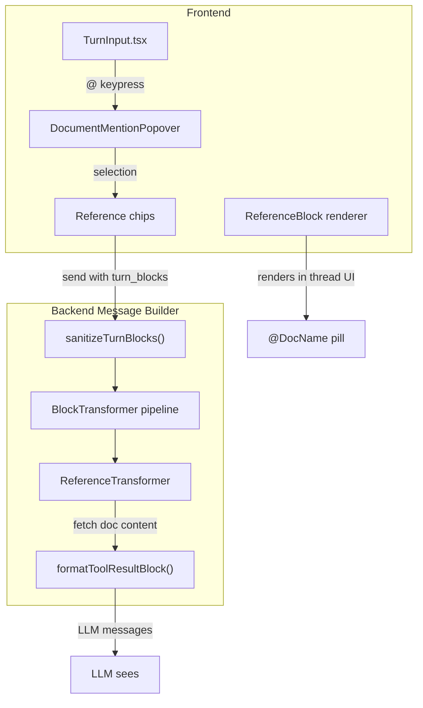

# @-File References + Message Builder Pipeline

**Status:** Ready to implement
**Priority:** High
**Estimated effort:** 2–3 days
**Depends on:** `fb-wikilinks-and-internal-links.md` Phase 1 (parser + resolver)
**Depended on by:** `fb-compaction.md` (reuses BlockTransformer pipeline)

## Problem Statement (WHY)

Writers working in thread conversations need to reference documents ("Aria's character sheet", "Chapter 12", "Magic system rules") so the LLM can see the full content. Today, writers must copy/paste content manually or hope the LLM remembers what it edited earlier.

This plan adds **@-file insertion in the thread composer** and builds the **message builder pipeline** — a block transformation layer that resolves reference blocks into document content the LLM can see. This pipeline is also the infrastructure compaction will build on.

## Current State

### What Works
- `BlockTypeReference` exists in content types — `backend/internal/domain/models/llm/content_types.go`
- `ValidateContent()` already validates reference blocks (requires `ref_id`, `ref_type`)
- `TurnInput.tsx` handles message composition with textarea
- Block renderer registry supports registering new block types — `frontend/src/features/threads/components/blocks/registry.ts`
- `MessageBuilderService.BuildMessages()` processes turns through sanitize -> format pipeline — `backend/internal/service/llm/thread_history/message_builder.go`
- `DocumentService.GetDocument()` available for fetching document content — `backend/internal/domain/services/docsystem/document.go`

### What's Missing
- `@` insertion UI in thread composer (TurnInput uses textarea, not CM6)
- Reference block renderer in thread UI
- `BlockTransformer` interface for the message builder pipeline
- `ReferenceTransformer` to resolve reference blocks into document content for the LLM

## Architecture



### Data flow: Sending a reference

1. User types `@` in composer -> `DocumentMentionPopover` appears
2. User selects document -> chip appears below textarea, `@DocName` inserted inline
3. User sends message -> API receives turn blocks: `[text_block, ...reference_blocks]`
4. Backend stores blocks as-is (reference blocks with `ref_id` + `ref_type`)
5. On next LLM call, `MessageBuilderService` runs `ReferenceTransformer`:
   - Fetches document content via `DocumentService.GetDocument()`
   - Replaces reference block with text block containing `<referenced_document>` XML
6. LLM sees the full document content inline in the conversation

## Implementation Plan

### Phase 1: @-File in Thread Composer (1 day)

#### 1A: DocumentMentionPopover

**Create**: `frontend/src/features/threads/components/DocumentMentionPopover.tsx`

- Triggers on `@` keypress in TurnInput textarea
- Filters `useTreeStore().documents` by typed query (case-insensitive substring match)
- On selection:
  1. Add to `attachedRefs` local state -> show dismissible **chip below textarea**
  2. Insert `@DocumentName` text inline in textarea (readability in message text)
  3. Both chip and inline text reference the same document

UX details:
- Popover positioned relative to textarea (above or below depending on space)
- Arrow keys navigate list, Enter/Tab selects, Escape dismisses
- Chip shows document name with `x` button to remove
- Removing chip does NOT remove inline `@DocName` text (text is just for readability)

#### 1B: Modify turn sending

**Modify**: `frontend/src/core/lib/api.ts`

`api.turns.send()` includes reference blocks in the turn payload:

```typescript
turn_blocks: [
  { block_type: 'text', text_content: message, content: null },
  ...attachedRefs.map(ref => ({
    block_type: 'reference',
    text_content: null,
    content: { ref_id: ref.documentId, ref_type: 'document' }
  }))
]
```

Already valid per backend's `ValidateContent()` for `BlockTypeReference`.

#### 1C: Render references in thread

**Create**: `frontend/src/features/threads/components/blocks/ReferenceBlock.tsx`

- Pill that shows `@DocName`, clickable -> opens document via `openDocument()`
- Styled distinctly from regular text (subtle background, icon)

**Modify**: `frontend/src/features/threads/components/blocks/registry.ts`

- Register `reference` renderer: `registerBlockRenderer('reference', ReferenceBlock)`

#### 1D: Thread store updates

**Modify**: `useThreadStore` — `createTurn` / `startNewThread` accept optional `references` param so the store can pass them through to the API call.

#### Files
- **Create**: `frontend/src/features/threads/components/DocumentMentionPopover.tsx`
- **Create**: `frontend/src/features/threads/components/blocks/ReferenceBlock.tsx`
- **Modify**: `frontend/src/features/threads/components/blocks/registry.ts`
- **Modify**: `frontend/src/features/threads/components/TurnInput.tsx`
- **Modify**: `frontend/src/core/lib/api.ts`
- **Modify**: Thread store (createTurn/startNewThread signatures)

---

### Phase 2: Backend BlockTransformer Pipeline (1 day)

#### 2A: BlockTransformer interface

**Create** `backend/internal/service/llm/thread_history/transformer.go`

```go
// BlockTransformer transforms turn blocks before they are sent to the LLM.
// Transformers run in sequence during BuildMessages(), after sanitization
// and before tool result formatting.
type BlockTransformer interface {
    Transform(ctx context.Context, turn *llmModels.Turn, blocks []llmModels.TurnBlock) ([]llmModels.TurnBlock, error)
}
```

This follows the same pattern as `ToolResultFormatter` — single-method interface, registered in a pipeline.

#### 2B: ReferenceTransformer

**Create** `backend/internal/service/llm/thread_history/reference_transformer.go`

```go
type ReferenceTransformer struct {
    documentSvc domain.DocumentService
    projectID   string
    userID      string
    logger      *slog.Logger
}
```

Behavior:
- For each `reference` block in the turn:
  1. Parse `ReferenceContent` from block's `Content` field
  2. Fetch document via `DocumentService.GetDocument(ctx, projectID, userID, refID)`
  3. Replace the reference block with a text block containing:

```xml
<referenced_document path="Characters/Heroes/Aria.md">
[full document content - ai_version if exists, else content]
</referenced_document>
```

- On error (doc deleted, permission denied): log warning, insert fallback text:
  `[Referenced document not found: <ref_id>]`
- Constructed per-request (needs `projectID` and `userID` from request context)

#### 2C: Pipeline integration

**Modify** `backend/internal/service/llm/thread_history/message_builder.go`

Add transformers to `MessageBuilderService`:

```go
type MessageBuilderService struct {
    formatterRegistry  *formatting.FormatterRegistry
    capabilityRegistry *capabilities.Registry
    transformers       []BlockTransformer  // NEW
    logger             *slog.Logger
}

// WithTransformers returns a copy with the given transformers.
// Used per-request to inject request-scoped transformers (e.g., ReferenceTransformer).
func (mb *MessageBuilderService) WithTransformers(t ...BlockTransformer) *MessageBuilderService {
    clone := *mb
    clone.transformers = t
    return &clone
}
```

Pipeline order in `BuildMessages()`:
1. `sanitizeTurnBlocks()` — structural validity (existing)
2. **Transformer pipeline** — resolve references (NEW)
3. `formatToolResultBlock()` — tool-specific formatting (existing)

```go
// In BuildMessages(), after sanitizing blocks:
for _, transformer := range mb.transformers {
    blocks, err = transformer.Transform(ctx, &turn, blocks)
    if err != nil {
        return nil, fmt.Errorf("transformer error: %w", err)
    }
}
```

#### 2D: Wire per-request

**Modify** `backend/internal/service/llm/streaming/service.go` in `startStreamingExecution()`:

```go
refTransformer := threadhistory.NewReferenceTransformer(
    s.documentSvc, threadContext.projectID, req.UserID, s.logger,
)
builder := s.messageBuilder.WithTransformers(refTransformer)
messages, err := builder.BuildMessages(ctx, path)
```

#### Files
- **Create**: `backend/internal/service/llm/thread_history/transformer.go`
- **Create**: `backend/internal/service/llm/thread_history/reference_transformer.go`
- **Modify**: `backend/internal/service/llm/thread_history/message_builder.go`
- **Modify**: `backend/internal/service/llm/streaming/service.go`

## Dependency Graph

```
fb-wikilinks Phase 1 (parser/resolver)
      ↓ (shared code, not blocking)
Phase 1 (composer @-file) -> Phase 2 (message builder pipeline)
```

Phase 1 and Phase 2 can be developed in parallel if the API contract for reference blocks is agreed upfront (it already exists in `ValidateContent`).

## Key Existing Code to Reuse

| What | Where |
|---|---|
| `ReferenceContent` type | `backend/internal/domain/models/llm/content_types.go` |
| `ValidateContent()` for reference blocks | Same file |
| `DocumentService.GetDocument()` | `backend/internal/domain/services/docsystem/document.go` |
| `FormatterRegistry` pattern (registry + single-method interface) | `backend/internal/service/llm/formatting/formatter.go` |
| `sanitizeTurnBlocks()` | `backend/internal/service/llm/thread_history/message_builder.go` |
| Block renderer registry | `frontend/src/features/threads/components/blocks/registry.ts` |
| `openDocument()` | `frontend/src/core/lib/panelHelpers.ts` |
| `useTreeStore().documents` | Frontend tree store |

## Testing

### Frontend
- Type `@` in composer -> document list appears, filtered by query
- Select document -> chip appears below textarea, `@DocName` in message text
- Remove chip -> chip disappears (inline text stays)
- Send message with reference -> turn stored with reference block
- Reference block renders as clickable `@DocName` pill in thread

### Backend
- Reference block in turn -> `BuildMessages()` outputs text block with `<referenced_document>` content
- Missing document -> fallback text, no crash
- Multiple references in one turn -> all resolved
- Non-reference blocks pass through unchanged

### Integration
- Send message with `@Aria` reference -> LLM response demonstrates awareness of Aria's content
- Delete referenced document -> next LLM call gracefully handles missing doc

## Success Criteria

- [ ] `@` in thread composer shows document picker popover
- [ ] Selected document appears as dismissible chip + inline `@DocName`
- [ ] Reference blocks stored correctly in backend
- [ ] Reference blocks render as pills in thread UI
- [ ] LLM sees `<referenced_document>` with full document content
- [ ] Missing documents handled gracefully (warning log + fallback text)
- [ ] `BlockTransformer` interface extensible for future transformers (compaction)

## Risks & Mitigations

| Risk | Mitigation |
|---|---|
| Large documents exceed context window when referenced | Future: token budget awareness. v1: warn if document is very large. |
| Stale content (document edited after reference created) | By design: `ReferenceTransformer` fetches **current** content at send-time. Reference is a pointer, not a snapshot. |
| Multiple references to same document | Deduplicate in transformer (or accept the redundancy — LLM handles it fine). |
| Textarea limitations vs CM6 | v1: simple popover is sufficient. Future: CM6-based composer if richer editing needed. |

## Related Documentation

- `_docs/plans/fb-wikilinks-and-internal-links.md` — Parser + resolver (shared dependency)
- `_docs/plans/fb-compaction.md` — Compaction (builds on BlockTransformer pipeline)
- `backend/internal/service/llm/thread_history/message_builder.go` — Pipeline integration point
- `backend/internal/domain/models/llm/content_types.go` — Reference content types
- `frontend/src/features/threads/components/blocks/registry.ts` — Block renderer registry
