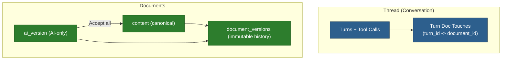

# Document History V1 (Snapshots + AI Review)

**Status:** In planning
**Priority:** High
**Estimated effort:** 2–5 days (full-stack, depending on UI depth)

## Problem Statement (WHY)

Meridian currently stores AI suggestions in `documents.ai_version` (with `ai_version_rev` CAS). This is a good writer-first editing model, but it is not durable history:

- Writers need **restore/undo across sessions** (accidents happen).
- LLM edits are often **cross-cutting** (many files touched). Writers need a “go review this” surface.
- Project-wide “Accept all” is risky without rollback.

**Goal:** Add per-document history snapshots and per-turn “touched documents” tracking, while keeping `ai_version` as the AI-only draft.

## Research Signals (WHY THESE CHOICES)

Patterns that work in practice:

- **Layered model**: canonical content + suggestion/draft layer + immutable history (Google Docs, Overleaf).
- **Review unit**: multi-file edits are reviewed as a grouped unit (GitHub PR).
- **Non-destructive restore**: restore creates a new head; it should never delete future history.
- **Keep branching constrained** early (Figma branching avoids branch-of-branch by default).

Meridian should follow the same approach: keep the writer mental model simple, and make correctness/rollback obvious.

## Definitions / Semantics (WHAT)

- **AI suggestions exist** for a document iff `documents.ai_version IS NOT NULL`.
- **Hunk Accept/Reject**: applies only selected diff hunks in the editor; `ai_version` typically remains until all hunks are resolved.
- **Accept all (doc)**: resolves all pending AI suggestions for the document.
- **Accept all (project)**: resolves all pending AI suggestions for all docs in a project.
- **Document history snapshot**: immutable saved `content` used for restore/audit.
- **Restore**: sets `content` to a prior snapshot, creating a new snapshot as the new head (non-destructive).

## Current State

### What Works ✅
- AI suggestions stored as `documents.ai_version`.
- CAS protection for AI draft updates via `documents.ai_version_rev`.
- Editor supports hunk accept/reject and “Accept all” for the open document (client-side).
- A lightweight `GET /api/documents/{id}/ai-status` exists for polling (frontend uses it).

### What's Missing ❌
- No durable per-document snapshot history (no restore/undo across sessions).
- No thread/turn-level “docs the LLM touched” list to drive review workflows.
- Project-wide “Accept all” lacks rollback safety until snapshots exist.

## Proposed Architecture

Key idea:
- Keep `ai_version` as the mutable AI draft.
- Add immutable snapshots of **canonical** `content`.
- Record which docs were mutated per turn to enable “Review touched files”.

## Data Model (V1)

### `document_versions` (new)

Store immutable snapshots of `documents.content`.

Minimal columns:
- `id` UUID
- `document_id` UUID (indexed)
- `parent_version_id` UUID nullable (enables future branching; V1 uses linear parent chain)
- `kind` TEXT: `checkpoint|ai_accept_all|restore|import|system`
- `reason` TEXT nullable (user-provided checkpoint name, short auto reason)
- `content` TEXT
- `content_hash` TEXT (sha256; for dedupe/debug)
- `created_by_user_id` TEXT
- `created_by_thread_id` UUID nullable
- `created_by_turn_id` UUID nullable
- `created_at` TIMESTAMPTZ

### `documents.head_version_id` (new)

Pointer to the latest snapshot for restore/audit.

WHY:
- Makes parent chaining explicit and fast.
- Makes “lazy baseline snapshot” safe: if `head_version_id` is null, create a baseline snapshot once.

### `turn_document_touches` (new read model)

Tracks which documents were mutated by tools in a given turn.

Minimal columns:
- `id` UUID
- `thread_id` UUID
- `turn_id` UUID
- `document_id` UUID
- `touch_kind` TEXT: `ai_version_write` (V1)
- `created_at` TIMESTAMPTZ

Uniqueness:
- Unique `(turn_id, document_id, touch_kind)` to avoid duplicates.

WHY:
- Writer-first review entrypoint: “this turn touched these docs”.
- Avoids parsing potentially-large turn blocks on every UI refresh.

## Retention / Cost Controls (Supabase Free Friendly)

History snapshots store full text; storage grows with doc size.

Default policy (configurable):
- Keep all `kind=checkpoint` (writer intent).
- Keep last `N` auto snapshots per document (default `N=20`).
- Optional TTL for auto snapshots (default 30 days).

Configuration:
- Default from env config.
- Optional per-project override in `projects.preferences` (recommended).

WHY:
- Keeps rollback safety without uncontrolled storage growth.
- Lets you adjust without migrations.

### Retention Implementation (No Cron Required)

Prefer pruning on write to avoid relying on scheduled jobs:
- When inserting an auto snapshot (non-checkpoint), delete older auto snapshots beyond `N` for that `document_id`.
- Optionally delete auto snapshots older than TTL at the same time.

WHY:
- Supabase free tiers often don’t have reliable server-side cron available by default.
- “Prune on write” keeps storage bounded without additional infra.

## Schema Notes (Indexes / Constraints)

Add indexes that match the UI access patterns:
- `document_versions(document_id, created_at DESC)` for history list.
- Partial index for auto snapshots if TTL/pruning queries filter by `kind != 'checkpoint'`.
- `turn_document_touches(thread_id, turn_id, created_at)` for thread review pagination.

Constraints:
- `turn_document_touches` unique `(turn_id, document_id, touch_kind)`.
- `documents.head_version_id` nullable, but all restore/accept operations must ensure a baseline exists first.

## Backend APIs (V1)

### Document Versions
- `GET /api/documents/{id}/versions`
  - list metadata only (no content).
- `GET /api/versions/{id}`
  - returns snapshot content + metadata.
- `POST /api/documents/{id}/checkpoints`
  - body: `{ reason: string }`
  - creates `kind=checkpoint`, updates `head_version_id`.
- `POST /api/documents/{id}/restore`
  - body: `{ version_id: uuid }`
  - behavior:
    - ensure baseline snapshot exists
    - set `documents.content` to snapshot content
    - clear `documents.ai_version` (recommended)
    - create new snapshot `kind=restore` as new head

### Turn Touched Docs
- `GET /api/threads/{id}/touched-docs?from_turn_id=&limit=`
  - returns list of turns with touched doc ids (and optionally display path).

WHY this endpoint:
- Gives the UI a single request to build the “review this” panel.

### Accept All (Doc vs Project)

Naming in UI stays “Accept all”.

Backend operations:
- `POST /api/documents/{id}/ai/accept-all`
  - atomically:
    - ensure baseline snapshot exists
    - set `content = ai_version`
    - set `ai_version = NULL`
    - bump `ai_version_rev`
    - create snapshot `kind=ai_accept_all` and update `head_version_id`
- `POST /api/projects/{id}/ai/accept-all`
  - same semantics applied to all docs with `ai_version IS NOT NULL`
  - returns `{ updatedCount, updatedDocumentIds }`

WHY keep “doc accept-all” as server op:
- Enables tree/banner accept without opening docs.
- Avoids client downloading/uploading merged content to perform “accept all”.

## Transactions / Invariants (Correctness)

For any operation that changes canonical content (restore/accept-all):
- Run in a DB transaction.
- Create snapshots as part of the transaction.
- Update `head_version_id` as part of the transaction.

Required invariants:
- Restore is non-destructive (always creates a new head).
- Exactly one active `ai_version` per document.
- AI tools always operate on `ai_version` if present, else `content` (existing behavior).

## Rollout / Migration

Start safe and incremental:
1. Add schema + baseline snapshot logic (lazy baseline).
2. Ship read-only history list + snapshot get.
3. Ship manual checkpoints.
4. Ship restore (creates new head).
5. Upgrade doc/project “Accept all” to create snapshots (making it undoable).

WHY:
- Each step is independently valuable and low-risk.
- Keeps the UX writer-first: no sudden new complexity.

## Frontend UX (V1)

### Tree Banner (Project AI Status)

See `_docs/plans/fb-tree-ai-suggestions-banner-accept-all.md`.

Add a “Review” affordance:
- Banner shows count of docs with suggestions.
- Dropdown lists affected docs (jump to file).
- Optional “Review recent AI touches” entry opens thread-scoped review.

### Thread Review Panel

In thread UI, add a “Touched files” section:
- For each turn: show list of documents touched (path + name).
- Clicking jumps to document and opens editor diff view.

WHY:
- Mirrors GitHub “files changed”, but writer-first and turn-based.

### History Drawer (Per Document)

In editor:
- History drawer lists snapshots.
- Actions: Preview, Restore (creates new head), Create checkpoint.

## Refresh Strategy (Event-Driven + Polling)

Use `_docs/plans/fb-event-driven-refresh-framework.md`:
- On `TURN_COMPLETE`, refresh:
  - project ai-status (for tree banner)
  - thread touched-docs list (for review panel)
- Poll fallback (30s) while project open + visible.

WHY:
- Keeps tree/review state correct for out-of-band AI changes.

## Implementation Plan

### Phase 1: Backend schema + endpoints (1–2 days)
- Add tables/columns + indexes.
- Implement checkpoint/versions list/get/restore.
- Implement doc accept-all and project accept-all with snapshot creation.
- Implement touched-doc logging on tool execution (doc-edit path).

### Phase 2: Frontend “touched files” + history drawer (1–2 days)
- Thread UI: touched docs list by turn.
- Editor history drawer with restore/checkpoint.

### Phase 3: Tie into tree banner + refresh (0.5–1 day)
- Wire touched-doc refresh on `TURN_COMPLETE`.
- Ensure accept-all refreshes tree/active editor appropriately.

## Testing

Backend:
- restore creates a new head snapshot and updates content correctly.
- accept-all clears ai_version and creates snapshot(s).
- retention logic respects checkpoint vs auto.
- touched-docs recorded exactly once per (turn, doc).

Frontend:
- thread touched docs list updates after AI run.
- history restore updates editor content and clears banner for that doc.

## Risks & Mitigations

| Risk | Mitigation |
|---|---|
| Snapshot storage costs | Auto snapshot caps + TTL; keep all checkpoints only |
| Races with pending saves | Best-effort flush before bulk accept-all (see tree banner plan) |
| Confusing naming (apply vs accept) | Use “Accept” UI everywhere; reserve “apply” for internal implementation |

## Related Documentation

- `_docs/plans/fb-tree-ai-suggestions-banner-accept-all.md`
- `_docs/plans/fb-event-driven-refresh-framework.md`
- `_docs/future/ideas/ai-behaviors/ai-editing-workspace.md`

## References (External)

- Google Docs: version history + restore: https://support.google.com/docs/answer/190843
- Google Docs: suggestion mode (accept/reject): https://support.google.com/docs/answer/6033474
- Overleaf: history/versioning: https://docs.overleaf.com/writing-and-editing/history-and-versioning
- Overleaf: track changes: https://docs.overleaf.com/collaborating/track-changes
- GitHub: reviewing PR changes: https://docs.github.com/en/pull-requests/collaborating-with-pull-requests/reviewing-changes-in-pull-requests/reviewing-proposed-changes-in-a-pull-request
- Figma: guide to branching: https://help.figma.com/hc/en-us/articles/360063144053-Guide-to-branching
- Cursor: checkpoints: https://docs.cursor.com/en/agent/chat/checkpoints
