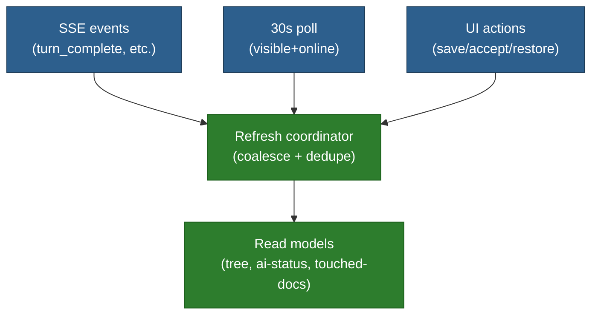

# Event-Driven Refresh Framework (SSE + Poll Fallback)

**Status:** In planning
**Priority:** High
**Estimated effort:** 0.5–1.5 days

## Problem Statement (WHY)

Meridian has multiple ways state can change:
- user actions in the UI
- AI tool calls mutating server state (often out-of-band from the current view)
- streaming/SSE events

Without a consistent refresh strategy, the tree, editor, and thread UI can drift out of sync or require heavy polling.

## Goal (WHAT)

Provide a single refresh/coalescing layer that supports:
- event-driven refresh on relevant SSE events (especially `TURN_COMPLETE`)
- low-frequency polling fallback (default 30s) while project is open + visible + online
- dedupe/coalescing so multiple triggers don’t cause request storms

## Core Idea

## Read Models To Refresh

Keep refresh targets explicit and small:
- Project tree (structure)
- Project AI status (docs with `ai_version`)
- Thread touched-docs (docs mutated by tools per turn)
- Active document (only if affected)

WHY:
- These are the key writer-facing surfaces that need freshness.
- They can be fetched efficiently as compact endpoints.

## Trigger Matrix (V1)

On `TURN_COMPLETE`:
- if a doc-mutating tool ran (e.g. `doc_edit`, `text_editor`):
  - refresh project AI status
  - refresh thread touched-docs
  - refresh tree if doc creation occurred

On “Accept all” / “Restore”:
- refresh project AI status
- refresh active doc if it was affected
- refresh touched-docs list if the action is tied to a turn

## Poll Fallback

Poll interval: 30s (configurable).

Only poll when:
- project is open
- tab is visible
- online

WHY:
- protects free-tier resources while still healing missed events.

## Implementation Notes

Minimal coordinator responsibilities:
- accept “refresh intents” (named targets)
- coalesce within a short window (e.g. 250–500ms)
- drop redundant in-flight requests
- expose debug state (what’s queued, last refresh times)

## Related Documentation

- `_docs/plans/fb-tree-ai-suggestions-banner-accept-all.md`
- `_docs/plans/fb-document-history-v1.md`

