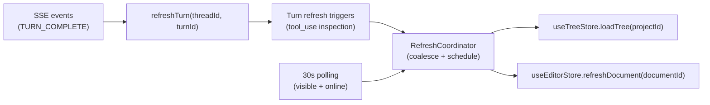

# Event-Driven Refresh Framework (Tree + Active Document)

**Status:** In planning  
**Priority:** High  
**Estimated effort:** 0.5–1.5 days (frontend-only)

## Problem Statement (WHY)

Meridian has multiple UI surfaces that depend on backend state changing during/after a thread run (SSE streaming + tool execution). Today, our refresh behavior is incomplete and ad-hoc:

- The **document tree** can go stale when tools create/rename/move documents/folders, because we do not consistently reload `GET /api/projects/{id}/tree`.
- We do refresh the **active document** in some cases, but only for the currently open doc and without a general “refresh framework”.

We need a **SOLID, event-driven refresh framework** so:
- Tool-driven mutations (esp. `doc_edit`) correctly propagate to the right UI surfaces.
- We avoid refresh storms (duplicate fetches) and refresh loops (effects re-running because they subscribe to the same store they mutate).
- We have a clear place to add future refresh targets (e.g., project AI suggestion status).

## Current State

### What Works ✅
- Thread streaming is handled via SSE; on `TURN_COMPLETE` we `refreshTurn(...)`.
- On `TURN_COMPLETE` we also call `useEditorStore.refreshDocument(activeDocId)` (active doc only). See:
  - `frontend/src/features/threads/hooks/sse/eventHandlers/lifecycleEventHandlers.ts`

### What’s Missing ❌
- No consistent mechanism to refresh the **tree** after tool-driven document changes.
- No structured mapping from “tool input/output” → “which data should refresh”.
- No polling fallback for out-of-band changes (other tab/device, tab suspended, SSE disconnect).

## Architecture Context (WHAT)

### Design goals (SOLID)
- **SRP:** One module owns “refresh scheduling/coalescing”, not each event handler.
- **OCP:** Adding a new tool-triggered refresh shouldn’t require reworking SSE plumbing.
- **Explicit > Implicit:** A concrete tool→refresh mapping table is the source of truth.
- **Design for debuggability:** Log refresh reasons and coalescing decisions.

### Proposed high-level flow

## Refresh Taxonomy

Define refresh targets explicitly:

| Refresh target | Scope | Implementation | Notes |
|---|---|---|---|
| `tree` | project | `useTreeStore.getState().loadTree(projectId)` | Reloads folder/doc hierarchy |
| `activeDocument` | document | `useEditorStore.getState().refreshDocument(documentId)` | Fetches full doc; only correct when we know the doc ID |

## Tool Trigger Matrix (current tools only)

Current tool set (see `backend/internal/domain/models/llm/tool_definition.go`):
- `doc_view` (read-only)
- `doc_tree` (read-only)
- `doc_search` (read-only)
- `doc_edit` (mutating: writes to `ai_version` and can create docs)

We only trigger refresh for tools that can mutate tree/doc state.

| Tool | Input discriminator | Triggered refresh | Why |
|---|---|---|---|
| `doc_view` | any | none | read-only |
| `doc_tree` | any | none | read-only |
| `doc_search` | any | none | read-only |
| `doc_edit` | `command=create` | `tree` | new document must appear in explorer |
| `doc_edit` | `command=str_replace` | `activeDocument` (conditional) | active doc should show new `ai_version` ASAP |
| `doc_edit` | `command=insert` | `activeDocument` (conditional) | same |
| `doc_edit` | `command=append` | `activeDocument` (conditional) | same |

### “Conditional activeDocument refresh” rules

Only refresh `activeDocument` when the tool’s target document matches the currently open doc:

1. Resolve `doc_edit.path` → `documentId` using the existing tree store arrays (`documents`, `folders`). Reuse logic from `frontend/src/features/threads/utils/docPathResolver.ts`.
2. Compare with `useEditorStore.getState()._activeDocumentId`.
3. If matched, call `useEditorStore.getState().refreshDocument(documentId)`.

If the doc can’t be resolved (e.g., tree is stale), do nothing for `activeDocument` refresh and rely on:
- subsequent tree refresh (if `create`), or
- polling fallback + normal editor polling mechanisms.

## Implementation Plan

### Phase 1: Define trigger extraction (1–2 hours)
- Add a small utility that inspects a refreshed `Turn` and yields refresh requests:
  - input: `Turn` blocks (tool_use + tool_result)
  - output: `{ tree?: boolean, activeDocument?: string[] }`
- Source of truth is the Tool Trigger Matrix above.

### Phase 2: Add RefreshCoordinator (2–4 hours)
- Implement a UI-free coordinator that exposes:
  - `requestTreeRefresh(projectId, reason)`
  - `requestDocumentRefresh(documentId, reason)`
- Coalescing rules:
  - At most 1 in-flight refresh per `(target, id)`
  - If requests arrive while in-flight, queue exactly 1 follow-up (merge reasons)
  - Don’t start refresh when `document.visibilityState === 'hidden'` or `navigator.onLine === false` (but keep a queued request to run when conditions improve).
- Debug logging:
  - `reason`, `coalesced`, `skipped_hidden`, `skipped_offline`.

### Phase 3: Wire TURN_COMPLETE to coordinator (1–2 hours)
- In `frontend/src/features/threads/hooks/sse/eventHandlers/lifecycleEventHandlers.ts`:
  1. After `refreshTurn(threadId, turnId)` resolves, read the updated turn from `useThreadStore.getState()`.
  2. Extract refresh triggers from the turn.
  3. Determine `projectId` via `useProjectStore.getState().currentProjectId`.
  4. Call coordinator methods for the computed targets.
- Keep the existing active document refresh behavior, but prefer the trigger-based approach so it’s intentional and tool-driven.

### Phase 4: Polling fallback + initial refresh (1–2 hours)
- Add a low-frequency poll (30s) for tree refresh, scoped to active project.
- Trigger a tree refresh once on project load (initial hydration).
- Guards:
  - don’t poll when hidden/offline
  - coordinator dedupes polling vs event-driven refresh

## Polling Spec (30 seconds)

- Interval: **30s**
- Enable when:
  - `currentProjectId != null`
  - visible + online
- Action: `requestTreeRefresh(projectId, 'poll_30s')`

## Testing

### Unit
- Coordinator coalescing:
  - many `requestTreeRefresh` calls → one `loadTree` invocation (+ at most one queued follow-up).
- Trigger extraction:
  - `doc_edit.command=create` triggers tree
  - `doc_edit.command=str_replace` triggers document refresh only when path resolves and matches active doc

### Manual verification
- Run a thread that issues `doc_edit.command=create` → new doc appears in tree after `TURN_COMPLETE`.
- Run a thread that edits the currently open doc → editor reflects updated `ai_version` after `TURN_COMPLETE` (without manual reload).
- Background/out-of-band: leave tab idle; after 30s poll, tree reflects changes made elsewhere (if any).

## Success Criteria
- [ ] Tree updates after tool-driven doc creation without manual reload.
- [ ] Active document refresh happens only when the tool targets the active doc.
- [ ] No refresh storms during rapid tool execution (coalescing works).
- [ ] Polling (30s) keeps tree eventually consistent for out-of-band changes.

## Risks & Mitigations

| Risk | Mitigation |
|---|---|
| Over-refreshing tree on every turn | Only refresh tree when trigger extraction says so; polling is low-frequency |
| Infinite loops from store subscriptions | Coordinator uses `getState()` reads only; no React subscription in effects |
| Stale path resolution (doc not found) | Best-effort refresh; rely on tree refresh + polling to eventually resolve |

## Related Documentation
- `frontend/src/features/threads/hooks/sse/eventHandlers/lifecycleEventHandlers.ts`
- `frontend/src/core/stores/useTreeStore.ts`
- `frontend/src/core/stores/useEditorStore.ts`
- `frontend/src/features/threads/utils/docPathResolver.ts`
