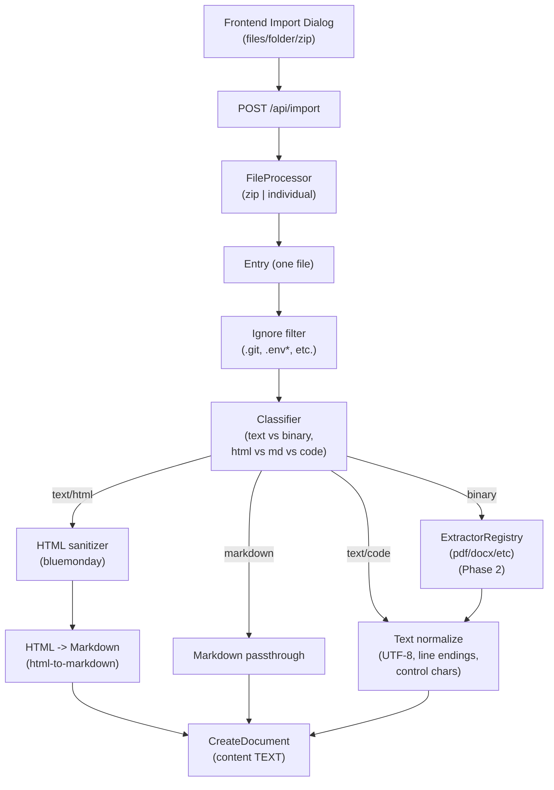

# Import “Any File” as Cleaned Text (Markdown | Plaintext | Code View)

**Status:** In planning
**Priority:** High
**Estimated effort:** 5–12 days (full-stack; depends on Phase 2 extractors)

## Problem Statement (WHY)

Meridian’s current import flow is optimized for writer-native formats (markdown/text/HTML). Writers also have substantial legacy material and research in other formats:

- **Code** (scripts, generators, config files) that must be preserved exactly
- **Plaintext-ish** (logs, notes, exports) that are not markdown but are still “text documents”
- **Office/PDF** (DOCX, PDF) that writers expect to “just become text” for editing/searching

If import fails or mangles content, writers lose trust. If we render code as markdown, we risk unwanted formatting (live preview hiding syntax, markdown keymaps) and accidental edits.

**Goal:** Allow importing “almost any file” into Meridian as **cleaned, safe text**, with clear fallback behavior:

- If convertible to markdown (already markdown, or HTML): store as markdown and render as markdown
- Else if it’s text/code: store as plaintext and render in a code-friendly CM6 view
- Else if it’s binary and we can’t extract: skip with an explicit reason (Phase 2 expands extractors)

## Current State

### What Works ✅

- Backend import supports `.zip`, `.md`, `.txt`, `.html/.htm` via converter registry:
  - `backend/internal/service/docsystem/converter/registry.go`
  - `backend/internal/service/docsystem/zip_file_processor.go`
  - `backend/internal/service/docsystem/individual_file_processor.go`
- HTML import is sanitized before conversion (XSS defense-in-depth):
  - `backend/internal/service/docsystem/converter/html_converter.go`
- Frontend import dialog has validation + folder upload (JSZip), with system file filtering:
  - `frontend/src/features/documents/components/ImportDocumentDialog.tsx`
  - `frontend/src/features/documents/utils/importFilters.ts`
- Editor “content adapter” foundation exists for multiple editor types:
  - `frontend/src/core/editor/adapters/`
  - `_docs/features/fb-multi-editor/README.md`

### What’s Missing ❌

- Import is extension-allowlisted on both sides:
  - Frontend: `frontend/src/features/documents/utils/fileValidation.ts`
  - Backend: converter routing by extension only (`converter/registry.go`)
- Backend rejects unknown document extensions (blocks storing `.py`, `.json`, etc.):
  - `backend/internal/service/docsystem/document.go`
  - `backend/internal/domain/models/docsystem/file_type.go`
- Editor rendering is markdown-centric (markdown language, live preview, markdown keymaps always on):
  - `frontend/src/core/editor/codemirror/CodeMirrorEditor.tsx`
- API contract mismatch bug: frontend sends `folder_id`, backend reads `folder_path`:
  - `frontend/src/core/lib/api.ts`
  - `backend/internal/handler/import.go`
- Zip bomb risk: docs call out “no extracted size limit”:
  - `_docs/features/fb-file-system/import/supported-formats.md`

## Architecture Context (Existing Systems To Reuse)

### Backend: Import as Strategy + Registry

The import system already uses Strategy/Registry patterns:

- Processor registry routes by container type (`.zip` vs “individual file”)
- Converter registry routes by extension (`.html`, `.txt`, `.md`)

We should extend this to a **two-layer pipeline**:

1. **Ingest** (classification + extraction + normalization) produces safe UTF-8 text
2. **Conversion** (optional) converts to markdown when appropriate (HTML -> markdown)

### Frontend: Adapter Pattern + Future Editor Factory

Multi-editor “content adapter” foundation exists, but `EditorPanel` still renders one editor path.

This plan implements the missing “editor factory” so we can render:

- Markdown: current writer-first markdown experience
- Plaintext/code: CM6 view tuned for code fidelity (monospace, no live preview)

## Proposed Architecture

### High-Level Flow



### Key Design Decisions (WHY THESE CHOICES)

- **Separate ingest from conversion (SRP):**
  - Classification/extraction/normalization is a different concern than HTML-to-markdown conversion.
- **Registry-based extensibility (OCP):**
  - Add new extractors (PDF, DOCX) without modifying core import logic.
- **Default-deny for binary (safety):**
  - If we can’t reliably extract text, we skip with explicit reason rather than storing garbage.
- **Preserve code fidelity:**
  - For code/text, store raw normalized text; do not auto-wrap in markdown fences.
- **Defense-in-depth filtering:**
  - Keep existing ignore patterns on both client and server; server remains authoritative.

## Data & Contracts

### Document Storage

No new DB tables required for Phase 1. We store text in `documents.content` and record provenance in `documents.metadata`.

Proposed import metadata namespace:

```json
{
  "import": {
    "originalFilename": "script.py",
    "detectedMime": "text/x-python",
    "kind": "code",
    "normalization": { "lineEndings": "lf" }
  }
}
```

### Import Response (UX/Debuggability)

Current import result only reliably reports created/updated and some failures. For “any file” import we need explicit per-file outcomes for user trust.

Proposed additions to `ImportResult`:

- `skipped_files`: list of `{ file, reason }` for unsupported/binary/ignored/too-large
- Ensure unsupported entries in zips are surfaced (not just counted)

This enables frontend to show “what happened” without guessing based on pre-upload filters.

## Validation & Safety (Correctness + Security)

### Backend Validation (Authoritative)

- **Zip defenses** (Phase 0):
  - Max extracted bytes across archive
  - Max entry count
  - Reject entries with path traversal (`..`, absolute paths, backslashes)
  - Optional: max compression ratio heuristic
- **Text safety**:
  - Enforce max stored characters per document (to avoid pathological memory use)
  - Normalize to UTF-8 (replace/strip invalid sequences)
  - Remove NUL and dangerous control characters (preserve tabs/newlines)
- **HTML safety**:
  - Keep current sanitization before conversion (never store raw HTML)
- **Secrets hygiene**:
  - Keep `.env*` ignored server-side even if client includes it
- **Extension safety** (Phase 1):
  - Replace strict allowlist with a “safe extension” validator:
    - length bounds (e.g., 1–16 chars excluding dot)
    - `[a-z0-9._+-]` only
    - denylist for confusing extensions (optional; e.g. `.html` still allowed but converted)
  - If extension is unsafe/empty: fallback to `.txt` and record original in metadata

### Frontend Validation (Helpful, Not Trusted)

- Keep size limits and system-file filtering.
- Stop rejecting by extension; instead:
  - Show “may be skipped if binary/unsupported” in preview
  - Prefer showing backend per-file skip reasons in results

## SOLID Boundaries (How We Keep It Clean)

- **SRP**:
  - `ingest/` contains classification/extraction/normalization only
  - `converter/` stays focused on format-to-markdown conversion (HTML, markdown passthrough)
  - `zip_file_processor.go` stays focused on archive iteration + limits, delegating text handling
- **OCP**:
  - `ExtractorRegistry` and `Classifier` allow new formats without rewriting processors
- **LSP**:
  - All `TextExtractor` implementations must be substitutable and deterministic on failures
- **ISP**:
  - Split interfaces: `Classifier` does not also “extract”; `TextNormalizer` does not “sniff mime”
- **DIP**:
  - Import processors depend on interfaces (`Classifier`, `ExtractorRegistry`, `Normalizer`)
  - Construction/wiring in `backend/cmd/server/main.go` provides concrete implementations

File size guideline: keep new modules < 500 LOC; split by domain concerns.

## Implementation Plan

### Phase 0: Fix Contract + Zip Safety Baseline (0.5–1 day)

0A) Fix import folder targeting contract

- Backend: accept `folder_id` query param (and/or update to use `folder_path` consistently)
  - Files: `backend/internal/handler/import.go`
- Decide authoritative “target folder” representation:
  - Recommendation: use `folder_id` for UI-driven import (exact folder selection)
  - Keep `folder_path` as optional for tool/AI use (path-based creation) if needed later

0B) Add zip safety limits (defense-in-depth)

- Files: `backend/internal/service/docsystem/zip_file_processor.go`
- Add:
  - entry path validation
  - max extracted bytes (config constant)
  - max entry count (config constant)
- Update docs noting limits
  - `_docs/features/fb-file-system/import/supported-formats.md`

### Phase 1: Any Text/Code Import (Backend) (2–4 days)

1A) Add ingest module (SRP) and wire it into processors

- Create package: `backend/internal/service/docsystem/ingest/`
- Interfaces:
  - `Classifier`
  - `TextNormalizer`
  - `ExtractorRegistry` (+ `TextExtractor`)
- Default implementations:
  - `MagicNumberClassifier`:
    - detect HTML (leading `<`, `<html>`, etc.) with a byte scan
    - detect likely binary (NUL byte / very low printable ratio)
    - otherwise treat as text/code
  - `UTF8Normalizer`:
    - strip BOM
    - normalize CRLF -> LF (record choice in metadata)
    - remove NUL/control chars except `\n`, `\r`, `\t`
    - enforce max rune/byte count

1B) Relax extension validation safely

- Change validation in `backend/internal/service/docsystem/document.go`:
  - Replace `IsValidExtension()` strict allowlist with safe-extension policy
  - Keep `IsMarkdownExtension()` as the gate for word count only
- Update `backend/internal/domain/models/docsystem/file_type.go`:
  - Keep mapping for known “special” types (mermaid/excalidraw)
  - Unknown extensions should be allowed and treated as text-based by default

1C) Update import processors to use ingest output

- Individual:
  - Always attempt ingest for unknown extensions
  - For HTML: sanitize + convert to markdown
  - For markdown: passthrough
  - For text/code: normalize and store as-is (no markdown conversion)
- Zip:
  - Apply same per-entry ingest (after ignore + zip limits)
  - Ensure unsupported/binary entries become `skipped_files` with reasons

1D) Improve ImportResult for debuggability

- Extend `ImportResult` to include `SkippedFiles` with reasons.
- Ensure “no processor found” cases record a skip reason (currently just increments counters).

### Phase 1: Any Text/Code Import (Frontend) (1–3 days)

1E) Remove extension allowlist gating in import UI

- Files:
  - `frontend/src/features/documents/utils/fileValidation.ts`
  - `frontend/src/features/documents/utils/importProcessing.ts`
  - `frontend/src/features/documents/components/ImportFileSelector.tsx`
- Replace with:
  - size checks + system file filtering
  - optional “Prefer text-only” toggle for folder imports (don’t zip known-binary files)

1F) Add an editor factory to render markdown vs code/plaintext

- Implement Phase 6 from `_docs/features/fb-multi-editor/README.md`:
  - `EditorPanel` chooses editor component based on:
    - document extension mapping, and/or
    - `metadata.import.kind` if present (preferred: server truth)
- Create a CM6 “text/code” editor component:
  - Monospace font
  - No markdown live preview
  - No markdown-specific keymaps
  - Optional: line numbers and language highlighting (future)

1G) Decide AI integration policy for code/plaintext

- Recommendation:
  - Phase 1: `supportsAIDiff=false` for `code` editor type (avoid PUA marker assumptions)
  - Plaintext remains eligible for AI diff (already supported via `plaintextAdapter`)

### Phase 2: PDF/DOCX/RTF Extractors (3–7 days)

2A) Add extractors behind `ExtractorRegistry`

- `PdfTextExtractor`
- `DocxTextExtractor`
- `RtfTextExtractor`

2B) Decide “layout vs fidelity” policy

- PDFs are layout-heavy; define minimal acceptable output:
  - “best-effort linear text” with page breaks
  - no promises on tables/columns

2C) Add explicit UX messaging

- Backend skip reasons must distinguish:
  - “binary unsupported”
  - “extractor failed”
  - “extractor disabled (feature flag)”

### Phase 3: Testing + Hardening (1–3 days)

Backend tests (table-driven):

- Classifier correctness for:
  - UTF-8 text, HTML, markdown, binary with NUL bytes
- Normalizer behavior:
  - BOM stripping, CRLF -> LF, control chars
- Zip safety:
  - path traversal entries rejected
  - extracted bytes limit enforced

Frontend tests (minimal):

- Import dialog accepts diverse extensions without client-side rejection
- Editor factory renders markdown editor vs code/plaintext editor correctly

## Dependencies

- Phase 1: no new external dependencies required (use stdlib + existing html sanitizer/converter)
- Phase 2: choose libraries per format (keep them behind extractors to contain blast radius)

## Success Criteria

- [ ] Import accepts arbitrary text/code extensions (e.g. `.py`, `.json`, `.yaml`, `.log`)
- [ ] Code/text imports preserve whitespace/indentation (no markdown live preview effects)
- [ ] `.md` and `.html/.htm` imports behave exactly as today
- [ ] Import results list explicit skipped reasons for unsupported/binary/ignored entries
- [ ] Zip bomb defenses enforce extracted limits and reject traversal paths
- [ ] No regressions to markdown editor + AI diff flows

## Risks & Mitigations

| Risk | Mitigation |
|------|------------|
| Importing binaries wastes bandwidth | Client “text-only” folder zip filter; backend binary detection + skip with reason |
| Relaxing extension validation breaks special editors | Keep explicit mappings for `.excalidraw`, `.mmd`, `.mermaid`; add targeted tests |
| Code editor still uses markdown config | Add separate CM6 config component; ensure live preview and markdown keymaps are off |
| HTML sanitization regressions | Keep existing sanitizer; add known-bad HTML fixture tests |
| Zip bomb / memory pressure | Add extracted limits; avoid reading entire extracted content if over limit |

## Related Documentation

- Import feature docs: `_docs/features/fb-file-system/import/README.md`
- Supported formats: `_docs/features/fb-file-system/import/supported-formats.md`
- File types/extensions: `_docs/features/fb-file-system/file-types.md`
- Multi-editor foundation: `_docs/features/fb-multi-editor/README.md`

