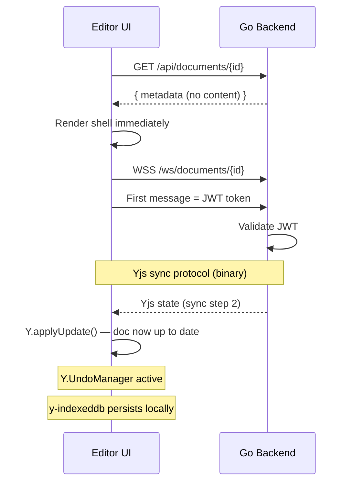

# RFC: Yjs-Based Editing with Real-Time AI Collaboration

**Status:** Draft
**Priority:** High (foundational architecture change)

---

## Canonical Plan Contract

This is the **main/canonical plan** for collaboration + AI collaboration.

- This doc owns **architecture, scope, and sequencing decisions**.
- `spec/*` docs own **technical contracts and invariants** (schemas, interfaces, protocols).
- `phase/*` docs own **implementation delivery steps** and are constrained by both.
- If a spec and this RFC appear to conflict, the spec is authoritative for technical detail; this RFC is authoritative for architectural intent. Resolve by updating whichever is stale.
- Canonical model: **Yjs CRDT** with proposal queue:
  - **Yjs document state** = authoritative document (binary CRDT state, sole source of truth)
  - **AI/agent proposal queue** = non-authoritative Yjs update buffers awaiting writer review
  - **`documents.content` and `documents.ai_content`** are derived projections from Yjs state (persisted alongside `yjs_state`, never written independently)
- Legacy `ai_version`/PUA-marker plans are retained for history only and are marked superseded.

## Unified Plan Set

| Purpose | Canonical Doc |
|---|---|
| Main architecture + sequencing | `_docs/plans/fb-realtime-collab-editing.md` |
| Index for collab plan set | `_docs/plans/collab-ai/README.md` |
| Spec: storage model | `_docs/plans/collab-ai/spec/storage-model.md` |
| Spec: API + events contract | `_docs/plans/collab-ai/spec/api-events-contract.md` |
| Spec: snapshot strategy + retention | `_docs/plans/collab-ai/spec/compaction-retention.md` |
| Spec: read-model freshness | `_docs/plans/collab-ai/spec/refresh-read-model-framework.md` |
| Spec: CM6 library model | `_docs/plans/collab-ai/spec/cm6-library-model.md` |
| Phase 1: Yjs sync + transport | `_docs/plans/collab-ai/phase/phase-1-yjs-sync-and-transport.md` |
| Phase 2: writer history + session undo + snapshots | `_docs/plans/collab-ai/phase/phase-2-history-and-undo.md` |
| Phase 3: AI proposals + writer review UX | `_docs/plans/collab-ai/phase/phase-3-ai-proposals-and-review.md` |
| Phase 4: multi-agent arbitration | `_docs/plans/collab-ai/phase/phase-4-multi-agent-arbitration.md` |
| Phase 5: multi-user collaboration | `_docs/plans/collab-ai/phase/phase-5-multi-user-collaboration.md` |

## Legacy Mapping (Superseded Inputs)

| Legacy Plan | New Home |
|---|---|
| `_docs/plans/fb-document-history-v1.md` | `_docs/plans/collab-ai/phase/phase-2-history-and-undo.md` |
| `_docs/plans/fb-tree-ai-suggestions-banner-accept-all.md` | `_docs/plans/collab-ai/phase/phase-3-ai-proposals-and-review.md` |
| `_docs/plans/fb-event-driven-refresh-framework.md` | `_docs/plans/collab-ai/spec/refresh-read-model-framework.md` |

---

## Problem Statement

Meridian currently uses snapshot-only writes (`PATCH` full content, one `documents.content` field).

| Limitation | Writer Impact |
|---|---|
| No persistent edit history | Undo disappears on file switch/reload |
| AI edits are polled | 2s polling + full refresh before user sees AI output |
| Snapshot race windows | Stale save-ack issues |
| AI edit granularity is coarse | `ai_version` + PUA marker flow cannot cleanly undo one AI action |
| No path to multi-user editing | No server operation stream/version protocol |

**WHY now:** Durable rollback/history and low-latency AI edits are immediate writer pain. A real-time sync layer also unlocks future multi-user collaboration.

---

## Decision Update: OT -> Yjs CRDT + Go-Only Backend

The original plan used CodeMirror OT (`@codemirror/collab`) with a Node collab service. After review, **Yjs CRDTs with a Go-only backend** are a better fit:

| Topic | Original (OT + Node) | New (Yjs + Go) |
|---|---|---|
| Collab model | `@codemirror/collab` OT | `yjs` + `y-codemirror.next` |
| Collab server | Node service (complex OT authority) | **Go backend** (same process, using `y-crdt`) |
| Transport | Go HTTP + Node WS (two services) | **Single WS** per document (Go handles everything) |
| WS auth | Ticket table + endpoint | **JWT in first message** (no ticket table) |
| `documents.content` | Text column (dual-write with Yjs) | **Kept as derived projection** — computed from Yjs state on persist, never written directly |
| Accepted proposals | Hard-delete after applying update | **Terminal accepted status, retained indefinitely** (`status='accepted'`) |
| Compaction | 3 Graphile Worker services, segment table | **Simple periodic snapshots** |
| Lease fencing | Per-document lease tokens with 60s TTL | **Removed** — CRDTs are conflict-free |
| Version allocation | `SELECT ... FOR UPDATE` row locks | **Removed** — Yjs state vectors |
| AI proposals | OT rebase + promote to authoritative stream | **Yjs update buffers** — held, then `Y.applyUpdate()` |
| AI proposal model | Separate from AI view | **Two views, one truth** — AI sees proposals as applied |
| Auto-accept | Not planned | **Tri-state cascade** (agent -> project -> user -> system) |
| Undo/redo | Custom op replay tail | **`Y.UndoManager`** — built-in |
| Awareness/presence | Phase 5 (future) | **Phase 1** via `y-protocols/awareness` |
| Offline | Not planned | **`y-indexeddb`** from Phase 1 |
| CM6 packages | 4 packages, 9 port interfaces | **1 package** (`@meridian/cm6-collab`), simplified interfaces |
| Scaling | Coupled to Node service | **Interface-based** (`DocumentBroadcaster`, `DocumentStore`) |
| Proposal data | HTTP endpoints + TanStack Query | **WS JSON frames** (single connection) |

**WHY Yjs + Go:**
1. Dramatically simpler — one service, one deployment, one connection pool.
2. No Node service to deploy, monitor, or coordinate with.
3. AI proposals don't need rebase — Yjs updates merge regardless of intervening changes.
4. Undo is built-in — `Y.UndoManager` works out of the box for in-session edits.
5. Multi-user is native — no CRDT migration needed for Phase 5.
6. Local-bridge integration is natural — Yjs is a sync protocol, bridge becomes another provider.
7. Go `y-crdt` library (MIT) covers the narrow server-side usage: load state, apply updates, encode state, sync protocol.

---

## Architecture Overview

```
Browser ──HTTP──> Go Backend ──DB──> Postgres
Browser ──WS────> Go Backend (same process)
```

**One service. One deployment. One database connection pool.**

### Network Boundary (Required)

| Traffic | Public Path | Owner |
|---|---|---|
| Browser HTTP | `/api/*` | Go backend |
| Browser realtime | `/ws/*` | Go backend (same process) |

No private service-to-service routes. No Node service.

### Service Ownership

| Owner | Responsibilities | Tables |
|---|---|---|
| Go backend | HTTP REST, WebSocket, Yjs persistence, proposals, auth | All tables |
| Frontend | Host app adapters + reusable CM6 collab/proposal libraries | IDB cache (`y-indexeddb`) |

### Go y-crdt Library

The Go backend uses [`skyterra/y-crdt`](https://github.com/skyterra/y-crdt) (MIT license):

| Feature | Status | Needed For |
|---|---|---|
| `NewDoc()`, `GetText()`, `GetMap()` | Working | Core doc operations |
| `ApplyUpdate()` / `EncodeStateAsUpdate()` | Working, compatibility tests pass | Persistence, proposal accept |
| `EncodeStateVector` / `DecodeStateVector` | Working | Sync protocol |
| `ytext.ToString()` | Working | Text extraction for search/preview |
| V1 encoder/decoder | Working | Binary wire format |

**What Go does NOT need:** `Y.UndoManager` (client-side), `y-codemirror.next` (client-side), `@codemirror/merge` (client-side).

**Risk mitigation for early-stage library:**
1. MIT license — fork and fix if upstream is unresponsive
2. Compatibility verified in local POC (round-trip encoding between Go y-crdt and JS Yjs) — formal test suite is a Phase 1 deliverable (see Verification Matrix)
3. Server usage is narrow: load state, apply updates, encode state, sync protocol
4. Interface-based design allows swapping to V8-embedded approach if needed

### Yjs Document + AI Proposal Queue

**WHY this split:**
- Human editing and AI editing have different lifecycle semantics.
- Writers need AI traceability/audit without polluting the live document.
- AI proposals are held as buffered Yjs updates until the writer reviews and accepts.

On accept: `Y.applyUpdate(mainDoc, bufferedUpdate)` -> proposal row marked `status='accepted'` (retained indefinitely as permanent audit record). Yjs handles merge automatically (CRDT guarantee).

### AI Proposal Model: Two Views, One Truth

```
Yjs Doc (authoritative)
  |-- Writer View: sees diff decorations for pending AI changes
  |-- AI View: sees the document WITH all pending AI changes applied
```

AI proposals aren't "held separately" from AI's perspective. The AI stream treats proposals as already-applied. The human sees them as pending diffs.

### Auto-Accept Configuration

Tri-state cascade (`true | false | null`):
```
Agent -> Project -> User -> System default (false)
```
When resolved to `true`, proposals are immediately applied — no review step. Writer can still undo via `Y.UndoManager`.

### Single WebSocket Design

Everything over one connection per document:
- Binary frames: Yjs sync protocol (state vectors, updates)
- Binary frames: Yjs awareness protocol (cursors, presence)
- JSON frames: Application messages (proposals, heartbeat, errors)

This eliminates HTTP proposal endpoints, TanStack Query for proposal data, and two-phase staleness windows.

### Scaling Interfaces

```go
// Connection is the transport-agnostic interface for a connected client.
// v1: *WSConn satisfies this. Tests and future transports provide their own.
type Connection interface {
    ID() string
    Send(data []byte) error
}

// v1: in-process map | v2: Redis pub/sub
type DocumentBroadcaster interface {
    Subscribe(docID string, conn Connection) error
    Unsubscribe(docID string, conn Connection)
    Broadcast(docID string, update []byte, exclude Connection)
}

// v1: direct Postgres | v2: optional Redis write-through cache
type DocumentStore interface {
    LoadState(ctx context.Context, docID string) ([]byte, error)
    SaveState(ctx context.Context, docID string, state []byte, content string, aiContent string) error
}

// DocumentCompactor — deferred optimization for Yjs state compaction.
// See _docs/future/ideas/performance/yjs-periodic-compaction.md
type DocumentCompactor interface {
    ReplaceState(ctx context.Context, docID string, compactedState []byte, content string, aiContent string) error
}
```

No core logic changes when scaling — only implementation swaps.

### Service Extraction Readiness

The collab domain follows the existing Go backend pattern (`domain/models/`, `domain/services/`, `domain/repositories/`, `service/`, `repository/postgres/`) with its own namespace. The **only cross-domain dependency** is the `DocumentResolver` interface:

```go
// DocumentResolver is the thin boundary between collab and the document domain.
// On extraction: swap the direct-call impl for an HTTP client impl.
type DocumentResolver interface {
    ResolveDocument(ctx context.Context, docID string) (*CollabDocRef, error)
    VerifyOwnership(ctx context.Context, docID string, userID string) (bool, error)
}
```

This means extracting collab to a separate service requires:
1. Implement `DocumentResolver` as an HTTP client (calling the document service).
2. Move the collab domain packages to the new service.
3. No other cross-domain wiring to untangle.

### SQL Prefix Convention (Required)

All SQL objects are env-prefixed and collab-scoped.

1. Environment prefix from `TABLE_PREFIX` (e.g., `dev_`, `stg_`, `prd_`).
2. Tables: `${TABLE_PREFIX}collab_document_edit_proposals`, `${TABLE_PREFIX}collab_document_snapshots`, `${TABLE_PREFIX}collab_request_idempotency`.
3. Indexes/constraints: `${TABLE_PREFIX}idx_collab_*`, `${TABLE_PREFIX}uq_collab_*`, `${TABLE_PREFIX}fk_collab_*`.
4. Migration files include `collab` in filename.

---

## Repo Structure

```
backend/
├── internal/
│   ├── domain/
│   │   ├── models/collab/          # Collab domain models
│   │   ├── services/collab/        # Collab service interfaces (including DocumentResolver)
│   │   └── repositories/collab/    # Collab repo interfaces
│   ├── service/collab/             # Business logic impl
│   │   ├── broadcaster.go          (DocumentBroadcaster impl)
│   │   ├── store.go                (DocumentStore impl)
│   │   ├── sync.go                 (Yjs sync protocol handler)
│   │   ├── awareness.go            (opaque awareness relay)
│   │   ├── proposals.go            (proposal lifecycle: create, accept, reject)
│   │   └── snapshot.go             (periodic snapshot management)
│   ├── repository/postgres/collab/ # Data access impl
│   ├── handler/
│   │   └── collab.go               (WS upgrade endpoint, self-contained)

packages/
└── cm6-collab/
    └── src/
        ├── sync/        # Yjs binding (y-codemirror.next), sync state, Y.UndoManager
        ├── proposals/   # Proposal domain state, WS event handling, accept/reject commands
        └── review/      # @codemirror/merge review integration, presentation policy
```

**To remove (during implementation):** `services/collab-server/` (Node service), `packages/cm6-meridian-adapter/`, `packages/cm6-proposals/`, `authority/`, `compaction/`, `core/ports/` with 9 interfaces.

---

## Phased Implementation

### Phase 1: Yjs Sync + Transport

**Goal:** Replace HTTP PATCH save with Yjs CRDT sync over WebSocket. Go-only backend with `y-crdt`. Offline via `y-indexeddb`. Awareness/presence available from day one.

### Phase 2: History + Session Undo

**Goal:** Reliable in-session Cmd+Z via `Y.UndoManager` plus durable cross-reload rollback using named snapshots in `collab_document_snapshots`.

### Phase 3: AI Proposal Model (Replace PUA Markers)

**Goal:** AI changes are reviewed through Yjs update buffer proposals + `@codemirror/merge` review. No markers in document text. Accept = `Y.applyUpdate()` + terminal `accepted` status (retained indefinitely as audit record). Auto-accept configurable.

### Phase 4: Multi-Agent Orchestration

**Goal:** Multiple LLM agents can propose concurrently with semantic quality arbitration (mechanical conflicts are impossible with CRDTs).

### Phase 5: Multi-User Collaboration

**Goal:** Presence, cursors, multi-client editing — native to Yjs from Phase 1.

Execution docs:

| Phase | Single-Purpose Plan |
|---|---|
| 1 | `_docs/plans/collab-ai/phase/phase-1-yjs-sync-and-transport.md` |
| 2 | `_docs/plans/collab-ai/phase/phase-2-history-and-undo.md` |
| 3 | `_docs/plans/collab-ai/phase/phase-3-ai-proposals-and-review.md` |
| 4 | `_docs/plans/collab-ai/phase/phase-4-multi-agent-arbitration.md` |
| 5 | `_docs/plans/collab-ai/phase/phase-5-multi-user-collaboration.md` |

```
Phase 1 (Yjs Sync + WS, Go-only)
  |--+-- Phase 2 (Y.UndoManager + Snapshots)
     |-- Phase 3 (AI Proposals + Auto-Accept)
              |-- Phase 4 (Semantic Arbitration)
                       |-- Phase 5 (Multi-User — native to Yjs)
```

### Rollout and Rollback (v1)

This rollout is optimized for a low-traffic greenfield state (one rare user, no compatibility burden). **Gating condition:** Re-evaluate if active user count exceeds ~10 before collab launch. If so, add a dual-write migration path (serve both PATCH and Yjs writes during transition) instead of hard cutover.

> **Confirmed:** Hard cutover valid (low-traffic greenfield, Feb 2026).

1. Hard cutover on a branch merge. No dual-write and no snapshot PATCH fallback.
2. Feature flag at frontend boot: `ENABLE_COLLAB_YJS=true`.
3. Rollback procedure:
   - disable `ENABLE_COLLAB_YJS`
   - keep data tables intact (no destructive rollback migration)
4. Data compatibility stance:
   - no backward compatibility guarantees across pre-cutover plans
   - if schema changes are needed during v1 stabilization, prefer forward-only migrations

---

## Specification Set (Canonical)

Detailed contracts were split into focused spec docs:

- Storage/data model: `_docs/plans/collab-ai/spec/storage-model.md`
- API/events/errors: `_docs/plans/collab-ai/spec/api-events-contract.md`
- Snapshot/retention: `_docs/plans/collab-ai/spec/compaction-retention.md`
- Read-model freshness: `_docs/plans/collab-ai/spec/refresh-read-model-framework.md`
- Frontend package boundary (single `@meridian/cm6-collab` package): `_docs/plans/collab-ai/spec/cm6-library-model.md`

Non-negotiable invariants summary:

1. Document state is a Yjs CRDT (`Y.Doc`). `documents.yjs_state BYTEA` is the sole source of truth. `documents.content` and `documents.ai_content` are derived projections (never written directly).
2. AI proposals are non-authoritative Yjs update buffers. Accept = `Y.applyUpdate()` + terminal `status='accepted'` (retained indefinitely).
3. No version allocation, no lease fencing, no compaction pipeline — Yjs handles all of this.
4. Periodic snapshots persist Yjs state to Postgres (see `_docs/plans/collab-ai/spec/compaction-retention.md` for full trigger policy: 2s debounce, every N updates, on disconnect, manual trigger).
5. Snapshots stored in `collab_document_snapshots` table (not on documents row).
6. Text extraction via Go `y-crdt` `ytext.ToString()` — derived `content` and `ai_content` columns persisted alongside `yjs_state` (no dual-write drift; always derived from binary).
7. Proposal accept is idempotent by `idempotencyKey` in WS message.
8. `Y.UndoManager` provides undo/redo for both user and accepted AI edits.
9. Accepted and rejected proposals are retained indefinitely as permanent audit records.
10. Frontend collab/proposal logic ships as 1 reusable CM6 package (`@meridian/cm6-collab`) with internal module separation (sync, proposals, review); app-layer hooks remain orchestration adapters.
11. Awareness/presence is available from Phase 1 via `y-protocols/awareness`.
12. Auto-accept configurable via tri-state cascade (agent -> project -> user -> system).
13. Single WebSocket per document carries all collab traffic (sync, awareness, proposals).
14. JWT-in-first-message auth (no ticket table).
15. `y-indexeddb` for offline persistence from Phase 1.

## Runtime Config (Env Vars)

| Variable | Default | Purpose |
|---|---|---|
| `MERIDIAN_COLLAB_SNAPSHOT_INTERVAL_UPDATES` | `500` | Write snapshot every N Yjs updates as safety net |
| `MERIDIAN_COLLAB_AUTO_SNAPSHOT_RETENTION_DAYS` | `90` | Keep auto snapshots before deletion |
| `MERIDIAN_COLLAB_DEFAULT_AUTO_ACCEPT` | `false` | System-level default for auto-accept tri-state cascade |

## First Load Flow



Typing policy during reconnect:
- Allow typing immediately.
- Yjs queues local changes until WS transport is ready.
- `y-indexeddb` persists edits locally for offline survival.
- Show sync state (`Connected`, `Syncing`, `Disconnected`).

---

## Component Design

### Go Backend (Collab Module)

| Module | Responsibility |
|---|---|
| `collab/broadcaster` | `DocumentBroadcaster` interface + in-memory v1 impl |
| `collab/store` | `DocumentStore` interface + Postgres v1 impl |
| `collab/sync` | Yjs sync protocol handler (state vectors, updates) |
| `collab/awareness` | Opaque awareness relay (binary blob forwarding) |
| `collab/ws` | WebSocket connection lifecycle, JWT auth, heartbeat |
| `collab/proposals` | Proposal lifecycle: create, accept (terminal status, retained indefinitely), reject |
| `collab/snapshot` | Periodic snapshot management, cleanup goroutines |

### Interface Contracts (Simplified)

| Contract | Kind | Used By |
|---|---|---|
| `DocumentResolver` | Interface | Collab service (doc ID lookup + ownership verification) — thin cross-domain dependency |
| `DocumentBroadcaster` | Interface | WS handler, proposals |
| `DocumentStore` | Interface | Sync, proposals, snapshots |
| `ProposalQueryPort` | Port | Review UI (via WS) |
| `ProposalCommandPort` | Port | Accept/reject handlers |
| `ReviewPresentationPolicy` | Strategy | Merge view generation |

### Frontend

| Component | Responsibility |
|---|---|
| `@meridian/cm6-collab` | Yjs binding (`y-codemirror.next`), `Y.UndoManager`, sync state, awareness, proposal state/event callbacks (invoked by host on WS receipt), accept/reject commands, `@codemirror/merge` review |
| `useCollabConnection` | WS lifecycle (connect, JWT auth, reconnect, heartbeat, cleanup) |
| `useCollabExtension` | Wire Yjs + `y-codemirror.next` to CM6 editor |
| `useCollabEvents` | WS JSON frame routing: parse frames, invoke cm6-collab callbacks, update host store |
| `useProposalReview` | Host hook that maps proposal state to feature UI |
| `useCollabStore` | Host UI projection store (`syncState`, `clientID`, `proposals`) |
| `AIProposalNavigator` | Host UI component bound to review/proposal package outputs |

### Merge Review Integration

`@codemirror/merge` is the canonical proposal review surface for AI changes. The live editor remains clean text and does not embed AI markers.

---

## Key Files Affected

### New: Collab domain (Go backend)
- `backend/internal/domain/models/collab/` — domain models
- `backend/internal/domain/services/collab/` — service interfaces (`DocumentResolver`, `DocumentBroadcaster`, `DocumentStore`)
- `backend/internal/domain/repositories/collab/` — repo interfaces
- `backend/internal/service/collab/` — business logic (sync, awareness, proposals, snapshots)
- `backend/internal/repository/postgres/collab/` — Postgres data access
- `backend/internal/handler/collab.go` — WS upgrade endpoint

### New: `packages/cm6-collab/` (CM6 library)
- `packages/cm6-collab/src/sync/*`
- `packages/cm6-collab/src/proposals/*`
- `packages/cm6-collab/src/review/*`

### Frontend — New
- `frontend/src/features/documents/hooks/useCollabConnection.ts`
- `frontend/src/features/documents/hooks/useCollabExtension.ts`
- `frontend/src/features/documents/hooks/useCollabEvents.ts`
- `frontend/src/features/documents/hooks/useProposalReview.ts`
- `frontend/src/core/stores/useCollabStore.ts`
- `frontend/src/features/documents/components/AIProposalNavigator.tsx`

### Frontend — Retire
- `frontend/src/core/services/documentSyncService.ts` — delete
- `frontend/src/core/services/saveMergedDocument.ts` — delete
- `frontend/src/core/lib/sync.ts` — delete
- `frontend/src/core/lib/mergedDocument.ts` — delete (553 lines)
- `frontend/src/core/editor/codemirror/diffView/*` — delete entire directory
- `frontend/src/features/documents/hooks/useDocumentSync.ts` — delete
- `frontend/src/features/documents/hooks/useDiffView.ts` — delete
- `frontend/src/features/documents/components/AIHunkNavigator.tsx` — delete

### Backend — Modify
- Drop `documents.ai_version`, `documents.ai_version_rev` columns (defer until Phase 3)
- Keep `documents.content` as derived projection (computed from Yjs state on persist)
- Add `documents.ai_content TEXT` column (AI's view — doc + pending proposals applied)
- Add `documents.yjs_state BYTEA` column
- Remove `GET /api/documents/{id}/ai-status` endpoint
- Add WS upgrade endpoint (`/ws/documents/{id}`)

---

## Key Decisions Summary

| Decision | Choice | Why |
|---|---|---|
| Collab model | **Yjs CRDT** | Conflict-free merges, built-in undo, native multi-user, simpler server |
| Backend | **Go-only** (y-crdt library) | One service, one deployment, no Node coordination |
| Transport | **Single WebSocket** per document | All collab data over one connection (sync, awareness, proposals) |
| WS auth | **JWT in first message** | No ticket table, no ticket endpoint, no TTL cleanup |
| `documents.content` | **Derived projection** | Kept as read-only column, computed from Yjs state on persist (for search/export/API) |
| Accepted proposals | **Terminal accepted status, retained indefinitely** (`status='accepted'`) | Permanent audit trail — no cleanup jobs needed |
| Auto-accept | **Tri-state cascade** (agent/project/user/system) | Configurable per context |
| AI proposal model | **Two views, one truth** | AI sees applied; writer sees diffs |
| Frontend packaging | 1 reusable CM6 package (`@meridian/cm6-collab`) with internal modules (sync, proposals, review) | Proposals depend on `Y.Doc` for accept — 1 package avoids artificial boundary; host-agnostic |
| DB access | Direct PostgreSQL (shared Supabase) | Simple, low latency |
| AI proposals | Yjs update buffers, accept = `Y.applyUpdate()` | No rebase, CRDT merge handles divergence |
| Undo/redo | `Y.UndoManager` | Built-in for in-session undo/redo |
| Proposal rendering | `@codemirror/merge` review surface | Clean review UX, no PUA markers |
| Accept idempotency | `idempotencyKey` in WS message + persisted responses | Safe retries |
| Snapshot strategy | Periodic (disconnect + N updates) + `collab_document_snapshots` table | Simple, no compaction pipeline |
| Conflict detection | Semantic only (Phase 4) | Mechanical conflicts impossible with CRDTs |
| Awareness/presence | Available Phase 1 via `y-protocols/awareness` | Free with Yjs |
| Offline | `y-indexeddb` from Phase 1 | Edits survive tab close |
| Multi-user | Native to Yjs (Phase 5) | No CRDT migration needed |
| Scaling | Interface-based (`DocumentBroadcaster`, `DocumentStore`) | Swap impl without core changes |
| Local-bridge fit | Yjs is a sync protocol — bridge becomes another provider | Natural integration |
| Proposal data | WS JSON frames (single connection) | No HTTP endpoints for proposals |
| Comments/annotations | **Separate from AI proposals** — proposals MODIFY (CRDT mutations), comments ANNOTATE (text anchoring) | Different operation types, lifecycles, and review UX; shared primitive: `Y.RelativePosition` |
| Migration | None — greenfield rebuild on branch | No users, no backwards compatibility needed |
| Rollout style | Hard cutover + feature flag | Fast iteration |

---

## Local-Bridge Integration

Yjs is a natural fit for the local-bridge plan (`_docs/plans/local-bridge/`). The bridge becomes another Yjs sync provider:

```
Browser <--> (WebSocket) <--> Go Backend <--> Postgres
                                   |
                              (Yjs sync)
                                   |
              Local Bridge <--> Local Files on Disk
```

With Yjs, document state can live in 4 places simultaneously — any subset can be online:
1. **Browser memory** — `Y.Doc` in the active tab
2. **IndexedDB** — via `y-indexeddb` provider (persistent offline cache)
3. **Local disk** — via the bridge (edit in VS Code, Obsidian, etc.)
4. **Server** — via Go backend -> Postgres

Each is just a Yjs provider. Offline edits sync automatically on reconnect.

---

## Observability and SLOs (v1)

Metrics (per document and global):
- `collab_sync_latency_ms` (p50/p95/p99)
- `proposal_accept_latency_ms`
- `reset_required_rate`
- `ws_reconnect_rate`
- `snapshot_duration_ms`
- `yjs_state_size_bytes` (per-document)

Alert thresholds:
1. `reset_required_rate > 5%` for 10 minutes.
2. `proposal_accept_latency_ms p95 > 1500ms` for 10 minutes.
3. `ws_reconnect_rate > 20%` for 10 minutes.
4. `yjs_state_size_bytes > 10_000_000` for any document.

SLO targets:
1. 99% successful Yjs sync operations (excluding client disconnects).
2. p95 proposal accept end-to-end < 1.5s.
3. p95 reconnect-to-synced < 3s.

---

## Verification Matrix (Required Before Cutover)

| Scenario | Method | Pass Criteria |
|---|---|---|
| Go y-crdt round-trip | Create doc in JS Yjs, encode, decode in Go, verify text | Binary compatibility |
| Go y-crdt sync protocol | Two Go Y.Docs sync via state vectors | State convergence |
| Single-user persist | Type, reload | Content preserved via Yjs state round-trip |
| WS disconnect/reconnect | Kill connection, reconnect | No data loss, Yjs sync recovers |
| Offline persistence | Type, kill tab, reopen — content survives via IndexedDB | No data loss |
| JWT auth reject | Send invalid JWT as first message | `AUTH_FAILED`, connection closed |
| Accept proposal | Accept AI proposal | Yjs update applied, proposal marked `accepted` |
| Accept after user edits | User edits then accepts | Yjs merge produces correct result |
| Reject proposal | Reject AI proposal | Update discarded, proposal marked rejected |
| Undo accepted AI edit | Accept then Cmd+Z | `Y.UndoManager` reverses the accepted edit |
| Undo across reload boundary | Type, reload, Cmd+Z | New session undo stack starts; snapshot restore provides durable rollback |
| Auto-accept | Configure agent auto-accept, generate AI edit | Immediate apply, no review step |
| Accepted-row audit | Accept proposal, verify row marked `accepted` not deleted | Permanent audit trail intact |
| Group accept | Accept proposal group | Deterministic `accepted|skipped` outcomes |
| Accept retry idempotency | Retry same accept request | Same response, no duplicate application |
| Snapshot on disconnect | Disconnect last client | Yjs state written to Postgres |
| Large document | 100k+ chars | Yjs sync stays responsive |
| Broadcaster interface | Swap in-memory broadcaster for mock pub/sub | No core logic changes |
| Cursor relay | Send awareness update from client A, verify client B receives | Opaque relay works |
| Permission gating (v1) | Unauthenticated user attempts accept | Mutation denied |

---

## Risks

| Risk | Mitigation |
|---|---|
| Yjs state size growth over months | `DocumentCompactor.ReplaceState` interface ready for periodic compaction when needed (see `_docs/future/ideas/performance/yjs-periodic-compaction.md`) |
| Go y-crdt library is early-stage | MIT fork rights, narrow usage surface, compatibility tests pass, interface-based swap path |
| Duplicate client retries | Idempotency keys on accept/group-accept |
| Proposal trace lost after removal | Terminal accepted/rejected rows retained indefinitely as permanent audit records |
| Large AI proposal payloads | Admission limits on `yjs_update` size |
| Semantic conflicts after CRDT merge | Phase 4 quality arbitration; writer always reviews |
| Token leakage via URL/logs | JWT in first WS message (not URL), log redaction |
| Multi-instance drift (in-memory Y.Doc) | Single instance v1; `DocumentBroadcaster` interface ready for pub/sub |

---

## Comments/Annotations vs AI Proposals

**Design boundary:** Proposals and comments/annotations are fundamentally different operations:

| Concern | AI Proposals | Comments/Annotations |
|---|---|---|
| Operation type | **MODIFY** — CRDT mutations (`Y.applyUpdate`) | **ANNOTATE** — text anchoring (no document mutation) |
| Document effect | Changes document content | Attaches metadata to a text range |
| Lifecycle | Proposed -> accepted/rejected | Created -> resolved/deleted |
| Shared primitive | `Y.RelativePosition` (for tracking proposal ranges) | `Y.RelativePosition` (for anchoring comments to text) |

**WHY separate:** Mixing annotation state into the proposal pipeline would conflate "change the document" with "comment on the document." Different review UX, different lifecycle, different storage.

Comments/annotations are explicitly deferred (not in Phase 1-5 scope) but this boundary is documented to prevent future design drift.

---

## Open Questions

1. **y-crdt awareness protocol completeness** — Need to verify Go library can identify awareness message types for relay. If awareness relay is just "forward opaque bytes," Go only needs to tag message types, not parse them.
2. **y-crdt WS sync protocol** — Primitives exist (`EncodeStateAsUpdate`, `ApplyUpdate`, state vectors) but the message framing/exchange logic (~50 lines) needs to be written on top of them.

Post-v1 evolution topics (explicitly deferred, non-blocking):
- Hocuspocus vs custom sync server (evaluate during Phase 1).
- Local-bridge as Yjs provider vs relay (evaluate during bridge stage 4-5).
- Horizontal fanout (Redis pub/sub when >1 instance required).
- Yjs state compaction strategy for long-lived documents.
- Comments/annotations system (text anchoring via `Y.RelativePosition`, separate from proposal pipeline).

---

## Sources

- [Yjs Documentation](https://docs.yjs.dev/)
- [Yjs Document Updates](https://docs.yjs.dev/api/document-updates)
- [y-codemirror.next](https://github.com/yjs/y-codemirror.next)
- [Y.UndoManager](https://docs.yjs.dev/api/undo-manager)
- [y-protocols](https://github.com/yjs/y-protocols)
- [y-indexeddb](https://github.com/yjs/y-indexeddb)
- [skyterra/y-crdt (Go)](https://github.com/skyterra/y-crdt)
- [CodeMirror Merge Package Docs](https://codemirror.net/docs/ref/#merge)
- [Figma: Multiplayer Technology](https://www.figma.com/blog/how-figmas-multiplayer-technology-works/)
- [Notion: Offline architecture (Dec 11, 2025)](https://www.notion.com/en-gb/blog/how-we-made-notion-available-offline)
- [RFC 6455: The WebSocket Protocol](https://datatracker.ietf.org/doc/html/rfc6455.html)
