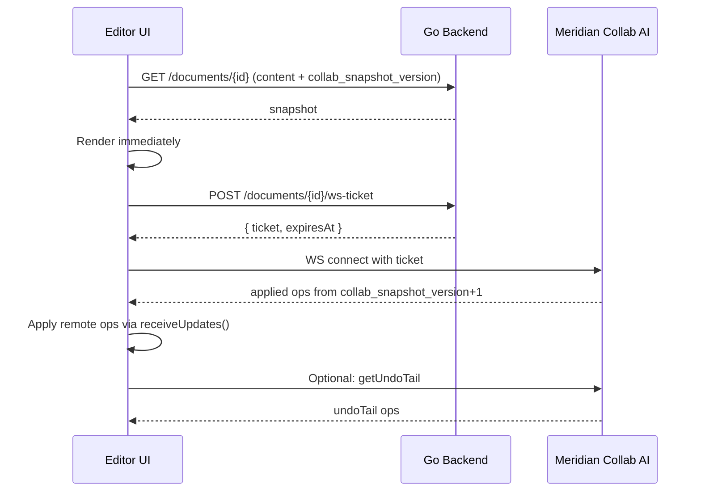

# RFC: Operation-Based Editing with Real-Time AI Collaboration

**Status:** Draft
**Priority:** High (foundational architecture change)

---

## Canonical Plan Contract

This is the **main/canonical plan** for collaboration + AI collaboration.

- If this doc conflicts with any related plan, **this doc wins**.
- `spec/*` docs in `_docs/plans/collab-ai/spec/` are canonical technical contracts.
- `phase/*` docs in `_docs/plans/collab-ai/phase/` are implementation slices of this RFC.
- Canonical model: **two changeset streams**:
  - **User stream** = authoritative applied edits (human edits + accepted AI edits)
  - **AI/agent stream** = proposal queue only (non-authoritative)
- Legacy `ai_version`/PUA-marker plans are retained for history only and are marked superseded.

## Unified Plan Set

| Purpose | Canonical Doc |
|---|---|
| Main architecture + sequencing | `_docs/plans/fb-realtime-collab-editing.md` |
| Index for collab plan set | `_docs/plans/collab-ai/README.md` |
| Spec: storage model | `_docs/plans/collab-ai/spec/storage-model.md` |
| Spec: API + events contract | `_docs/plans/collab-ai/spec/api-events-contract.md` |
| Spec: compaction + retention | `_docs/plans/collab-ai/spec/compaction-retention.md` |
| Spec: refresh/read-model policy | `_docs/plans/collab-ai/spec/refresh-read-model-framework.md` |
| Phase 1: transport + authoritative ops | `_docs/plans/collab-ai/phase/phase-1-oplog-transport.md` |
| Phase 2: writer history + persistent undo | `_docs/plans/collab-ai/phase/phase-2-history-and-undo.md` |
| Phase 3: AI proposals + writer review UX | `_docs/plans/collab-ai/phase/phase-3-ai-proposals-and-review.md` |
| Phase 4: multi-agent arbitration | `_docs/plans/collab-ai/phase/phase-4-multi-agent-arbitration.md` |
| Phase 5: multi-user collaboration (future) | `_docs/plans/collab-ai/phase/phase-5-multi-user-collaboration.md` |

## Legacy Mapping (Superseded Inputs)

| Legacy Plan | New Home |
|---|---|
| `_docs/plans/fb-document-history-v1.md` | `_docs/plans/collab-ai/phase/phase-2-history-and-undo.md` |
| `_docs/plans/fb-tree-ai-suggestions-banner-accept-all.md` | `_docs/plans/collab-ai/phase/phase-3-ai-proposals-and-review.md` |
| `_docs/plans/fb-event-driven-refresh-framework.md` | `_docs/plans/collab-ai/spec/refresh-read-model-framework.md` |

---

## Problem Statement

Meridian currently uses snapshot-only writes (`PATCH` full content, one `documents.content` field).

| Limitation | Writer Impact |
|---|---|
| No persistent edit history | Undo disappears on file switch/reload |
| AI edits are polled | 2s polling + full refresh before user sees AI output |
| Snapshot race windows | Stale save-ack issues |
| AI edit granularity is coarse | `ai_version` + PUA marker flow cannot cleanly undo one AI action |
| No path to multi-user editing | No server operation stream/version protocol |

**WHY now:** Persistent undo and low-latency AI edits are immediate writer pain. A server operation stream also unlocks future multi-user collaboration.

---

## Decision Update (From Review + Research)

1. **CodeMirror OT + authoritative Node/TS collab service** — not Go backend. Native `@codemirror/collab` access eliminates need to port ~2000 lines of ChangeSet logic.
2. Split storage into **two changeset streams**:
   - user operations stream (authoritative, includes accepted AI edits)
   - AI/agent proposal stream (non-authoritative queue)
3. Load UX: **snapshot first**, then operation batches. Do not block typing while reconnecting.
4. Compaction: keep snapshot + bounded replay tail (not snapshot-only).
5. Use **short-lived WebSocket ticket**, not long-lived JWT query param.
6. Keep one live-collab stream per chapter/section document. Defer document pagination/segmented loading.
7. **No migration needed.** No users — greenfield rebuild on a branch.
8. AI proposal review uses **`@codemirror/merge`** as the canonical diff/review surface (no PUA markers in document text).
9. **Multi-agent first, not multi-user first.** Prioritize many AI proposal producers for one writer before presence/cursors.
10. **Defer CRDT/Yjs migration.** Re-evaluate before multi-user/offline phase using explicit criteria.

---

## Scope Clarification: Multi-Agent First

Primary near-term concurrency is **multiple LLM agents + one writer**, not many human co-editors.

- The authoritative op stream remains centralized (`@codemirror/collab` OT model).
- AI systems write proposals to the AI/agent stream. On accept, proposal changeset is promoted into user stream and removed from AI stream.
- Proposal acceptance is serialized by the Node authority so agent outputs cannot race the version stream.

### CRDT Re-Evaluation Trigger

Reconsider Yjs/CRDT only if any become true:
- multi-user editing with frequent concurrent writers is now near-term
- offline-first edits must merge after long disconnects
- cross-region multi-instance fanout is required for core editing reliability

---

## Architecture Overview

```
┌─────────────────┐     ┌──────────────────────┐     ┌─────────────┐
│  Frontend        │────│ Meridian Collab AI     │────│  PostgreSQL  │
│  (Vite + CM6)   │ WS │  (authority + proposals)│ DB │  (Supabase)  │
└────────┬────────┘     └──────────────────────┘     └──────┬──────┘
         │ REST                                              │
         └──────────────┐                                    │
                        ▼                                    │
               ┌─────────────────┐                           │
               │  Go Backend      │───────────────────────────┘
               │  (REST API, Auth,│ DB
               │   Threads/LLM)   │
               └─────────────────┘
```

### Service Ownership

| Service | Owns | Tables |
|---|---|---|
| Meridian Collab AI (Node) | WebSocket, version authority, proposals, compaction | `<env_prefix>collab_document_applied_operations`, `<env_prefix>collab_document_edit_proposals`, `<env_prefix>collab_ws_tickets` |
| Go backend | REST API, auth (JWT/JWKS), file system, threads/LLM | Everything else (`documents`, `folders`, `threads`, etc.) |
| Frontend | CM6 collab extension, merge-based proposal review UI | IDB cache |

Both services connect directly to the same Supabase PostgreSQL. Table ownership is clear — no cross-writes.

**WHY Node:** `rebaseUpdates()`, `ChangeSet.map()`, `ChangeSet.compose()` are JS functions from `@codemirror/collab` and `@codemirror/state`. The Authority server from the CM collab example is ~30 lines of JS. Building on it natively avoids porting ChangeSet operations to Go.

### Dual Streams: User + AI/Agent Changesets

**WHY this split:**
- Human editing and AI editing have different lifecycle semantics.
- Writers need AI traceability/audit without polluting human edit logs.
- Multi-user human editing can scale independently from agent orchestration.

Authority rule (v1):
- Document head version is a single monotonic sequence in **user stream**.
- AI/agent stream never defines canonical document state.
- On accept: proposal changeset -> user stream operation -> proposal row deleted.

### SQL Prefix Convention (Required)

All SQL objects owned by Meridian Collab AI are env-prefixed and collab-scoped.

1. Environment prefix comes from `MERIDIAN_SQL_PREFIX` (for example: `dev_`, `stg_`, `prd_`).
2. Tables: `<env_prefix>collab_document_applied_operations`, `<env_prefix>collab_document_edit_proposals`, `<env_prefix>collab_ws_tickets`.
3. Indexes/constraints: `<env_prefix>idx_collab_*`, `<env_prefix>uq_collab_*`, `<env_prefix>fk_collab_*` when explicitly named.
4. Shared-table columns added by collab must use `collab_` prefix (stable across envs).
5. New migration files should include `collab` in the filename to make ownership obvious.

Example resolution:
- local (`MERIDIAN_SQL_PREFIX=dev_`): `dev_collab_document_applied_operations`
- staging (`MERIDIAN_SQL_PREFIX=stg_`): `stg_collab_document_applied_operations`
- production (`MERIDIAN_SQL_PREFIX=prd_`): `prd_collab_document_applied_operations`

---

## Repo Structure

```
meridian-collab-ai/
├── package.json
├── pnpm-workspace.yaml
├── packages/
│   ├── core/
│   │   ├── ports/
│   │   │   ├── OperationLogPort.ts
│   │   │   ├── ProposalPort.ts
│   │   │   ├── TicketPort.ts
│   │   │   ├── SnapshotPort.ts
│   │   │   ├── PubSubPort.ts
│   │   │   └── AuthVerifierPort.ts
│   │   └── policies/
│   │       ├── ConflictPolicy.ts
│   │       ├── AdmissionPolicy.ts
│   │       └── ArbitrationPolicy.ts
│   ├── cm-ot/
│   │   └── index.ts                # CM6 OT adapters/helpers (`ChangeSet`, map, compose)
│   └── transport-ws/
│       └── protocol.ts             # WS protocol types
└── services/
    └── collab-server/
        └── src/
            ├── index.ts            # Entry point, HTTP + WS server
            ├── authority/
            │   ├── Authority.ts
            │   └── DocumentSession.ts
            ├── proposals/
            │   ├── ProposalService.ts
            │   └── proposalTypes.ts
            ├── agents/
            │   └── AgentArbiter.ts
            ├── compaction/
            │   └── CompactionService.ts
            ├── transport/
            │   ├── wsHandler.ts
            │   └── wsTicket.ts
            ├── db/
            │   ├── pool.ts
            │   ├── operationRepo.ts
            │   ├── proposalRepo.ts
            │   ├── ticketRepo.ts
            │   └── snapshotRepo.ts
            └── auth/
                └── jwtValidator.ts
```

---

## Phased Implementation

### Phase 1: WebSocket Transport + Applied Operations

**Goal:** Replace HTTP PATCH save with CM collab over WebSocket. Single-user, single-tab.

### Phase 2: Persistent Undo

**Goal:** Cmd+Z survives page reload, powered by persisted history state (initially replay-tail based).

### Phase 3: AI Proposal Model (Replace PUA Markers)

**Goal:** AI changes are reviewed through a merge-based proposal surface. No markers in document text.

### Phase 4: Multi-Agent Orchestration

**Goal:** Multiple LLM agents can propose concurrently with deterministic arbitration.

### Phase 5: Multi-User Collaboration (Future)

**Goal:** Presence, cursors, multi-client conflict handling.

Execution docs:

| Phase | Single-Purpose Plan |
|---|---|
| 1 | `_docs/plans/collab-ai/phase/phase-1-oplog-transport.md` |
| 2 | `_docs/plans/collab-ai/phase/phase-2-history-and-undo.md` |
| 3 | `_docs/plans/collab-ai/phase/phase-3-ai-proposals-and-review.md` |
| 4 | `_docs/plans/collab-ai/phase/phase-4-multi-agent-arbitration.md` |
| 5 | `_docs/plans/collab-ai/phase/phase-5-multi-user-collaboration.md` |

Cross-cutting read freshness:
- `_docs/plans/collab-ai/spec/refresh-read-model-framework.md`

```
Phase 1 (WS + Applied Ops)
  └──┬── Phase 2 (Persistent Undo)
     └── Phase 3 (AI Proposals)
              └── Phase 4 (Multi-Agent Orchestration)
                       └── Phase 5 (Multi-User) ← future
```

### Rollout and Rollback (v1)

This rollout is optimized for a low-traffic greenfield state (one rare user, no compatibility burden).

1. Hard cutover on a branch merge. No dual-write and no snapshot PATCH fallback.
2. Feature flag at frontend boot: `ENABLE_COLLAB_OT=true`.
3. Kill switch (server + frontend):
   - server returns `503 COLLAB_DISABLED` from WS and proposal endpoints
   - frontend shows read-only banner and disables proposal accept/reject actions
4. Rollback procedure:
   - disable `ENABLE_COLLAB_OT`
   - stop Meridian Collab AI deployment
   - keep data tables intact (no destructive rollback migration)
5. Data compatibility stance:
   - no backward compatibility guarantees across pre-cutover plans
   - if schema changes are needed during v1 stabilization, prefer forward-only migrations

---

## Specification Set (Canonical)

Detailed contracts were split into focused spec docs:

- Storage/data model: `_docs/plans/collab-ai/spec/storage-model.md`
- API/events/errors: `_docs/plans/collab-ai/spec/api-events-contract.md`
- Compaction/floor/retention: `_docs/plans/collab-ai/spec/compaction-retention.md`
- Refresh/read-model policy: `_docs/plans/collab-ai/spec/refresh-read-model-framework.md`

Non-negotiable invariants summary:

1. Canonical storage is two streams:
   - authoritative user stream (`origin='user'|'ai_accepted'`)
   - non-authoritative AI proposal queue (`proposed|rejected|conflicted`)
2. Accept path is atomic and server-authoritative:
   - rebase proposal
   - insert authoritative user-stream op (`origin='ai_accepted'`)
   - remove proposal row
   - emit `updates` + `proposalRemoved`
3. Accepted AI edits remain discoverable in authoritative changesets (raw ops and/or compacted segments).
4. Accepted AI edits, once promoted, compact with the same policy as human authoritative ops.
5. Clients below floor must reload snapshot via `RESET_REQUIRED`.
6. Proposal accept is idempotent and can promote each proposal at most once.
7. Writer timeline defaults to merged authoritative history (`user + ai_accepted`).
8. Proposal stream uses parallel tiered compaction for `rejected|conflicted`; `proposed` stays raw queue, accepted is removed on promotion.
9. Undo/restore behavior is identical for human edits and accepted AI edits because both are authoritative ops.

## Runtime Config (Env Vars)

Compaction/retention behavior is deployment-tunable via env vars. Canonical contract lives in:
- `_docs/plans/collab-ai/spec/compaction-retention.md`

| Variable | Default |
|---|---|
| `MERIDIAN_COLLAB_COMPACTION_OP_COUNT_THRESHOLD` | `200` |
| `MERIDIAN_COLLAB_COMPACTION_OP_BYTES_THRESHOLD` | `262144` |
| `MERIDIAN_COLLAB_COMPACTION_MAX_AGE_HOURS` | `24` |
| `MERIDIAN_COLLAB_REPLAY_TAIL_OPS` | `75` |
| `MERIDIAN_COLLAB_PROPOSAL_HOT_DAYS` | `30` |
| `MERIDIAN_COLLAB_PROPOSAL_DAILY_TO_WEEKLY_DAYS` | `90` |
| `MERIDIAN_COLLAB_PROPOSAL_WEEKLY_TO_MONTHLY_DAYS` | `365` |
| `MERIDIAN_COLLAB_COMPACTION_LOCK_TIMEOUT_MS` | `2000` |
| `MERIDIAN_COLLAB_COMPACTION_STATEMENT_TIMEOUT_MS` | `5000` |

All values require startup validation with fail-fast behavior on invalid bounds/relationships.

## First Load Flow



Typing policy during reconnect:
- Allow typing immediately.
- `@codemirror/collab` queues local ops until transport is ready.
- Show sync state (`Connected`, `Syncing`, `Disconnected`).

---

## Component Design

### Meridian Collab AI Service

| Module | Responsibility |
|---|---|
| `Authority` | CM collab authority: version log, `rebaseUpdates()`, broadcast |
| `DocumentSession` | Per-document active session: connections, in-memory state |
| `ProposalService` | Create, accept (rebase + apply), reject proposals |
| `AgentArbiter` | Multi-agent ordering, overlap scoring, admission limits |
| `CompactionService` | Periodic `ChangeSet.compose()` → snapshot |
| `wsHandler` | WebSocket connection lifecycle |
| `wsTicket` | Ticket creation + one-time redemption |

### Interface Contracts (SOLID)

| Contract | Kind | Used By | Default Adapter/Policy |
|---|---|---|---|
| `OperationLogPort` | Port | `Authority`, `CompactionService` | `db/operationRepo.ts` |
| `ProposalPort` | Port | `ProposalService`, `AgentArbiter` | `db/proposalRepo.ts` |
| `TicketPort` | Port | `wsTicket`, `wsHandler` | `db/ticketRepo.ts` |
| `SnapshotPort` | Port | `CompactionService`, first-load API | `db/snapshotRepo.ts` |
| `PubSubPort` | Port | `DocumentSession`, `wsHandler` | in-process adapter (v1), Redis adapter (future) |
| `AuthVerifierPort` | Port | `wsHandler`, ticket endpoints | `auth/jwtValidator.ts` |
| `ConflictPolicy` | Strategy | `ProposalService` | low/medium/high overlap policy |
| `AdmissionPolicy` | Strategy | `AgentArbiter`, `ProposalService` | size/range/payload limits |
| `ArbitrationPolicy` | Strategy | `AgentArbiter` | FIFO + overlap score |

Contract rules:
- Core services depend only on ports/strategies, never concrete DB/WS/JWT clients.
- Ports are small and task-specific (read/write split when practical).
- Any adapter replacement (e.g., Redis pub/sub, different SQL client) must keep contract behavior unchanged.
- Each module keeps single responsibility: transport modules do connection concerns, policy modules decide outcomes, repositories persist state.

### Frontend

| Component | Responsibility |
|---|---|
| `CollabTransport` | WS connection, reconnect with backoff, message send/receive |
| `collabExtension` | `@codemirror/collab` setup: `collab()` extension, push/pull wired to transport |
| `useDocumentCollab` | Hook: ticket → WS connect → collab extension → cleanup |
| `useCollabStore` | Zustand: `syncState`, `version`, `clientID` |
| `undoHistory` | Map replay tail ops → CM6 undo stack |
| `useProposalReview` | Proposal list, WS subscription, accept/reject actions |
| `useProposalStore` | Active proposals, focused index, navigation |
| `mergeReviewAdapter` | `@codemirror/merge` integration for proposal review/accept/reject UX |
| `proposalAnchors` | Optional lightweight inline cues for pending proposals (no text mutation) |
| `AIProposalNavigator` | Proposal navigation/actions tied to merge chunks |

### Merge Review Integration

`@codemirror/merge` is the canonical proposal review surface for AI changes. The live editor remains clean text and does not embed AI markers.

If lightweight inline proposal cues are retained, they must be decoration-only and must not alter persisted editor text.

---

## Key Files Affected

### New: `meridian-collab-ai/` (entire directory)
- `meridian-collab-ai/packages/core/ports/*` (new interfaces)
- `meridian-collab-ai/packages/core/policies/*` (new strategy contracts/defaults)
- `meridian-collab-ai/services/collab-server/*` (deployable runtime)

### Frontend — New
- `frontend/src/core/collab/CollabTransport.ts`
- `frontend/src/core/collab/collabExtension.ts`
- `frontend/src/core/collab/types.ts`
- `frontend/src/core/collab/undoHistory.ts`
- `frontend/src/core/collab/proposalTypes.ts`
- `frontend/src/core/stores/useCollabStore.ts`
- `frontend/src/core/stores/useProposalStore.ts`
- `frontend/src/core/editor/codemirror/mergeReview/mergeReviewAdapter.ts`
- `frontend/src/core/editor/codemirror/mergeReview/mergeReviewState.ts`
- `frontend/src/core/editor/codemirror/mergeReview/mergeReviewTheme.ts`
- `frontend/src/features/documents/hooks/useDocumentCollab.ts`
- `frontend/src/features/documents/hooks/useProposalReview.ts`
- `frontend/src/features/documents/components/AIProposalNavigator.tsx`

### Frontend — Retire
- `frontend/src/core/services/documentSyncService.ts` — delete
- `frontend/src/core/services/saveMergedDocument.ts` — delete
- `frontend/src/core/lib/sync.ts` — delete
- `frontend/src/core/lib/mergedDocument.ts` — delete (553 lines)
- `frontend/src/core/editor/codemirror/diffView/*` — delete entire directory
- `frontend/src/features/documents/hooks/useDocumentSync.ts` — delete
- `frontend/src/features/documents/hooks/useDiffView.ts` — delete
- `frontend/src/features/documents/components/AIHunkNavigator.tsx` — delete

### Backend — Modify
- `backend/internal/handler/document.go` — add WS ticket endpoint
- Drop `documents.ai_version`, `documents.ai_version_rev` columns
- Remove `GET /api/documents/{id}/ai-status` endpoint
- Add proposal query APIs:
  - `GET /api/projects/{id}/proposals`
  - `GET /api/documents/{id}/proposals`
  - `GET /api/proposals/{id}`
  - `GET /api/proposal-groups/{groupId}`
  - `POST /api/proposal-groups/{groupId}/accept`
  - `GET /api/projects/{id}/proposal-status`
- Add authoritative changeset query APIs:
  - `GET /api/projects/{id}/changesets`
  - `GET /api/documents/{id}/changesets`
- `POST /collab/proposals/{id}/accept` returns `operationId` + new `version` and removes proposal row

---

## Key Decisions Summary

| Decision | Choice | Why |
|---|---|---|
| Architecture style | Ports + adapters + policy strategies | Strengthens DIP/ISP/OCP and testability |
| Collab server language | Node/TS | Native `@codemirror/collab` access, no ChangeSet porting |
| DB access | Direct PostgreSQL (shared Supabase) | Low latency for version allocation, clear table ownership |
| WS auth | Short-lived ticket (30s, one-time) | No JWT in URL, revocable |
| Version allocation | `SELECT ... FOR UPDATE` row lock | Simple, standard SQL semantics |
| Stream model | User authoritative stream + AI proposal queue | Clear writer-control and future multi-user compatibility |
| Proposal rendering | `@codemirror/merge` review surface (no in-text markers) | Cleaner review UX, native accept/reject affordances, no PUA corruption |
| Proposal accept | Promote to user stream + remove proposal row | Accepted AI changes become first-class authoritative edits |
| AI-accept undo | Same authoritative undo/restore path as user edits | No special-case undo system; accepted AI edits are canonical changesets |
| Accept idempotency | `Idempotency-Key` + unique accepted-proposal mapping | Safe retries; one proposal cannot be promoted twice |
| Provenance durability | Copy immutable provenance into authoritative row (no mutable-FK dependency) | Audit trail survives proposal deletion and data cleanup |
| Multi-agent strategy | Proposal-only writers + serialized acceptance | Deterministic arbitration for many LLMs, one user |
| Event ordering | Per-document monotonic `eventId` with gap-recovery rules | Deterministic client reconciliation under network disorder |
| Group accept semantics | Deterministic order + stop-on-conflict, per-item outcomes | Predictable bulk review behavior for large AI edits |
| Proposal permissions | `owner/editor` mutate, `viewer` read-only | Safe multi-user extension without rewriting core flow |
| Large AI edits | Admission limits + chunking + fallback mode | Prevent oversized ops from breaking transport/rebase UX |
| Compaction | Dual-stream tiered compaction (authoritative ops + proposal-history rollups) | Keeps replay/query cost bounded while preserving writer-facing history |
| Accepted-AI compaction | `origin='ai_accepted'` compacts like `origin='user'` after promotion | Accepted AI edits are first-class authoritatives, not a protected special case |
| Timeline default | Merged authoritative timeline with origin filters | Keeps accepted AI edits first-class in writer history |
| Publish-failure recovery | Write-then-publish with pull/refresh reconciliation | Commit success is never rolled back by transient WS issues |
| CRDT/Yjs | Deferred with explicit trigger criteria | Avoid migration cost before multi-user/offline is needed |
| Migration | None — greenfield rebuild on branch | No users, no backwards compatibility needed |
| WS library | `ws` (Node) | Standard, performant, well-maintained |
| PostgreSQL client | `postgres` (porsager/postgres) | Modern, fast, tagged template queries |
| Compaction jobs | Graphile Worker (`job_key` per document + advisory lock) | Async, retry-safe compaction without write-path latency |
| Rollout style | Hard cutover + kill switch | Fast iteration with minimal legacy burden |

---

## Observability and SLOs (v1)

Metrics (per document and global):
- `collab_push_latency_ms` (p50/p95/p99)
- `proposal_accept_latency_ms`
- `rebase_conflict_rate`
- `reset_required_rate`
- `ws_reconnect_rate`
- `compaction_duration_ms`
- `compaction_lock_timeout_count`
- `authoritative_raw_ops_highwater` (per-document)
- `compacted_segment_count` (per-document)
- `proposal_rollup_lag_seconds` (per-document)

Alert thresholds:
1. `reset_required_rate > 5%` for 10 minutes.
2. `proposal_accept_latency_ms p95 > 1500ms` for 10 minutes.
3. `compaction_lock_timeout_count >= 5` in 15 minutes.
4. `ws_reconnect_rate > 20%` for 10 minutes.
5. `authoritative_raw_ops_highwater > 50_000` for any document.
6. `proposal_rollup_lag_seconds > 86_400` for any document.

SLO targets:
1. 99% successful `pushUpdates` (excluding client disconnects).
2. p95 proposal accept end-to-end < 1.5s.
3. p95 reconnect-to-synced < 3s.

---

## Verification Matrix (Required Before Cutover)

| Scenario | Method | Pass Criteria |
|---|---|---|
| Concurrent push race | 2 clients push same base version | contiguous versions, no duplicate op IDs |
| Ticket replay | reuse same ticket twice | first succeeds, second returns `TICKET_INVALID` |
| Compaction during typing | run compaction with active writes | no lost ops, no partial snapshot, clients stay synced |
| Accept promotion | accept proposal | authoritative op inserted with `origin='ai_accepted'`, proposal row removed |
| Floor reset path | request updates below floor | `RESET_REQUIRED` then successful snapshot reload |
| Large proposal chunking | proposal exceeds limits | split into group, all chunks ordered, stop-on-conflict works |
| High-overlap conflict | overlapping proposals accepted out of order | high-overlap proposal marked `conflicted` |
| Accepted-AI compaction | run compaction over old accepted AI ops | old `origin='ai_accepted'` raw ops compacted into valid segments, timeline/query remains coherent |
| Kill switch | set `COLLAB_DISABLED` | WS/connect/accept blocked, UI read-only |
| Crash retry idempotency | retry same `client_op_id` after simulated crash | no duplicate authoritative op |
| Accept retry idempotency | retry same proposal accept request | same `operationId`/`version`, no second promotion |
| Event gap recovery | drop/out-of-order `eventId` delivery | client reconciles via pull + refresh without divergent state |
| Group accept determinism | accept a large proposal group with one conflict | deterministic `accepted|conflicted|skipped` outcomes |
| Permission gating | viewer attempts accept/reject | mutation denied, read endpoints still work |

---

## Risks

| Risk | Mitigation |
|---|---|
| Version race/collision | Transactional row lock + unique constraints + retry |
| Duplicate client retries | Idempotency keys (`client_id`, `client_op_id`) |
| Compaction breaks reconnect | `collab_op_floor_version` + explicit `resetRequired` contract |
| Accepted proposal trace lost after removal | Copy full provenance to authoritative op (`source_proposal_id`, run/thread/turn fields) |
| Proposal accepted twice due retries/races | Unique mapping from proposal to authoritative op + idempotency key contract |
| Proposal drift after edits | Anchor + `before_hash` validation → `conflicted` state |
| Out-of-order/lost WS events | Monotonic `eventId` + gap reconciliation via pull and refresh |
| Large AI proposal payloads stall transport | Server admission limits + chunking + fallback mode |
| Group accept ambiguity | Deterministic order and stop-on-conflict with explicit per-item outcomes |
| Semantic conflict after mechanical rebase | Tiered conflict policy (low/medium/high) + manual review path |
| Token leakage via URL/logs | Short-lived WS ticket + log redaction |
| Over-aggressive compaction can hide fine-grained old history | Keep hot raw window + expose compacted segment metadata in `/changesets` |
| Over-engineering large docs too early | Chapter/section boundaries first, defer pagination |
| Multi-instance drift (in-memory sessions) | Run single replica in v1; add pub/sub before horizontal scaling |
| Extra service to deploy | Meridian Collab AI is focused and small; deploy on Railway alongside Go |

---

## Open Questions

No blocking open questions for v1 collaboration + AI collaboration.

Post-v1 evolution topics (explicitly deferred, non-blocking):
- Interface granularity refinements (split ports further if contracts grow).
- Undo persistence evolution beyond replay-tail rebuild.
- Horizontal fanout (Redis pub/sub when >1 service instance is required).
- Arbitration ranking beyond FIFO + overlap score.

---

## Sources

- [CodeMirror Collaborative Editing Example](https://codemirror.net/examples/collab/)
- [CodeMirror Collab API Reference](https://codemirror.net/docs/ref/#collab)
- [CodeMirror ChangeSet API Reference](https://codemirror.net/docs/ref/#state.ChangeSet)
- [CodeMirror Merge Package Docs](https://codemirror.net/docs/ref/#merge)
- [CodeMirror Viewport/Rendering Example](https://codemirror.net/examples/million/)
- [Yjs Document Updates](https://docs.yjs.dev/api/document-updates)
- [Yjs WebSocket Provider](https://docs.yjs.dev/ecosystem/connection-provider/y-websocket)
- [y-codemirror.next](https://github.com/yjs/y-codemirror.next)
- [Notion: Data model and persistence](https://www.notion.com/blog/data-model-behind-notion)
- [Notion: Offline architecture (Dec 11, 2025)](https://www.notion.com/en-gb/blog/how-we-made-notion-available-offline)
- [PostgreSQL Explicit Locking (`FOR UPDATE`)](https://www.postgresql.org/docs/current/explicit-locking.html)
- [MDN WebSocket constructor](https://developer.mozilla.org/en-US/docs/Web/API/WebSocket/WebSocket)
- [RFC 6455: The WebSocket Protocol](https://datatracker.ietf.org/doc/html/rfc6455.html)
- [@marimo-team/codemirror-ai](https://github.com/marimo-team/codemirror-ai)
- [Graphile Worker Docs](https://worker.graphile.org/docs)
