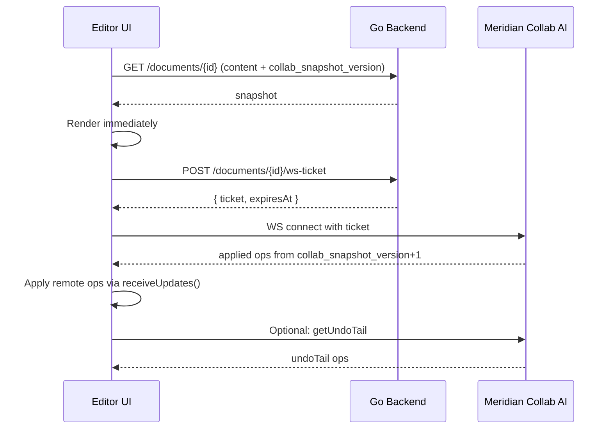

# RFC: Operation-Based Editing with Real-Time AI Collaboration

**Status:** Draft
**Priority:** High (foundational architecture change)

---

## Problem Statement

Meridian currently uses snapshot-only writes (`PATCH` full content, one `documents.content` field).

| Limitation | Writer Impact |
|---|---|
| No persistent edit history | Undo disappears on file switch/reload |
| AI edits are polled | 2s polling + full refresh before user sees AI output |
| Snapshot race windows | Stale save-ack issues |
| AI edit granularity is coarse | `ai_version` + PUA marker flow cannot cleanly undo one AI action |
| No path to multi-user editing | No server operation stream/version protocol |

**WHY now:** Persistent undo and low-latency AI edits are immediate writer pain. A server operation stream also unlocks future multi-user collaboration.

---

## Decision Update (From Review + Research)

1. **CodeMirror OT + authoritative Node/TS collab service** — not Go backend. Native `@codemirror/collab` access eliminates need to port ~2000 lines of ChangeSet logic.
2. Split storage into **applied ops** (authoritative) and **proposals** (review queue).
3. Load UX: **snapshot first**, then operation batches. Do not block typing while reconnecting.
4. Compaction: keep snapshot + bounded replay tail (not snapshot-only).
5. Use **short-lived WebSocket ticket**, not long-lived JWT query param.
6. Keep one live-collab stream per chapter/section document. Defer document pagination/segmented loading.
7. **No migration needed.** No users — greenfield rebuild on a branch.
8. AI proposals rendered as **CodeMirror decorations** (not PUA markers in document text).
9. **Multi-agent first, not multi-user first.** Prioritize many AI proposal producers for one writer before presence/cursors.
10. **Defer CRDT/Yjs migration.** Re-evaluate before multi-user/offline phase using explicit criteria.

---

## Scope Clarification: Multi-Agent First

Primary near-term concurrency is **multiple LLM agents + one writer**, not many human co-editors.

- The authoritative op stream remains centralized (`@codemirror/collab` OT model).
- AI systems are proposal producers. They do not write authoritative ops directly.
- Proposal acceptance is serialized by the Node authority so agent outputs cannot race the version stream.

### CRDT Re-Evaluation Trigger

Reconsider Yjs/CRDT only if any become true:
- multi-user editing with frequent concurrent writers is now near-term
- offline-first edits must merge after long disconnects
- cross-region multi-instance fanout is required for core editing reliability

---

## Architecture Overview

```
┌─────────────────┐     ┌──────────────────────┐     ┌─────────────┐
│  Frontend        │────│ Meridian Collab AI     │────│  PostgreSQL  │
│  (Vite + CM6)   │ WS │  (authority + proposals)│ DB │  (Supabase)  │
└────────┬────────┘     └──────────────────────┘     └──────┬──────┘
         │ REST                                              │
         └──────────────┐                                    │
                        ▼                                    │
               ┌─────────────────┐                           │
               │  Go Backend      │───────────────────────────┘
               │  (REST API, Auth,│ DB
               │   Threads/LLM)   │
               └─────────────────┘
```

### Service Ownership

| Service | Owns | Tables |
|---|---|---|
| Meridian Collab AI (Node) | WebSocket, version authority, proposals, compaction | `<env_prefix>collab_document_applied_operations`, `<env_prefix>collab_document_edit_proposals`, `<env_prefix>collab_ws_tickets` |
| Go backend | REST API, auth (JWT/JWKS), file system, threads/LLM | Everything else (`documents`, `folders`, `threads`, etc.) |
| Frontend | CM6 collab extension, proposal decorations, UI | IDB cache |

Both services connect directly to the same Supabase PostgreSQL. Table ownership is clear — no cross-writes.

**WHY Node:** `rebaseUpdates()`, `ChangeSet.map()`, `ChangeSet.compose()` are JS functions from `@codemirror/collab` and `@codemirror/state`. The Authority server from the CM collab example is ~30 lines of JS. Building on it natively avoids porting ChangeSet operations to Go.

### Dual Streams: Applied Operations + Proposals

**WHY this split:** Proposals should not consume authoritative versions. Only applied ops define document state/version.

### SQL Prefix Convention (Required)

All SQL objects owned by Meridian Collab AI are env-prefixed and collab-scoped.

1. Environment prefix comes from `MERIDIAN_SQL_PREFIX` (for example: `dev_`, `stg_`, `prd_`).
2. Tables: `<env_prefix>collab_document_applied_operations`, `<env_prefix>collab_document_edit_proposals`, `<env_prefix>collab_ws_tickets`.
3. Indexes/constraints: `<env_prefix>idx_collab_*`, `<env_prefix>uq_collab_*`, `<env_prefix>fk_collab_*` when explicitly named.
4. Shared-table columns added by collab must use `collab_` prefix (stable across envs).
5. New migration files should include `collab` in the filename to make ownership obvious.

Example resolution:
- local (`MERIDIAN_SQL_PREFIX=dev_`): `dev_collab_document_applied_operations`
- staging (`MERIDIAN_SQL_PREFIX=stg_`): `stg_collab_document_applied_operations`
- production (`MERIDIAN_SQL_PREFIX=prd_`): `prd_collab_document_applied_operations`

---

## Repo Structure

```
meridian-collab-ai/
├── package.json
├── pnpm-workspace.yaml
├── packages/
│   ├── core/
│   │   ├── ports/
│   │   │   ├── OperationLogPort.ts
│   │   │   ├── ProposalPort.ts
│   │   │   ├── TicketPort.ts
│   │   │   ├── SnapshotPort.ts
│   │   │   ├── PubSubPort.ts
│   │   │   └── AuthVerifierPort.ts
│   │   └── policies/
│   │       ├── ConflictPolicy.ts
│   │       ├── AdmissionPolicy.ts
│   │       └── ArbitrationPolicy.ts
│   ├── cm-ot/
│   │   └── index.ts                # CM6 OT adapters/helpers (`ChangeSet`, map, compose)
│   └── transport-ws/
│       └── protocol.ts             # WS protocol types
└── services/
    └── collab-server/
        └── src/
            ├── index.ts            # Entry point, HTTP + WS server
            ├── authority/
            │   ├── Authority.ts
            │   └── DocumentSession.ts
            ├── proposals/
            │   ├── ProposalService.ts
            │   └── proposalTypes.ts
            ├── agents/
            │   └── AgentArbiter.ts
            ├── compaction/
            │   └── CompactionService.ts
            ├── transport/
            │   ├── wsHandler.ts
            │   └── wsTicket.ts
            ├── db/
            │   ├── pool.ts
            │   ├── operationRepo.ts
            │   ├── proposalRepo.ts
            │   ├── ticketRepo.ts
            │   └── snapshotRepo.ts
            └── auth/
                └── jwtValidator.ts
```

---

## Phased Implementation

### Phase 1: WebSocket Transport + Applied Operations

**Goal:** Replace HTTP PATCH save with CM collab over WebSocket. Single-user, single-tab.

### Phase 2: Persistent Undo

**Goal:** Cmd+Z survives page reload, powered by persisted history state (initially replay-tail based).

### Phase 3: AI Proposal Model (Replace PUA Markers)

**Goal:** AI changes as proposals rendered via decorations. No markers in document text.

### Phase 4: Multi-Agent Orchestration

**Goal:** Multiple LLM agents can propose concurrently with deterministic arbitration.

### Phase 5: Multi-User Collaboration (Future)

**Goal:** Presence, cursors, multi-client conflict handling.

```
Phase 1 (WS + Applied Ops)
  └──┬── Phase 2 (Persistent Undo)
     └── Phase 3 (AI Proposals)
              └── Phase 4 (Multi-Agent Orchestration)
                       └── Phase 5 (Multi-User) ← future
```

### Rollout and Rollback (v1)

This rollout is optimized for a low-traffic greenfield state (one rare user, no compatibility burden).

1. Hard cutover on a branch merge. No dual-write and no snapshot PATCH fallback.
2. Feature flag at frontend boot: `ENABLE_COLLAB_OT=true`.
3. Kill switch (server + frontend):
   - server returns `503 COLLAB_DISABLED` from WS and proposal endpoints
   - frontend shows read-only banner and disables proposal accept/reject actions
4. Rollback procedure:
   - disable `ENABLE_COLLAB_OT`
   - stop Meridian Collab AI deployment
   - keep data tables intact (no destructive rollback migration)
5. Data compatibility stance:
   - no backward compatibility guarantees across pre-cutover plans
   - if schema changes are needed during v1 stabilization, prefer forward-only migrations

---

## Operation Model

### Applied Operations Schema (Authoritative)

```sql
CREATE TABLE <env_prefix>collab_document_applied_operations (
    id            UUID PRIMARY KEY DEFAULT gen_random_uuid(),
    document_id   UUID NOT NULL REFERENCES documents(id) ON DELETE CASCADE,
    version       INT NOT NULL,      -- authoritative, contiguous per document
    user_id       TEXT NOT NULL,
    source        TEXT NOT NULL,     -- 'user' | 'ai' | 'system'
    client_id     TEXT NOT NULL,     -- browser tab session id (generated per tab, persists across reload via sessionStorage)
    client_op_id  TEXT NOT NULL,     -- per-client monotonic op id (idempotency)
    changeset     JSONB NOT NULL,    -- ChangeSet.toJSON() => number[] arrays
    created_at    TIMESTAMPTZ NOT NULL DEFAULT NOW(),

    UNIQUE(document_id, version),
    UNIQUE(document_id, client_id, client_op_id)
);

CREATE INDEX <env_prefix>idx_collab_document_applied_doc_version
    ON <env_prefix>collab_document_applied_operations(document_id, version);
```

### Proposal Schema (Non-Authoritative)

```sql
CREATE TABLE <env_prefix>collab_document_edit_proposals (
    id                     UUID PRIMARY KEY DEFAULT gen_random_uuid(),
    document_id            UUID NOT NULL REFERENCES documents(id) ON DELETE CASCADE,
    source                 TEXT NOT NULL DEFAULT 'ai',
    agent_id               TEXT,
    proposal_group_id      UUID,
    status                 TEXT NOT NULL DEFAULT 'proposed'
                           CHECK (status IN ('proposed', 'accepted', 'rejected', 'conflicted')),
    base_version           INT NOT NULL,        -- version proposal was generated against
    anchor_start           INT NOT NULL,        -- UTF-16 offset at base_version
    anchor_end             INT NOT NULL,        -- UTF-16 offset at base_version
    before_hash            TEXT NOT NULL,       -- SHA-256 of text at anchor range at base_version
    changeset              JSONB NOT NULL,
    description            TEXT,                -- human-readable summary of change
    accepted_operation_id  UUID REFERENCES <env_prefix>collab_document_applied_operations(id),
    created_by             TEXT,
    created_at             TIMESTAMPTZ NOT NULL DEFAULT NOW(),
    decided_at             TIMESTAMPTZ
);
```

### WS Ticket Schema

```sql
CREATE TABLE <env_prefix>collab_ws_tickets (
    id          UUID PRIMARY KEY DEFAULT gen_random_uuid(),
    user_id     TEXT NOT NULL,
    document_id UUID NOT NULL REFERENCES documents(id) ON DELETE CASCADE,
    expires_at  TIMESTAMPTZ NOT NULL,
    used        BOOLEAN NOT NULL DEFAULT FALSE,
    created_at  TIMESTAMPTZ NOT NULL DEFAULT NOW()
);
```

### Snapshot Metadata

```sql
ALTER TABLE documents
  ADD COLUMN collab_snapshot_version INT NOT NULL DEFAULT 0,
  ADD COLUMN collab_op_floor_version INT NOT NULL DEFAULT 0;
```

### Retention and Cleanup (v1)

1. `<env_prefix>collab_ws_tickets`: delete rows where `expires_at < now() - interval '1 day'` every hour.
2. `<env_prefix>collab_document_edit_proposals`: keep `accepted/rejected/conflicted` for 90 days, then delete nightly.
3. `<env_prefix>collab_document_applied_operations`: bounded by compaction tail; hard alert if any doc keeps > `10_000` ops.
4. Cleanup jobs run in Meridian Collab AI service scheduler (single instance).

### Version Allocation

`SELECT ... FOR UPDATE` row lock on `documents` then assign next version. Simple, standard SQL semantics. Runs in the Node service directly.

---

## Authority Server

`Authority.ts` follows the CM collab example:

```typescript
import { ChangeSet, Text } from "@codemirror/state";
import { rebaseUpdates, Update } from "@codemirror/collab";

class Authority {
  doc: Text;
  floorVersion: number; // oldest version still replayable from ops table
  headVersion: number;  // latest authoritative applied op version
  updates: Update[] = []; // updates[0] corresponds to floorVersion + 1

  receiveUpdates(clientVersion: number, updates: Update[]) {
    if (clientVersion < this.floorVersion) {
      return { type: "resetRequired", snapshotVersion: this.floorVersion };
    }
    const missedFrom = clientVersion - this.floorVersion;
    if (missedFrom < this.updates.length) {
      // Client is behind — rebase their updates over what they missed
      updates = rebaseUpdates(updates, this.updates.slice(missedFrom));
    }
    for (const update of updates) {
      this.updates.push(update);
      this.doc = update.changes.apply(this.doc);
      this.headVersion += 1;
    }
    // Persist to <env_prefix>collab_document_applied_operations + broadcast to peers
  }
}
```

---

## Transport and Auth

### WS Protocol

```typescript
// Client → Server
| { type: "getDocument" }
| { type: "pushUpdates"; version: number; updates: { clientID: string; changes: number[] }[] }
| { type: "pullUpdates"; version: number }
| { type: "getUndoTail" }

// Server → Client
| { type: "document"; version: number; doc: string }
| { type: "updates"; updates: { clientID: string; changes: number[]; source: string }[] }
| { type: "pushResult"; ok: boolean; version?: number; error?: string }
| { type: "resetRequired"; snapshotVersion: number }
| { type: "undoTail"; ops: { version: number; changes: number[]; clientID: string }[] }
| { type: "newProposal"; proposal: Proposal }
| { type: "proposalStatusChanged"; proposalId: string; status: string }
```

### Protocol Error Contract (v1)

`pushResult.error` and REST error bodies use stable machine codes:

| Code | Meaning | Client Behavior |
|---|---|---|
| `VERSION_GAP` | client version behind floor/head expectations | issue `pullUpdates`; if repeated, reconnect |
| `RESET_REQUIRED` | requested version `< collab_op_floor_version` | reload snapshot, reconnect from `collab_snapshot_version` |
| `IDEMPOTENCY_REPLAY` | same (`client_id`, `client_op_id`) already applied | treat as success, refresh head version |
| `PAYLOAD_TOO_LARGE` | op/proposal exceeds limits | chunk and retry |
| `PROPOSAL_CONFLICTED` | proposal cannot be safely rebased | show conflicted state, regenerate |
| `TICKET_INVALID` | ticket missing/expired/used | fetch new ticket and reconnect |
| `RATE_LIMITED` | per-connection or per-doc limits exceeded | exponential backoff (start 250ms, cap 5s) |
| `COLLAB_DISABLED` | kill switch enabled | switch UI to read-only mode |

### Auth

**WS ticket:** `POST /api/documents/{id}/ws-ticket` (Go backend, JWT-authenticated) → `{ ticket: "<uuid>", expiresAt: "..." }`. 30-second TTL, one-time use.

**WS connect:** `wss://collab-ai.meridian.app/ws/documents/{documentId}?ticket={ticket}`

Node service redeems ticket against DB, validates user owns document.

Ticket redemption must be atomic:
- one statement/transaction validates `used = false AND expires_at > now()`
- marks `used = true` on success
- fails closed on replay/race

### Security and Data Access Model (v1)

1. Browser never talks to Postgres directly for collab tables.
2. Meridian Collab AI uses server-side DB credentials only (never exposed to frontend).
3. Go backend and Meridian Collab AI use separate DB roles with least privilege by table ownership.
4. Log policy: redact `ticket`, `changeset`, and large proposal payloads from info logs.
5. Secret rotation target: every 90 days or immediately after suspected leak.

### LLM Stream Transport

Keep existing SSE for turn streaming. Document ops and turn streaming remain separate channels.

---

## Compaction and Snapshot Policy

### Policy

1. Trigger compaction when any condition is met:
   - applied op count > `200`
   - applied op bytes > `256KB`
   - active doc has not compacted in `24h`
2. Compose applied ops up to `cutoff_version` using `ChangeSet.compose()` (native JS).
3. In one transaction:
   - write `documents.content` snapshot at `cutoff_version`
   - set `collab_snapshot_version = cutoff_version`
   - delete applied ops `<= cutoff_version - replay_tail`
   - set `collab_op_floor_version` to oldest remaining applied version (or `collab_snapshot_version`)
4. Keep replay tail (default `75` ops) for reconnect + undo continuity.

### Reconnect Contract

If client requests `fromVersion < collab_op_floor_version`, server returns `resetRequired`. Client reloads snapshot and reconnects from `collab_snapshot_version`.

### Concurrency Rules (Compaction vs Writes)

1. Lock order is fixed: `documents` row lock first, then operation-range reads.
2. Set transaction `lock_timeout = '2s'` and `statement_timeout = '5s'` for compaction.
3. If lock timeout occurs, compaction aborts and retries later (no partial work).
4. Compaction runs max one job per document at a time (document-scoped mutex).
5. Apply path always wins over compaction under lock contention.

---

## First Load Flow



Typing policy during reconnect:
- Allow typing immediately.
- `@codemirror/collab` queues local ops until transport is ready.
- Show sync state (`Connected`, `Syncing`, `Disconnected`).

---

## AI Proposal Accept/Reject Model

### How Proposals Work

**Create:** AI generates edit → Node service creates proposal at `base_version` → broadcasts `newProposal` via WS → frontend renders decorations.

**Render (decoration-based, never in document text):**
1. Take proposal's `changeset` (against `base_version`)
2. Map through all ops from `base_version` to current version using `ChangeSet.map()`
3. For each change in mapped changeset:
   - **Deletions:** Mark decoration (red strikethrough) on the range
   - **Insertions:** Widget decoration (green text) at insertion point
4. Navigate with up/down arrows (same UX as current hunk navigator)

**Accept (server-authoritative, atomic):**
1. Client sends `POST /collab/proposals/{id}/accept` with idempotency key
2. Node service loads proposal + ops from `base_version` to current
3. Node rebases proposal changeset via `ChangeSet.map()`
4. In one DB transaction:
   - insert applied op (`source: 'ai'`)
   - set proposal `status = 'accepted'`
   - set `accepted_operation_id`, `decided_at`
5. Node broadcasts both `updates` and `proposalStatusChanged`

**Reject:** Mark proposal `rejected`, remove decorations. No document change.

**Conflict:** If overlap severity is high or `before_hash` mismatches after rebase → mark `conflicted`, require regeneration/review.

This replaces `ai_version` + PUA marker flow entirely.

### Multi-Agent Arbitration Rules

1. Agents only create proposals (non-authoritative).
2. Proposal accept/reject is the single authority gate.
3. Accept pipeline is serialized per document to prevent version races.
4. Overlapping accepted proposals are rebased in acceptance order.

### Large AI Edit Admission Policy

All limits are server-enforced (client mirrors for UX only).

| Limit | Default | Behavior on exceed |
|---|---|---|
| `max_changeset_bytes` | `128KB` | Split into chunk proposals |
| `max_changed_chars` | `20_000` | Split into chunk proposals |
| `max_changed_ranges` | `200` | Split into chunk proposals |
| per-op WS payload | `64KB` | Reject push, require chunking |

Chunking strategy:
1. Split by paragraph/section boundaries into ordered chunks.
2. Create proposal group (`proposal_group_id`) for shared accept/reject UX.
3. Accept chunks independently, with stop-on-conflict.

Fallback mode:
- If chunking still exceeds limits or conflict rate is high, use **full rewrite review mode** (out-of-band diff + manual apply), not live op streaming.

### Backpressure and Rate Limits (v1)

| Scope | Limit | Behavior |
|---|---|---|
| per WS connection inbound | `30` messages/sec | return `RATE_LIMITED`, temporary mute 1s |
| per document pending proposal accepts | `20` | reject new accepts until queue drains |
| per document queued agent proposals | `200` | reject lowest-priority new proposal |
| offline local queue (frontend) | `256KB` | stop queueing, show reconnect-required banner |

### Conflict Policy (Rebase Outcomes)

| Tier | Condition | Behavior |
|---|---|---|
| Low | Small overlap, hash still valid | Auto-rebase path allowed |
| Medium | Moderate overlap | Require user review before accept |
| High | Large overlap or hash mismatch | Mark `conflicted`, do not auto-apply |

---

## Component Design

### Meridian Collab AI Service

| Module | Responsibility |
|---|---|
| `Authority` | CM collab authority: version log, `rebaseUpdates()`, broadcast |
| `DocumentSession` | Per-document active session: connections, in-memory state |
| `ProposalService` | Create, accept (rebase + apply), reject proposals |
| `AgentArbiter` | Multi-agent ordering, overlap scoring, admission limits |
| `CompactionService` | Periodic `ChangeSet.compose()` → snapshot |
| `wsHandler` | WebSocket connection lifecycle |
| `wsTicket` | Ticket creation + one-time redemption |

### Interface Contracts (SOLID)

| Contract | Kind | Used By | Default Adapter/Policy |
|---|---|---|---|
| `OperationLogPort` | Port | `Authority`, `CompactionService` | `db/operationRepo.ts` |
| `ProposalPort` | Port | `ProposalService`, `AgentArbiter` | `db/proposalRepo.ts` |
| `TicketPort` | Port | `wsTicket`, `wsHandler` | `db/ticketRepo.ts` |
| `SnapshotPort` | Port | `CompactionService`, first-load API | `db/snapshotRepo.ts` |
| `PubSubPort` | Port | `DocumentSession`, `wsHandler` | in-process adapter (v1), Redis adapter (future) |
| `AuthVerifierPort` | Port | `wsHandler`, ticket endpoints | `auth/jwtValidator.ts` |
| `ConflictPolicy` | Strategy | `ProposalService` | low/medium/high overlap policy |
| `AdmissionPolicy` | Strategy | `AgentArbiter`, `ProposalService` | size/range/payload limits |
| `ArbitrationPolicy` | Strategy | `AgentArbiter` | FIFO + overlap score |

Contract rules:
- Core services depend only on ports/strategies, never concrete DB/WS/JWT clients.
- Ports are small and task-specific (read/write split when practical).
- Any adapter replacement (e.g., Redis pub/sub, different SQL client) must keep contract behavior unchanged.

### Frontend

| Component | Responsibility |
|---|---|
| `CollabTransport` | WS connection, reconnect with backoff, message send/receive |
| `collabExtension` | `@codemirror/collab` setup: `collab()` extension, push/pull wired to transport |
| `useDocumentCollab` | Hook: ticket → WS connect → collab extension → cleanup |
| `useCollabStore` | Zustand: `syncState`, `version`, `clientID` |
| `undoHistory` | Map replay tail ops → CM6 undo stack |
| `useProposalReview` | Proposal list, WS subscription, accept/reject actions |
| `useProposalStore` | Active proposals, focused index, navigation |
| `proposalPlugin` | ViewPlugin: render proposal decorations alongside live preview coordinator |
| `proposalField` | StateField: proposal data + focused index |
| `AIProposalNavigator` | Floating nav pill (replaces `AIHunkNavigator`) |

### Decoration Coordinator Integration

The proposal plugin sits **alongside** the existing `livePreview/plugin.ts` coordinator as a separate ViewPlugin. The coordinator handles markdown rendering; the proposal plugin handles AI change visualization. They don't conflict because proposals are decoration-only.

The `excludedRegions` pattern extends to proposal decoration ranges (avoid rendering markdown within proposal widgets).

---

## Key Files Affected

### New: `meridian-collab-ai/` (entire directory)
- `meridian-collab-ai/packages/core/ports/*` (new interfaces)
- `meridian-collab-ai/packages/core/policies/*` (new strategy contracts/defaults)
- `meridian-collab-ai/services/collab-server/*` (deployable runtime)

### Frontend — New
- `frontend/src/core/collab/CollabTransport.ts`
- `frontend/src/core/collab/collabExtension.ts`
- `frontend/src/core/collab/types.ts`
- `frontend/src/core/collab/undoHistory.ts`
- `frontend/src/core/collab/proposalTypes.ts`
- `frontend/src/core/stores/useCollabStore.ts`
- `frontend/src/core/stores/useProposalStore.ts`
- `frontend/src/core/editor/codemirror/proposals/proposalPlugin.ts`
- `frontend/src/core/editor/codemirror/proposals/proposalField.ts`
- `frontend/src/core/editor/codemirror/proposals/proposalWidget.ts`
- `frontend/src/features/documents/hooks/useDocumentCollab.ts`
- `frontend/src/features/documents/hooks/useProposalReview.ts`
- `frontend/src/features/documents/components/AIProposalNavigator.tsx`

### Frontend — Retire
- `frontend/src/core/services/documentSyncService.ts` — delete
- `frontend/src/core/services/saveMergedDocument.ts` — delete
- `frontend/src/core/lib/sync.ts` — delete
- `frontend/src/core/lib/mergedDocument.ts` — delete (553 lines)
- `frontend/src/core/editor/codemirror/diffView/*` — delete entire directory
- `frontend/src/features/documents/hooks/useDocumentSync.ts` — delete
- `frontend/src/features/documents/hooks/useDiffView.ts` — delete
- `frontend/src/features/documents/components/AIHunkNavigator.tsx` — delete

### Backend — Modify
- `backend/internal/handler/document.go` — add WS ticket endpoint
- Drop `documents.ai_version`, `documents.ai_version_rev` columns
- Remove `GET /api/documents/{id}/ai-status` endpoint

---

## Key Decisions Summary

| Decision | Choice | Why |
|---|---|---|
| Architecture style | Ports + adapters + policy strategies | Strengthens DIP/ISP/OCP and testability |
| Collab server language | Node/TS | Native `@codemirror/collab` access, no ChangeSet porting |
| DB access | Direct PostgreSQL (shared Supabase) | Low latency for version allocation, clear table ownership |
| WS auth | Short-lived ticket (30s, one-time) | No JWT in URL, revocable |
| Version allocation | `SELECT ... FOR UPDATE` row lock | Simple, standard SQL semantics |
| Proposal rendering | Decorations (not in document text) | Clean document, no PUA corruption, multiple proposals coexist |
| Proposal accept | Server-authoritative atomic transaction | Prevent accepted/applied split-brain on retries/failures |
| Multi-agent strategy | Proposal-only writers + serialized acceptance | Deterministic arbitration for many LLMs, one user |
| Large AI edits | Admission limits + chunking + fallback mode | Prevent oversized ops from breaking transport/rebase UX |
| CRDT/Yjs | Deferred with explicit trigger criteria | Avoid migration cost before multi-user/offline is needed |
| Migration | None — greenfield rebuild on branch | No users, no backwards compatibility needed |
| WS library | `ws` (Node) | Standard, performant, well-maintained |
| PostgreSQL client | `postgres` (porsager/postgres) | Modern, fast, tagged template queries |
| Rollout style | Hard cutover + kill switch | Fast iteration with minimal legacy burden |

---

## Observability and SLOs (v1)

Metrics (per document and global):
- `collab_push_latency_ms` (p50/p95/p99)
- `proposal_accept_latency_ms`
- `rebase_conflict_rate`
- `reset_required_rate`
- `ws_reconnect_rate`
- `compaction_duration_ms`
- `compaction_lock_timeout_count`

Alert thresholds:
1. `reset_required_rate > 5%` for 10 minutes.
2. `proposal_accept_latency_ms p95 > 1500ms` for 10 minutes.
3. `compaction_lock_timeout_count >= 5` in 15 minutes.
4. `ws_reconnect_rate > 20%` for 10 minutes.

SLO targets:
1. 99% successful `pushUpdates` (excluding client disconnects).
2. p95 proposal accept end-to-end < 1.5s.
3. p95 reconnect-to-synced < 3s.

---

## Verification Matrix (Required Before Cutover)

| Scenario | Method | Pass Criteria |
|---|---|---|
| Concurrent push race | 2 clients push same base version | contiguous versions, no duplicate op IDs |
| Ticket replay | reuse same ticket twice | first succeeds, second returns `TICKET_INVALID` |
| Compaction during typing | run compaction with active writes | no lost ops, no partial snapshot, clients stay synced |
| Floor reset path | request updates below floor | `RESET_REQUIRED` then successful snapshot reload |
| Large proposal chunking | proposal exceeds limits | split into group, all chunks ordered, stop-on-conflict works |
| High-overlap conflict | overlapping proposals accepted out of order | high-overlap proposal marked `conflicted` |
| Kill switch | set `COLLAB_DISABLED` | WS/connect/accept blocked, UI read-only |
| Crash retry idempotency | retry same `client_op_id` after simulated crash | no duplicate authoritative op |

---

## Risks

| Risk | Mitigation |
|---|---|
| Version race/collision | Transactional row lock + unique constraints + retry |
| Duplicate client retries | Idempotency keys (`client_id`, `client_op_id`) |
| Compaction breaks reconnect | `collab_op_floor_version` + explicit `resetRequired` contract |
| Proposal drift after edits | Anchor + `before_hash` validation → `conflicted` state |
| Large AI proposal payloads stall transport | Server admission limits + chunking + fallback mode |
| Semantic conflict after mechanical rebase | Tiered conflict policy (low/medium/high) + manual review path |
| Token leakage via URL/logs | Short-lived WS ticket + log redaction |
| Over-engineering large docs too early | Chapter/section boundaries first, defer pagination |
| Multi-instance drift (in-memory sessions) | Run single replica in v1; add pub/sub before horizontal scaling |
| Extra service to deploy | Meridian Collab AI is focused and small; deploy on Railway alongside Go |

---

## Open Questions

| Question | Context | Options |
|---|---|---|
| Interface granularity | Avoid fat interfaces while keeping ergonomics | Split reader/writer ports if contracts grow |
| Undo persistence evolution | v1 uses replay-tail-based rebuild | move to serialized history if writer UX requires it |
| Horizontal fanout | v1 single instance is sufficient | Redis pub/sub when >1 service instance is required |
| Arbitration ranking | v1 FIFO + overlap score | later add quality/confidence weighting per agent |

---

## Sources

- [CodeMirror Collaborative Editing Example](https://codemirror.net/examples/collab/)
- [CodeMirror Collab API Reference](https://codemirror.net/docs/ref/#collab)
- [CodeMirror ChangeSet API Reference](https://codemirror.net/docs/ref/#state.ChangeSet)
- [CodeMirror Merge Package Docs](https://codemirror.net/docs/ref/#merge)
- [CodeMirror Viewport/Rendering Example](https://codemirror.net/examples/million/)
- [Yjs Document Updates](https://docs.yjs.dev/api/document-updates)
- [Yjs WebSocket Provider](https://docs.yjs.dev/ecosystem/connection-provider/y-websocket)
- [y-codemirror.next](https://github.com/yjs/y-codemirror.next)
- [Notion: Data model and persistence](https://www.notion.com/blog/data-model-behind-notion)
- [Notion: Offline architecture (Dec 11, 2025)](https://www.notion.com/en-gb/blog/how-we-made-notion-available-offline)
- [PostgreSQL Explicit Locking (`FOR UPDATE`)](https://www.postgresql.org/docs/current/explicit-locking.html)
- [MDN WebSocket constructor](https://developer.mozilla.org/en-US/docs/Web/API/WebSocket/WebSocket)
- [RFC 6455: The WebSocket Protocol](https://datatracker.ietf.org/doc/html/rfc6455.html)
- [@marimo-team/codemirror-ai](https://github.com/marimo-team/codemirror-ai)
