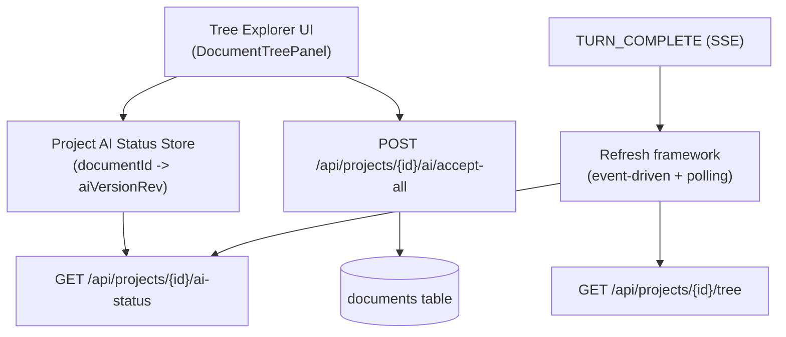

# Tree AI Suggestions Banner + “Accept All”

**Status:** In planning  
**Priority:** High  
**Estimated effort:** 1–3 days (full-stack)

## Problem Statement (WHY)

AI suggestions in Meridian are stored as `documents.ai_version` (with `ai_version_rev` CAS). The editor supports reviewing and “Accept All” **per open document**, but writers managing 100+ files need a writer-first, project-wide view:

- A tree explorer banner that shows **how many files currently have AI suggestions**
- A quick dropdown list to **jump to the affected files**
- A project-wide **“Accept All”** to apply suggestions across all files without opening them one by one

Without this, AI changes are “invisible” until the writer manually finds and opens each file.

## Current State

### What Works ✅
- Per-document AI status exists via `GET /api/documents/{id}/ai-status` (lightweight).
- Editor can render suggestions via merged-document markers and has “Accept All”/“Reject All” for the open doc (`useDiffView`).
- Tree explorer is rendered in `DocumentTreePanel` / `DocumentTreeContainer`.

### What’s Missing ❌
- The project tree API (`GET /api/projects/{id}/tree`) omits `ai_version`/`ai_version_rev`, so the tree has no knowledge of “which docs have AI suggestions”.
- No project-level endpoint for “docs with AI suggestions”.
- No project-wide “Accept All”.
- No consistent refresh strategy for “AI suggestion status” across streaming/out-of-band changes.

## Architecture Context (WHAT)

This plan depends on the “event-driven refresh framework” plan:
- `_docs/plans/fb-event-driven-refresh-framework.md`

We will introduce a project-scoped “AI suggestions index” (read model) and a project-wide accept operation (write model) so the tree UI stays fast and simple.

## Definitions / Semantics

- **“AI suggestions exist”** for a document means: `documents.ai_version IS NOT NULL`.
- **Project-wide “Accept All”** means:
  - `content = ai_version`
  - `ai_version = NULL`
  - bump `ai_version_rev` so concurrency remains consistent
- Undo is not supported until document history snapshots exist (see `_docs/plans/fb-document-history-v1.md`).

## Proposed Architecture



### Backend: Project AI Status Endpoint

Add:
- `GET /api/projects/{id}/ai-status`

Response shape (minimal):
```json
{
  "documents": [
    { "id": "uuid", "aiVersionRev": 3 }
  ]
}
```

Rules:
- Only include docs with `ai_version IS NOT NULL`
- Include `aiVersionRev` for correctness/debug and for any future CAS-dependent operations

Performance:
- Add a partial index so this is fast even for large projects:
  - `(project_id, updated_at DESC)` filtered by `ai_version IS NOT NULL AND deleted_at IS NULL`

### Backend: Project “Accept All” Endpoint (recommended)

Add:
- `POST /api/projects/{id}/ai/accept-all`

Behavior:
- Single transaction
- Apply accept semantics to all docs in the project where `ai_version IS NOT NULL`
- Return:
```json
{
  "updatedCount": 23,
  "updatedDocumentIds": ["uuid1", "uuid2"]
}
```

Why this endpoint (vs client loop):
- Avoids N×(GET doc + PATCH doc) requests for large projects.
- Avoids pulling full document content to the client just to apply “accept all”.
- Keeps logic correct and atomic server-side.

### Frontend: Project AI Status Store

Add a store keyed by `documentId`:
- `hasAiVersion` derived from presence in map
- store holds `aiVersionRev` for any future UI (“new since last seen”, etc.)

Refresh strategy:
- **Event-driven:** on `TURN_COMPLETE`, if a doc-mutating tool ran (esp. `doc_edit`), refresh project AI status.
- **Polling fallback:** low-frequency while project open + visible + online.
  - Proposed interval: 30s (can adjust later)
- **Initial load:** fetch once on project open.

### UI: Tree Banner + Dropdown List

Placement:
- In `DocumentTreePanel`, between the sticky search bar and the tree content.

Banner behavior:
- Hidden when count is 0.
- Shows: `AI suggestions in N files`.
- Dropdown list of affected docs:
  - Uses tree metadata (`useTreeStore.documents`) for display label + path
  - Clicking opens the doc via existing navigation helpers (`openDocument(...)`)

Optional (later):
- Per-file indicator in `DocumentTreeItem` (dot/badge).

### UI: “Accept All” action

Button in the banner:
- `Accept all` triggers:
  1. Best-effort flush of pending saves/retries (see below)
  2. `POST /api/projects/{id}/ai/accept-all`
  3. Refresh:
     - tree (`loadTree`) and
     - project ai-status store
     - if the active doc is in `updatedDocumentIds`, refresh active doc too

## Safety: Flush before Accept All (Best-effort)

Why:
- User could have just edited a doc, navigated back to tree quickly, and the debounced save/retry is still in-flight.
- Running project-wide accept-all can race with late saves/retries and cause confusing “reverted” state.

Approach:
- Add a “flush all pending sync operations” method (best-effort with timeout).
- If offline or flush times out:
  - either disable the action (strict), or
  - allow but show a small warning in the banner (writer-first; acceptable risk).

## Tool Trigger Matrix (for AI status + tree)

Current tools (backend-defined):
- `doc_view`, `doc_tree`, `doc_search` are read-only → no AI-status changes.
- `doc_edit` changes `ai_version` and/or creates docs.

| Tool | Input discriminator | Refresh needed |
|---|---|---|
| `doc_edit` | any | refresh project ai-status |
| `doc_edit` | `command=create` | refresh tree + ai-status |

This is intentionally conservative: any `doc_edit` can create/update `ai_version`, so we refresh ai-status.

## Implementation Plan

### Phase 1: Backend APIs (0.5–1 day)
- Add `GET /api/projects/{id}/ai-status`
- Add `POST /api/projects/{id}/ai/accept-all`
- Add DB index (migration)
- Ensure auth/authorization matches existing project access patterns.

### Phase 2: Frontend AI Status Store + Refresh wiring (0.5–1 day)
- Add project ai-status store + fetcher in `api.ts`.
- Wire:
  - initial fetch on project open
  - 30s polling fallback
  - event-driven refresh on `TURN_COMPLETE` when `doc_edit` ran

### Phase 3: Tree Banner UI (0.5–1 day)
- Implement banner in `DocumentTreePanel`:
  - count + dropdown list + accept-all
  - loading + disabled states while request in-flight

### Phase 4: Accept All + Flush + Post-refresh (0.5–1 day)
- Add best-effort flush before triggering accept-all.
- Call bulk endpoint; on success refresh:
  - tree
  - ai-status
  - active doc (conditional)

## Dependencies

- Backend: new project endpoints + migration
- Frontend: refresh framework plan (`fb-event-driven-refresh-framework.md`) for consistent event-driven refresh triggers/coalescing

## Testing

### Backend
- `GET /ai-status` returns only docs with `ai_version IS NOT NULL`
- `POST /ai/accept-all`:
  - updates `content` correctly
  - clears `ai_version`
  - bumps `ai_version_rev`
  - is atomic

### Frontend
- Banner shows correct count and hides at 0.
- Dropdown opens doc correctly.
- Accept-all:
  - clears banner to 0
  - tree stays consistent (new docs show up, etc.)
  - active editor updates if it was affected

## Success Criteria
- [ ] Tree explorer shows a banner when any file has AI suggestions.
- [ ] Banner dropdown links to all affected docs.
- [ ] “Accept all” applies AI suggestions across all affected docs.
- [ ] AI status stays correct during streaming and after out-of-band changes (via event refresh + 30s poll).

## Risks & Mitigations

| Risk | Mitigation |
|---|---|
| Large projects cause heavy client loops | Provide backend bulk accept-all endpoint |
| Races with pending saves/retries | Best-effort flush before accept-all |
| No undo | Acceptable until file versioning exists; keep UX minimal and writer-first |

## Related Documentation
- `_docs/plans/fb-event-driven-refresh-framework.md`
- `frontend/src/features/documents/components/DocumentTreePanel.tsx`
- `frontend/src/core/lib/api.ts` (documents update + aiVersion CAS semantics)
