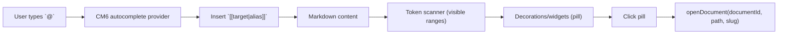

# Wikilinks + Internal Links (Docs) + `@` Mention Insertion

**Status:** Ready to implement  
**Priority:** High  
**Estimated effort:** 1–3 days (frontend + small backend prompt update)

## Problem Statement (WHY)

Writers need to reference other documents (“Aria”, “Chapter 12”, “World bible: magic”) inside prose and instructions without copy/pasting paths or losing references when content changes.

Meridian already has:
- a project-scoped document tree (paths are stable identifiers)
- a high-polish CodeMirror editor with live preview
- an LLM edit tool (`str_replace_based_edit_tool`) that reads/edits documents by path

What’s missing is a **writer-first internal link system**:
- easy insertion (`@` menu)
- durable, readable link tokens in markdown
- consistent rendering (pills) in the main editor and skill editor
- LLM guidance so edits preserve and produce correct internal links

## Current State

### What Works ✅
- Document addressing by exact path (URLs already use `Document.path` including extension).
  - See `frontend/src/features/workspace/components/WorkspaceLayout.tsx`
- CodeMirror editor infrastructure and live-preview renderer registry.
  - See `frontend/src/core/editor/codemirror/livePreview/plugin.ts`
- LLM tool prompt section is built dynamically from enabled tools.
  - See `backend/internal/service/llm/tools/registry.go`
  - Tool section is injected into the system prompt.
    - See `backend/internal/service/llm/streaming/system_prompt_resolver.go`

### What’s Missing ❌
- A canonical internal link token format writers can type and the UI can render.
- `@` insertion/autocomplete for documents.
- Click-to-open behavior in editor content.
- Backend prompt guidance for internal link format (so LLM doesn’t break links).
- Rename/move propagation (optional but strongly recommended).

## Definitions / Semantics (WHAT)

### Canonical token formats

We support **both** of these as internal links:

1) **Wikilinks (canonical insertion format)**
- `[[target]]`
- `[[target|alias]]`
- `[[target#fragment]]`
- `[[target#fragment|alias]]`

2) **Markdown links (interop; LLMs may emit these)**
- `[alias](target)`
- `[alias](target#fragment)`

### `target` rules

- Target is “project-relative file path”, filesystem-style.
  - Examples: `Characters/Heroes/Aria.md`, `Chapters/12.md`
- **Extension omission implies `.md`:**
  - `[[Aria]]` means `Aria.md`
  - `[[Characters/Heroes/Aria]]` means `Characters/Heroes/Aria.md`
- For **non-markdown files** (future multi-editor), extension MUST be explicit:
  - `[[Images/Map.png]]` is valid
  - `[[Map]]` would NOT infer `.png`

### `fragment` rules (future-facing, but design for it now)

We reserve `#fragment` for “navigate to a location inside the target file”.

v1 semantics (for the editor UX):
- `#fragment` refers to a **heading** inside the target markdown file.
  - Example: `[[Worldbuilding/Magic.md#Spellcraft]]`
- We preserve the fragment exactly as written (don’t auto-slugify in stored content).

v1 behavior:
- Rendering shows a single pill (same as a normal doc link).
- Clicking opens the target doc.
- Scrolling/highlighting to the heading is a follow-up phase (see “Phase 5”).

Why this matters:
- It aligns with user mental model (`@file#section`) and common markdown conventions.
- It gives us a clean bridge to thread/LLM “quote this section” reference blocks later.

### Shortest-unique rule

This rule affects **what the UI inserts**, not what the parser accepts.

- **In-document context** (main editor / skill editor): insert the **shortest unique suffix** of the target path.
  - Choose the shortest `suffix` where exactly one document path ends with it.
  - If ambiguous, expand to the next-longer suffix; if still ambiguous, fall back to full path.
  - Example: for `Characters/Heroes/Aria.md`, try:
    - `Aria.md` → unique? if yes, use it
    - else `Heroes/Aria.md` → unique? else full path
- **Root context** (thread composer; no “current document”): always insert full path.

### Rendering

- Render internal links as **pills** (writer-first, skim-friendly).
- Display text:
  - default: `@alias` if present, else `@<resolved document name>`
  - if ambiguous/unresolved: show `@<target>` with a warning style

### Click behavior

Clicking a pill should open the referenced document in the editor using existing navigation helpers:
- `frontend/src/core/lib/panelHelpers.ts` (`openDocument(...)`)

## Architecture Context

We implement internal links as a **CodeMirror extension** so it can be reused in:
- Main document editor
- Skill editor
- Future: CM6-based thread composer

We avoid creating a custom markdown dialect early by:
- scanning raw text for tokens (wikilinks + markdown links) in visible ranges
- rendering via decorations/widgets
- keeping the underlying stored markdown intact

This mirrors the existing “live preview” approach: syntax stays in the doc, but the user sees clean UI.

## Backend: LLM Prompt Guidance (IMPORTANT)

We want link preservation and consistent formatting **only when edit tool is enabled**, because that’s when the LLM is editing writer content.

Implementation:
- Add internal link rules to the **tool guideline** for `str_replace_based_edit_tool`.
- This guideline is included via `ToolRegistry.BuildSystemPromptSection()` when the tool is enabled.

Where:
- `backend/internal/service/llm/tools/text_editor.go` → `TextEditorToolMetadata().Guideline`

Guideline should include (minimal, strict):
- Preserve existing internal links (don’t “simplify” them).
- Prefer wikilinks `[[target|alias]]` for internal references.
- `[[Name]]` implies `.md`; non-md requires explicit extension.
- Allow `#fragment` for headings: `[[path/to/doc#Heading]]` or `[alias](path/to/doc.md#Heading)`.
- If the assistant emits Markdown links, keep targets filesystem-style (no URL-encoding).

## Frontend: Implementation Plan (step-by-step)

### Phase 1: Token model + resolvers (0.5 day)

Add a small internal module (pure functions + types) for parsing/resolution:
- Parse wikilinks: `[[target]]`, `[[target|alias]]`
- Parse wikilinks with fragments: `[[target#fragment]]`, `[[target#fragment|alias]]`
- Parse markdown links when `target` looks like a project path (not `http(s)://`)
- Parse markdown links with fragments: `[alias](target#fragment)`
- Normalize targets:
  - infer `.md` when extension absent
  - preserve explicit extension for non-md
- Split `target` into:
  - `path` (normalized, extension-inferred)
  - `fragment` (optional, raw string after `#`)
- Resolve target → document:
  - exact match on `Document.path`
  - fallback: unique `endsWith` match for shortest-unique behavior

Keep this pure so it can be unit-tested without CodeMirror.

### Phase 2: CM6 decorations + click handler (0.5–1 day)

Create a CM6 extension that:
- scans visible ranges for link tokens
- replaces them with a pill widget when:
  - selection/cursor does not overlap token range
  - token is not inside code spans/blocks (optional v1)
- attaches click behavior:
  - on click, call injected `openByDocumentId(id, opts?)` / `openByPath(path, opts?)` callback
    - `opts` includes optional `fragment` (future scroll-to-heading)

Integration points:
- Main editor: wire as an `extraExtension` on the markdown editor.
- Skill editor: same extension.

Constraints:
- Must not interfere with AI diff view hunk regions (follow the existing “skip hunk regions” rule).
  - See `frontend/src/core/editor/codemirror/livePreview/plugin.ts` (`hunkRegionsField`)

### Phase 3: `@` insertion/autocomplete (0.5–1 day)

Add an autocomplete source that triggers on `@`:
- Data source: `useTreeStore().documents` (already in memory) for display and insertion targets.
- Insert format:
  - In-document context: `[[<shortestUniqueTarget>|<alias>]]`
  - Root context (future composer): `[[<fullPath>|<alias>]]`
- Allow selecting folders later (for `[[folder/]]` or folder mentions) but keep v1 to documents only.

Keyboard UX:
- `Esc` closes menu
- `Enter/Tab` accepts selection

### Phase 4 (optional but recommended): Rename/move propagation (0.5–2 days)

Problem:
- Path-based links break on rename/move without refactoring.

Approach (v1):
- On document rename/move, update internal links across all markdown documents in project:
  - Update `[[oldTarget]]` / `[[oldTarget|alias]]` to new target (alias preserved).
  - Update markdown links `[alias](oldTarget)` similarly.

Implementation options:
- Backend job (recommended): a project-scoped “refactor references” service method.
- Frontend-only (not recommended): too slow and race-prone for large projects.

### Phase 5 (separate follow-up): `@file#section` + thread/LLM partial references (1–3 days)

This is a separate phase to do *after* core wikilinks + `@doc` insertion, but we should keep the v1 design extensible for it:
- Token model already supports optional `fragment`.
- Click handler already threads `fragment` through callbacks.

Scope:

1) `@doc#heading` insertion in CM6
- Extend the `@` completion into a 2-stage flow:
  - `@` → choose document
  - then (optional) `#` → choose heading in that doc
- Insert: `[[target#Heading|alias]]` (alias optional).

2) Clicking `[[doc#Heading]]` scrolls to the heading (editor UX)
- On open, locate the heading in the target markdown and scroll/highlight.
- Implementation choice (v1): simple “find heading text” in document content (fast enough).
- Later: slug-based matching if/when we standardize a heading slugger.

3) Thread/LLM “quote this section” (structured blocks)
- Keep **writer-visible content** as wikilinks.
- Add (or evolve) thread blocks to reference parts of files without copy/paste:
  - `reference`: whole file
  - `partial_reference`: a section or excerpt
- Important: current `partial_reference` is character-range based and does **not** stay up to date on file edits unless we add an anchor resolver.
- Recommended evolution (anchor-based; offsets are derived):
  - `{ ref_id, ref_type: "document", anchor_kind: "heading", anchor_text: "Spellcraft", version_timestamp? }`
  - Resolver computes the current range/snippet at send-time.

## Testing Strategy

### Frontend unit tests (Vitest)
- Parser:
  - `[[Aria]]` → `Aria.md`
  - `[[Aria#Spellcraft]]` → `Aria.md` + fragment `Spellcraft`
  - `[[Images/Map.png]]` stays `.png`
  - `[[Heroes/Aria.md|Aria]]` parses alias
  - `[Aria](Characters/Heroes/Aria.md)` recognized as internal link
- Resolver:
  - exact match wins
  - shortest-unique `endsWith` behavior
  - ambiguous behavior returns “unresolved/ambiguous”

### Manual verification
- Create two docs with same filename in different folders → verify insertion chooses longer suffix to disambiguate.
- Click pill opens doc and preserves cursor/scroll state as expected.
- LLM edit runs do not break internal links (spot-check edits near links).

## Success Criteria
- [ ] Typing `@` in the main editor inserts `[[...]]` internal links.
- [ ] Existing wikilinks and markdown links render as pills when not editing them.
- [ ] Clicking a pill opens the referenced document.
- [ ] Link target inference: `[[Name]]` implies `.md`.
- [ ] Backend edit tool prompt mentions internal link rules only when tool enabled.
- [ ] (Phase 5) `[[doc#Heading]]` navigates to the heading.

## Risks & Mitigations

| Risk | Mitigation |
|---|---|
| Path-based links break on rename/move | Implement Phase 4 rename/move propagation ASAP, or gate rename UI with “update references” option. |
| Ambiguous shortest-unique resolution | Fall back to full path insertion; render ambiguous tokens with warning style + tooltip. |
| Performance scanning large docs | Scan visible ranges only; cache results by doc version; avoid full-doc regex every update. |
| LLM emits HTTP links instead of internal | Prompt guidance + internal link renderer only targets filesystem-like paths. |

## Related Documentation

- `_docs/features/fb-file-system/README.md` (path semantics, search)
- `_docs/features/fb-thread-llm/README.md` (system prompt hierarchy)
- `_docs/features/fb-thread-llm/system-prompts.md` (prompt resolution details)
- `frontend/src/core/editor/codemirror/CodeMirrorEditor.tsx` (extraExtensions integration)
- `backend/internal/service/llm/tools/registry.go` (tool section prompt)
- `backend/internal/service/llm/tools/text_editor.go` (guideline location)
- `backend/internal/domain/models/llm/content_types.go` (reference/partial_reference content)
- `backend/internal/domain/services/llm/streaming.go` (turn block inputs)
