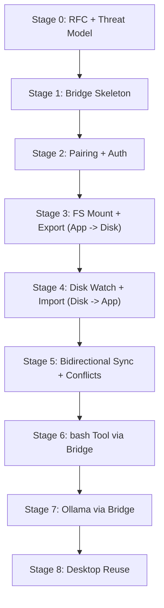
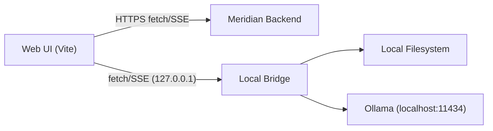

# Local Bridge Plan (Multi-Stage)

Local companion service ("Local Bridge") that the web app can use while open for:
- Local filesystem sync (bidirectional, conflict-safe)
- Local command execution (bash tool), policy-gated
- Local LLM access (Ollama preferred), streamed to the web UI

Principles:
- Web UI stays a client; Local Bridge owns local power (fs/exec/llm).
- Default-deny security posture (pairing, scoped tokens, allowlists).
- Single local trust boundary (one bridge) rather than 3 separate ones.
- Future desktop app bundles/reuses the same bridge as the core.

## Stages

Files:
- Stage 0: `./stage-0-rfc.md`
- Stage 1: `./stage-1-skeleton.md`
- Stage 2: `./stage-2-pairing-auth.md`
- Stage 3: `./stage-3-fs-export.md`
- Stage 4: `./stage-4-fs-import.md`
- Stage 5: `./stage-5-sync-conflicts.md`
- Stage 6: `./stage-6-bash-tool.md`
- Stage 7: `./stage-7-ollama.md`
- Stage 8: `./stage-8-desktop.md`

## Target Architecture (End State)

