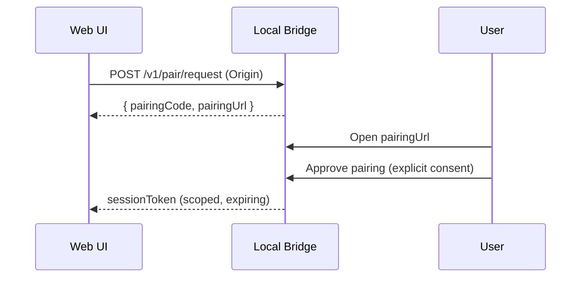

# Stage 2: Pairing + Auth (Single Trust Boundary)

Goal: Make it hard for arbitrary web pages to drive the bridge.

## Pairing Flow (Recommended)

## Token Properties

- Short-lived access token (minutes), renewable via refresh endpoint if needed.
- Bound to:
  - allowed `Origin` (exact match)
  - permission scopes
  - allowed `projectId` (and optionally mount IDs)

## Request Requirements

- `Authorization: Bearer <token>` for all `/v1/*` privileged endpoints.
- Must include `Origin` header and it must match the token-bound origin.
- Must include a non-simple header (e.g. `X-Meridian-Bridge: 1`) so CSRF-style form posts cannot work.

## Revocation / Disconnect

- `POST /v1/session/revoke` revokes token immediately.
- Bridge should support "revoke all sessions" for recovery.

## Stage Exit Criteria

- No privileged endpoint can be accessed without a valid token + correct Origin.
- Pairing UX is explicit and human-approved.

