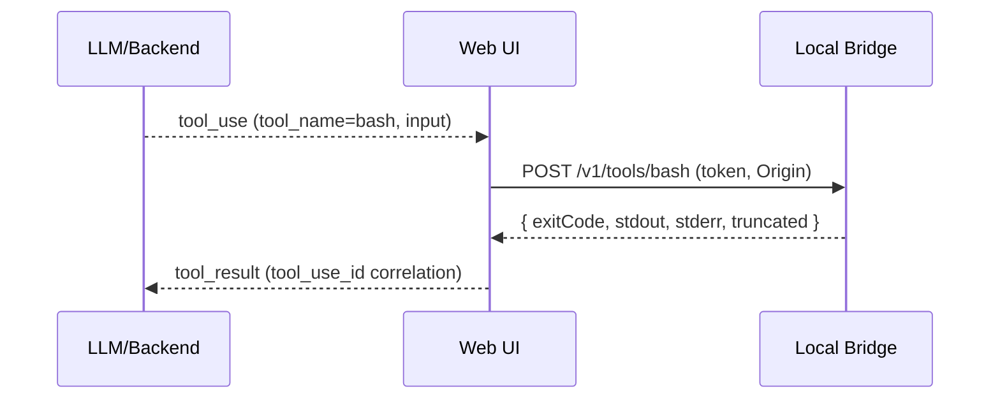

# Stage 6: bash Tool via Bridge (Policy-Gated Exec)

Goal: Support a "bash" tool that runs locally, with strong restrictions.

## Execution Model

## API (Bridge)

- `POST /v1/tools/bash`
  - input:
    - `command`: string (allowlisted)
    - `args`: string[] (structured)
    - `cwd`: `{ projectId, meridianPath? }` (resolved inside mount)
    - `timeoutMs`
  - output:
    - `exitCode`
    - `stdout`
    - `stderr`
    - `truncated`: boolean

## Policy (Default Deny)

- No raw shell string evaluation by default.
- Allowlist commands explicitly (v1):
  - start tiny (e.g., `ls`, `rg`, `git status`) and expand later.
- Cwd must be inside mount root (realpath-checked).
- Block network access if feasible (optional per OS; otherwise document the limitation).
- Enforce:
  - timeouts
  - max output bytes
  - max concurrent processes per token

## Stage Exit Criteria

- A `bash` tool call completes end-to-end and is persisted as `tool_result` in thread history.
- Malformed/blocked commands fail loudly with actionable errors.

