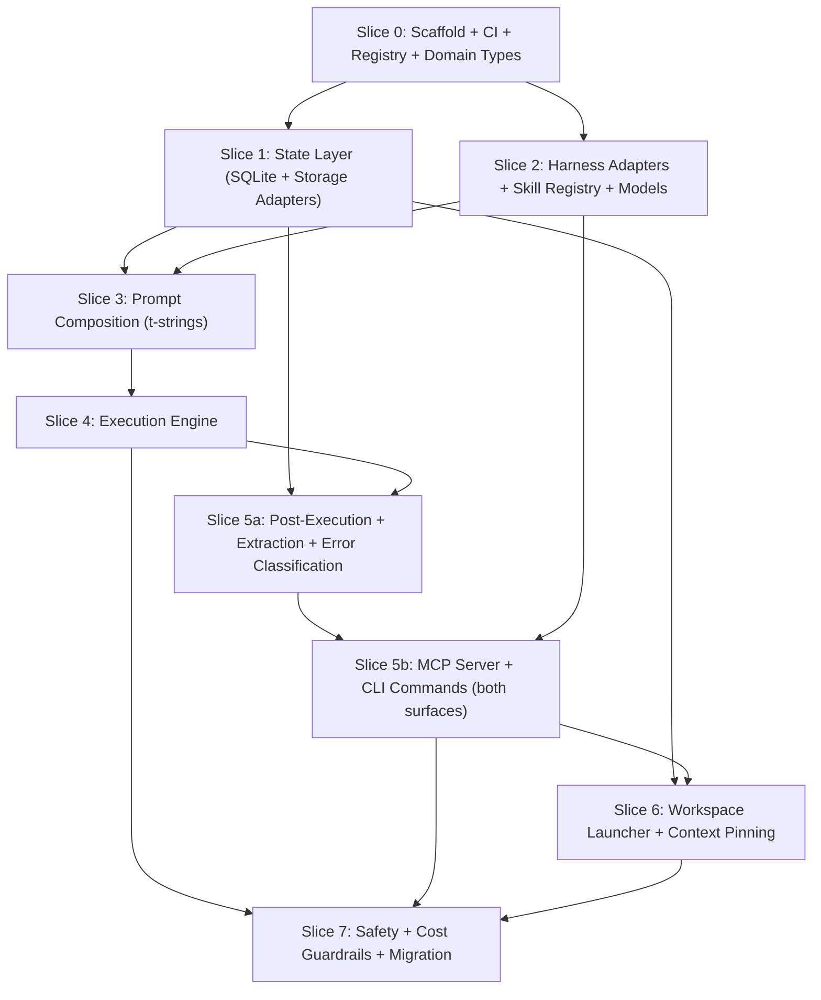

# `meridian` — Orchestrate CLI + MCP Server + API Tool Provider

**Status:** draft
**Priority:** High
**Estimated effort:** 12-16 days across 9 slices (0-7, with 5 split into 5a/5b)
**Depends on:** None (greenfield — subsumes existing bash scripts)
**Supersedes:** `orchestrate-cli.md` (Rust plan) — see [migration-from-rust.md](migration-from-rust.md)

## Problem Statement

The run-agent toolkit is ~1,400 lines of bash + jq that routes agent runs across Claude, Codex, and OpenCode CLIs. While functional, it has 20 documented gaps (see `_docs/technical/orchestrate-system-review.md`) including:

- Background runs silently lose results (critical gap #1, observed live)
- Read/write lock mismatch enables index corruption under concurrency (#2)
- Dangerous permission defaults (`--dangerously-skip-permissions` as fallback) (#3)
- No cost tracking for Codex/OpenCode (#4)
- JSONL index has no corruption recovery (#5)
- jq injection in filter interpolation (#8)

These gaps motivated the project, but `meridian` is not a rewrite of the bash scripts — it is a **new application** that subsumes them. The bash scripts handle: arg parsing -> prompt composition -> process spawning -> result extraction -> JSONL logging. `meridian` adds workspace persistence with compaction recovery, context pinning with auto re-injection, event-sourced workflow state, cost tracking and budget enforcement, permission tiers, a guardrail system, run dependency graphs, MCP-native tool exposure, programmatic tool calling support (Anthropic API `code_execution` + `allowed_callers`), and CLI, MCP server, and API tool interfaces with structured output. Roughly 30% of `meridian` replaces existing bash functionality; the other 70% is new product surface that cannot be achieved by patching the scripts.

Python 3.14 with pyright strict mode, frozen dataclasses in the core domain, pydantic only at boundaries, and the official `mcp` SDK provide type safety, rapid iteration, and native MCP server support. Python 3.14 unlocks t-strings (PEP 750) for type-safe prompt composition, deferred annotations (PEP 649) for cleaner Protocol definitions, and free-threaded Python (PEP 779) as a future concurrency option.

## Plan Files

| File | Contents |
|------|----------|
| [design-philosophy.md](design-philosophy.md) | P1-P12 design principles, `meridian` vs `meridian.lib` boundary |
| [architecture.md](architecture.md) | Architecture diagram, project layout, pyproject.toml, deps, operation registry, storage protocols, logging, MCP lifecycle |
| [mcp-tools.md](mcp-tools.md) | MCP tool definitions, response types, parity contract, non-blocking `run_create`, `MERIDIAN_DEPTH` |
| [cli-contract.md](cli-contract.md) | Output modes, error schema, `--json`/`--yes` specs, command grammar |
| [correctness-specs.md](correctness-specs.md) | 10 invariants, execution model strategy |
| [risk-and-gaps.md](risk-and-gaps.md) | Risk table, gap resolution, compatibility contract |
| [migration-from-rust.md](migration-from-rust.md) | What changed, what stayed, v2 horizon |

## Slice Summary

| Slice | Title | Effort | Dependencies |
|-------|-------|--------|-------------|
| [0](slices/0-scaffold.md) | Scaffold, CI, and `meridian` Package | 1 day | None |
| [1](slices/1-state-layer.md) | State Layer (SQLite + Events + Traces) | 2 days | Slice 0 |
| [2](slices/2-harness-skills-models.md) | Harness Adapters + Skill Registry + Model Discovery | 2 days | Slices 0, 1 |
| [3](slices/3-prompt-composition.md) | Prompt Composition | 1.5 days | Slices 1, 2 |
| [4](slices/4-execution-engine.md) | Execution Engine | 2 days | Slices 1, 2, 3 |
| [5a](slices/5a-extraction.md) | Post-Execution + Extraction | 1.5 days | Slices 1, 2, 4 |
| [5b](slices/5b-mcp-cli-wiring.md) | MCP Server + CLI Commands | 1.5 days | Slices 2, 5a |
| [6](slices/6-workspace-context.md) | Workspace Launcher + Context Pinning | 2 days | Slices 1, 5b |
| [7](slices/7-safety-migration.md) | Safety + Cost Guardrails + Migration | 2 days | Slices 4, 5b, 6 |

## Dependency Graph

Parallelizable: Slices 1 and 2 can run concurrently after Slice 0.
