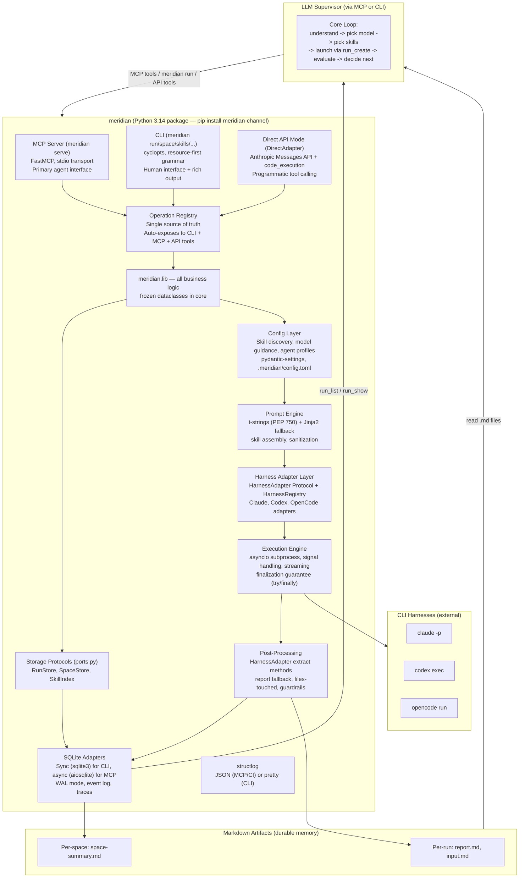

# Architecture

**Required reading:**
- [`README.md`](README.md) (always)
- [`design-philosophy.md`](design-philosophy.md) (always)

## Architecture Diagram



## Operation Registry — Anti-Drift Mechanism (Critical)

**All three independent reviews flagged CLI/MCP drift as the #1 architectural risk.** The Operation Registry ensures every operation is defined once and auto-exposed to both CLI and MCP.

```python
# meridian/lib/ops/registry.py
from dataclasses import dataclass, field
from typing import Any, Awaitable

@dataclass(frozen=True)
class OperationSpec:
    """Single source of truth for an operation exposed on both surfaces."""
    name: str                          # e.g. "run.create"
    handler: Callable[[Any], Awaitable[Any]]  # typed async handler
    input_type: type                   # frozen dataclass for input
    output_type: type                  # frozen dataclass for output
    cli_group: str                     # e.g. "run"
    cli_name: str                      # e.g. "create"
    mcp_name: str                      # e.g. "run_create"
    description: str                   # shared help text
    version: str = "1"                 # schema version for this operation
    sync_handler: Callable[[Any], Any] | None = None  # sync variant for CLI
    cli_only: bool = False             # e.g. "serve" — explicitly annotated with reason
    mcp_only: bool = False             # e.g. future tools with no CLI equivalent

_REGISTRY: dict[str, OperationSpec] = {}

def operation(spec: OperationSpec) -> OperationSpec:
    """Register an operation. Called at module load time.
    Raises ValueError if duplicate name detected."""
    if spec.name in _REGISTRY:
        raise ValueError(
            f"Duplicate operation name '{spec.name}': "
            f"already registered by {_REGISTRY[spec.name].handler}"
        )
    _REGISTRY[spec.name] = spec
    return spec

def get_all_operations() -> list[OperationSpec]:
    return list(_REGISTRY.values())

def get_operation(name: str) -> OperationSpec:
    return _REGISTRY[name]
```

**All three surfaces build from the registry:**
- `meridian/cli/main.py` — builds cyclopts commands from registry specs
- `meridian/server/main.py` — registers MCP tools from registry specs
- `meridian/lib/harness/direct.py` — generates Anthropic API tool definitions with `allowed_callers: ["code_execution_20260120"]`
- All are thin wrappers: parse input -> call `spec.handler` -> format output

**Parity test (CI-enforced):**
```python
# tests/test_surface_parity.py
def test_every_operation_has_both_surfaces():
    """Fail CI if an operation is missing from CLI or MCP without explicit opt-out."""
    for op in get_all_operations():
        if not op.cli_only:
            assert op.mcp_name in get_registered_mcp_tools(), \
                f"{op.name} missing MCP tool (add mcp_only=True if intentional)"
        if not op.mcp_only:
            assert f"{op.cli_group}.{op.cli_name}" in get_registered_cli_commands(), \
                f"{op.name} missing CLI command (add cli_only=True if intentional)"

def test_cli_help_matches_mcp_description():
    """CLI help text and MCP tool description must match."""
    for op in get_all_operations():
        if not op.cli_only and not op.mcp_only:
            assert get_cli_help(op) == get_mcp_description(op)

def test_api_tools_generated_from_registry():
    """Every non-CLI-only operation generates a valid API tool definition."""
    tools = DirectAdapter.build_tool_definitions()
    for op in get_all_operations():
        if not op.cli_only:
            tool = next(t for t in tools if t["name"] == op.mcp_name)
            assert tool["allowed_callers"] == ["code_execution_20260120"]
```

## Storage Protocol Layer (DIP)

All data access goes through Protocol interfaces — never direct DB calls in business logic.

```python
# meridian/lib/ports.py — storage interfaces
from typing import Protocol

class RunStore(Protocol):
    """Async read/write interface for run data (MCP server path)."""
    async def create(self, params: RunCreateParams) -> Run: ...
    async def get(self, run_id: RunId) -> Run | None: ...
    async def list(self, filters: RunFilters) -> list[RunSummary]: ...
    async def update_status(self, run_id: RunId, status: RunStatus) -> None: ...
    async def enrich(self, run_id: RunId, enrichment: RunEnrichment) -> None: ...

class RunStoreSync(Protocol):
    """Sync read/write interface for run data (CLI path)."""
    def create(self, params: RunCreateParams) -> Run: ...
    def get(self, run_id: RunId) -> Run | None: ...
    def list(self, filters: RunFilters) -> list[RunSummary]: ...
    def update_status(self, run_id: RunId, status: RunStatus) -> None: ...
    def enrich(self, run_id: RunId, enrichment: RunEnrichment) -> None: ...

class SpaceStore(Protocol):
    async def create(self, params: SpaceCreateParams) -> Space: ...
    async def get(self, space_id: SpaceId) -> Space | None: ...
    async def list(self, filters: SpaceFilters) -> list[SpaceSummary]: ...
    async def transition(self, space_id: SpaceId, new_state: SpaceState) -> None: ...

class SkillIndex(Protocol):
    async def reindex(self, skills_dir: Path) -> IndexReport: ...
    async def search(self, query: str) -> list[SkillManifest]: ...
    async def load(self, names: list[str]) -> list[SkillContent]: ...

class ContextStore(Protocol):
    async def pin(self, space_id: SpaceId, file_path: str) -> None: ...
    async def unpin(self, space_id: SpaceId, file_path: str) -> None: ...
    async def list_pinned(self, space_id: SpaceId) -> list[PinnedFile]: ...
```

**v1 adapter:** `meridian/lib/adapters/sqlite.py` implements all protocols. The adapter implements both `RunStore` (async, via `aiosqlite` for MCP) and `RunStoreSync` (sync, via `sqlite3` for CLI). CLI uses sync variants; MCP uses async variants.

**Why Protocols, not ABC:** Protocols support structural subtyping — no inheritance required. A mock that has the right methods satisfies the Protocol automatically. This makes testing trivial.

## DirectAdapter — Programmatic Tool Calling

The `DirectAdapter` is a `HarnessAdapter` that calls the Anthropic Messages API directly with `code_execution` + meridian's operations as tools. Instead of spawning a CLI harness (`claude -p`, `codex exec`), it runs the tool-calling loop itself.

**Why this matters:** With programmatic tool calling, Claude writes Python code inside a sandbox that calls meridian's tools in a loop — **without round-tripping back to the model for each tool call**. Tool results don't enter Claude's context; only the final code output does. This is massively more token-efficient for orchestration tasks (listing runs, searching skills, aggregating costs).

```python
# meridian/lib/harness/direct.py
class DirectAdapter(HarnessAdapter):
    """Calls Anthropic Messages API with programmatic tool calling.

    Tools are generated from the Operation Registry with
    allowed_callers: ["code_execution_20260120"], enabling Claude
    to call them programmatically inside code execution.
    """

    @staticmethod
    def build_tool_definitions() -> list[dict]:
        """Convert Operation Registry to Anthropic API tool definitions."""
        tools = [
            {"type": "code_execution_20260120", "name": "code_execution"},
        ]
        for op in get_all_operations():
            if not op.cli_only:
                tools.append({
                    "name": op.mcp_name,
                    "description": op.description,
                    "input_schema": schema_from_type(op.input_type),
                    "allowed_callers": ["code_execution_20260120"],
                })
        return tools

    async def execute(self, prompt: str, model: str, ...) -> RunResult:
        """Run the tool-calling loop against the Anthropic API."""
        response = await client.messages.create(
            model=model,
            tools=self.build_tool_definitions(),
            messages=[{"role": "user", "content": prompt}],
        )
        # Handle tool_use blocks: execute against meridian.lib.ops, return results
        # Loop until stop_reason == "end_turn"
        ...
```

**When to use DirectAdapter vs CLI harnesses:**

| Mode | When | Why |
|------|------|-----|
| `direct` | Orchestration, review, research, skill-only tasks | No harness overhead, programmatic tool calling saves tokens, full control over tool set |
| `harness` (claude/codex/opencode) | Implementation tasks needing file editing, web search, bash | Harness provides built-in tools meridian doesn't replicate |

**Invocation:**
```bash
meridian run create --mode direct -m claude-opus-4-6 -p "Review the last 5 runs and summarize failures"
meridian run create --mode harness -m gpt-5.3-codex -p "Implement the auth module"  # default
```

The `--mode` flag selects the adapter. Default is `harness` (current behavior). `direct` uses `DirectAdapter`. The Operation Registry generates tool definitions for both MCP and API surfaces from the same source of truth.

## Logging Strategy (structlog)

```python
# meridian/lib/logging.py
import structlog

def configure_logging(json_mode: bool = False, verbosity: int = 0) -> None:
    """Configure structlog for CLI or MCP server mode."""
    if json_mode:
        # MCP server / CI: JSON lines to stderr
        renderer = structlog.processors.JSONRenderer()
    else:
        # CLI / dev: pretty console output
        renderer = structlog.dev.ConsoleRenderer()
    structlog.configure(
        processors=[
            structlog.processors.add_log_level,
            structlog.processors.TimeStamper(fmt="iso"),
            renderer,
        ],
        wrapper_class=structlog.make_filtering_bound_logger(verbosity),
    )

# Usage in modules:
log = structlog.get_logger()
log.info("run.started", run_id="r7", model="gpt-5.3-codex")
log.warning("budget.approaching", run_id="r7", spent=0.45, limit=0.50)
```

## MCP Server Lifecycle

```python
# meridian/server/main.py
from mcp.server.fastmcp import FastMCP
from contextlib import asynccontextmanager

@asynccontextmanager
async def lifespan(server: FastMCP):
    """Initialize shared resources for MCP server lifetime."""
    db = await aiosqlite.connect(db_path)
    await db.execute("PRAGMA journal_mode=WAL")
    await db.execute("PRAGMA busy_timeout=5000")
    stores = create_stores(db)      # RunStore, SpaceStore, etc.
    configure_logging(json_mode=True)
    try:
        yield {"stores": stores, "db": db}
    finally:
        await db.close()

mcp = FastMCP("meridian", lifespan=lifespan)

# Tools registered from Operation Registry
for op in get_all_operations():
    if not op.cli_only:
        mcp.tool(name=op.mcp_name, description=op.description)(op.handler)
```

## Project Layout

```
meridian-channel/                  # Python package root (no crates/ — not Rust)
  pyproject.toml                   # uv/pip config, entry points
  src/
    meridian/
      __init__.py
      __main__.py                  # entry point: meridian CLI
      cli/
        __init__.py
        main.py                    # cyclopts app, resource-first groups (built from registry)
        space.py               # start, resume, list, show, close
        run.py                     # create, list, show, continue, retry, wait
        context.py                 # pin, unpin, list
        skills_cmd.py              # list, search, show, reindex
        models_cmd.py              # list, show
        diag.py                    # doctor, repair
        export.py                  # gather committable artifacts
        output.py                  # output formatting: rich (TTY), plain, json, porcelain
      server/
        __init__.py
        main.py                    # FastMCP server setup, lifespan, tool registration from registry
      lib/
        __init__.py                # explicit public API
        types.py                   # domain newtypes: SpaceId, RunId, HarnessId, ModelId
        domain.py                  # frozen dataclasses: Run, Space, PinnedFile, etc.
        ports.py                   # Storage Protocols: RunStore, RunStoreSync, SpaceStore, SkillIndex, ContextStore
        logging.py                 # structlog configuration
        ops/
          __init__.py
          registry.py              # OperationSpec, @operation decorator, parity helpers
          run.py                   # run_create, run_list, run_show, run_continue, run_retry, run_wait
          skills.py                # skills_search, skills_load, skills_list, skills_reindex
          models.py                # models_list, models_show
          space.py             # space_start, space_resume, space_list, space_show, space_close
          context.py               # context_pin, context_unpin, context_list
          diag.py                  # diag_doctor, diag_repair
        adapters/
          __init__.py
          sqlite.py                # SQLite implementations of all Storage Protocols (sync + async)
          jsonl.py                 # JSONL reader/writer for dual-write + import
        state/
          __init__.py
          schema.py                # table definitions + migrations (nullable-first policy)
          id_gen.py                # counter-based ID generation
          artifact_store.py        # ArtifactStore Protocol + LocalStore
        config/
          __init__.py
          settings.py              # pydantic-settings: .meridian/config.toml + env vars
          skill.py                 # SKILL.md frontmatter parser, scanner, indexer
          skill_registry.py        # skill index CRUD, keyword/tag search
          model_guidance.py        # guidance loader with override precedence
          agent.py                 # agent profile parser
          routing.py               # model name to HarnessId routing
          base_skills.py           # three base skills content + injection rules (teach MCP tools)
          catalog.py               # built-in model catalog + models.toml override
        prompt/
          __init__.py
          compose.py               # t-string based prompt composition (PEP 750)
          assembly.py              # skill content loading + ordered dedup
          reference.py             # -f flag file loading
          sanitize.py              # prompt hygiene
        harness/
          __init__.py
          adapter.py               # HarnessAdapter Protocol, HarnessCapabilities
          registry.py              # HarnessRegistry
          claude.py                # ClaudeAdapter
          codex.py                 # CodexAdapter
          opencode.py              # OpenCodeAdapter
          direct.py                # DirectAdapter — Anthropic API with programmatic tool calling
        exec/
          __init__.py
          spawn.py                 # asyncio subprocess spawn with streaming
          signals.py               # signal handling, graceful shutdown
          timeout.py               # timeout support
          errors.py                # error classification: retryable vs unrecoverable
        extract/
          __init__.py
          files_touched.py         # file path extraction from output
          report.py                # report.md extraction/fallback
          finalize.py              # orchestrates extraction pipeline
        space/
          __init__.py
          crud.py                  # space CRUD, state machine
          summary.py               # space-summary.md generation
          launch.py                # supervisor harness launch + context injection
          context.py               # context pinning logic
        safety/
          __init__.py
          permissions.py           # permission tier model
          budget.py                # cost budgets
          guardrails.py            # script-based post-run validation
  tests/
    __init__.py
    conftest.py                    # shared fixtures, mock harness, tmp dirs
    mock_harness.py                # configurable mock (replaces Rust mock-harness binary)
    test_surface_parity.py         # CI-enforced: every operation dual-exposed
    test_state/                    # state layer tests
    test_ops/                      # operation handler tests
    test_config/                   # config/skill/model tests
    test_prompt/                   # prompt composition tests
    test_harness/                  # harness adapter tests
    test_exec/                     # execution engine tests
    test_extract/                  # extraction tests
    test_space/                # space launcher tests
    test_safety/                   # safety/guardrail tests
    test_mcp/                      # MCP server integration tests
    test_cli/                      # CLI integration tests
    fixtures/                      # test skill/agent/output files
```

## `pyproject.toml` Structure

```toml
[project]
name = "meridian-channel"
version = "0.1.0"
description = "Orchestrate CLI + MCP server for multi-model agent workflows"
requires-python = ">=3.14"
dependencies = [
    "cyclopts>=3.0",               # CLI framework (typed, async-first, Pydantic integration)
    "mcp>=1.0",                    # Anthropic MCP SDK (stdio server, FastMCP)
    "pydantic>=2.12",              # Boundary validation only (MCP responses, config parsing)
    "pydantic-settings>=2.0",      # Config file management (.meridian/config.toml)
    "pyyaml>=6.0",                 # SKILL.md frontmatter, agent profiles
    "aiosqlite>=0.19",             # Async SQLite for MCP server path
    "structlog>=25.0",             # Structured logging (JSON prod, pretty dev)
    "rich>=13.0",                  # CLI output formatting (TTY only, optional)
    "anthropic>=0.50",             # Anthropic API SDK (DirectAdapter + programmatic tool calling)
]
# NOTE: t-strings (PEP 750) are stdlib in 3.14 — used for prompt composition
# NOTE: tomllib is stdlib since 3.11 — no tomli dependency needed

[project.scripts]
meridian = "meridian.cli.main:app"

[project.optional-dependencies]
dev = [
    "pytest>=8.0",
    "pytest-asyncio>=0.23",
    "pytest-snapshot",             # snapshot testing for output stability
    "ruff>=0.3",                   # linting + formatting
    "pyright>=1.1",                # strict type checking
    "coverage>=7.0",
]
templates = [
    "jinja2>=3.1",                 # optional: file-based template rendering fallback
]

[tool.pyright]
pythonVersion = "3.14"
typeCheckingMode = "strict"

[tool.ruff]
target-version = "py314"
line-length = 100

[tool.ruff.lint]
select = ["E", "F", "I", "UP", "B", "SIM", "TCH", "RUF"]

[tool.pytest.ini_options]
asyncio_mode = "auto"
testpaths = ["tests"]

[build-system]
requires = ["hatchling"]
build-backend = "hatchling.build"
```

## Key Dependencies

| Package | Purpose | Why |
|---------|---------|-----|
| `cyclopts` | CLI parsing | Type-hint native, async command support, Pydantic/dataclass integration |
| `mcp` | MCP server SDK | Anthropic's official SDK, FastMCP, stdio transport |
| `pydantic` | Boundary validation | MCP response types, config parsing — **not in core domain** |
| `pydantic-settings` | Config management | Loads `.meridian/config.toml` with env var overrides |
| `pyyaml` | YAML parsing | SKILL.md frontmatter, agent profiles |
| `aiosqlite` | Async SQLite | MCP server path — non-blocking concurrent access |
| `structlog` | Structured logging | JSON in production, pretty console in dev |
| `rich` | CLI output | TTY-only formatting; bypassed for `--json`/`--porcelain`/non-TTY |
| `anthropic` | Anthropic API SDK | DirectAdapter: programmatic tool calling via `code_execution` + `allowed_callers` |
| `jinja2` | Template rendering | Optional dep (`[templates]` extra) for file-based templates; t-strings used for inline |
| `pytest` + `pytest-asyncio` | Testing | Async test support, fixtures |
| `pyright` | Type checking | Strict mode catches bugs at authoring time |
| `ruff` | Linting + formatting | Fast, replaces flake8+isort+black |

**Core domain types use `@dataclass(frozen=True)` — NOT pydantic.** Pydantic is only used at system boundaries (MCP response serialization, config file parsing, CLI input validation). This prevents pydantic from leaking into business logic and keeps the core dependency-free.

**Dual sync/async SQLite strategy:**
- CLI reads (e.g., `meridian run list`) use stdlib `sqlite3` synchronously — simpler, no event loop needed
- MCP server path uses `aiosqlite` for non-blocking concurrent access
- Both go through the same Storage Protocol (see Operation Registry section)

## CLI Binary Name: `meridian`

Installed via `uv tool install meridian-channel` or `pip install meridian-channel`. Agents and humans use it directly.

**Dual interface:**
```bash
# ── MCP server mode (primary agent interface) ────────────────────
meridian serve                                   # start MCP server on stdio

# ── CLI mode (human interface, secondary agent interface) ────────
# Standalone mode (no space, replaces run-agent.sh)
meridian run -m claude-opus-4-6 -p "Review this code"
meridian run -m gpt-5.3-codex --skills research -p "..."
meridian run list
meridian run show @latest --report

# Space-bound mode (replaces scripts/cc-meridian)
meridian space start --plan plan.md
meridian space resume
meridian space list
meridian space show w3

# Skill registry
meridian skills list
meridian skills search "code review"
meridian skills show review

# Model catalog
meridian models list
meridian models show codex

# Context pinning
meridian context pin research-findings.md
meridian context list

# Diagnostics
meridian diag doctor
meridian diag repair
```

**Short aliases:** `meridian start` = `meridian space start`, `meridian run` (with `-p`) = `meridian run create`, `meridian list` = `meridian run list`, etc.

## Bash Scripts Being Replaced

The `meridian` package replaces all scripts under `.claude/skills/run-agent/scripts/` (~2,600 lines of bash + jq). The bash scripts are deprecated in Slice 7 and kept as fallback during transition.
