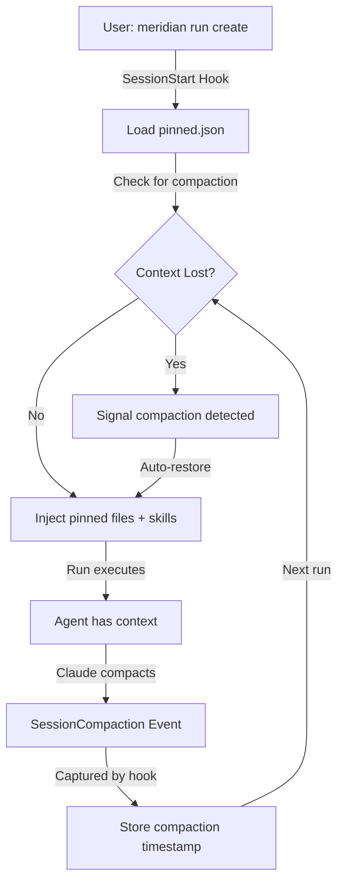

# Meridian-Channel Lifecycle Hooks Design

**Status:** Design Phase (multi-model review completed)
**Date:** 2026-02-28
**Orchestrated by:** Multi-model supervisor session
**Models:** gpt-5.3-codex (architecture, research), claude-sonnet-4-6 (UX)

## Executive Summary

**Problem:** Users lose context (skills, pinned files) when Claude compacts. Currently no mechanism to restore.

**Solution:** Lifecycle hooks that detect context loss and reinject persistent state. Unlike orchestrate (which persists skills in transcript), meridian-channel needs a **file-based state system** because:
1. Each `meridian run` is a fresh prompt (not conversation continuation)
2. Users need to explicitly pin files and manage space context
3. System prompts in Claude are sent every request anyway (no efficiency gain)

**Key insight from system prompt research:**
Claude API is **stateless and deterministic** — system prompt is required on every request. There's no persistent "context slot" we can update. This means:
- Adding skills to system prompt requires rebuilding on every run (same as reinjection)
- System prompt caching (Anthropic's feature) requires prompt prefix consistency
- Therefore: **Either add to system prompt OR reinject as text — cost is similar**

**Recommendation:**
- **For space-level skills:** Add to space system prompt (built once, reused per run)
- **For per-run context:** Store files in `.meridian/pinned.json`, load + inject at run start
- **For compaction recovery:** Hooks detect/signal context loss, CLI or primary agent can trigger reload

---

## Architecture

### Data Model

```
.meridian/
├── index/runs.db                    # Existing run index (unchanged)
├── pinned.json                      # New: persistent context state
└── hooks/
    ├── cli-lifecycle-events.sh      # New: meridian-specific hooks
    ├── signals.sh                   # New: compaction/signal detection
    └── restore.sh                   # New: context reinject logic
```

**`pinned.json` schema:**
```json
{
  "space_id": "w1-abc123",
  "pinned_files": [
    {
      "path": "src/main.py",
      "purpose": "architecture reference",
      "pinned_at": "2026-02-28T01:53:32Z"
    }
  ],
  "pinned_skills": ["researching", "reviewing"],
  "session_system_prompt_suffix": "You have access to these files...",
  "metadata": {
    "last_pinned": "2026-02-28T01:53:32Z",
    "compaction_signal": "2026-02-28T01:45:00Z"
  }
}
```

### Lifecycle Events



### Hook Integration Points

**Meridian-channel will provide:**
1. **`meridian-session-start` hook** — Called by harness on SessionStart
   - Load `pinned.json` from space
   - Inject files + skills into prompt
   - Detect compaction (check timestamps)

2. **`meridian-compaction-detected` hook** — Called when compaction signaled
   - Update `pinned.json` metadata
   - Optionally warn user

3. **`meridian context` CLI commands** — User-facing pinning interface
   - `meridian context pin <file>` — Add to persistent set
   - `meridian context list` — Show pinned files
   - `meridian context clear` — Remove all pins

---

## System Prompt vs File Injection: Trade-off Analysis

### Option A: Add to System Prompt (Persistent)

```
system: "You are meridian agent for space 'feature-x'.
Reference these files:
- src/main.py
- docs/api.md

Skills: researching, reviewing"
```

**Pros:**
- Feels like "always available" context
- Cleaner for skills (part of role, not reinjected messages)
- Works across multiple runs (consistent)

**Cons:**
- Requires rebuilding system prompt with file paths on each run
- Files change → must refresh paths
- Same cost as file injection (both per-request)
- If files are large, inflates every request

### Option B: Inject as Text (In User Message)

```
user: "These files are pinned and available:
- src/main.py (42 lines)
- docs/api.md (128 lines)

Available skills: researching, reviewing

Task: ..."
```

**Pros:**
- Simple: just prepend to each run's prompt
- Files can be versioned (last-modified, hash)
- User sees what's injected
- Easier to debug/inspect

**Cons:**
- Consumes token budget (unless skills are system prompt)
- Visible in each message ("noise" after 10 runs)
- Skills feel less like "role" and more like "instructions"

### Option C: Hybrid (System Prompt for Skills, Text for Files)

```
system: "You are meridian agent. Skills: researching, reviewing"

user: "Reference these files: src/main.py, docs/api.md

Task: ..."
```

**Pros:**
- Skills feel like role (system prompt)
- Files visible but isolated
- Flexible: skills don't change, files do

**Cons:**
- Two injection points = two places to maintain
- Still costs tokens (just split differently)

### Recommendation

**Use Option C (Hybrid):**
- **Skills** → System prompt (once per space, rarely changes)
- **Files** → Text injection (per run, changes with pins)
- **Compaction detection** → Automatic signal, CLI flag to refresh if needed

**Rationale:**
- Skills are "always available" (agent capability)
- Files are "references" (context that changes)
- Matches user mental model: "set up skills once, pin files as needed"

---

## Command-Line Interface

### New `meridian context` Commands

```bash
# Show pinned state
$ meridian context list
space   : w1-abc123
pinned files:
  src/main.py       (pinned 2 hours ago)
  docs/api.md       (pinned 1 day ago)
pinned skills:
  - researching
  - reviewing

# Pin a file
$ meridian context pin src/config.yaml
Added: src/config.yaml

# Unpin a file
$ meridian context unpin docs/old-notes.md
Removed: docs/old-notes.md

# Clear all pins
$ meridian context clear
Cleared 3 pinned files and 2 skills. (Use --force to confirm)

# Manage skills
$ meridian context skill add orchestrate
$ meridian context skill remove reviewing
$ meridian context skill list
```

### CLI Integration at Run Start

```bash
# Automatic (always loads pinned state)
$ meridian run create -p "Refactor this code"
[Session w1-abc123]
Pinned context: 2 files (src/main.py, docs/api.md), 2 skills (researching, reviewing)
Compaction detected 5 minutes ago — context may be stale. Use `meridian context refresh` if needed.

Running...
```

### Integration with Primary Agent

When primary agent launches a subagent run:
```bash
# Primary agent can pass pinned files as references
run-agent.sh \
  --model gpt-5.3-codex \
  --skills researching \
  -p "Task description" \
  -f <(cat .meridian/pinned.json | jq -r '.pinned_files[].path') \
  --label "space=w1-abc123"
```

---

## Compaction Detection Strategy

### Signal Hierarchy

1. **Explicit signal** (preferred) — Harness emits `SessionCompaction` event
   - Hook captures timestamp, updates `pinned.json`

2. **Implicit detection** — Hook monitors for signal patterns
   - Transcript marker: `[context_compacted]` from Claude
   - Stream event: `message_type: "compaction_notice"` from harness
   - Run continuity: Gap in `.meridian/index/runs.jsonl`

3. **User signal** — Manual `meridian context refresh` if automatic failed

4. **Fallback** — Next run loads stale state, user adjusts as needed

### Implementation

```python
# In src/meridian/lib/hooks/lifecycle.py

def detect_compaction(transcript_path: str, last_compaction_time: float) -> bool:
    """Check if context was lost since last_compaction_time."""

    # Check for explicit marker in transcript
    with open(transcript_path) as f:
        for line in f:
            if '[context_compacted]' in line:
                return True

    # Check for implicit markers (gaps, stream events, etc)
    # ...

    return False
```

---

## Extensibility: Generic Auto-Injection Framework

The design is intentionally open-ended for future context types:

```python
# In src/meridian/lib/hooks/context_types.py

class ContextType(Protocol):
    """Protocol for auto-injectable context."""

    def load(self, space_id: str) -> str | None:
        """Return context string to inject, or None if not applicable."""

    def on_compaction(self, space_id: str) -> None:
        """Handle compaction event (optional)."""


class PinnedFilesContext(ContextType):
    """Implementation: injects pinned file contents."""

    def load(self, space_id: str) -> str:
        files = load_pinned_files(space_id)
        return f"Pinned files:\n" + "\n".join(files)

# Future: add more types
class EnvironmentContext(ContextType):
    """Future: inject environment variables."""

class AgentStateContext(ContextType):
    """Future: inject agent state/preferences."""

# Register and load all
def load_all_contexts(space_id: str) -> str:
    contexts = [PinnedFilesContext(), EnvironmentContext()]
    return "\n".join(
        c.load(space_id) for c in contexts
        if (result := c.load(space_id))
    )
```

### Injection Points in Code

```python
# In src/meridian/lib/ops/_run_prepare.py

def prepare_run(payload: RunCreateInput, ...) -> PreparedRun:
    # ... existing prep ...

    # NEW: Load and inject all persistent context
    persistent_context = load_all_contexts(
        space_id=prepared.space_id
    )

    prepared.prompt = f"{persistent_context}\n\n{prepared.prompt}"
    return prepared
```

---

## Comparison with Existing Tools

| Tool | Preserves | Storage | Trigger | Restoration |
|------|-----------|---------|---------|------------|
| **git** | Staging, refs | `.git/` objects | Explicit (`git add`) | Implicit (commands use refs) |
| **tmux** | Session memory | Server socket + files | Automatic (session attach) | Automatic (session resumed) |
| **vim** | Edits, marks, undo | Swap + viminfo + undofile | Explicit (`:w`) + auto-recover | Automatic on startup |
| **direnv** | Env vars | `.envrc` file | Directory change | Implicit (shell hook) |
| **fzf** | Command history | `--history=<file>` | Each invocation | Implicit (history loaded) |
| **meridian** (proposed) | Files, skills | `pinned.json` | `meridian context pin` | Implicit at run start + manual `refresh` |

---

## Implementation Roadmap

### Phase 1: Foundation (Week 1)
- [ ] Create `pinned.json` storage + CRUD ops (`src/meridian/lib/ops/context.py`)
- [ ] Add `meridian context` CLI commands (`src/meridian/cli/context.py`)
- [ ] Hook into run preparation to load pinned state
- [ ] Test: pin files, run, verify they're injected

### Phase 2: Hooks & Signals (Week 2)
- [ ] Create hook scripts in meridian package (`src/meridian/resources/hooks/`)
- [ ] Implement compaction detection (transcripts + stream events)
- [ ] Wire hooks into harness (`.claude/settings.json`, etc.)
- [ ] Test: simulate compaction, verify signal handling

### Phase 3: Polish (Week 3)
- [ ] Add Codex limitation warnings (system prompt not supported)
- [ ] Implement `--force` for destructive context operations
- [ ] Add `meridian context refresh` command
- [ ] Test: full workflow (pin → run → compact → restore)

---

## Open Questions

1. **File size limits?** Should we cap pinned file total size? (Token budget concern)
2. **File watch?** Auto-detect when pinned files change and warn user?
3. **Skill validation?** Warn if pinned skill no longer exists?
4. **Clear confirmation?** Require `--force` flag for `meridian context clear`?
5. **Multiple spaces?** Can user pin files globally (across spaces)?
6. **Content ordering?** If 5 files pinned, what order are they injected? (Reverse age? User order?)

---

## Key Design Principles

1. **Explicit over implicit** — User explicitly pins files; no magic auto-detection
2. **Space-scoped** — Each space has independent pinned state
3. **Read-only injection** — Pinned files are read-only in prompt; agent can't modify them
4. **Fail-safe** — Missing pinned files don't break run; warning issued
5. **Extensible** — Generic context framework allows future types (env vars, state, etc.)
6. **Leverage existing** — Reuse SQLite schema where possible, hook into existing lifecycle

---

## Notes

- **Orchestrate hooks vs meridian hooks:** Orchestrate scans transcripts for skill activations; meridian uses explicit JSON storage. Both are valid, but meridian's approach better fits the "multiple fresh runs per session" model.
- **System prompt insight:** Researching discovered Claude API is stateless; system prompt sent on every request. This eliminates the efficiency argument for "persistent system prompt slot" and justifies simpler JSON-based approach.
- **Skill pinning alternatives considered:**
  - Persist in agent profile (rejected: per-space, not global)
  - Inject as text like files (accepted: explicit, but feels less like role)
  - Add to system prompt (accepted hybrid: skills in system, files as text)
