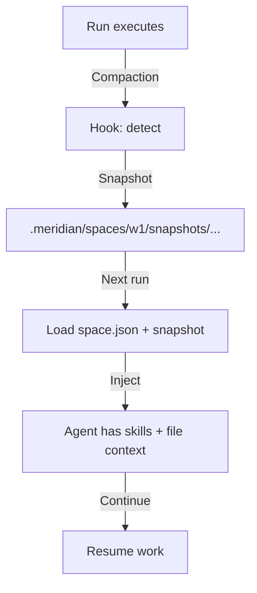

# Revised Lifecycle Hooks Design (Simplified Architecture)

**Status:** Design Phase (REVISED based on user feedback)
**Date:** 2026-02-28
**Key Insight:** Skills are static per space. Files live in `.meridian/`. Snapshot/restore entire space state.

---

## Core Simplification

### Old Design (Rejected)
- Dynamic skill pinning: `meridian context skill add/remove`
- Individual file pinning: `meridian context pin <file>`
- Complex state management

### New Design (Simplified)
- **Skills:** Set once at space creation → static for space lifetime
- **Files:** Managed by primary agent/agents within `.meridian/spaces/<id>/` → snapshot entire state
- **Restoration:** Single snapshot/restore operation (not individual artifacts)

---

## Architecture

### Data Model

```
.meridian/
├── index/
│   └── runs.db              (existing: run history)
├── state/                   (existing: meridian state)
├── spaces/              (NEW: space-scoped state)
│   └── <space-id>/
│       ├── space.json   (space metadata: agent, skills, created_at, etc.)
│       ├── files.json       (current space file state: what primary agent is working on)
│       ├── snapshots/       (NEW: compaction snapshots)
│       │   └── <timestamp>/
│       │       ├── files.json.snapshot
│       │       ├── session.json.snapshot
│       │       └── metadata.json
│       └── session/         (current session state)
│           ├── current.json (active session: run IDs, agent, etc.)
│           └── history/
└── runs/                    (existing: per-run artifacts)
```

### Space Metadata

```json
{
  "space_id": "w1-abc123",
  "name": "feature-x",
  "created_at": "2026-02-28T03:00:00Z",
  "agent": "coder",                           // static: set at creation
  "skills": ["researching", "reviewing"],     // static: set at creation
  "default_model": "gpt-5.3-codex",           // optional override
  "status": "active"
}
```

### Space Files State

```json
{
  "space_id": "w1-abc123",
  "session_id": "current",
  "files": {
    "src/main.py": {
      "path": "src/main.py",
      "size": 2048,
      "last_modified": "2026-02-28T03:15:00Z",
      "purpose": "entry point",
      "managed_by": "primary_agent"  // who last edited/added it
    },
    "docs/api.md": {
      "path": "docs/api.md",
      "size": 4096,
      "last_modified": "2026-02-28T02:50:00Z",
      "purpose": "API reference",
      "managed_by": "agent_run_12345"
    }
  },
  "metadata": {
    "total_size_bytes": 6144,
    "file_count": 2,
    "last_modified": "2026-02-28T03:15:00Z"
  }
}
```

### Compaction Snapshot

```json
{
  "snapshot_id": "snap_20260228T031500Z",
  "space_id": "w1-abc123",
  "timestamp": "2026-02-28T03:15:00Z",
  "reason": "context_compaction_detected",
  "files_snapshot": { /* full files.json copy */ },
  "session_snapshot": { /* current session state */ },
  "metadata": {
    "total_size_bytes": 6144,
    "file_count": 2,
    "harness": "claude",
    "compaction_signal": "SessionCompaction event"
  }
}
```

---

## Lifecycle Flow

### 1. Space Creation

```bash
$ meridian space create \
  --name feature-x \
  --agent coder \
  --skills researching,reviewing

# Creates:
# - .meridian/spaces/w1-abc123/space.json (skills + agent stored)
# - .meridian/spaces/w1-abc123/files.json (empty)
# - .meridian/spaces/w1-abc123/session/current.json (initialized)
```

**Files stored:** Static skill set (part of space.json), no dynamic management needed.

### 2. Run Execution

```bash
$ meridian run create -p "Refactor auth" -w w1-abc123

# At run creation:
# 1. Load space.json → get agent + skills
# 2. Load files.json → get current file state
# 3. Build prompt with:
#    - Space skills injected (from space.json)
#    - File context injected (from files.json)
# 4. Execute run
# 5. After run completes: update files.json with new/modified files
```

**Key:** Skills injected from space metadata (set at creation), not dynamic.

### 3. Compaction Detection & Recovery

```
User runs task → Claude compacts
        ↓
Hook detects: SessionCompaction event
        ↓
Snapshot entire space state:
  - Copy files.json → snapshots/<timestamp>/files.json.snapshot
  - Copy session state → snapshots/<timestamp>/session.json.snapshot
  - Store metadata (harness, timestamp, reason)
        ↓
Next run:
  - Load latest snapshot (automatic)
  - Restore files.json from snapshot
  - Resume with same file context + skills
```

**Flow:**


---

## CLI Interface

### Space Commands

```bash
# Create space with skills specified once
meridian space create --name feature-x --agent coder --skills researching,reviewing
# Output: Created w1-abc123

# Show space (including static skills)
meridian space show w1-abc123
# Output:
# space_id: w1-abc123
# name: feature-x
# agent: coder
# skills: researching, reviewing
# files: src/main.py (2.0KB), docs/api.md (4.0KB)
# status: active

# View space file state
meridian space files w1-abc123
# Output: List of files in .meridian/spaces/w1-abc123/files.json

# View compaction snapshots (optional)
meridian space snapshots w1-abc123
# Output: List of snapshots with timestamps and restore options

# Close space
meridian space close w1-abc123
```

### NO `meridian context` Commands Needed

- ❌ `meridian context pin <file>` — Removed (files managed automatically)
- ❌ `meridian context skill add` — Removed (skills static at creation)
- ❌ `meridian context list` — Removed

**Why:** Skills are static (set at creation), files are implicit (what primary agent/agents work on), snapshots are automatic (on compaction).

---

## How It Works Per Harness

### Claude ✅
- Hooks: Session lifecycle detection (provided by orchestrate)
- Skills: Injected from space.json → system prompt
- Files: Injected from files.json → prompt text
- Compaction: Hook detects + snapshots + auto-restore

### Codex ⚠️
- Hooks: NO explicit lifecycle API (workaround: track run continuity in DB)
- Skills: Injected as prompt text (not dropped, just as text not CLI flag)
- Files: Injected as prompt text
- Compaction: Manual detection via run gaps + auto-restore on next run

### OpenCode ⚠️
- Hooks: NO explicit lifecycle API documented (similar workaround as Codex)
- Skills: Injected as prompt text
- Files: Injected as prompt text
- Compaction: Manual detection + auto-restore

### Cursor
- TBD (when adapter added)

**Key:** All harnesses work the same way to the user. Internals differ (Claude: hooks, others: prompt injection + DB tracking).

---

## Implementation (Simplified)

### Phase 1: Core (1 week)

**Files to create:**
- `src/meridian/lib/space/state.py` — space state CRUD (files.json, space.json)
- `src/meridian/lib/space/snapshots.py` — snapshot creation/restore logic
- Update `src/meridian/cli/space.py` — add `files`, `snapshots` subcommands

**Changes:**
- Space creation stores agent + skills in `space.json` (one-time)
- Run preparation loads skills from space (not from CLI/per-run)
- After each run, update space files.json with new files
- Compaction hook: snapshot entire state in `.meridian/spaces/<id>/snapshots/`
- Next run: auto-restore from latest snapshot

**Test:** Create space → run → check files.json updated → simulate compaction → next run has context

### Phase 2: Harness-Specific (1 week)

- Codex/OpenCode: track compaction via run gaps in DB
- Claude: wire hooks (SessionStart, SessionCompaction)
- All: inject skills + files into prompt at run start

### Phase 3: Polish (1 week)

- CLI: `meridian space files`, `meridian space snapshots`
- Primary agent: built-in file discovery (finds new files created by agent)
- Optional: compression for large snapshots

---

## Advantages Over Original Design

| Aspect | Original | Revised |
|--------|----------|---------|
| **Skill management** | Dynamic CLI commands | Static at space creation |
| **File management** | Individual pins | Implicit (primary agent manages) |
| **Complexity** | Multiple state types | Single space state |
| **User UX** | `meridian context pin/unpin` | Just `meridian space show` |
| **Restoration** | Per-artifact | Full space snapshot |
| **Harness support** | Requires hooks | Works everywhere (prompt injection fallback) |

---

## Open Questions

1. **File discovery:** Should primary agent auto-detect new files created by agents? Or explicit management?
2. **Snapshot compression:** Should large snapshots be compressed / archived?
3. **File size limits:** Cap on total space file size?
4. **Multi-session:** Can one space have multiple concurrent sessions? Or one session at a time?
5. **Snapshot retention:** How many snapshots to keep? Auto-cleanup policy?

---

## Key Insight

By shifting from **"individual file/skill pinning"** to **"static space profile + automatic file management"**, we:
- ✅ Eliminate dynamic CLI commands for skills/files
- ✅ Simplify state management (one JSON file per aspect)
- ✅ Work across all harnesses (prompt injection fallback)
- ✅ Make restoration a single operation (snapshot/restore space)
- ✅ Let primary agent naturally discover and manage files

This is how **tmux** (sessions), **vim** (swap files), and **git** (commits) approach it: not individual pin commands, but state snapshots.
