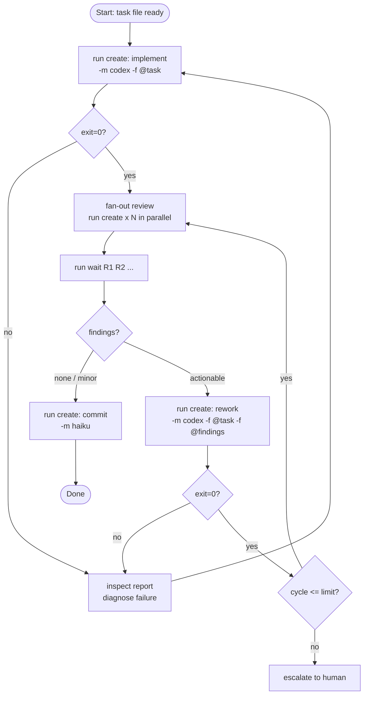

# OL-8: Implement→Review→Rework Workflow Recipe

**Status:** done

## Decision

The implement→review→rework loop is a **supervisor-driven workflow**, not a CLI feature. The CLI stays minimal. Supervisors (orchestrate skill, LLMs) follow the recipe below.

**Why not a CLI command:** The loop has variable structure — sometimes one reviewer, sometimes three, sometimes the implementer self-reviews after a hint. Hardcoding a `meridian run workflow implement-review-rework` would fight this variability. A recipe the supervisor internalized is more flexible and composable.

**Why not YAML recipes:** Premature. Documented patterns in the supervisor's prompt are sufficient until we see a clear need for structured data.

---

## The Loop



---

## Recipe

### 1. Implement

```bash
R=$(meridian run create --background -m codex -f @task --session $SESSION)
meridian run wait $R
```

Inspect `meridian run show $R`. If failed, diagnose and retry. If passed, proceed.

### 2. Fan-out Review

Launch N reviewers in parallel with **different focus areas** — prompt diversity finds more issues than model diversity:

```bash
R1=$(meridian run create --background -m codex \
  -f @review-prompt --var FOCUS=correctness --session $SESSION)

R2=$(meridian run create --background -m codex \
  -f @review-prompt --var FOCUS=tests --session $SESSION)

R3=$(meridian run create --background -m sonnet \
  -f @review-prompt --var FOCUS=architecture --session $SESSION)

meridian run wait $R1 $R2 $R3
```

Read each report. Aggregate findings.

### 3. Evaluate

- **No actionable findings** → commit.
- **Minor style / cosmetic** → commit with note.
- **Actionable findings** → rework.
- **Cycle > N** (default: 3) → escalate.

### 4. Rework

Pass the original task **and** aggregated findings:

```bash
meridian space write @findings < aggregated-findings.md

R=$(meridian run create --background -m codex \
  -f @task -f @findings --session $SESSION)
meridian run wait $R
```

Return to step 2.

### 5. Commit

```bash
meridian run create -m haiku -p "Commit the changes with a clean message"
```

---

## Model Guidance for This Loop

| Step | Model | Notes |
|---|---|---|
| Implement | `gpt-5.3-codex` | 3–5 min, reliable quality |
| Review (medium risk) | `gpt-5.3-codex` x2–3 with different focus | 2–4 min each, parallel |
| Review (arch/deep) | `claude-sonnet-4-6` | 3–5 min, high-quality findings |
| Rework | `gpt-5.3-codex` | Same as implement |
| Commit | `claude-haiku-4-5` | Lightweight |

Use `claude-opus-4-6` as a reviewer (not implementer) for high-risk architectural tasks. Set `--timeout-secs 1800` — it can be slow.

---

## Loop Limits

Default: **3 rework cycles**. After that, escalate to a human or file an issue rather than looping indefinitely. Add a cycle counter in the supervisor prompt:

```
CYCLE=1
...after rework...
CYCLE=$((CYCLE + 1))
if [ $CYCLE -gt 3 ]; then echo "Max cycles reached. Escalate."; exit 1; fi
```

---

## Key Observations from Real Usage (2026-02-27)

- Two codex reviewers with **different focus prompts** found non-overlapping issues — more effective than one opus reviewer.
- Opus timed out on a 15-min architectural task; use it as a reviewer with `--timeout-secs 1800`, not as an implementer for broad tasks.
- Structured task files (Goal, Steps, Files, Acceptance Criteria) consistently produced better implementation quality.
- Passing both `@task` and `@findings` to the reworker outperformed passing only `@findings`.
