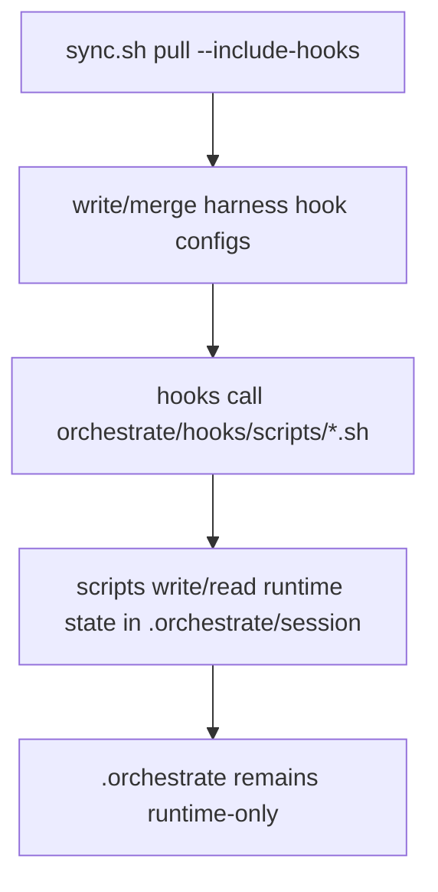

**Status:** done

# Orchestrate Hook Location Migration

## Goal

Keep `.orchestrate/` runtime-only (state/logging) and move hook execution to tracked source scripts under `orchestrate/hooks/scripts`.

## Scope

- Update hook path templates for Cursor and OpenCode.
- Update project Claude hook commands to call `orchestrate/hooks/scripts` directly.
- Remove hook-script copying into `.orchestrate/` from `sync.sh`.
- Update docs/comments to reflect the new source location.

## Flow

## Tasks

1. Remove `.orchestrate/hooks/scripts` copy behavior from `orchestrate/sync.sh`.
2. Update `orchestrate/hooks/.cursor/hooks.json` command paths to `orchestrate/hooks/scripts/...`.
3. Update `orchestrate/hooks/.opencode/plugins/orchestrate.ts` script directory path and comments.
4. Update project Claude hooks in `.claude/settings.json` to use `$CLAUDE_PROJECT_DIR/orchestrate/hooks/scripts/...`.
5. Re-run sync for hooks and smoke test session-start hook path.

## Acceptance Criteria

1. No hook script code is copied into `.orchestrate/` by sync.
2. Harness configs delegate to `orchestrate/hooks/scripts/*.sh`.
3. Session-start hook still produces sticky-skill context from transcript replay.
4. `.orchestrate/` remains runtime-only (session/runs/index data only).
