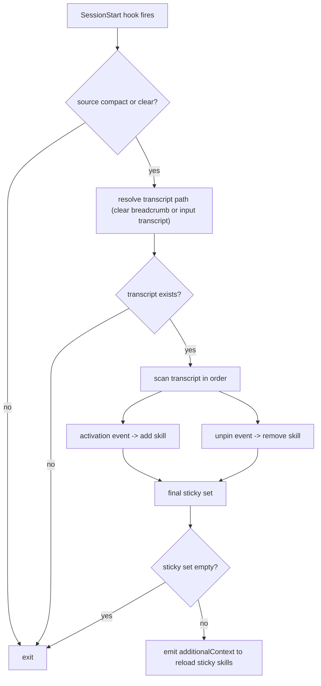

**Status:** done

# Orchestrate Hook Sticky Skill Reload (Transcript + Unpin)

## Goal

Make session skill reload behavior deterministic for long-running autonomous work:
1. Keep a sticky skill set based on observed skill activation events.
2. Remove skills when an explicit `unpin` event appears in transcript.
3. Eliminate `.orchestrate/tracked-skills` dependency.

## Problem

Current hook behavior depends on a configured tracked list (`.orchestrate/tracked-skills`) and re-detects only those names. That model is brittle for long-running autonomous tasks and requires manual maintenance.

## Scope

- In scope: hook logic in `orchestrate/hooks/scripts/session-start.sh`, `orchestrate/hooks/scripts/lib.sh`, and runtime dir bootstrap in `orchestrate/sync.sh`.
- In scope: docs/comments updates describing sticky + unpin behavior.
- Out of scope: building a full new skill package for pin/unpin UX in this change.

## Behavior Design

### Reload Source of Truth

Use the transcript from the current carry mechanism:
1. `clear`: session-end writes `.orchestrate/session/prev-transcript`; session-start reads it.
2. `compact`: session-start uses provided `transcript_path`.

No additional persistent sticky file is introduced in this slice.

### Sticky Set Construction

Process transcript in order and apply events:
1. Skill activation event => `sticky.add(skill)`
2. Unpin event => `sticky.remove(skill)`

Final sticky set is whatever remains after replaying all events in order.

### Activation Signals (existing + robust)

A skill is considered activated when any of these appear:
- `Launching skill: <name>`
- `Base directory for this skill: .../skills/<name>`
- Skill tool invocation payload containing `"name":"Skill"` with `"skill":"<name>"`

### Unpin Signals (new)

Support explicit transcript markers to remove from sticky set:
- `/unpin <name>`
- `unpin skill: <name>`
- `SKILL_UNPIN:<name>` (recommended machine-readable marker for future skill integration)

## Flow

## Implementation Plan

1. Update `orchestrate/hooks/scripts/session-start.sh`:
- remove tracked-skills gating
- extract all activation events from transcript
- parse unpin events and apply ordered add/remove replay
- emit reload recommendations from final sticky set

2. Update `orchestrate/hooks/scripts/lib.sh`:
- remove `load_tracked_skills`
- keep only shared root/path helpers (and add tiny parsing helpers if needed)

3. Update `orchestrate/sync.sh`:
- stop creating default `.orchestrate/tracked-skills`
- keep `.orchestrate/runs`, `.orchestrate/index`, `.orchestrate/session` creation unchanged

4. Update docs/comments:
- script headers and inline comments
- remove references to tracked-skills as required config

## Validation

1. Hook replay fixture tests:
- activation only => skill appears in reload set
- activation then unpin => skill removed from reload set
- multiple skills + selective unpin => only remaining skills reload
- duplicate events => set remains deduped

2. `clear` carry smoke:
- verify `session-end` breadcrumb + `session-start` reload output still works

3. `compact` smoke:
- verify direct transcript path replay works

## Risks and Mitigations

- Risk: Transcript format variation across harnesses.
- Mitigation: keep multiple activation signal parsers and prioritize existing proven signals.

- Risk: Unpin phrasing ambiguity in natural language.
- Mitigation: support explicit machine marker (`SKILL_UNPIN:<name>`) and treat free-form patterns as best-effort.

## Acceptance Criteria

1. `.orchestrate/tracked-skills` is no longer required or generated by default.
2. Hook reload set is derived from transcript event replay (activation add, unpin remove).
3. If transcript contains `unpin` for a skill after activation, that skill is not reloaded next compact/clear.
4. Existing clear breadcrumb behavior remains intact.
