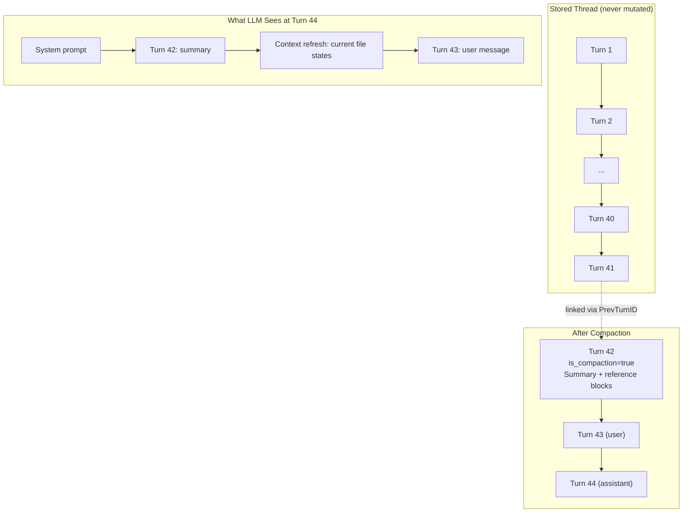
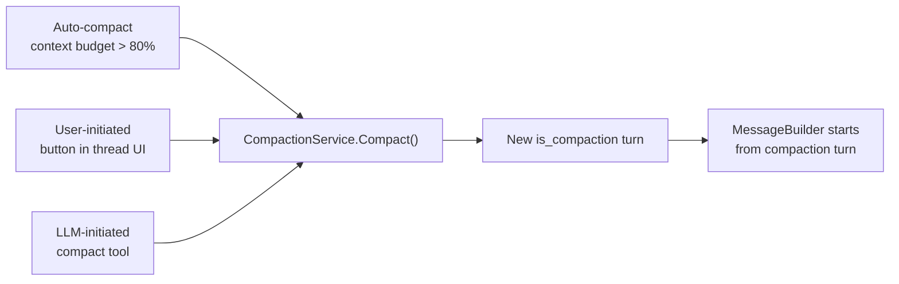
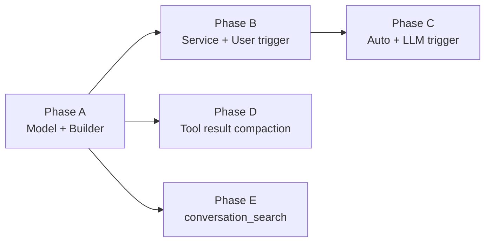

# Compaction: Context Window Management

**Status:** Ready to implement (after `fb-at-references.md` Phase 2)
**Priority:** High
**Estimated effort:** 5–6 days
**Depends on:** `fb-at-references.md` Phase 2 (BlockTransformer pipeline + ReferenceTransformer)

## Problem Statement (WHY)

Long conversations exhaust the context window. Writers working on 100+ chapter serials will have extended AI sessions. Without compaction, the LLM loses access to early conversation context or hits token limits.

**Key constraint**: Never mutate stored turn/block data. Compaction is **additive** (new summary turns) and **view-time** (message builder decides what to include). Old turns remain searchable.

## Current State

### What Works
- Token tracking in `thread_history/service.go:141-209`
- Context limits from `capabilityRegistry.GetModelCapabilities()`
- Warning system triggers at 75%+ usage via `injectTokenLimitWarningIfNeeded`
- Turn tree model with `PrevTurnID` linking
- `BlockTransformer` pipeline (from `fb-at-references.md`)

### What's Missing
- `is_compaction` flag on turns
- Compaction service (summarization)
- Auto/user/LLM-initiated triggers
- `conversation_search` tool for searching pre-compaction turns
- Tool result summarization for older turns

## How It Works



Key insight: The compaction turn includes **reference blocks** for important documents. The `ReferenceTransformer` (from `fb-at-references.md`) resolves these to **current** document content at LLM call time — providing automatic context refresh.

## Data Model Changes

### Turn model — add `is_compaction` flag

New field on `Turn`:

```go
// In backend/internal/domain/models/llm/turn.go
IsCompaction bool `json:"is_compaction" db:"is_compaction"`
```

**Migration**: `ALTER TABLE turns ADD COLUMN is_compaction BOOLEAN NOT NULL DEFAULT FALSE;`

Compaction turns are:
- Role: `user` (injected as context, not assistant output)
- `is_compaction = true`
- Blocks: text block (summary) + reference blocks (important documents)
- Created by compaction service, not by user input

### No block-level compaction flags

Tool result compaction (e.g., "edited file.md +12/-3 lines") is a **view-time transformation** in the message builder via `BlockTransformer`, not stored state.

## Three Compaction Triggers



### 1. Auto-compact (context budget exceeded)

In `startStreamingExecution()`, after loading conversation history:

```go
tokenEstimate := estimateTokens(path)  // rough: sum of text lengths / 4
budget := contextLimit - reservedForSystem - reservedForOutput

if tokenEstimate > budget * autoCompactThreshold {  // e.g., 0.80
    compactionTurn, err := s.compactionSvc.Compact(ctx, threadID, path, CompactOptions{
        KeepRecentTurns: 4,
    })
    path = rebuildPathFromCompaction(compactionTurn, recentTurns)
}
```

Leverages existing token tracking and context limit infrastructure.

### 2. User-initiated

**Frontend**: Button in thread UI — thread menu or triggered by existing 75% warning banner.

**Backend**: `POST /api/threads/{id}/compact`

```go
func (h *ThreadHandler) CompactThread(w http.ResponseWriter, r *http.Request) {
    // Authorize, get thread, load turn path
    // Call compactionSvc.Compact()
    // Return compaction turn
}
```

### 3. LLM-initiated (`compact` tool)

Registered in the tool registry alongside doc tools:

```go
type CompactTool struct {
    compactionSvc CompactionService
}

func (t *CompactTool) Execute(ctx, input) (result, error) {
    // LLM decides context is too large
    // Returns: { "message": "Conversation compacted. N turns summarized." }
}
```

The existing token warning at 75%+ can hint: "Consider using the `compact` tool to summarize older conversation."

## Compaction Service

**Create** `backend/internal/service/llm/compaction/service.go`

```go
type CompactionService interface {
    Compact(ctx context.Context, threadID string, path []Turn, opts CompactOptions) (*Turn, error)
}

type CompactOptions struct {
    Model           string  // configurable summarization model
    KeepRecentTurns int     // always keep last N turns in full detail
}
```

### Summarization flow

1. Partition turns: everything before `KeepRecentTurns` -> "to summarize"
2. Build summarization prompt:
   - "Summarize this conversation. Preserve: key decisions, constraints, character/world details discussed, files edited, and important context."
3. Call LLM with summarization model (configurable per project — default to quality-optimized model)
4. Identify important documents from summarized turns (files edited, referenced, discussed)
5. Create new `Turn`:
   - `is_compaction = true`, role = `user`
   - Block 1: text — the summary
   - Blocks 2..N: reference blocks for important documents
6. Insert into turn tree (PrevTurnID = last summarized turn's ID)

### Context refresh via reference blocks

The compaction turn structure:

```
Block 1: text — "Summary: discussed Aria's character arc, edited Chapter 12
                 intro, established magic system rules..."
Block 2: reference -> Characters/Heroes/Aria.md
Block 3: reference -> Chapters/Chapter12.md
Block 4: reference -> Worldbuilding/Magic.md
```

When `MessageBuilderService` processes this turn, `ReferenceTransformer` resolves each reference to **current** document content. No special "context refresh" mechanism needed — reuses existing infrastructure.

## Message Builder: Compaction-Aware Loading

**Modify** `BuildMessages()` in `message_builder.go`:

```go
func (mb *MessageBuilderService) BuildMessages(ctx context.Context, path []Turn) ([]Message, error) {
    // Find the most recent compaction turn in the path
    compactionIdx := -1
    for i := len(path) - 1; i >= 0; i-- {
        if path[i].IsCompaction {
            compactionIdx = i
            break
        }
    }

    // If compaction exists, start from there (skip older turns)
    effectivePath := path
    if compactionIdx >= 0 {
        effectivePath = path[compactionIdx:]
    }

    // Continue with existing logic using effectivePath...
}
```

## Tool Result Compaction (View-Time)

A `BlockTransformer` that summarizes verbose tool results in older turns:

```go
type CompactToolResultsTransformer struct {
    recentTurnThreshold int  // don't compact last N turns
}

func (t *CompactToolResultsTransformer) Transform(ctx, turn, blocks) ([]TurnBlock, error) {
    if turnIsRecent(turn, t.recentTurnThreshold) {
        return blocks, nil  // keep recent turns verbatim
    }
    // For each tool_result block, replace with summary:
    // "Viewed Characters/Aria.md (200 lines, 1250 words)"
    // "Edited Chapter12.md: str_replace (+12 lines, -3 lines)"
    // "Searched documents for 'magic system' (3 results)"
}
```

This runs in the `BlockTransformer` pipeline from `fb-at-references.md`, registered alongside `ReferenceTransformer`.

## `conversation_search` Tool

Since old turns aren't sent to the LLM after compaction, it needs a way to search them.

**Create** `backend/internal/service/llm/tools/conversation_search.go`

```go
type ConversationSearchTool struct {
    turnReader TurnReader
    threadID   string
}
```

Input schema:
```json
{
    "query": "search query",
    "turn_role": "optional: user | assistant",
    "block_type": "optional: text | tool_use | tool_result",
    "limit": "optional: max results (default 10)"
}
```

Output: matching turn excerpts with turn IDs and timestamps.

Search strategy:
- v1: substring/keyword match on `text_content` of blocks in the thread
- Searches ALL turns (including pre-compaction)
- Future: FTS index on turn blocks

Registration: Register in tool registry. Available when thread has compacted turns.

## Implementation Phases

### Phase A: Compaction turn model + message builder (1 day)
- Migration: add `is_compaction` to turns
- `Turn` model field
- `BuildMessages()`: compaction-aware path loading
- No trigger yet — infrastructure only

### Phase B: Compaction service + user trigger (1–2 days)
- `CompactionService` with summarization LLM call
- `POST /api/threads/{id}/compact` endpoint
- Frontend: compact button in thread UI
- **Depends on**: Phase A

### Phase C: Auto-compact + LLM trigger (1 day)
- Auto-compact in `startStreamingExecution()` based on context budget
- `compact` tool registered in tool registry
- Update token warning to hint at compact tool
- **Depends on**: Phase B

### Phase D: Tool result compaction + context refresh (1 day)
- `CompactToolResultsTransformer` in the BlockTransformer pipeline
- Context refresh via reference blocks in compaction turns
- **Depends on**: Phase A + `fb-at-references.md` Phase 2

### Phase E: `conversation_search` tool (1 day)
- Search tool implementation
- Register in tool registry
- **Depends on**: Phase A



## Key Files

| File | Change |
|---|---|
| `backend/migrations/NEXT.sql` | Add `is_compaction` column |
| `backend/internal/domain/models/llm/turn.go` | Add `IsCompaction` field |
| `backend/internal/service/llm/compaction/service.go` | NEW: compaction service |
| `backend/internal/service/llm/thread_history/message_builder.go` | Compaction-aware path loading |
| `backend/internal/service/llm/thread_history/compact_tool_results_transformer.go` | NEW: tool result summarization |
| `backend/internal/service/llm/streaming/service.go` | Auto-compact trigger |
| `backend/internal/service/llm/tools/conversation_search.go` | NEW: search tool |
| `backend/internal/service/llm/tools/compact.go` | NEW: compact tool |
| `backend/internal/handler/thread.go` | Compact endpoint |
| Frontend: thread UI | Compact button |

## Testing

### Phase A verification
- Manually insert `is_compaction` turn via DB -> `BuildMessages()` skips older turns

### Phase B verification
- Send 20+ messages -> click compact -> summary turn appears -> next LLM response uses summary

### Phase C verification
- Use small context model -> verify compaction auto-triggers at threshold

### Phase D verification
- Older tool results show summaries, recent ones show full content

### Phase E verification
- Compact -> LLM calls `conversation_search` -> finds pre-compaction content

## Success Criteria

- [ ] `is_compaction` field on turns, persisted and loaded correctly
- [ ] `BuildMessages()` starts from most recent compaction turn
- [ ] User can trigger compaction via UI button
- [ ] Auto-compaction fires when context budget exceeded
- [ ] LLM can trigger compaction via `compact` tool
- [ ] Compaction summary preserves key context (decisions, constraints, file edits)
- [ ] Reference blocks in compaction turn provide current file states
- [ ] `conversation_search` finds content from pre-compaction turns
- [ ] Tool result compaction reduces token usage for older turns

## Risks & Mitigations

| Risk | Mitigation |
|---|---|
| Summarization loses critical context | Quality-optimized model for summarization. Include reference blocks for important files. `conversation_search` as fallback. |
| Compaction during streaming race | Compaction creates new turns atomically. Streaming reads from existing path — no conflict. |
| Token estimation inaccuracy | Use conservative threshold (80%). Exact token count not needed for trigger — just rough estimate. |
| LLM abuses compact tool | Only register when thread has enough turns. Tool returns error if conversation is too short. |

## Related Documentation

- `_docs/plans/_archive/fb-at-references.md` — BlockTransformer pipeline (historical prerequisite)
- `_docs/plans/references/fb-wikilinks-and-internal-links.md` — Parser + resolver (shared)
- `backend/internal/service/llm/thread_history/message_builder.go` — Pipeline integration
- `backend/internal/service/llm/streaming/service.go` — Token tracking + streaming
