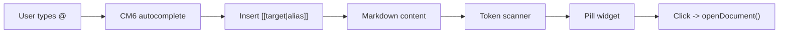

# Wikilinks + Internal Links (Editor Only)

**Status:** Phases 1–3 complete; Phase 4 (LLM prompt guidance) pending
**Priority:** High
**Estimated effort:** ~0.25 day remaining (Phase 4 only)
**Depends on:** Nothing
**Depended on by:** `fb-at-references.md` (reuses parser + resolver)

## Problem Statement (WHY)

Writers need to reference other documents ("Aria", "Chapter 12", "World bible: magic") inside prose without copy/pasting paths. Meridian already has stable document paths, a CodeMirror editor with live preview, and an LLM edit tool. What's missing is the **writer-facing link system inside the editor**: easy insertion (`@` menu), durable link tokens, pill rendering, and LLM guidance to preserve links during edits.

> **Scope boundary**: This plan covers the **editor** (main + skill). Thread composer @-file insertion is in `fb-at-references.md`.

## Current State

### What Works
- Document addressing by exact path — `Document.path` includes extension.
- CodeMirror live-preview renderer registry — `frontend/src/core/editor/codemirror/livePreview/plugin.ts`
- LLM tool prompt built dynamically — `backend/internal/service/llm/tools/registry.go`

### What's Missing
- Canonical internal link token format.
- `@` insertion/autocomplete for documents in the editor.
- Pill rendering for wikilinks and internal markdown links.
- Click-to-open behavior.
- Backend prompt guidance for internal link format.

## Token Formats

### Wikilinks (canonical insertion format)

```
[[target]]
[[target|alias]]
[[target#fragment]]
[[target#fragment|alias]]
```

### Markdown links (interop; LLMs may emit these)

```
[alias](target)
[alias](target#fragment)
```

Only recognized as internal when target is NOT `http(s)://`.

### Target rules

- Project-relative file path, filesystem-style: `Characters/Heroes/Aria.md`
- Extension omission implies `.md`: `[[Aria]]` -> `Aria.md`
- Non-markdown requires explicit extension: `[[Images/Map.png]]`
- `#fragment` refers to a heading inside the target file.

### Shortest-unique insertion rule

The `@` autocomplete inserts the **shortest unique suffix** of the target path:

```
Characters/Heroes/Aria.md -> try Aria.md -> unique? use it
                           -> else Heroes/Aria.md -> unique? use it
                           -> else full path
```

### Rendering

- Internal links render as **pills**: `<span class="cm-wikilink-pill">@DisplayName</span>`
- Display: `@alias` if present, else `@<resolved document name>`
- Unresolved/ambiguous: warning style.

## Architecture



Internal links are a **CM6 extension** reusable in main editor and skill editor. We scan raw text for tokens in visible ranges and render via decorations — same approach as existing live preview. Underlying markdown is never mutated.

## Implementation Plan

### Phase 1: Token Parser + Resolver (0.5 day)

**Create** `frontend/src/core/editor/wikilinks/`

#### `parser.ts` — Pure functions, no CM6 dependency

```typescript
interface ParsedInternalLink {
  type: 'wikilink' | 'mdlink'
  raw: string              // full match including delimiters
  target: string           // normalized path (e.g., "Characters/Aria.md")
  fragment?: string        // heading after #
  alias?: string           // display text
  from: number             // start offset in document
  to: number               // end offset in document
}

parseWikilink(text, offset): ParsedInternalLink | null
parseMdInternalLink(text, offset): ParsedInternalLink | null
scanInternalLinks(text, from): ParsedInternalLink[]
```

Rules:
- `[[target]]`, `[[target|alias]]`, `[[target#fragment]]`, `[[target#fragment|alias]]`
- Markdown links `[alias](target)` only when target is NOT `http(s)://`
- No extension -> append `.md`
- Split `#fragment` from path

#### `resolver.ts` — Resolution against document list

```typescript
interface ResolvedLink {
  documentId: string
  path: string
  status: 'resolved' | 'ambiguous' | 'unresolved'
}

resolveTarget(target, documents): ResolvedLink
shortestUniquePath(docPath, documents): string
```

Resolution: exact match on `Document.path` -> fallback `endsWith` -> ambiguous/unresolved.

#### Files
- **Create**: `frontend/src/core/editor/wikilinks/parser.ts`
- **Create**: `frontend/src/core/editor/wikilinks/resolver.ts`
- **Create**: `frontend/src/core/editor/wikilinks/index.ts`

---

### Phase 2: CM6 Pill Rendering + Click (0.5–1 day)

Wikilinks are NOT part of Lezer's CommonMark grammar — no syntax nodes exist. We create a **separate ViewPlugin** that text-scans visible ranges.

#### `frontend/src/core/editor/codemirror/livePreview/renderers/wikilink.ts`

- Scan visible ranges for `[[...]]` and internal `[...](...)` using parser from Phase 1
- When cursor does NOT overlap token: replace with pill `WidgetDecoration`
- Pill: `<span class="cm-wikilink-pill">@DisplayName</span>`
- Click handler via `EditorState.facet` — callback injected by `CodeMirrorEditor`
- Respects `hunkRegionsField` (skip AI diff regions)

#### Click behavior
- Extract `documentId` from resolver
- Call `openDocument()` from `panelHelpers.ts`
- Pass `fragment` for future scroll-to-heading

#### Files
- **Create**: `frontend/src/core/editor/codemirror/livePreview/renderers/wikilink.ts`
- **Modify**: `frontend/src/core/editor/codemirror/livePreview/renderers/index.ts` (register)
- **Modify**: `frontend/src/core/editor/codemirror/CodeMirrorEditor.tsx` (add extension + click callback via facet)
- **Modify**: `frontend/src/features/documents/components/EditorPanel.tsx` (provide `onWikilinkClick`)

---

### Phase 3: `@` Autocomplete in Editor (0.5 day)

**Create** `frontend/src/core/editor/codemirror/extensions/wikilinkAutocomplete.ts`

- CM6 `autocompletion` extension with custom `CompletionSource`
- Triggers on `@` character
- Data source: `useTreeStore.getState().documents` (in-memory, sync)
- On selection: insert `[[<shortestUniqueTarget>|<alias>]]`
- Wire into `CodeMirrorEditor.tsx` extension array

Depends on Phase 1 (parser + resolver).

---

### Phase 4: Backend Prompt Guidance (0.25 day)

**Modify** `backend/internal/service/llm/tools/text_editor.go` — append to `TextEditorToolMetadata().Guideline`:

```
Internal links: Documents may contain internal links in wikilink format [[target|alias]]
or markdown format [alias](target). Rules:
- Preserve existing internal links exactly as written
- Prefer wikilink format for new references: [[path/to/doc|Display Name]]
- [[Name]] implies .md; non-markdown requires explicit extension
- Fragment references: [[path/to/doc#Heading]]
- Keep targets as filesystem-style paths (no URL-encoding)
```

Injected only when `str_replace_based_edit_tool` is enabled (existing mechanism via `ToolRegistry.BuildSystemPromptSection()`).

## Dependency Graph

```
Phase 1 (parser) -> Phase 2 (pills) -> Phase 3 (@ autocomplete)
Phase 4 (prompt guidance) — independent, parallel with anything
```

## Testing

### Unit tests (Vitest)
- `[[Aria]]` -> `Aria.md`
- `[[Aria#Spellcraft]]` -> `Aria.md` + fragment `Spellcraft`
- `[[Images/Map.png]]` stays `.png`
- `[[Heroes/Aria.md|Aria]]` parses alias
- `[Aria](Characters/Heroes/Aria.md)` recognized as internal link
- `[link](https://example.com)` NOT recognized as internal link
- Shortest-unique: two docs with same filename in different folders -> longer suffix used

### Manual verification
- Create doc with `[[OtherDoc]]` -> pill appears when cursor moves away, raw syntax shows on cursor enter
- Click pill -> opens referenced document
- LLM edit runs do not break internal links

## Success Criteria

- [ ] Typing `@` in the main editor inserts `[[...]]` internal links
- [ ] Existing wikilinks and markdown links render as pills when not editing them
- [ ] Clicking a pill opens the referenced document
- [ ] Link target inference: `[[Name]]` implies `.md`
- [ ] Backend edit tool prompt includes internal link rules when tool enabled

## Risks & Mitigations

| Risk | Mitigation |
|---|---|
| Path-based links break on rename/move | Future: rename propagation (separate plan). Gate rename UI with "update references" option. |
| Ambiguous shortest-unique resolution | Fall back to full path insertion; render ambiguous tokens with warning style. |
| Performance scanning large docs | Scan visible ranges only; cache results by doc version. |
| LLM emits HTTP links instead of internal | Prompt guidance + renderer only targets filesystem-like paths. |

## Related Documentation

- `_docs/plans/_archive/fb-at-references.md` — Thread composer @-file (historical dependency on parser from this plan)
- `_docs/plans/references/fb-compaction.md` — Compaction (depends on message builder from at-references)
- `frontend/src/core/editor/codemirror/livePreview/plugin.ts` — Live preview architecture
- `backend/internal/service/llm/tools/text_editor.go` — Guideline location
- `backend/internal/service/llm/tools/registry.go` — Tool section prompt
