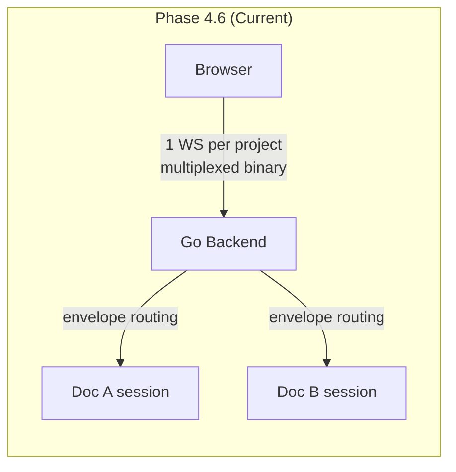
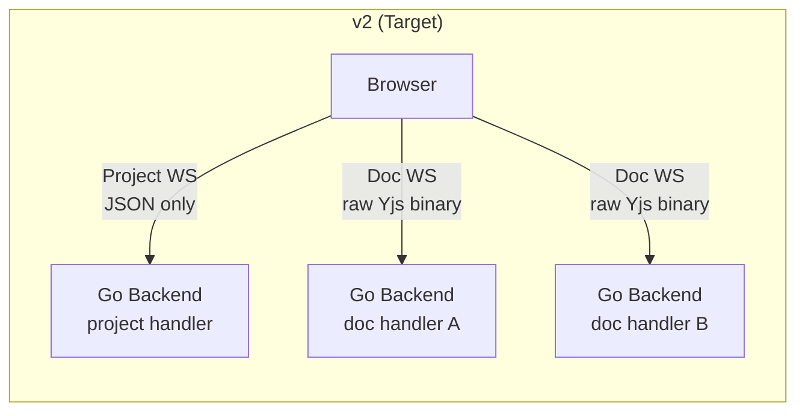
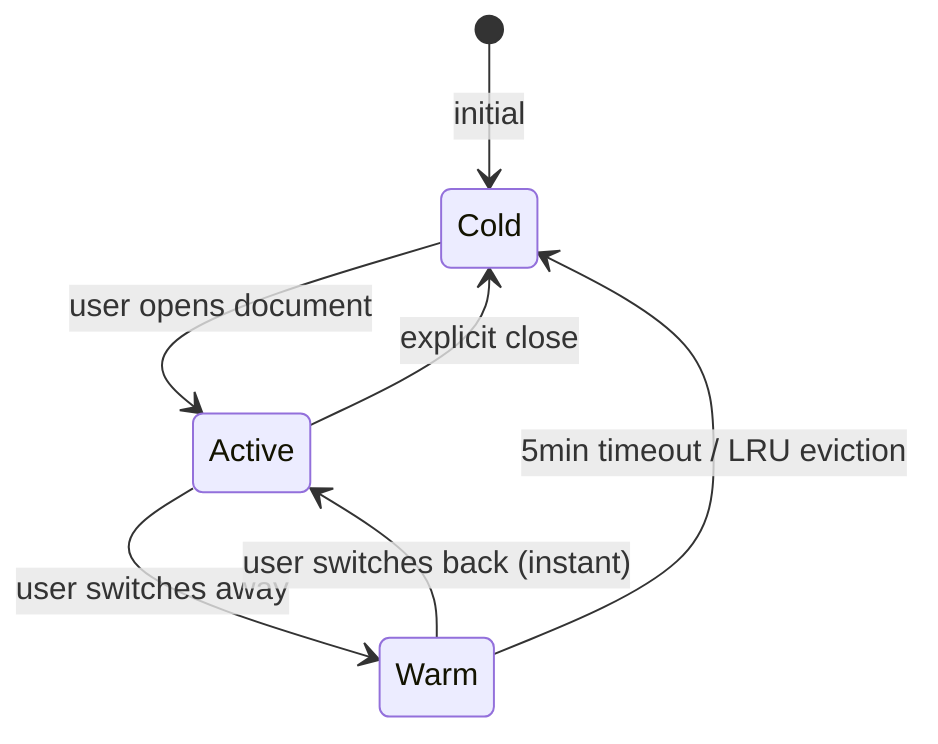
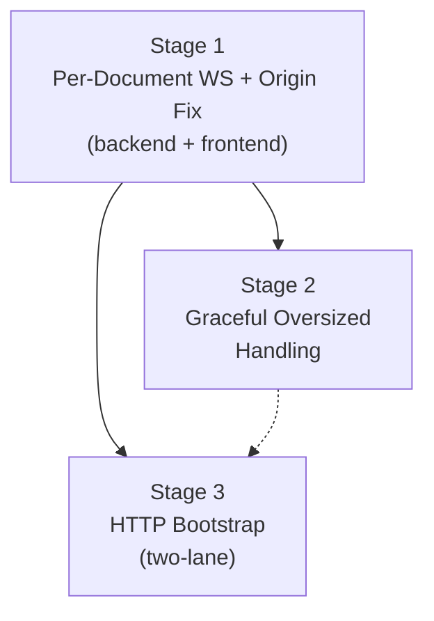

# WebSocket Transport v2: Per-Document Connections

**Status:** draft

## Why

Phase 4.6 moved from per-document WS to per-project WS with multiplexed document subscriptions. In practice, the multiplexing layer causes more problems than it solves:

| Problem | Root Cause | Impact |
|---------|-----------|--------|
| Sync responses misrouted between documents (Bug #10) | Envelope-based doc routing is complex and has subtle ordering issues | Data corruption risk |
| Oversized frames kill the entire connection (Bug #9) | One bad frame on the shared pipe tears down all document sessions | Reliability |
| No Origin validation (Bug #11) | Upgrader accepts any origin | Security |
| Head-of-line blocking | Large SyncStep2 for doc A blocks frames for doc B | Latency |
| 64KB too small for legitimate payloads | No HTTP fallback for large state | Functionality gap |

The frontend only has **one active document at a time**. Writers typically work in 1-3 documents per session. The multiplexing was designed for a future multi-doc UI that doesn't exist and may never exist.

**Real-world context:** y-websocket and Liveblocks use per-document/per-room connections. Hocuspocus v2 added multiplexing for multi-user multi-doc scenarios. Meridian is **single-user-first with one active document at a time** -- multiplexing adds complexity with no benefit for this product shape. Per-document connections align with Meridian's architecture and eliminate the routing layer that caused Bug #10.

## Architecture: Before and After

## Three WebSocket Types

| Type | Endpoint | Carries | Lifecycle |
|------|----------|---------|-----------|
| **Project WS** | `/ws/projects/{projectId}` | Proposal events, `doc:edited` notifications, heartbeat (JSON only) | One per project, always connected |
| **Document WS** | `/ws/documents/{documentId}` | Yjs sync + awareness (1-byte prefix + raw binary) | One per active/warm document |
| **Chat WS** (future -- not part of Stages 1-3) | `/ws/threads/{threadId}` | LLM streaming + Yjs delta piggybacking (replaces SSE) | One per active chat session |

Stages 1-3 piggyback Yjs deltas on the **existing chat stream (currently SSE)**, not a new WS. The Chat WS row above is a future upgrade. The document WS remains the canonical sync path. See `ws-patterns.md` for details.

## Document Session States

| State | WS | Y.Doc | Sync | Awareness |
|-------|----|----|-----------|----------|
| **Active** | Open | In memory | Full sync | Sending |
| **Warm** | Open | In memory | Receiving updates | Paused |
| **Cold** | Closed | IndexedDB cache only | Chat stream deltas may pre-warm | None |

The session manager holds the full document session (Y.Doc + IndexedDB + runtime + WS), not just the WebSocket. Warm sessions stay fully synced so switching back is instant with no resync.

**Cold document open:** If IndexedDB has cached content (from any previous visit or chat stream deltas), it renders immediately. Document WS syncs in background. The writer never sees "Connecting to collaboration..." unless it is their first-ever open with no cache.

## Implementation Stages

| Stage | What | Fixes | Key Files |
|-------|------|-------|-----------|
| 1 | Per-document WS (`coder/websocket`) + simplified project WS + session manager + origin validation. Old `golang.org/x/net/websocket` code deleted. | Bug #10 (eliminated), Bug #11 (origin), Acquire() TOCTOU race | See `stage-1-per-doc-ws.md` |
| 2 | Application-level size check, structured rejection | Bug #9 | `collab_document_handler.go`, `collab.go` |
| 3 | `GET /api/documents/{id}/yjs-state` + client two-lane decision | Large doc bootstrap | New `collab_state.go`, `httpBootstrap.ts` |

Stage 1 is the foundation. Stages 2-3 are independent after Stage 1.

**Note:** Chat stream delta piggybacking (described in `ws-patterns.md`) is deferred to a future stage. The `applyExternalUpdate(docId, delta)` API is a placeholder in the session manager interface -- Stage 1 does not implement or wire it. It exists as a design marker for the future chat delta integration.

## Relationship to Existing Plans

- **Supersedes Phase 4.6** (`phase/phase-4.6-project-ws-overhaul.md`) -- reverts the per-project multiplexing
- **Updates `spec/api-events-contract.md`** -- new protocol (no envelope, no doc:subscribe)
- **Proposal events stay on project WS** -- `proposal:*` contract unchanged, just different transport
- **Session manager API stable, minor internal cleanup** -- `Acquire(docID)` / `Release(docID)` API unchanged; remove `SubscriptionService` coupling
- **Authenticator reused** -- JWT validation shared by both WS types

## Doc Index

| Doc | Purpose |
|-----|---------|
| `stage-1-per-doc-ws.md` | Stage 1 implementation plan (replace, don't migrate) |
| `ws-patterns.md` | Protocol specs, session manager, chat delta piggybacking, CRDT guarantee |
| `known-bugs-and-pitfalls.md` | Bugs being fixed + real-world Yjs failure modes to watch for |
| `review-findings.md` | Adversarial review findings (rounds 1-4) |
| `ui-requirements.md` | What the UI must handle from the transport layer (for new UI effort) |
| `architecture-map-20260310-r4k7.md` | Target architecture diagrams (GPT-generated, round 2 review artifact) |
| `implementation-plan.md` | Stage 1 master implementation plan: 5 phases, dependency graph, estimates |
| `agent-headcount.md` | Orchestration model, per-phase staffing, review loop process |
| `decision-log.md` | Immutable log of implementation decisions (append-only) |
| `whats-weird.md` | Surprising patterns implementers should know + out-of-scope bugs |
