# v2 Adversarial Review: Consolidated Findings

Three independent reviewers analyzed the ws-transport-v2 design against real-world systems (Hocuspocus, Liveblocks, y-websocket, Figma, Google Docs, Notion, Linear) and the current codebase. Below are the consolidated, deduplicated findings.

## Blocking Issues

These must be resolved before or during Stage 1 implementation.

### B-1: Proposal commands will break without subscription rework [BOTH REVIEWERS]

**Current code:** `handleProjectProposalCommand()` in `collab_project.go:452` calls `GetSubscription(connectionID, documentID)` to validate access. In v2, document subscriptions live on separate document WS connections, so this check will **always fail** -- `proposal:accept` and `proposal:reject` are dead on arrival.

**Fix:** Replace `GetSubscription` check with direct `checkDocumentAccess` call. The subscription check was a proxy for "user has access to this document" -- in v2, use the authenticator directly. Document this decision in `../spec/backend-frontend.md`.

### B-2: Migrate from `golang.org/x/net/websocket` [ARCHITECTURE REVIEWER] -- RESOLVED

**Resolution:** Use `coder/websocket` for new handlers; old `golang.org/x/net/websocket` code is deleted with old handlers. This is not a separate migration step -- new handlers are written with `coder/websocket` from the start, and the old library disappears when old code is deleted. `coder/websocket` provides context-native API, concurrent-write safety, modern patterns, and is actively maintained by Coder Inc.

### B-3: Fix Bug #11 (Origin validation) NOW, not Stage 4 [BUG REVIEWER]

The CSWSH vulnerability is a single-line fix independent of the transport redesign. Deferring it to Stage 4 leaves the vulnerability open during the entire refactor period.

```go
// Current: accepts any origin
Handshake: func(_ *websocket.Config, _ *http.Request) error { return nil },

// Fix: validate against CORS origins
Handshake: func(config *websocket.Config, r *http.Request) error {
    origin := r.Header.Get("Origin")
    if h.config.Environment == "dev" { return nil }
    for _, allowed := range h.config.CORSOrigins {
        if origin == allowed { return nil }
    }
    return fmt.Errorf("origin %q not allowed", origin)
},
```

## Structural Issues (Round 2 -- Codebase-Aware Review)

These were found by a reviewer with deep codebase access. They are more concrete than the initial review findings.

### S-1: Warm pool preserves the wrong object -- needs full session, not just WS [BLOCKING]

The plan introduces a socket-level `documentConnection.ts` pool (stage-1:84), but the current frontend keeps the actual durable state inside `useDocumentCollab`: `CollabSyncRuntime`, `Y.Doc`, `IndexeddbPersistence`, proposal runtime -- all destroyed on cleanup (`useDocumentCollab.ts:169, :421`). **Keeping only the WS alive does not keep the doc "warm"** -- background updates have nowhere to land.

**Fix:** Stage 1 needs a long-lived **per-document session/provider abstraction** (Y.Doc + IndexedDB + WS + runtime) managed by the connection manager, not just a WS pool. `useDocumentCollab` should borrow/return a session from this manager rather than creating and destroying one each mount.

### S-2: Migration Phase A is incompatible with current broadcaster [BLOCKING]

Phase A says old project WS and new document WS coexist, frontend still uses old path. But `InMemoryDocumentBroadcaster` fans the same payload bytes to every subscriber (`broadcaster.go:63`). Old clients expect envelope-framed bytes; new clients expect raw Yjs bytes. **Mixed subscribers on the same doc will misdecode traffic.**

**Fix:** Two options:
1. Transport-aware broadcaster that wraps/unwraps based on subscriber type
2. Separate broadcast registries for old and new connections (cleaner, temporary)

Phase A must specify which approach and scope the work.

### S-3: Proposal broadcasting needs explicit project-connection registry [HIGH]

The plan says "keep proposal handling/broadcasting" while simplifying project WS, but:
- Current proposal commands require `GetSubscription(connectionID, documentID)` -- fails in v2 (same as B-1 but broader)
- Proposal broadcasts go through the **document** broadcaster (`collab_proposal.go:390`, `collab_proposal_broadcaster.go:27`) -- in v2 these must route to the **project** WS instead

**Fix:** Need an explicit project-connection registry/broadcaster. Proposals broadcast to project WS connections, not document sessions. This is new plumbing, not "same as today."

### S-4: Raw binary protocol needs a minimal message-type prefix for awareness [HIGH]

The plan says "no envelope" and document WS carries raw Yjs sync + awareness. But the current runtime sends `encodeAwarenessUpdate(...)` bytes under the envelope (`runtime.ts:128`). Without an outer discriminator, the Go backend cannot reliably distinguish sync vs awareness frames from just the first varint -- the Yjs sync message type byte (0,1,2) and the awareness encoding can collide depending on content.

**Fix:** Either:
1. Keep a 1-byte message-type prefix (0x00=sync, 0x01=awareness) -- minimal, standard in y-websocket
2. Defer awareness to a later stage and only carry sync on document WS

Option 1 is preferred -- y-websocket uses exactly this pattern. Document the byte layout explicitly.

### S-5: README overstates external consensus [MEDIUM]

README says y-websocket, Liveblocks, and Hocuspocus "all use per-document connections." Hocuspocus v2 explicitly supports multiplexing. The justification should be **"better fit for Meridian's single-active-document product shape"**, not universal Yjs orthodoxy.

Similarly, the B-2 finding on `golang.org/x/net/websocket` is valid but the framing is too strong -- the package is less featureful/less maintained, not a formal hard-deprecated blocker.

**Fix:** Update README to use accurate, honest framing. The design stands on its own merits for this product.

## High Priority Design Gaps

### H-1: Add protocol version to handshake [ARCHITECTURE]

The `connected` message `{"type":"connected","stateSize":N}` has no version field. When Stage 3 adds HTTP bootstrap, the client needs to know if the server supports it.

**Fix:** Add `"protocol":1` from day one. Zero cost, prevents painful future migrations.

### H-2: Awareness vs sync binary frame disambiguation undocumented [ARCHITECTURE]

Removing the envelope means the Go backend must parse the Yjs varint to distinguish sync messages (type 0,1,2) from awareness messages (different range). The current envelope explicitly tags awareness as `0x03`. The plan does not specify how the new document handler distinguishes these.

**Fix:** Add explicit documentation in `../spec/backend-frontend.md` about Yjs message type parsing.

### H-3: Double-release risk in connection lifecycle [BUG REVIEWER]

Two paths can trigger `session_manager.Release()`: (1) the document handler's defer on WS close, and (2) the connection manager's warm pool eviction. If both fire, `refCount` decrements twice for a single `Acquire()`.

**Fix:** Warm pool eviction must close the WS (which triggers the handler's defer, which calls Release). The warm pool must NEVER call Release directly. Exactly-once release semantics via the WS close chain only.

### H-4: Server-side per-user connection limit [ARCHITECTURE]

The client caps warm connections at 3, but the server has no per-user limit. A buggy client could open hundreds of document WS connections.

**Fix:** Add server-side per-user document WS limit (e.g., max 10). Return `CONNECTION_LIMIT` error code.

### H-5: Server-side idle timeout [ARCHITECTURE]

Warm connections sit idle for up to 5 minutes. If the client crashes (no `beforeunload`), the server holds goroutines until heartbeat timeout (~35s). But the design has no server-initiated idle close for legitimately open but unused connections.

**Fix:** Server-side 5-minute idle timeout matching the client. If no application messages (only heartbeats) for 5 minutes, server closes the connection.

## Medium Priority

### M-1: Proposal/Yjs update ordering gap [BUG REVIEWER]

In v1, proposal events and Yjs updates travel on the same TCP connection (ordering guaranteed). In v2, they travel on separate connections. `proposal:statusChanged` (project WS, small JSON) may arrive before the Yjs update (document WS, larger binary). The frontend tries to render a diff before the Y.Doc has the changes.

**Fix:** Frontend proposal manager should buffer status changes and apply after the next Yjs update, or check state vector before rendering diffs.

### M-2: Rate limiting not carried forward [ARCHITECTURE]

Current `collab.go` has `collabInboundRateLimit = 30` messages/second. The Stage 1 plan does not mention rate limiting in the document handler's responsibilities.

**Fix:** Add to `stage-1-per-doc-ws.md` responsibility list.

### M-3: Hocuspocus counter-evidence [ARCHITECTURE]

The README claims "per-project multiplexing is non-standard in the Yjs ecosystem." Hocuspocus v2.0.0 **added** multiplexing as a core feature. y-websocket uses per-document, but Hocuspocus (the most production-hardened Yjs server) chose multiplexing deliberately.

**Fix:** Update the README to be honest about the trade-off. The real justification is that Meridian is single-user-first with one active document at a time, making multiplexing unnecessary complexity. Hocuspocus needs it for multi-user multi-doc scenarios.

### M-4: Bugs #6 and #7 are real, unfixed, and unrelated to transport [BUG REVIEWER]

Bug #6 (snapshot restore clears `ai_content`) and Bug #7 (empty safety snapshot) are in the snapshot handler, not the transport layer. Coupling them to a transport redesign risks them being forgotten.

**Fix:** Fix independently before or during Stage 1. Bug #6 is a one-line fix (change `""` to `restoredContent` on `collab_snapshot.go:301`). Bug #7 needs a `bootstrapYjsState` call before the safety snapshot.

## UX Findings

> **Note:** A full frontend UI replacement is planned as the next major effort. UX findings here are captured for reference but frontend implementation should be minimal/temporary during the v2 transport work. The new UI will own notification design, connection indicators, and error presentation.

### UX-1: AI edit notification system -- DEFERRED to new UI

Reviewers identified a critical gap: no design for how writers discover AI edits to other documents. This is real but belongs to the new UI design, not the transport layer. The transport must emit the right events (`doc:edited` on project WS) -- the new UI will decide presentation.

### UX-2: Connection/offline display -- DEFERRED to new UI

Per-document WS creates multiple independent reconnection processes. The new UI should present one unified state. For now, keep existing `CollabConnectionIndicator` as-is (functional, not pretty).

### UX-3: Error messages -- minimal for now

Error codes are defined but user-facing messages are not. Temporary approach during v2:

| Code | Temporary behavior |
|------|-------------------|
| `AUTH_FAILED` | Auto-refresh token + reconnect silently |
| `AUTH_TIMEOUT` | Auto-refresh token + reconnect silently (same as AUTH_FAILED) |
| `AUTH_EXPIRED` | Auto-refresh token + reconnect silently |
| `FRAME_TOO_LARGE` | Console warn, keep connection alive |
| `RATE_LIMITED` | Auto-retry with backoff, no UI |
| `RESET_REQUIRED` | Full document reload |

New UI will design proper writer-friendly error presentation.

### UX-4: Stale warm connections -- implement health check

If a warm connection silently died, show cached IndexedDB content on switch while reconnecting in background. This is a transport-level concern (not UI-dependent) and should be in Stage 1.

### UX-5: Anticipatory connections -- defer

Keep-alive pool already covers the primary use case. Defer anticipatory connections. If added later, `warmup()` must be idempotent and deduplicated.

## Low Priority

| Finding | Source | Note |
|---------|--------|------|
| No sub-document support considered | Architecture | Not a blocker for single-user writing tool; note as known limitation |
| Warm pool diagnostics missing | Architecture | Add `getPoolState()` debug method for dev tools |
| `stateSize` TOCTOU between connected message and HTTP fetch | Architecture | Yjs merge is idempotent; performance-only, not correctness |
| Flash of empty content during two-lane HTTP fetch | UX | Show IndexedDB cached content during fetch |
| `pagehide`/`beforeunload` unreliable for cleanup | Both | Use `pagehide` with `beforeunload` fallback. Server-side heartbeat is the real safety net; browser events are courtesy only |

## Round 4: Opus Deep-Dive Reviews (Completeness, Concurrency, Go Idioms)

Three focused reviews by Opus analyzed the design for completeness gaps, concurrency correctness, and Go idiom adherence.

### Summary Table

| ID | Severity | Finding | Resolution |
|----|----------|---------|------------|
| C1 | CRITICAL | Acquire() singleflight eliminates loser entirely -- no duplicate to clean up | RESOLVED (stage-1 updated) |
| C2 | CRITICAL | ApplyUpdate() use-after-delete race -- session destroyed between lock release and applyUpdate call | TRACKED (known-bugs + stage-1 updated) |
| C3 | CRITICAL | Subscribe() nil Session race -- partially-initialized subscription exposed to concurrent readers | TRACKED (known-bugs updated; pre-existing in code v2 deletes) |
| C4 | HIGH | Double-release on warm eviction -- Release() needs underflow guard | RESOLVED (stage-1 updated) |
| C5 | HIGH | DocumentSessionManager integration spec missing -- instantiation, context, store interaction | RESOLVED (stage-1 updated) |
| C6 | HIGH | leaseGeneration pseudocode missing -- acquire/release/eviction semantics unclear | RESOLVED (stage-1 updated) |
| M1 | MEDIUM | Context threading -- singleflight needs detached context, handler needs context.WithCancel | RESOLVED (stage-1 updated) |
| M2 | MEDIUM | Error modeling -- need sentinel errors, bootstrapAuth should return error not string | RESOLVED (stage-1 updated) |
| M3 | MEDIUM | Interface split -- ProjectConnectionRegistry should split into Broadcaster + Registrar | RESOLVED (stage-1 updated) |
| M4 | MEDIUM | Direct write -- replace writeChan with Send(data) interface; coder/websocket handles concurrency | RESOLVED (stage-1 updated) |
| M5 | MEDIUM | AcceptOptions -- concrete websocket.Accept configuration missing | RESOLVED (ws-patterns updated) |
| M6 | MEDIUM | Rate limiter scope -- one per connection, created at setup | RESOLVED (stage-1 updated) |
| M7 | MEDIUM | proposal:snapshot query scope -- only pending proposals, not all documents | RESOLVED (ws-patterns updated) |
| M9 | MEDIUM | Document broadcaster replaced -- per-doc handler owns fanout via connection set | RESOLVED (stage-1 updated) |
| M10 | MEDIUM | Server has no warm pool -- must state explicitly | RESOLVED (stage-1 updated) |
| M11 | MEDIUM | applyExternalUpdate deferred -- README overstates Stage 1 scope | RESOLVED (README updated) |
| M12 | MEDIUM | Proposal auth cache detail -- map[string]string, connection-scoped mutex | RESOLVED (stage-1 updated) |
| M13 | MEDIUM | Atomic eviction -- generation check + delete + mark-destroying under one lock | RESOLVED (stage-1 updated) |
| M14 | MEDIUM | doc:edited source enum -- expand with future values | RESOLVED (ws-patterns updated) |
| L1 | LOW | AUTH_TIMEOUT as distinct error code | RESOLVED (ws-patterns updated) |
| L2 | LOW | Server sends heartbeat, client responds (not bidirectional proactive) | RESOLVED (ws-patterns updated) |
| L3 | LOW | Eviction cleanup must call ydoc.destroy(), indexeddbProvider.destroy(), runtime.destroy() | RESOLVED (ui-requirements + stage-1 updated) |
| L4 | LOW | goleak: prefer per-test defer over TestMain | RESOLVED (stage-1 updated) |

## Action Summary

```mermaid
flowchart TD
    NOW["Fix Now<br/>(independent of v2)"] --> B3["B-3: Origin validation"]
    NOW --> M4_old["M-4: Bugs #6 + #7"]

    S0["Stage 0<br/>(before v2)"] --> B2["B-2: RESOLVED<br/>coder/websocket used in new handlers"]

    PLAN["Update Stage 1 Plan<br/>(before implementing)"] --> S1_bl["S-1: Full session abstraction<br/>not just WS pool"]
    PLAN --> S2_bl["S-2: Broadcaster coexistence<br/>strategy for migration"]
    PLAN --> S3_bl["S-3: Project-connection<br/>registry for proposals"]
    PLAN --> S4_bl["S-4: 1-byte message prefix<br/>for sync vs awareness"]
    PLAN --> S5_bl["S-5: Honest README framing"]
    PLAN --> B1["B-1: Proposal auth rework"]
    PLAN --> H1["H-1: Protocol version"]
    PLAN --> H3["H-3: Exactly-once release"]
    PLAN --> H4["H-4: Server connection limit"]
    PLAN --> H5["H-5: Server idle timeout"]
    PLAN --> M2_old["M-2: Rate limiting"]

    R4["Round 4 Findings<br/>(RESOLVED in docs)"] --> C1["C1: singleflight insight"]
    R4 --> C2["C2: ApplyUpdate use-after-delete"]
    R4 --> C4["C4: Release underflow guard"]
    R4 --> C5["C5: SessionManager integration"]
    R4 --> C6["C6: leaseGeneration pseudocode"]
    R4 --> M1_r4["M1-M14: Context, errors,<br/>interface split, etc."]

    TRACKED["Pre-existing Bugs<br/>(TRACKED)"] --> C3["C3: Subscribe nil Session<br/>(deleted in v2)"]
    TRACKED --> C2b["C2: ApplyUpdate race<br/>(fix in session_manager)"]

    DEFER["Deferred to New UI"] --> UX1["AI edit notifications"]
    DEFER --> UX2["Unified offline display"]
    DEFER --> UX3["Connection indicator redesign"]
    DEFER --> UX5["Anticipatory connections"]
```


