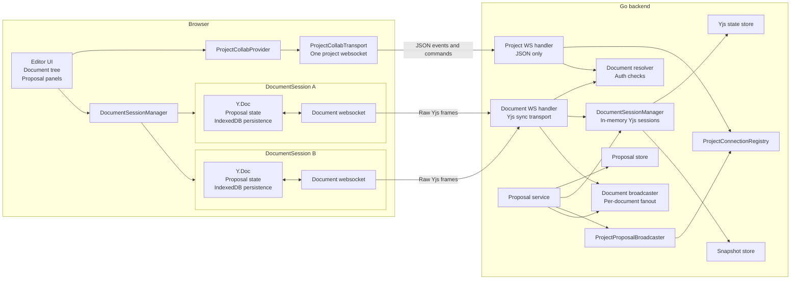
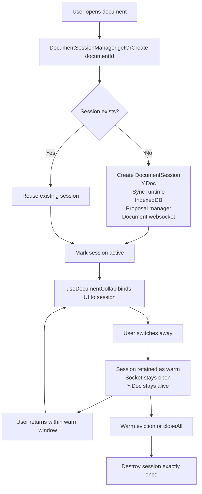
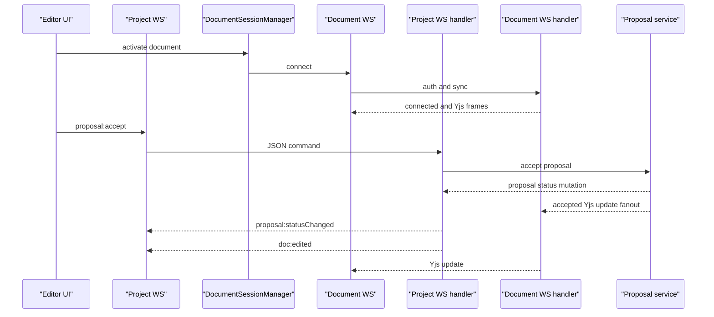

# Recommended v2 Architecture Map

This maps the recommended transport redesign, not the current implementation.

## System Overview

## Frontend Ownership

## Backend Event Split

## Rules

| Area | Recommended rule |
|------|------------------|
| React ownership | Components bind to sessions. Components do not own `Y.Doc` lifetime. |
| Warm state | A warm session keeps websocket, `Y.Doc`, proposal state, and IndexedDB alive together. |
| Project WS | Project WS carries only JSON events and proposal commands. |
| Document WS | Document WS carries only document-scoped sync traffic. |
| Broadcasting | Project JSON fanout and document Yjs fanout use separate registries. |
| Migration | Cut over by client cohort or feature flag, not mixed payloads on one broadcaster. |
