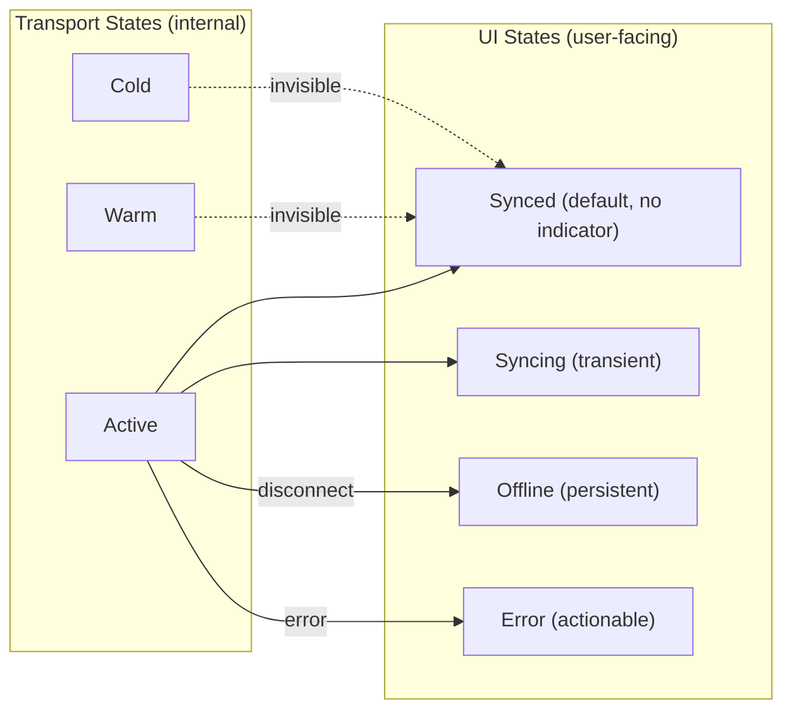
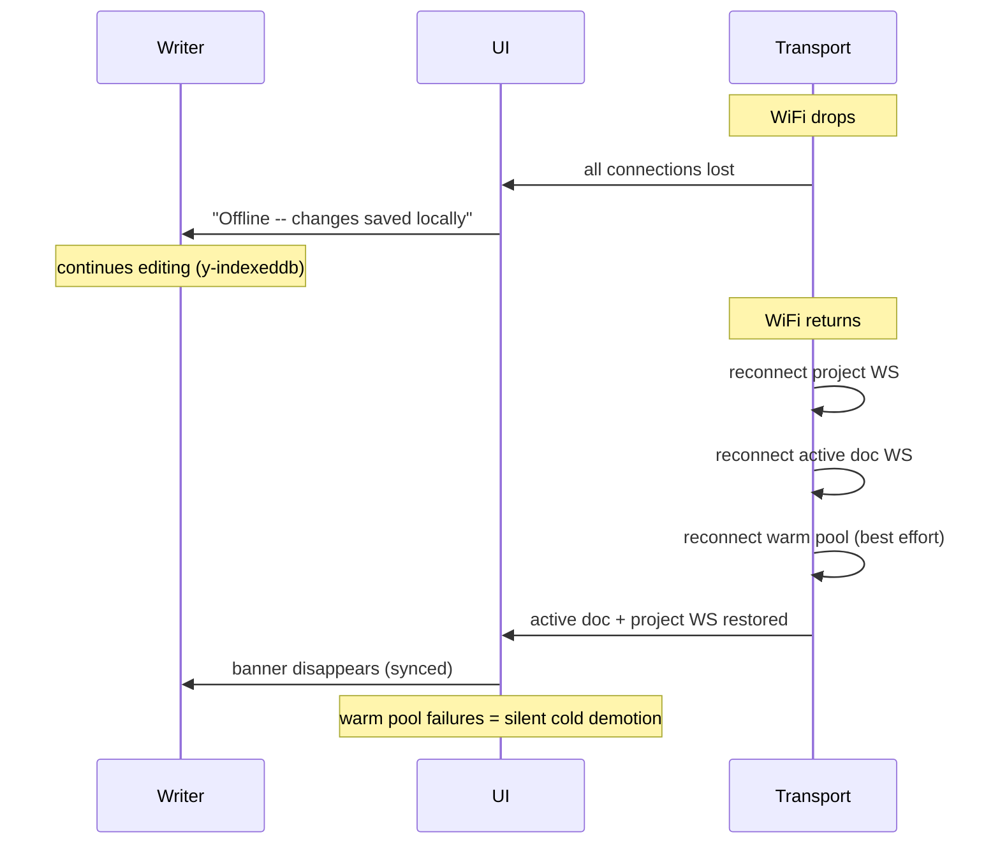

# UI Requirements from Transport v2

**Status:** Requirements only -- implementation belongs to the new UI effort.

The transport layer emits events and state changes. This document specifies what the UI must handle, regardless of how it presents them.

## Connection States the UI Must Represent

The transport exposes 3 internal states per document. The UI should collapse these into a simpler model.



**Key rule:** Warm and Cold states are never visible to the writer. The user only sees the state of the document they are currently viewing.

### State Mapping

| Transport event | UI shows | Duration |
|----------------|----------|----------|
| Document WS connected + SyncStep2 applied | Nothing (synced is the default) | Persistent |
| Document WS connected, SyncStep2 in flight | "Saving..." or subtle spinner | Until sync completes |
| Cold-to-Active transition (user opens doc) | Loading indicator in editor area | ~200-500ms typically |
| Warm-to-Active promotion | Nothing (already synced) | Instant |
| All connections lost (browser offline) | Single offline banner | Until reconnected |
| Reconnecting after offline | "Reconnecting..." | Until active doc + project WS restored |
| Warm connection dies silently | Nothing (demoted to cold internally) | Invisible |

### What NOT to Show

- Connection count or type ("3 WebSockets active")
- Warm/cold vocabulary
- Per-connection reconnection status (present one unified state)
- "Collaboration" language (implies multi-user, which is Phase 5)

## Events the UI Must Handle

### From Project WS

| Event | Payload | UI Responsibility |
|-------|---------|-------------------|
| `doc:edited` | `{documentId, source, timestamp}` | Mark document as having unreviewed changes in navigation (tree, tabs, etc.) |
| `proposal:statusChanged` | `{documentId, proposalId, status}` | Update proposal UI; may arrive before Yjs update on document WS (see ordering note below) |
| `proposal:new` | `{documentId, proposalId, ...}` | Show new proposal indicator |

### From Document WS

| Event | Payload | UI Responsibility |
|-------|---------|-------------------|
| Yjs sync complete | (internal state) | Transition from "syncing" to "synced" |
| Yjs update applied | (Y.Doc change) | Editor content updates automatically via Yjs binding |
| Connection error | `{code, message}` | See error handling table below |

### From Chat Stream (future)

| Event | Payload | UI Responsibility |
|-------|---------|-------------------|
| Tool result with Yjs delta | `{documentId, yjsDelta, summary}` | Apply delta to local Y.Doc/IndexedDB (transport handles this); render inline diff or summary in chat UI instead of raw tool call |

The chat stream piggybacking is a preview + cache-warming optimization. The UI renders the `summary` or an inline diff in the chat conversation. The session manager handles applying the `yjsDelta` to local state automatically.

### Ordering Caveat

Project WS (JSON, small) and Document WS (binary, potentially larger) are separate TCP connections. **No ordering guarantee between them.** The UI must handle:

- `proposal:statusChanged` arriving before the corresponding Yjs update -- buffer or defer rendering until Y.Doc state vector includes the change
- `doc:edited` arriving for a document with no active connection -- store metadata, present when user navigates
- Chat stream deltas arriving for documents with no active session -- cache to IndexedDB, reconcile automatically on next document WS sync (Yjs state vector handles this)

## AI Edit Awareness

Writers need to know when AI edits documents they are not viewing. The transport provides `doc:edited` events on the project WS with `{documentId, source, timestamp}`.

### Requirements for the UI

1. **Passive indicator** on navigation items (tree nodes, tabs, etc.) for documents with unreviewed AI edits
2. **Batch presentation** -- if 5 documents are edited while the writer is focused, do not show 5 separate interruptions
3. **Clear on view** -- indicator disappears when the writer opens the document
4. **Never interrupt flow** -- no modals, no toasts, no sounds for background AI edits. Writers lose ~23 min of focus per interruption (Smashing Magazine research on notification UX)
5. **Optional summary** -- an accessible-on-demand view of recent AI activity across the project

### Data the UI Should Track

```
{
  documentId: string
  source: "proposal_accepted"  // matches concrete event from proposal broadcaster
  timestamp: number
  reviewed: boolean  // cleared when user opens document
}
```

Store in a dedicated store (not collabStore). Persist across page navigations but not across sessions.

## Error Handling

The transport returns structured error codes. The UI must translate these into writer-appropriate responses.

| Error Code | What Happened | UI Response | Recovery |
|------------|--------------|-------------|----------|
| `AUTH_FAILED` | JWT expired mid-session | Auto-refresh token, reconnect silently. If refresh fails: "Session expired, please sign in again." | Redirect to login on failure |
| `FRAME_TOO_LARGE` | Update exceeded 256KB app limit | Silent retry via HTTP if two-lane available. If not: "Your change couldn't be saved. Try a smaller edit." | Keep connection alive |
| `RATE_LIMITED` | >30 messages/second | Buffer and retry silently. After 10s: "Changes are saving slowly." | Auto-resolves |
| `RESET_REQUIRED` | State divergence unrecoverable | Save local changes to IndexedDB, reload document. "Reloading document..." | Automatic |
| `CONNECTION_LIMIT` | Too many document connections | Evict oldest warm connection, retry. Never shown to user. | Automatic |

**Principle:** Error messages describe the situation and action, never the technical cause. The writer does not know what a "frame" or "rate limit" is.

## Offline and Reconnection

### Requirements

1. **One unified state** -- WiFi dropping is one event from the writer's perspective, even though 2-5 WS connections are affected
2. **Reconnection priority:** project WS first (so `doc:edited` events are not missed), then active document WS, then warm pool
3. **Show "synced" only when active document + project WS are both connected**
4. **Warm pool failures are invisible** -- silent demotion to cold
5. **IndexedDB cache** -- on reconnect, show cached content immediately while sync completes in background



## Document Switching

| Transition | What Happens | Perceived Latency | UI Guidance |
|-----------|-------------|-------------------|-------------|
| Warm to Active | WS already open + synced | ~0ms | Show content immediately, no loading state |
| Cold to Active (cached) | Open WS + sync, show IndexedDB cache meanwhile | ~0ms visible, sync in background | Show cached content instantly, subtle sync indicator |
| Cold to Active (no cache) | Open WS + full sync | ~200-500ms | Loading skeleton in editor area |
| Cold to Active (large doc, two-lane) | Open WS + HTTP fetch | ~500ms-2s | Loading skeleton, progress bar if >2s |

### Stale Warm Connection Detection

Transport provides a health check: if last heartbeat on a warm connection was >60s ago, it is preemptively marked cold. The UI should treat the next switch to that document as a cold-to-active transition (show cached content + sync indicator) rather than an instant switch that then fails.
