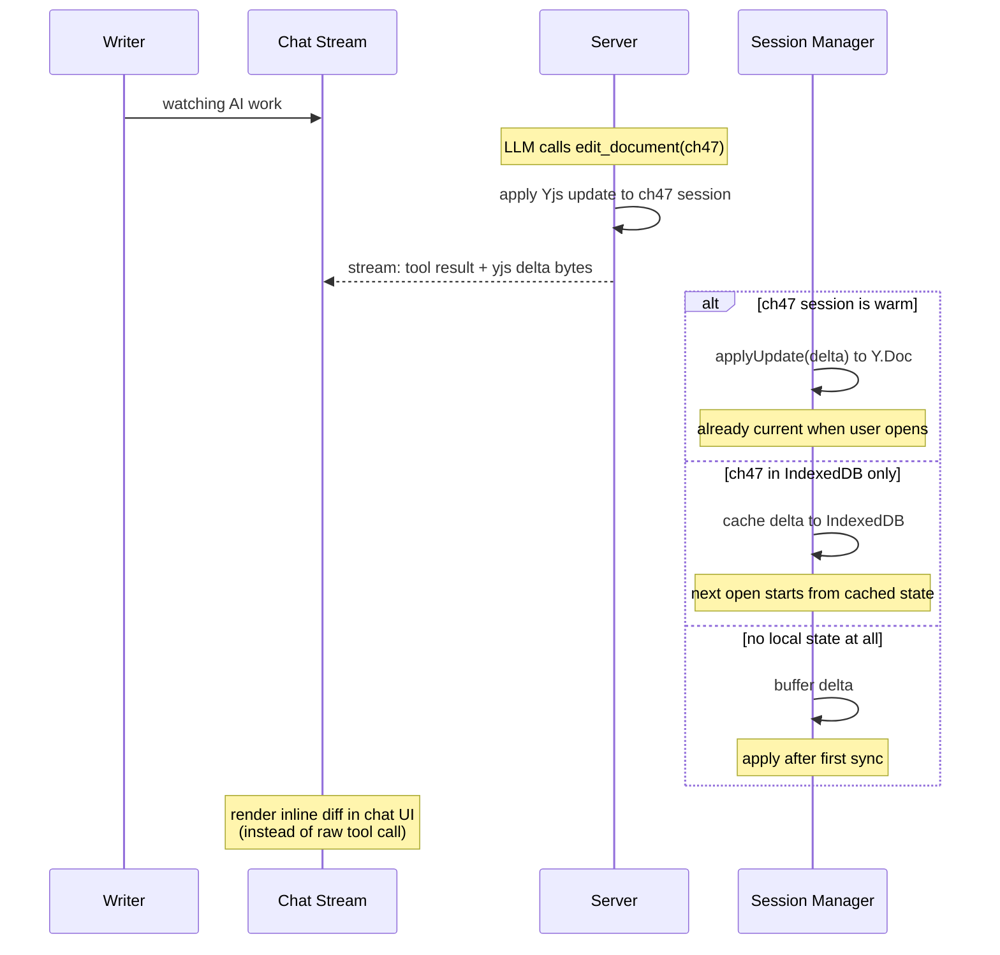
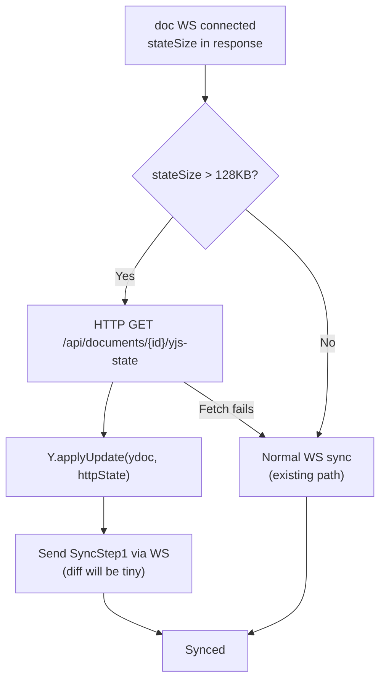
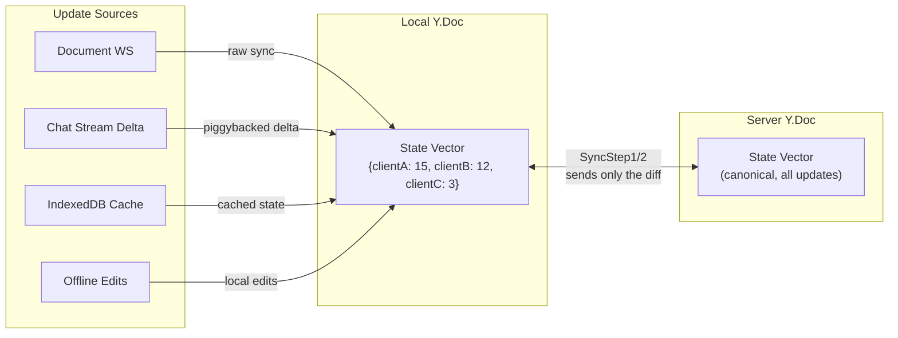

# WebSocket Patterns and Protocol Specs

## Document WebSocket Protocol

**Endpoint:** `GET /ws/documents/{documentId}`

No envelope header. No `doc:subscribe` / `doc:unsubscribe`. Connect = subscribe. Disconnect = unsubscribe.

### Handshake

```
Client -> Server: [text] raw JWT string (first message)
Server -> Client: [text] {"type":"connected","stateSize":12345}
Server -> Client: [binary] raw SyncStep1 bytes
Client -> Server: [binary] raw SyncStep1 bytes
Server -> Client: [binary] raw SyncStep2 bytes
                  [synced, live editing begins]
```

### Binary Frame Types

1-byte message-type prefix (y-websocket convention), then raw Yjs protocol bytes:

| Prefix Byte | Type | Payload |
|-------------|------|---------|
| `0x00` | Sync | Yjs sync protocol (SyncStep1=0, SyncStep2=1, Update=2) |
| `0x01` | Awareness | `encodeAwarenessUpdate(...)` bytes |

This is NOT the old envelope (`[1B type][16B docUUID][payload]`). The prefix is a single discriminator byte — no document ID, since the document is implicit from the WS connection. This follows the y-websocket convention where the first byte distinguishes sync from awareness.

### JSON Messages (Text Frames)

```
Server -> Client: {"type":"connected","stateSize":N,"protocol":1}
Server -> Client: {"type":"heartbeat"}
Server -> Client: {"type":"error","code":"...","message":"..."}
Client -> Server: {"type":"heartbeat"}
```

`protocol` field enables future negotiation (e.g., client checks `protocol >= 2` before attempting HTTP bootstrap in Stage 3).

Error codes: `AUTH_FAILED`, `FRAME_TOO_LARGE`, `RATE_LIMITED`, `RESET_REQUIRED`, `CONNECTION_LIMIT`

### Auth

Same JWT-in-first-message pattern. Server validates JWT + checks document access via `collabAuthenticator`. On failure: `{"type":"error","code":"AUTH_FAILED"}` + close.

Auth timeout: 5 seconds. If no JWT received within 5s, close with `AUTH_FAILED`.

---

## Project WebSocket Protocol

**Endpoint:** `GET /ws/projects/{projectId}`

JSON only. No binary frames. Handles cross-document events.

### What It Carries

```
Server -> Client:
  proposal:snapshot      (per-document, sent on connect)
  proposal:new           (new AI proposal for any document)
  proposal:statusChanged (accept/reject on any document)
  proposal:groupAcceptResult
  proposal:updateData    (lazy-fetched yjsUpdate)
  doc:edited             (LLM edited a document -- triggers anticipatory connect)
  heartbeat

Client -> Server:
  proposal:accept        {documentId, proposalId, idempotencyKey}
  proposal:reject        {documentId, proposalId}
  proposal:groupAccept   {documentId, groupId, idempotencyKey}
  proposal:requestUpdate {documentId, proposalId}
  heartbeat
```

### What It No Longer Carries

- `doc:subscribe` / `doc:unsubscribe` (handled by document WS connect/disconnect)
- Binary Yjs sync frames (handled by document WS)
- Envelope-framed binary messages (eliminated entirely)

### Proposal Event Contract

Unchanged from Phase 4.6. All events include `documentId`. `proposal:snapshot` sent per-document on connect (server sends snapshot for all documents in the project with pending proposals).

---

## Keep-Alive Pool (Session Manager)

### Why

Without keep-alive, switching documents means: destroy Y.Doc + runtime -> close WS -> open new WS -> JWT auth -> full Yjs sync -> create new Y.Doc + runtime. The writer sees "Connecting..." and "Syncing..." spinners every time.

With the session manager, switching back to a recently-used document is **instant** -- the full session (Y.Doc + IndexedDB + runtime + WS) stays alive. No spinners, no resync.

### Strategy

```
┌──────────────────────────────────────────────┐
│         Document Session Manager             │
│                                              │
│  Active:  [Chapter 3 - Y.Doc + WS + runtime]│
│                                              │
│  Warm pool (max 3, LRU eviction):            │
│    [Chapter 1 - full session, 2m30s left]    │
│    [Outline   - full session, 4m15s left]    │
│    [Notes     - full session, 1m02s left]    │
│                                              │
│  On acquire(docId):                          │
│    1. Check warm pool -> promote if found    │
│    2. Check IndexedDB -> show cached content │
│    3. Open new WS, create session            │
│    Never block render on sync.               │
│                                              │
│  On release(docId):                          │
│    Move to warm pool, start 5min timer.      │
│    Session stays alive (WS open, Y.Doc in    │
│    memory, background updates applied).      │
│                                              │
│  On eviction/timeout:                        │
│    Close WS (triggers server-side Release).  │
│    Destroy Y.Doc and runtime.                │
│    IndexedDB cache persists for next open.   │
└──────────────────────────────────────────────┘
```

| Parameter | Value | Rationale |
|-----------|-------|-----------|
| Warm timeout | 5 minutes | Covers "flip between two chapters" workflows |
| Max warm connections | 3 | Keeps resource usage bounded for writers |
| Eviction | LRU | Least-recently-used document closes first |

### Warm Session Behavior

- Full session stays alive: Y.Doc in memory, IndexedDB provider active, WS open
- Continues receiving Yjs updates from server (state stays current)
- Awareness updates paused (no phantom cursors in docs user isn't viewing)
- On reactivation: no resync needed, just resume awareness and rebind to editor
- **Health check:** If last heartbeat was >60s ago, mark session as stale. On next `acquire()`, treat as cold (destroy and recreate) to avoid promoting a dead session

---

## Chat Stream Delta Piggybacking

### Why

When an LLM edits a document via a chat tool call, the server already has the Yjs update bytes. Instead of opening anticipatory connections, piggyback the delta on the chat stream the writer is already connected to. Zero extra connections, negligible bandwidth (incremental updates are typically a few hundred bytes).

### Flow



### What the chat stream carries

When an AI tool call produces a document edit, the stream response includes:

```json
{
  "type": "tool_result",
  "documentId": "uuid",
  "yjsDelta": "<base64 encoded Yjs update bytes>",
  "summary": "Rewrote opening paragraph"
}
```

The `yjsDelta` is the raw Yjs update bytes (base64 encoded for JSON transport) — the output of `Y.encodeStateAsUpdateV2()` on the server after the tool call applies its edit. This is NOT the same as document WS frames (which have a 1-byte prefix); it is a standalone Yjs update that can be applied directly via `Y.applyUpdateV2(doc, delta)`.

**Ownership:** The session manager is responsible for applying the delta. If a warm session exists, apply to the Y.Doc directly. If only IndexedDB exists, open the provider and apply. If nothing exists, discard (the next document WS sync will catch it anyway — no durability requirement on the chat stream).

**Dropped stream:** If the chat stream disconnects mid-event, the delta is lost from this channel. This is fine — the document WS sync will deliver it on next connect. Chat deltas are best-effort acceleration, not a durability guarantee.

The chat UI can render `summary` or a mini inline diff instead of showing the raw tool call.

### Multiple agents editing the same document

If Chat A and Chat B both edit chapter 47, each stream only carries its own agent's deltas. The writer connected to Chat A sees A's updates but not B's.

**This is fine.** The chat deltas are a **preview optimization**, not the source of truth. When the writer opens chapter 47, the document WS performs a full Yjs sync and catches anything missed from other agents. Because the writer already has some updates cached (from whichever chat streams they were watching), the sync is smaller and faster.

See "CRDT Convergence Guarantee" below for why partial state from multiple channels always resolves correctly.

### `doc:edited` Event (Project WS)

Still broadcast on project WS as a lightweight notification:

```json
{"type": "doc:edited", "documentId": "uuid", "source": "proposal_accepted"}
```

This does NOT carry Yjs bytes (the chat stream does that). It serves as a notification for the frontend to show passive indicators (e.g., tree badges in future UI) and optionally warm up sessions.

Hook location: `proposal_service.go` on proposal accept -> broadcast to project WS connections.

---

## Two-Lane Transport (Stage 3)

### Why

Yjs documents can exceed 1MB for heavily-edited content (see research in `.meridian/fs/real-world-collab-traffic.md`). Cramming full state through the WS sync protocol blocks the connection. HTTP is better for one-shot large transfers.

### Decision Flow



### HTTP Endpoint

```
GET /api/documents/{id}/yjs-state
Authorization: Bearer <jwt>

Response: application/octet-stream (raw Yjs state bytes)
Headers: Content-Length, X-Yjs-State-Size
```

Logic: in-memory session state (freshest) -> DB `yjs_state` -> bootstrap from `content` column.

---

## Size Limits

| Limit | Value | Behavior | Rationale |
|-------|-------|----------|-----------|
| Library-level max (`MaxPayloadBytes`) | 2MB | Connection killed (last resort) | Prevents memory exhaustion |
| Application-level max | 256KB | `FRAME_TOO_LARGE` error, connection stays alive | Catches abuse, legitimate large payloads use HTTP |
| HTTP bootstrap threshold | 128KB | Client switches to HTTP lane | Below 128KB, WS sync is fast enough |
| Proposal `yjs_update` max | 256KB | Reject proposal creation | Same as application max |

---

## Heartbeat

Same contract as Phase 4.6, applied per-connection:
- Server sends every 30s if idle
- Client must respond within 5s
- Client considers connection dead after 60s silence
- Applied independently to each document WS and the project WS

---

## Reconnection

Same backoff formula as Phase 4.6: `min(5s, 250ms * 2^attempt) + jitter(15%)`

Per-connection reconnect:
- Document WS reconnect: re-auth -> Yjs sync (automatic state reconciliation)
- Project WS reconnect: re-auth -> server replays `proposal:snapshot` for all docs with pending proposals
- Session manager handles document WS reconnects independently (one doc reconnecting doesn't affect others)

---

## CRDT Convergence Guarantee

**This is why the entire multi-channel architecture works.** Yjs updates are commutative, idempotent, and causally ordered by state vectors. This means:

1. **Any channel can deliver updates** -- document WS, chat stream deltas, IndexedDB cache, offline edits. They all produce the same Yjs update bytes.
2. **Order doesn't matter** -- applying updates A then B produces the same result as B then A.
3. **Duplicates are free** -- applying the same update twice is a no-op. No deduplication logic needed.
4. **Partial state resolves automatically** -- if you have updates from Chat A but not Chat B, opening the document WS triggers a sync. The state vector tells the server exactly what you have, and SyncStep2 sends only what you're missing.



**We build transport pipes. Yjs handles the hard part.**

Multiple agents, offline humans, chat streams, warm pools -- all feeding into the same Y.Doc. Every source is just another pipe delivering `(clientID, clock)` pairs. The state vector reconciles everything automatically. No conflict resolution dialogs, no "accept theirs/mine," no merge logic.

This is the architectural invariant that makes it safe to:
- Cache partial updates from chat streams
- Keep warm sessions receiving background updates
- Go offline and sync later
- Have multiple AI agents editing the same document concurrently
- Receive updates from any channel in any order
