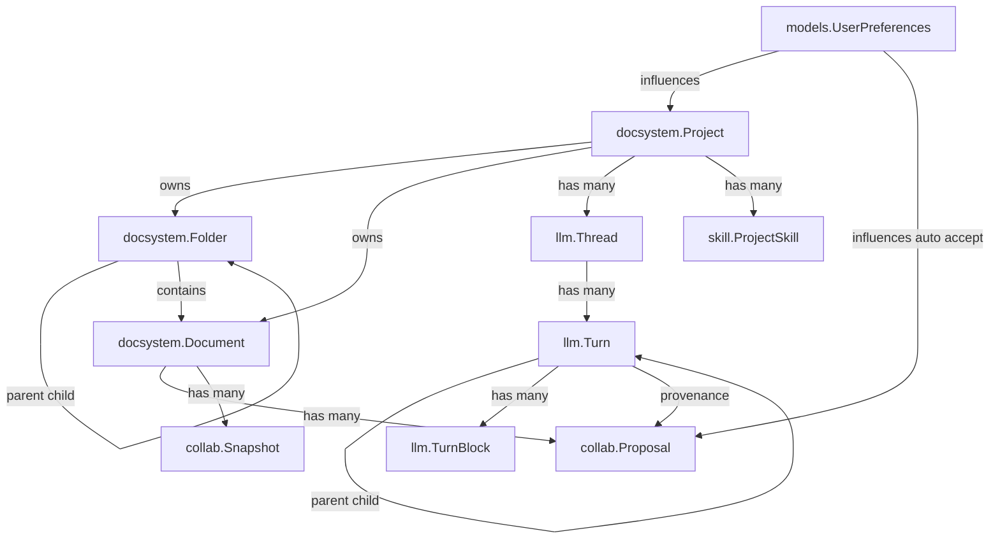
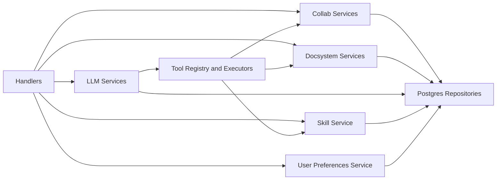
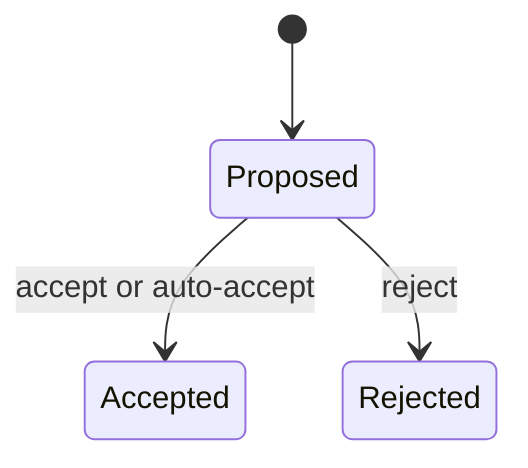
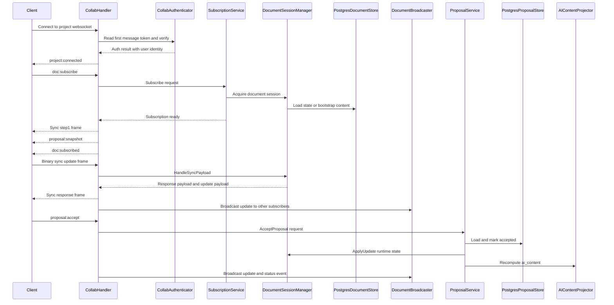
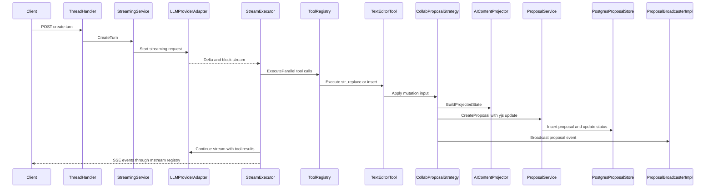
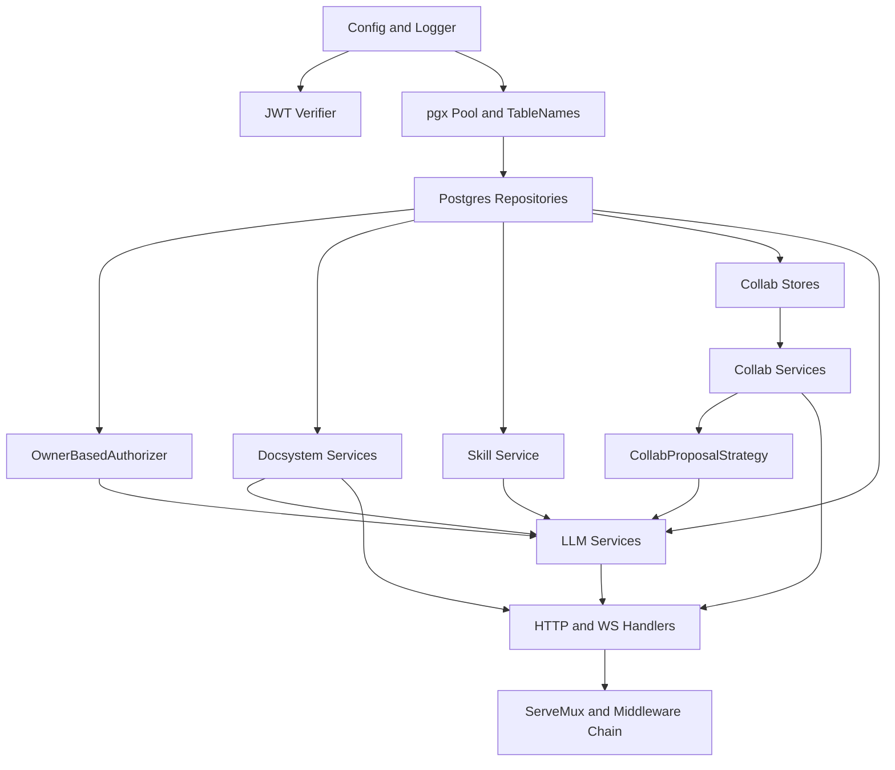

# Backend Technical Documentation

Technical reference and architecture overview for the Meridian backend (Go + net/http + PostgreSQL).

## Quick Links

| Need | Go to |
| --- | --- |
| First time? | [Getting Started](#getting-started) |
| API Reference? | [API Contracts](api/contracts.md) |
| Architecture? | [Architecture Overview](architecture/overview.md) |
| Database? | [Schema](database/schema.md) |
| Troubleshooting? | [Debugging Guide](development/debugging.md) |
| Commands? | `/backend/CLAUDE.md` |

## Getting Started

See `/backend/CLAUDE.md` for commands and setup workflow.

- [Database Connections](database/connections.md) - PgBouncer vs direct connections
- [Database Schema](database/schema.md) - Complete schema with ER diagrams
- [API Overview](api/overview.md) - Available endpoints

## Sub-Documentation Index

### API

- [Overview](api/overview.md) - Endpoint groups, auth pattern, key behaviors
- [Contracts](api/contracts.md) - Route table with handler files
- [Error Responses](api/error-responses.md) - RFC 7807 error format

### Database

- [Schema](database/schema.md) - ER diagram, table purposes, FK cascades
- [Connections](database/connections.md) - PgBouncer auto-config and pool settings

### Architecture

- [Overview](architecture/overview.md) - Design principles and layer responsibilities
- [Service Layer](architecture/service-layer.md) - ThreadHistoryService, StreamingService

### Document Search

- [Search Architecture](search-architecture.md) - PostgreSQL FTS with snippets, ranking, and pagination

### LLM Integration

**Library:** [`meridian-llm-go`](../llm/README.md) - Unified provider abstraction

- [Architecture](../llm/architecture.md) - Library design and 3-layer architecture
- [Streaming](../llm/streaming/README.md) - Streaming architecture and block types
- [Provider Routing](provider-routing.md) - Model string parsing and provider selection
- [Tools Architecture](tools/architecture.md) - Tool registry, builder, and execution

### Authentication

- [Cross-Stack Overview](../auth-overview.md) - Complete auth flow from frontend to backend
- [Authorization](auth/authorization.md) - Service-layer ownership-based authorization
- [Frontend Auth](../frontend/auth/auth-implementation.md) - Frontend Supabase integration

### Thread System

- Domain model: [thread/overview.md](thread/overview.md)
- Pagination: [thread/pagination.md](thread/pagination.md)
- LLM providers: [thread/llm-providers.md](thread/llm-providers.md)
- Turn blocks: [thread/turn-blocks.md](thread/turn-blocks.md)
- Schema: [database/schema.md](database/schema.md#thread-system)

### Streaming System

- **Start here:** [../llm/streaming/README.md](../llm/streaming/README.md)
- Block types: [thread/turn-blocks.md](thread/turn-blocks.md)
- API endpoints: [../llm/streaming/api-endpoints.md](../llm/streaming/api-endpoints.md)
- Race conditions: [../llm/streaming/race-conditions.md](../llm/streaming/race-conditions.md)
- Tool execution: [../llm/streaming/tool-execution.md](../llm/streaming/tool-execution.md)
- Edge cases: [../llm/streaming/edge-cases.md](../llm/streaming/edge-cases.md)

### Development

- [Debugging](development/debugging.md) - Common issues and solutions
- [Workspace + Submodule](development/workspace-and-submodule.md) - Local edits with pinned deps
- Test data: Run `make seed-fresh` (see `/backend/CLAUDE.md`)

---

## Architecture Overview

Clean Architecture (Hexagonal) with clear layer separation. For detailed design principles, see [architecture/overview.md](architecture/overview.md).

### Domain Model

Core domains intersect at runtime through service interfaces.



Key relationships:
- `Turn` is a tree via `prev_turn_id`; `TurnBlock` holds typed multimodal/tool blocks
- `Document` persists collab state (`yjs_state`, `ai_content`) alongside content
- `Proposal` stores Yjs updates and decision metadata for accept/reject lifecycle

### Service Layer



See [architecture/service-layer.md](architecture/service-layer.md) for detailed service responsibilities.

### Repository Patterns

Storage backend is Postgres via `pgxpool` under `internal/repository/postgres`.

Key patterns:
- **Conditional updates with pointer semantics**: `nil` = skip, non-nil = update. Combined with `COALESCE` in SQL. See `internal/repository/postgres/llm/turn.go:AccumulateTokensAndUpdateMetadata()`.
- **Interface segregation**: Turn data split into `TurnWriter`, `TurnReader`, `TurnNavigator`.
- **Transaction propagation**: Context-based `SetTx`/`GetTx` with `GetExecutor`.
- **PgBouncer compatibility**: Auto-mode for port `6543` using `QueryExecModeCacheDescribe`.

### Collab System

Project-scoped WebSocket transport with per-document multiplexing over a Yjs runtime. This is the most complex subsystem -- the diagrams below capture the protocol, state machine, and full message flow.

**Wire protocol:**
- JSON command/event channel: `project:connected`, `heartbeat`, `doc:subscribe`/`doc:unsubscribe`/`doc:subscribed`/`doc:error`/`doc:unsubscribed`, and `proposal:*` commands/events
- Binary multiplexed frames: `[envelopeType][documentUUID16][payload]` for Yjs sync and awareness

**Proposal state machine:**



**Message flow:**



**Runtime behaviors:**
- Server-driven heartbeats every 30s; socket closes if no ack within 5s
- Rate limited to 30 messages/second per socket; excess triggers `RATE_LIMITED` error and 1s mute
- Active subscriptions revalidated on sync traffic; revoked access emits `doc:unsubscribed`

### LLM and AI Integration

Provider setup in `service/llm/setup.go` builds the provider factory, adapter factory, and registry. Streaming uses `meridian-stream-go` for SSE and catchup.

**Tool access** (built per-request from project preferences + model capabilities):
- `str_replace_based_edit_tool`, `doc_search`, `skill_invoke`, `skill_list`
- `web_search` (when search API config is present)

**Tool call to document mutation flow:**

Document edits from `str_replace_based_edit_tool` flow through collab proposals, not direct writes. This is the critical bridge between the LLM and collab subsystems.



Tool results emitted through SSE include `proposal_id` and `status` so the thread UI can correlate stream output with the collab proposal lifecycle.

### Dependency Injection Wiring

All composition lives in `backend/cmd/server/main.go`.



---

## Documentation Conventions

All backend docs follow these standards:

**Frontmatter:**
```yaml
---
detail: minimal | standard | comprehensive
audience: developer | architect | claude
---
```

**Reference format:** `file_path:line_number` (e.g., `internal/handler/document.go:45`)

**Diagrams:** Dark-mode compatible Mermaid diagrams where helpful

## Quick Reference

| Resource | Location |
| --- | --- |
| Commands | `/backend/CLAUDE.md` |
| Environment | `/backend/.ENVIRONMENTS.md` |
| Project root | `/CLAUDE.md` |
