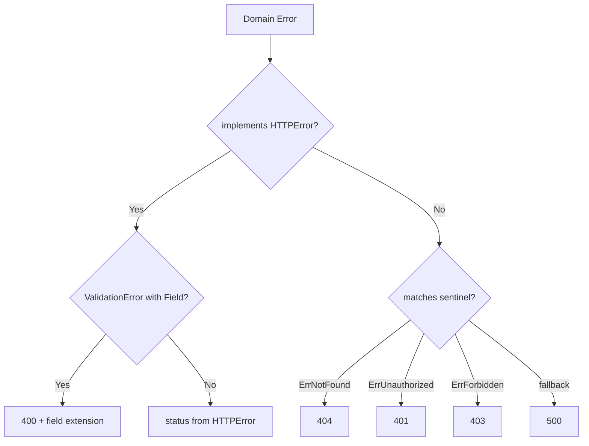

# API Error Responses

## Design Decision: RFC 7807 Problem Details

All error responses use [RFC 7807](https://datatracker.ietf.org/doc/html/rfc7807) format with `Content-Type: application/problem+json`. Fields: `type` (RFC URI), `title`, `status`, `detail`.

## Error Mapping

## Status Codes

| Code | When | Extensions |
|------|------|------------|
| 400 | Validation failure | `field` (single field name) for `ValidationError` with `Field` set |
| 401 | Missing/invalid JWT | -- |
| 403 | Not resource owner | -- |
| 404 | Not found or soft-deleted | -- |
| 409 | Duplicate resource on CREATE | `resource` (full existing resource for idempotent conflict resolution) |
| 429 | Concurrent streaming limit | -- |
| 500 | Server error | Debug detail appended in dev/test only |

## Exceptions

Import endpoints (`POST /api/import`, `POST /api/import/replace`) use a custom batch format with `summary`/`errors`/`documents` fields instead of RFC 7807, because partial success does not fit the standard error model.

## Implementation

- Error response helpers: `internal/httputil/response.go`
- Error-to-HTTP mapping: `internal/handler/helpers.go`
- Domain error types: `internal/domain/errors.go`
- Frontend parsing: `frontend/src/core/lib/api.ts` (auto-extracts `detail`, `resource`, `field`)
