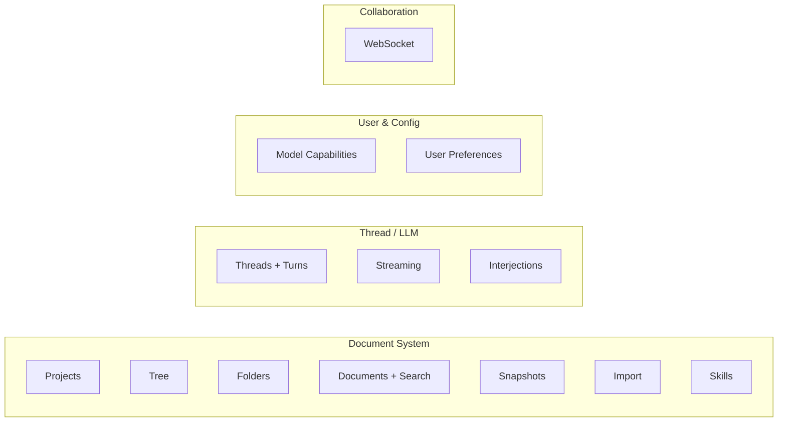

# API Overview

## Authentication

All endpoints require `Authorization: Bearer <JWT>` except:
- `GET /health` -- no auth
- `GET /ws/projects/{projectId}` -- JWT bootstrapped from first WebSocket message

## Resource Hierarchy

```
Project (slug-or-UUID addressable)
+-- Folder (hierarchical, recursive delete)
+-- Document (markdown content)
+-- Thread (LLM conversation)
|   +-- Turn (user or assistant message)
|       +-- Block (text, thinking, tool_use, ...)
+-- Skill (project-scoped AI behavior)
```

## Endpoint Groups



All routes registered in `cmd/server/main.go`. For error format, see [error-responses.md](error-responses.md).

## Key Behaviors

- **Identifier resolution**: Project endpoints accept UUID or slug. Document endpoints accept UUID only.
- **Soft delete**: Projects use soft delete (set `deleted_at`, return 200). Folders and documents use hard delete (return 204).
- **Folder delete**: Recursive -- deletes all descendants.
- **Root level**: Use `null` (not `""`) for `folder_id` to place at root. Empty string returns 400.
- **Path notation**: CREATE operations support Unix-style paths in `name` (e.g., `"Characters/Heroes/Aria"`). UPDATE operations do not.
- **Search pagination**: `limit`/`offset` params on `GET /api/documents/search` (default 20, max 100).
- **Thread pagination**: Direction-based (`before`/`after`/`both`) on `GET /api/threads/{id}/turns`. See [pagination guide](../thread/pagination.md).
- **Error format**: RFC 7807 Problem Details (`application/problem+json`). See [error-responses.md](error-responses.md).
- **Conflict responses**: 409 on CREATE includes the existing `resource` in the response body.
