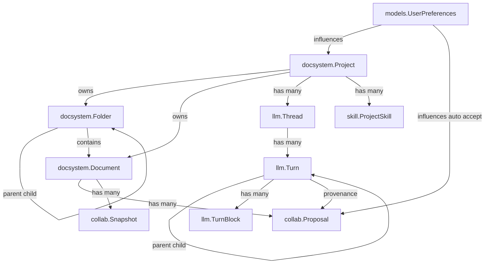
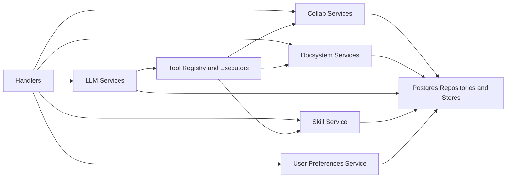
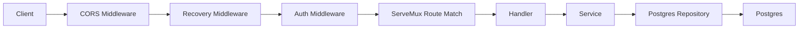
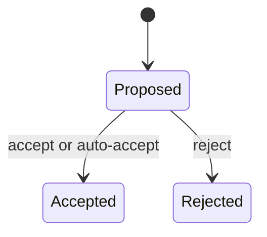
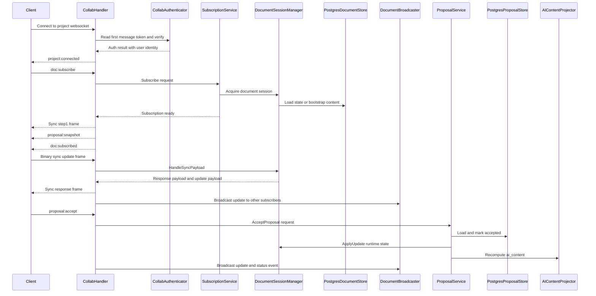
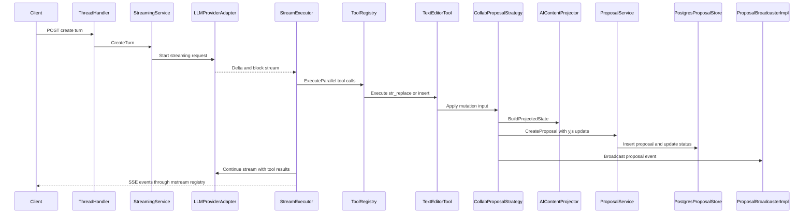
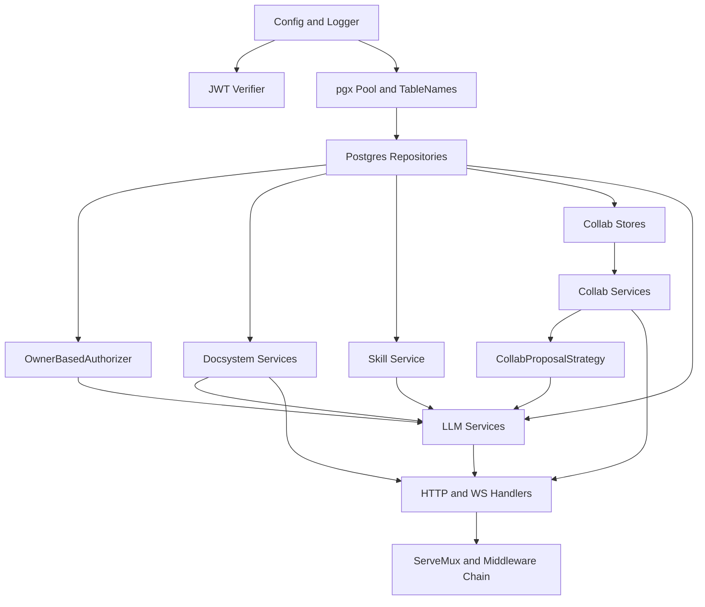

# Backend Architecture Map

This document maps the backend architecture that currently exists in code under `backend/`.

## 1. Directory Structure

### Top-level `backend/` directories

| Path | Purpose |
| --- | --- |
| `cmd/server` | Production server entrypoint and dependency wiring in `main.go`. |
| `cmd/seed` | Seed command for local/dev dataset creation. |
| `internal` | Application code: handlers, services, repositories, domain contracts, middleware, auth, config. |
| `migrations` | Goose SQL migrations for schema changes. |
| `tests` | Integration/smoke test assets. |
| `scripts` | Backend-specific helper scripts and seed data. |
| `supabase` | Supabase-related local artifacts. |
| `bin` | Local build outputs. |
| `logs` | Runtime log files when file logging is enabled. |
| `tmp` | Temporary working files. |
| `temp` | Temporary data folder. |
| `.gocache` | Local Go build cache. |

### Key `internal/` subdirectories

| Path | Purpose |
| --- | --- |
| `internal/domain/models` | Domain entities and DTO-like structs (`docsystem`, `llm`, `collab`, `skill`, `user_preferences`). |
| `internal/domain/repositories` | Repository interfaces and transaction abstractions. |
| `internal/domain/services` | Service interfaces and cross-domain contracts. |
| `internal/repository/postgres` | Postgres implementations for all repository/store interfaces. |
| `internal/service/docsystem` | Project/folder/document/tree/import/favorite business logic. |
| `internal/service/llm` | Provider routing, thread services, streaming orchestration, tool system, token enrichment. |
| `internal/service/collab` | Yjs session runtime, subscriptions, proposal lifecycle, projection, arbiter strategies. |
| `internal/service/auth` | Ownership-based resource authorizer implementation. |
| `internal/service/skill` | Project skill lifecycle and skill-folder management. |
| `internal/handler` | HTTP and WebSocket transport handlers. |
| `internal/middleware` | Auth and panic-recovery middleware. |
| `internal/auth` | JWT verifier and Supabase admin auth client abstractions. |
| `internal/config` | Environment-driven app configuration loading. |
| `internal/capabilities` | Embedded model capability registry loaded from YAML. |
| `internal/jobs` | In-memory background queue and recurring cleanup jobs. |
| `internal/httputil` | Common HTTP parsing/response helpers and auth context helpers. |
| `internal/llm` | Legacy unified request/response schema structs. |

## 2. Domain Model

Core domains are split by package, but they intersect at runtime through service interfaces.

- `docsystem`: `Project`, `Folder`, `Document`
- `llm`: `Thread`, `Turn`, `TurnBlock`
- `collab`: `Proposal`, `Snapshot`, idempotency + touch/reference models
- `skill`: `ProjectSkill`
- `models`: `UserPreferences`

Notes from code:

- `Project` includes `preferences` JSONB and `auto_accept_proposals` tri-state.
- `Document` persists `content`, `metadata`, and collab state columns (`yjs_state`, `ai_content`) via collab stores.
- `Turn` is a tree via `prev_turn_id`; `TurnBlock` holds typed multimodal/tool blocks.
- `Proposal` stores Yjs updates and decision metadata for accepted/rejected lifecycle.

## 3. Service Layer

### Major service groups

| Service package | What it does |
| --- | --- |
| `service/docsystem` | CRUD + validation + path resolution + tree building + import processing. |
| `service/llm/thread` | Thread CRUD. |
| `service/llm/thread_history` | Turn path/sibling/pagination/history assembly. |
| `service/llm/streaming` | `CreateTurn`, provider streaming orchestration, tool loop, interruption, interjection, token finalization. |
| `service/llm/tools` | Tool registry/builder/executors (`str_replace_based_edit_tool`, `doc_search`, `skill_*`, `web_search`). |
| `service/collab` | Session manager, subscription lifecycle, proposal service, AI content projection, arbiter chain, broadcaster. |
| `service/skill` | Project skill CRUD, ordering, and backing folder integration via namespace service. |
| `service/auth` | Ownership-based `ResourceAuthorizer` implementation. |
| `service/identifier` | UUID or slug resolution for project/document identifiers. |
| `jobs` | In-memory queue workers, generation enrichment retries, collab snapshot cleanup loop. |

### Service interaction shape

## 4. Repository Layer

Storage backend is Postgres via `pgxpool`; all concrete persistence is under `internal/repository/postgres`.

### Repository/store implementations

| Package | Concrete type | Main interfaces satisfied |
| --- | --- | --- |
| `postgres/docsystem` | `ProjectRepository`, `FolderRepository`, `DocumentRepository`, `FavoriteRepository` | Domain docsystem repository interfaces |
| `postgres/llm` | `PostgresThreadRepository` | `ThreadRepository` |
| `postgres/llm` | `PostgresTurnRepository` | `TurnRepository`, plus split `TurnWriter` `TurnReader` `TurnNavigator` |
| `postgres/skill` | `ProjectSkillRepository` | `ProjectSkillRepository` |
| `postgres` | `PostgresUserPreferencesRepository` | `UserPreferencesRepository` |
| `postgres/collab` | `PostgresDocumentStore` | `DocumentStateStore`, `SnapshotStore`, `DocumentContentLoader`, `AIContentReader` |
| `postgres/collab` | `PostgresProposalStore` | `ProposalStore` |
| `postgres/collab` | `PostgresIdempotencyStore` | `IdempotencyStore` |
| `postgres/collab` | `PostgresAutoAcceptStore` | `AutoAcceptPolicyStore` |
| `postgres` | `TransactionManager` | `TransactionManager` |

### Notable repository patterns

- Dynamic table-name prefixing through `TableNames` in `connection.go`.
- Transaction propagation via context (`SetTx` and `GetTx`) and `GetExecutor`.
- PgBouncer compatibility auto-mode for port `6543` using `QueryExecModeCacheDescribe`.
- Interface segregation on turn data (`TurnWriter`, `TurnReader`, `TurnNavigator`) is actively used by services.

## 5. Handler and API Layer

### Transport implementation

- HTTP stack uses Go `net/http` + `http.ServeMux` with Go 1.22 method-aware patterns.
- Collab WebSocket endpoint uses `golang.org/x/net/websocket`.
- SSE streaming endpoint is served by `SSEHandler` over `mstream.Registry`.

### Middleware chain

Execution order for incoming HTTP requests in `main.go`:

1. CORS middleware
2. Recovery middleware
3. Auth middleware
4. Route handler via `ServeMux`

Runtime behavior:

- `/health` and `/ws/projects/*` skip HTTP bearer auth middleware.
- Collab WebSocket authenticates in-band with first WS message token.

### Route groups currently registered

| Route prefix | Handler |
| --- | --- |
| `/health` | document handler health check |
| `/api/projects*` | project, tree, and project skills handlers |
| `/api/folders*` | folder handler |
| `/api/documents*` | document handler + collab snapshot handler |
| `/api/import*` | import handler |
| `/api/models/capabilities` | models handler |
| `/api/users/me/preferences` | user preferences handler |
| `/api/threads*` and `/api/turns*` | thread + streaming/interjection handlers |
| `/ws/projects/{projectId}` | collab websocket handler |
| `/debug/api/...` | thread debug handlers in `ENVIRONMENT=dev` only |

### HTTP request flow

## 6. Collab System

The collab subsystem is project-scoped WebSocket transport with per-document multiplexing and a Yjs runtime.

### Core collab components

| Component | Role |
| --- | --- |
| `CollabHandler` | WS transport entrypoint and protocol dispatcher. |
| `collabAuthenticator` | First-message JWT validation + ownership/project checks. |
| `SubscriptionService` | Per-connection document subscription limits and lifecycle. |
| `DocumentSessionManager` | In-memory Y.Doc cache, acquire/release ref-counting, debounce persistence, snapshots. |
| `InMemoryDocumentBroadcaster` | Fan-out to subscribers, excluding sender when needed. |
| `ProposalService` | Proposal create/accept/reject/groupAccept lifecycle + idempotency + gates. |
| `AIContentProjector` | Recomputes `ai_content` from base state plus pending proposals; also builds projected state for AI edit conversion. |
| `StrategyChainArbiter` | Auto-accept override chain based on proposal size and recent density. |

### Wire protocol

- JSON command/event channel on the same socket:
  - connection/document messages: `project:connected`, `heartbeat`, `doc:subscribe`, `doc:unsubscribe`, `doc:subscribed`, `doc:error`, `doc:unsubscribed`
  - proposal commands: `proposal:accept`, `proposal:reject`, `proposal:groupAccept`, `proposal:requestUpdate`
  - proposal events: `proposal:snapshot`, `proposal:new`, `proposal:statusChanged`, `proposal:groupAcceptResult`, `proposal:updateData`
- Binary multiplexed frame format for Yjs sync and awareness:
  - frame bytes are `[envelopeType][documentUUID16][payload]`
  - envelope types map to sync step1, sync step2, update, awareness

### Proposal state

### Collab message flow

### Runtime behaviors that affect collab sessions

- Heartbeats are server-driven: `runHeartbeatLoop` sends `heartbeat` every 30 seconds and closes the socket if no ack arrives within 5 seconds.
- Inbound traffic is rate limited in the shared message loop to 30 messages per second per socket; exceeding the limit sends `error` with code `RATE_LIMITED` and mutes inbound processing for 1 second.
- Active subscriptions are revalidated on binary sync traffic and proposal commands; if ownership is revoked or the document no longer belongs to the socket's project, the handler unsubscribes that document and emits `doc:unsubscribed` with reason `access_revoked` or `project_mismatch`.
- Document-scoped failures such as bad subscribe payloads, missing subscriptions, or sync problems emit `doc:error` without closing the whole project socket.

## 7. LLM and AI Integration

### Runtime structure

- Provider setup in `service/llm/setup.go` builds:
  - provider factory + adapter factory + registry
  - adapters include Anthropic, OpenRouter, and lorem adapter implementations
- Service setup wires:
  - `thread.Service`
  - `thread_history.Service`
  - `streaming.Service`
- Streaming uses `meridian-stream-go` registry for SSE and catchup behavior.

### Tool access available to LLM runtime

Tool registry is built per request from project preferences + model capabilities.

- `str_replace_based_edit_tool`
- `doc_search`
- `skill_invoke`
- `skill_list`
- `web_search` when search API config is present

### Tool call to document mutation path

Document edits from `str_replace_based_edit_tool` do not write document text directly. They flow through collab proposals:

1. tool reads projected content via `AIContentReader`
2. tool builds new content and calls `DocumentMutationStrategy`
3. `CollabProposalStrategy` builds projected Yjs state and converts text diff to Yjs update
4. strategy calls `ProposalService.CreateProposal`
5. strategy broadcasts proposal-created or proposal-accepted events through collab broadcaster bridge

Tool results emitted through SSE include `proposal_id` and `status` when `str_replace_based_edit_tool` creates a collab proposal, so the thread UI can correlate stream output with the collab proposal lifecycle.

## 8. Key Interfaces

Important boundary interfaces used across layers:

| Interface | Package | Primary implementation |
| --- | --- | --- |
| `ResourceAuthorizer` | `domain/services` | `service/auth.OwnerBasedAuthorizer` |
| `TransactionManager` | `domain/repositories` | `repository/postgres.TransactionManager` |
| `TurnWriter`, `TurnReader`, `TurnNavigator` | `domain/repositories/llm` | `repository/postgres/llm.PostgresTurnRepository` |
| `ThreadRepository` | `domain/repositories/llm` | `repository/postgres/llm.PostgresThreadRepository` |
| `DocumentService`, `FolderService`, `TreeService` | `domain/services/docsystem` | `service/docsystem` implementations |
| `NamespaceService` | `domain/services/docsystem` | `service/docsystem.namespaceService` |
| `Resolver` | `domain/services/identifier` | `service/identifier.ChainedResolver` |
| `ProjectSkillService` | `domain/services/skill` | `service/skill.projectSkillService` |
| `UserPreferencesService` | `domain/services` | `service.UserPreferencesService` |
| `LLMProvider` | `domain/services/llm` | provider adapters from `service/llm/adapters` |
| `StreamingService` | `domain/services/llm` | `service/llm/streaming.Service` |
| `DocumentStateStore`, `SnapshotStore`, `AIContentReader`, `DocumentContentLoader` | `domain/services/collab` | `repository/postgres/collab.PostgresDocumentStore` |
| `ProposalStore`, `IdempotencyStore`, `AutoAcceptPolicyStore` | `domain/services/collab` | Postgres collab stores |
| `ProposalService` | `domain/services/collab` | `service/collab.ProposalService` |
| `AgentArbiter` | `domain/services/collab` | `service/collab.StrategyChainArbiter` |
| `ArbiterStrategy` | `domain/services/collab` | `service/collab.SizeThresholdStrategy`, `service/collab.RecentChangeDensityStrategy` |
| `DocumentMutationStrategy` | `service/llm/tools` | `tools.CollabProposalStrategy` |
| `SearchClient` | `service/llm/tools/external` | `external.TavilyClient` |

## 9. Dependency Injection and Wiring

All application composition is in `backend/cmd/server/main.go`.

Boot sequence in current code, grouped into major phases but keeping the concrete initializations that matter:

1. Load `.env` and config.
2. Create the tool-limit resolver.
3. Initialize structured logger and optional file logging.
4. Build the JWT verifier.
5. Create the pgx pool and dynamic `TableNames`.
6. Instantiate repositories and transaction manager.
7. Instantiate validators and the ownership authorizer.
8. Build docsystem services: content analyzer, path resolver, project, favorite, document, and folder services.
9. Build the LLM provider registry.
10. Initialize the capability registry.
11. Create and start the in-memory job queue goroutine.
12. Build the namespace service and project skill service.
13. Instantiate collab stores and collab runtime services: broadcaster, session manager, AI content projector, arbiter strategies, and proposal service.
14. Build the AI edit mutation bridge with `CollabProposalStrategy`.
15. Build LLM services and the SSE stream registry.
16. Create the identifier resolver, tree service, converter registry, file processor registry, import service, and user preferences service.
17. Instantiate HTTP/WS handlers, including collab subscription and snapshot handlers.
18. Start the collab cleanup goroutine.
19. Register routes on the mux.
20. Wrap middleware in execution order and create the HTTP server.
21. Install graceful shutdown for the cleanup and job queue goroutines, then start `ListenAndServe`.

