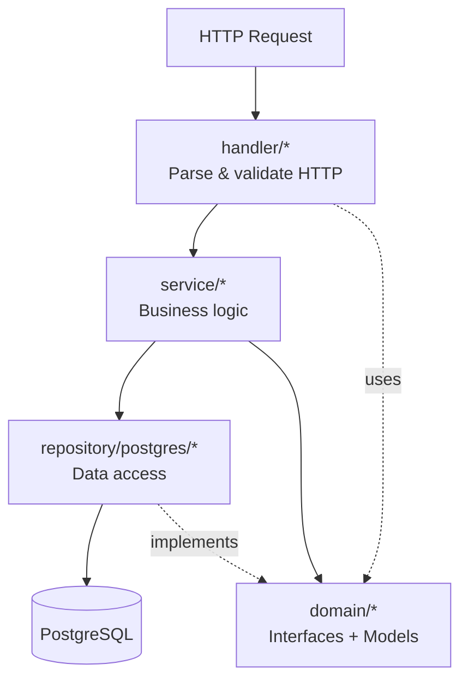
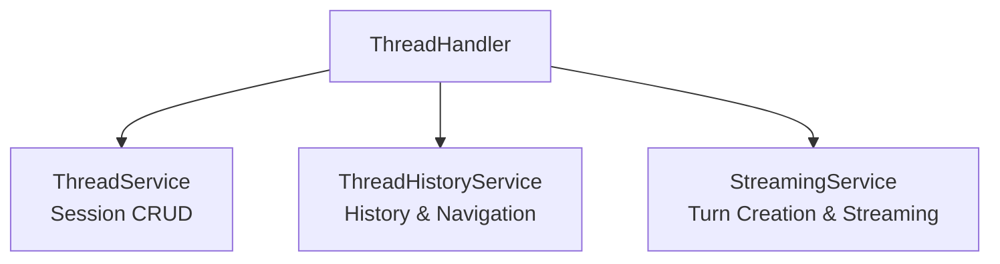
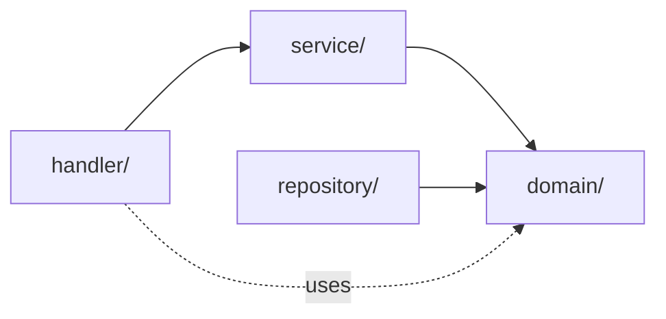
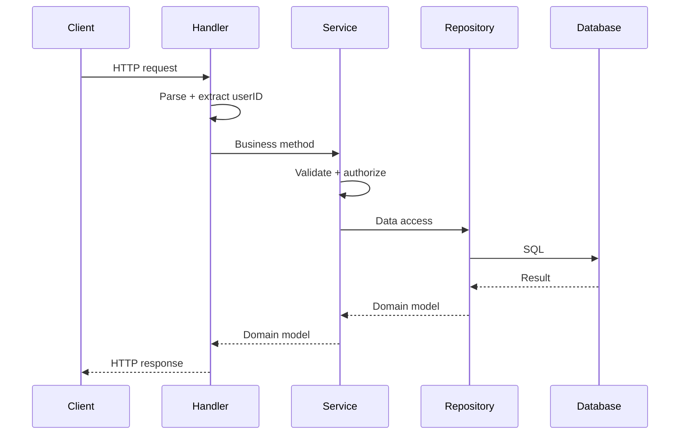

# Architecture Overview

Meridian backend uses Clean Architecture with clear layer separation. Business logic does not depend on external details like databases or HTTP frameworks.

## Layer Diagram

## The Three Layers

| Layer | Directory | Does | Does NOT |
|-------|-----------|------|----------|
| **Handler** | `internal/handler/` | Parse HTTP, call services, map errors to status codes | Business logic, SQL, create errors |
| **Service** | `internal/service/` | Validate, authorize, orchestrate, transform, transactions | HTTP concerns, SQL |
| **Repository** | `internal/repository/postgres/` | Execute SQL, map rows to structs | Validation, business logic |

See any handler file (e.g., `internal/handler/document.go`) for the thin-handler pattern. Services use ozzo-validation and `ResourceAuthorizer` for business rules.

## LLM Service Split

The LLM domain demonstrates advanced Clean Architecture with a 3-service split. See [service-layer.md](service-layer.md) for full rationale.

## Dependency Flow

Services depend on repository **interfaces** (domain), not **implementations** (postgres). This enables testing with mocks and swapping databases without changing services.

## Request Flow

## Error Handling

Domain defines `HTTPError` interface and sentinel errors (`ErrNotFound`, `ErrValidation`, etc.) in `internal/domain/errors.go`. Handlers map these to HTTP status codes via `handleError()` in `internal/handler/helpers.go`.

## Dependency Injection

All wiring happens in `cmd/server/main.go` using Go 1.22+ `http.NewServeMux()`. LLM services use `internal/service/llm/setup.go` as a setup helper.

## Key Technologies

| Concern | Technology |
|---------|------------|
| HTTP | `net/http` with Go 1.22+ enhanced ServeMux |
| Database | pgx v5 |
| Validation | ozzo-validation |
| Logging | slog |
| Streaming | meridian-stream-go |
| LLM | meridian-llm-go |

## References

- Interfaces: `internal/domain/repositories/`, `internal/domain/services/`
- Models: `internal/domain/models/`
- [Service Layer Architecture](service-layer.md)
- [Repository Patterns](../README.md#repository-patterns)
