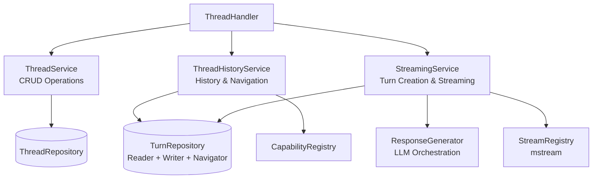
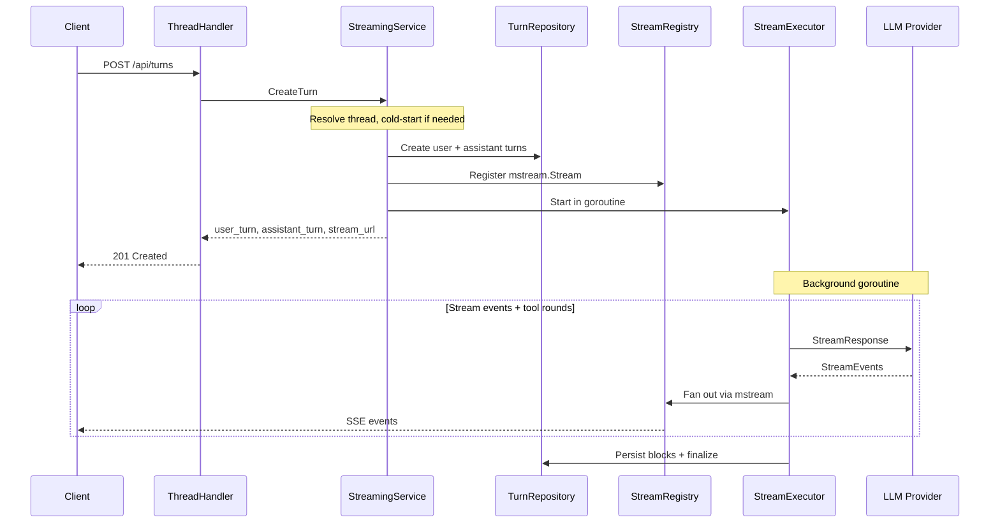
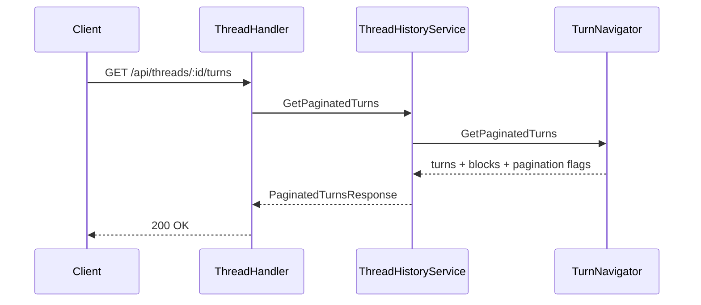

# Service Layer Architecture: LLM Services

The LLM service layer splits a former monolithic ThreadService (1500+ lines) into 3 focused services following SOLID principles.

## Service Overview

## The Three Services

| Service | Responsibility | Size | Key Dependencies |
|---------|---------------|------|-----------------|
| **ThreadService** | Thread session CRUD | ~150 lines | ThreadRepository, ProjectRepository |
| **ThreadHistoryService** | Turn path, siblings, tree, pagination, token usage | ~210 lines | TurnReader, TurnNavigator, CapabilityRegistry |
| **StreamingService** | Turn creation, streaming, tool execution, interjections | 20+ files | TurnWriter, TurnReader, TurnNavigator, ProviderGetter, mstream.Registry, many more |

See `internal/service/llm/setup.go` for full dependency wiring.

**Why separate?** Each service has a single reason to change. ThreadService can be used standalone for thread lists. HistoryService is read-optimized with batch block loading. StreamingService isolates complex orchestration (background goroutines, SSE broadcasting, tool execution loops).

## Key Flows

### User Sends Message

### User Views Thread History

## SOLID Compliance

**SRP**: Each service has one reason to change. ThreadService knows nothing about streaming; HistoryService knows nothing about LLM calls.

**ISP**: Three focused service interfaces instead of one fat interface. TurnRepository is consumed via 3 narrow interfaces: `TurnReader`, `TurnWriter`, `TurnNavigator`.

**DIP**: Services depend on repository/provider interfaces, not implementations. See the dependency diagram above.

## Authorization Pattern

All services receive a `ResourceAuthorizer`. Authorization happens at the service layer (not handler), enforcing ownership chain: turn -> thread -> project -> user.

## References

- Domain interfaces: `internal/domain/services/llm/thread.go`, `thread_history.go`, `streaming.go`
- Implementations: `internal/service/llm/thread/`, `thread_history/`, `streaming/`
- Setup helper: `internal/service/llm/setup.go`
- [Architecture Overview](overview.md)
- [Tool System Architecture](../tools/architecture.md)
