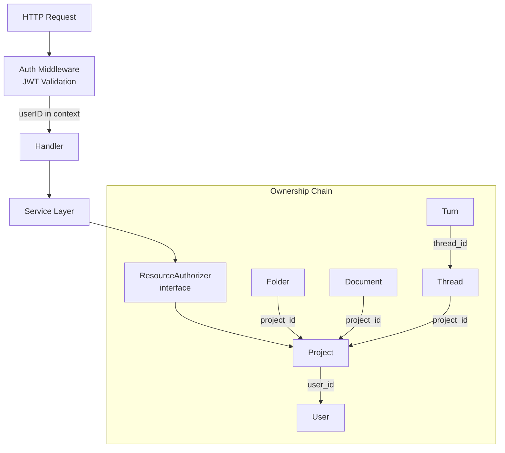

# Authorization

## Pattern

All authorization happens at the **service layer**, not handlers (with exceptions for SSE streams and import).

## How It Works

`ResourceAuthorizer` interface (`internal/domain/services/auth.go`) with one method per resource type. The sole implementation is `OwnerBasedAuthorizer` (`internal/service/auth/owner_authorizer.go`) -- simple ownership: user owns project, therefore owns everything within it.

**Two authorization paths:**

1. **`CanAccessProject`**: Used for tree, skills, thread-history, import, and other project-scoped paths. Returns 403 for both non-owned and missing projects (prevents existence leakage).

2. **User-scoped repository reads**: Project CRUD (list, get, update, delete) uses repos that filter by `user_id` directly. Non-owner gets 404 via the identifier resolver returning `ErrNotFound`.

## Extensibility

Same `ResourceAuthorizer` interface supports future RBAC or team-based authorization -- swap the implementation, keep the contract.

**Wiring:** See `cmd/server/main.go` for how the authorizer is created and injected into services.
