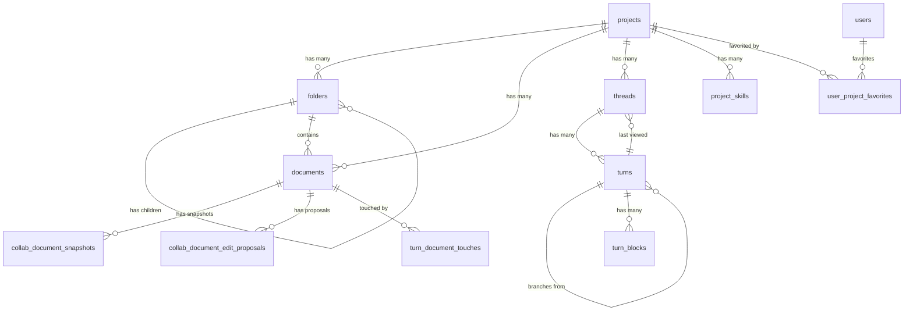

# Database Schema

PostgreSQL schema for Meridian. Managed via goose migrations in `backend/migrations/`.

## ER Diagram

## Table Purposes

### Document System

| Table | Purpose | Key Design Notes |
|-------|---------|-----------------|
| `projects` | Top-level container. Slug-or-UUID addressable. | Soft-delete via `deleted_at`. `UNIQUE(user_id, slug)` partial index on active rows. |
| `folders` | Hierarchical tree via adjacency list (`parent_id` self-ref). | DB column is `parent_id`; API exposes as `folder_id`. Recursive delete cascades to children. |
| `documents` | Leaf nodes with markdown `content` + `ai_content` for collab. | `yjs_state` for real-time collab. `path` is computed (not stored) via recursive CTE. |
| `user_project_favorites` | Junction table for project favorites. | Composite PK `(user_id, project_id)`. |
| `project_skills` | Per-project AI skill metadata and content. | Links to `instance_folder_id` in `/.meridian/skills/`. Has `metadata` JSONB column. |

### Thread System

| Table | Purpose | Key Design Notes |
|-------|---------|-----------------|
| `threads` | LLM conversation sessions scoped to projects. | `last_viewed_turn_id` for UI navigation. Soft-delete. |
| `turns` | Tree-structured conversation via `prev_turn_id` self-ref. | `ON DELETE SET NULL` for `prev_turn_id` (preserves branches). Statuses: pending, streaming, waiting_subagents, complete, cancelled, error. |
| `turn_blocks` | Multimodal content blocks within turns. | Types: text, thinking, tool_use, tool_result, image, reference, partial_reference, web_search_use, web_search_result. JSONB `content` for type-specific data. |

### Collaboration System

| Table | Purpose | Key Design Notes |
|-------|---------|-----------------|
| `collab_document_snapshots` | Yjs state snapshots for version history. | Types: auto, auto_human, auto_ai_accept, named, pre_restore. |
| `collab_document_edit_proposals` | Queued AI edit proposals for review workflow. | Statuses: proposed, accepted, rejected. Groups via `proposal_group_id`. |
| `collab_request_idempotency` | Prevents duplicate proposal accept processing. | TTL-based cleanup via `expires_at`. |
| `turn_document_touches` | Tracks which documents a turn touched. | Enables provenance-based review workflows. |

### User System

| Table | Purpose | Key Design Notes |
|-------|---------|-----------------|
| `user_preferences` | Namespaced JSONB settings per user. | Single row per user, GIN-indexed. |

## Key Design Decisions

**Dynamic table names**: Tables use environment-specific prefixes (`dev_`, `test_`, `prod_`) configured via `ENVIRONMENT` or `TABLE_PREFIX` env vars. All queries use `fmt.Sprintf` with `db.Tables.*`. See `internal/repository/postgres/connection.go`.

**Soft delete**: Projects, folders, documents, threads, and skills support soft deletion. Uniqueness constraints use partial indexes (`WHERE deleted_at IS NULL`) to allow re-creation.

**Turn branching**: Multiple turns can share the same `prev_turn_id`, creating conversation branches. `ON DELETE SET NULL` prevents cascade-deleting entire branches when a parent turn is removed.

**Path computation**: Folder/document paths are computed at query time via recursive CTE, not stored. Renaming a folder automatically updates all descendant paths.

## FK Cascade Summary

| Relationship | ON DELETE |
|-------------|-----------|
| project -> folders, documents, threads | CASCADE |
| folder -> child folders, documents | CASCADE |
| thread -> turns | CASCADE |
| turn -> turn_blocks | CASCADE |
| turn (prev) -> turn (child) | **SET NULL** |
| turn -> thread.last_viewed_turn_id | SET NULL |
| document -> snapshots, proposals, idempotency, touches | CASCADE |

## References

- Migration files: `backend/migrations/`
- Table name config: `internal/repository/postgres/connection.go`
- Content validation: `internal/domain/models/llm/content_types.go`
- FTS indexes: See [search-architecture.md](../search-architecture.md)
