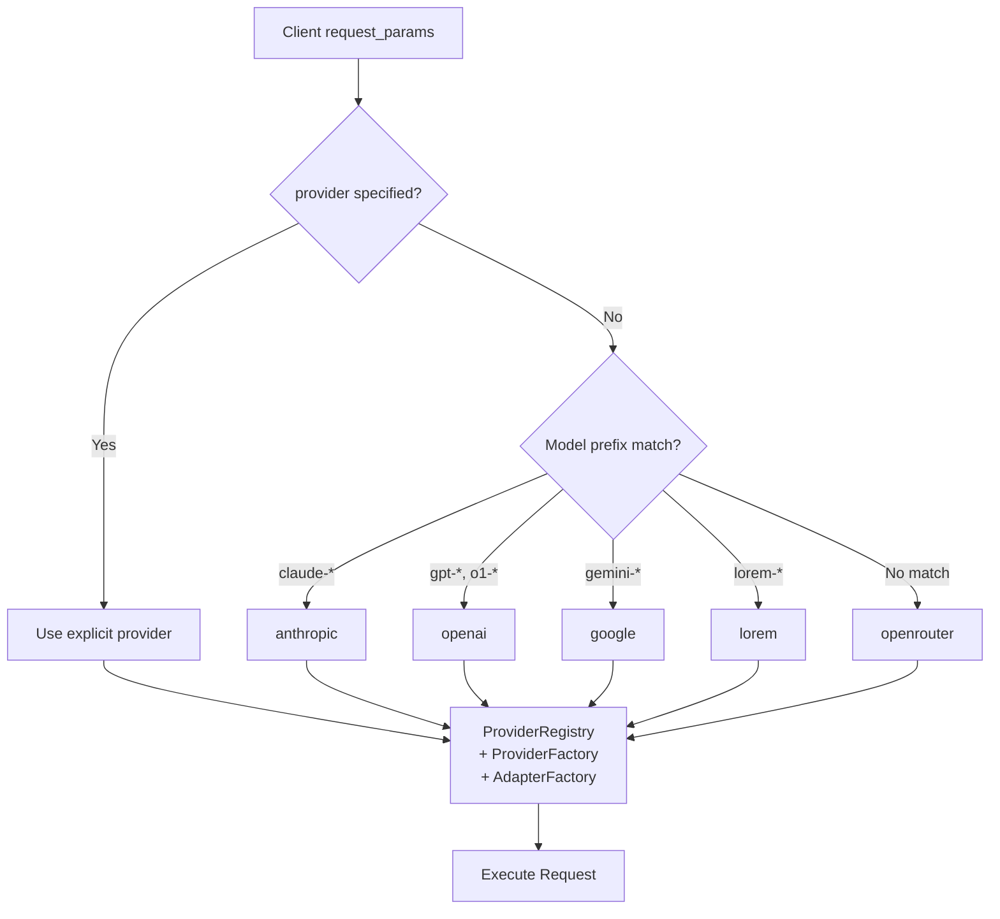

# Provider Routing

## How Provider Is Resolved

## Implemented Providers

| Provider | API Key Env Var | Notes |
|----------|----------------|-------|
| `anthropic` | `ANTHROPIC_API_KEY` | Claude models directly |
| `openrouter` | `OPENROUTER_API_KEY` | Universal gateway for any model |
| `lorem` | (none) | Mock provider for testing |

## Known Gap

The model mapping infers `openai` from `gpt-*` prefixes and `google` from `gemini-*` prefixes, but neither provider is implemented. Requesting these models **without** an explicit `provider: "openrouter"` will fail with "unsupported provider". To use GPT or Gemini models, clients must explicitly set `provider: "openrouter"`.

## Implementation

- Model mapping: `internal/domain/models/llm/model_mapping.go`
- Provider factory: `internal/service/llm/provider_factory.go`
- Adapter factory: `internal/service/llm/adapter_factory.go`
- Registry (cached, thread-safe): `internal/service/llm/registry.go`
- Resolution call sites: `internal/service/llm/streaming/service.go`, `response_generator.go`, `debug.go`
