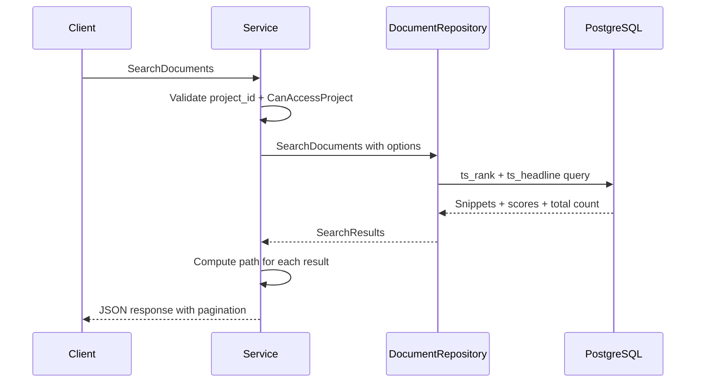

# Search Architecture

PostgreSQL full-text search with content snippets, relevance ranking, and pagination.

## Flow

## Key Design Points

- **Project-scoped**: `project_id` is required. Cross-project search not supported.
- **Field weighting**: Name matches get 2.0x multiplier over content matches.
- **Snippets**: `ts_headline()` returns contextual fragments, not full content.
- **Pagination**: `limit` (default 20, max 100) and `offset` params.
- **Language**: Defaults to `english`. Only `simple` and `english` have GIN indexes; other PostgreSQL FTS languages work but fall back to sequential scans.
- **Query syntax**: Google-like via `websearch_to_tsquery` (AND, OR, NOT, phrases).
- **Extensibility**: `SearchStrategy` enum defines `fulltext`, `vector`, `hybrid` -- only fulltext is implemented.

## Implementation

- Domain models: `internal/domain/models/docsystem/search.go`
- Repository: `internal/repository/postgres/docsystem/document.go` (search methods)
- Service: `internal/service/docsystem/document.go` (authorization + path enrichment)
- FTS indexes: `backend/migrations/00001_initial_schema.sql`
