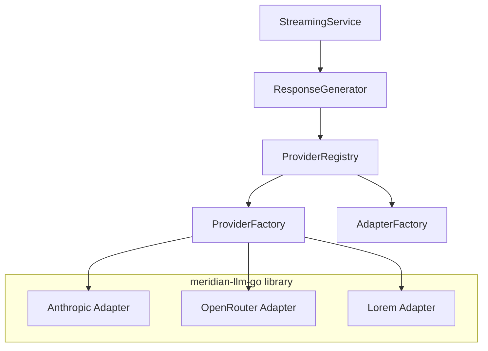
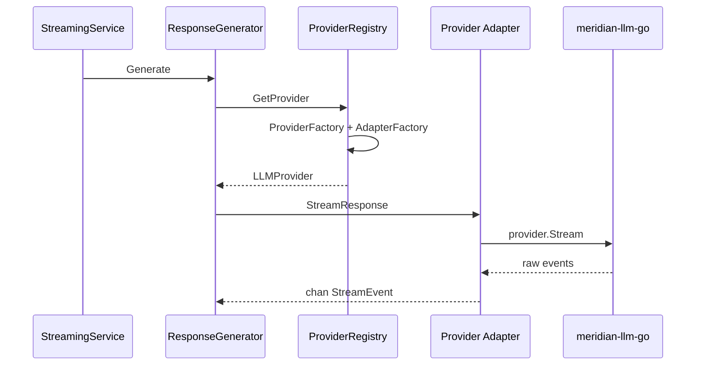

# LLM Provider Architecture

Provider abstraction layer using `meridian-llm-go` library with factory-based routing.

## Architecture

The backend wraps `meridian-llm-go` provider adapters via a `ProviderRegistry` + `ProviderFactory` pattern for dynamic provider selection.

The backend defines its own `LLMProvider` interface (see `internal/domain/services/llm/provider.go`) that wraps the library's type. Provider adapters in `internal/service/llm/` bridge between the two.

Optional capability interfaces (checked via type assertion): `GenerationStatsQuerier` (OpenRouter), `GenerationCanceller` (OpenRouter).

## Wired Providers

| Provider | Env Var | Notes |
|----------|---------|-------|
| `anthropic` | `ANTHROPIC_API_KEY` | Direct API |
| `openrouter` | `OPENROUTER_API_KEY` | Multi-model router |
| `lorem` | (none) | Testing only |

Not yet wired (library code exists): `openai`, `gemini`, `bedrock`.

Default provider/model configured in `internal/config/config.go`. Override per-request via `request_params.provider`.

## Request Flow

## Capability Registry

`internal/capabilities/` provides model metadata (context window, supported features, pricing). Used by `ThreadHistoryService.GetTurnTokenUsage()` to calculate usage percentage and warnings.

## References

- Provider interface: `internal/domain/services/llm/provider.go`
- Provider factory: `internal/service/llm/provider_factory.go`
- Provider registry: `internal/service/llm/registry.go`
- Adapter factory: `internal/service/llm/adapter_factory.go`
- Request params: `internal/domain/models/llm/request_params.go`
- Setup: `internal/service/llm/setup.go`
