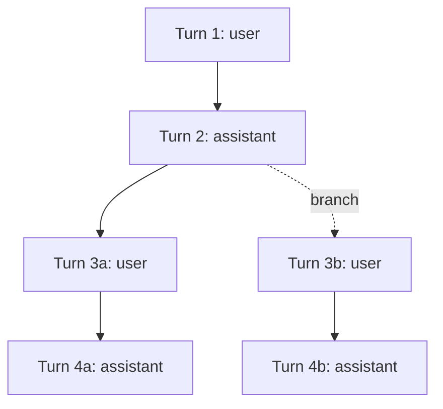
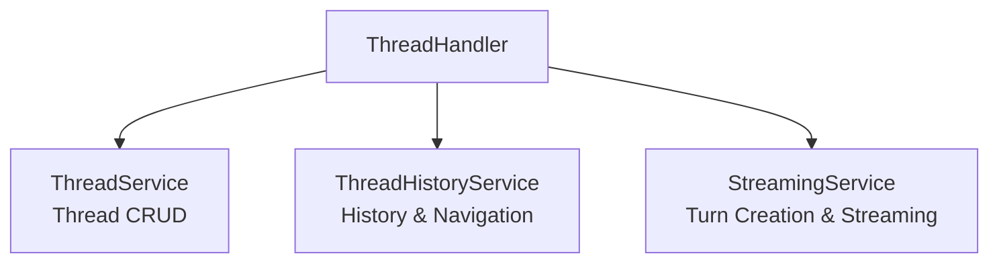
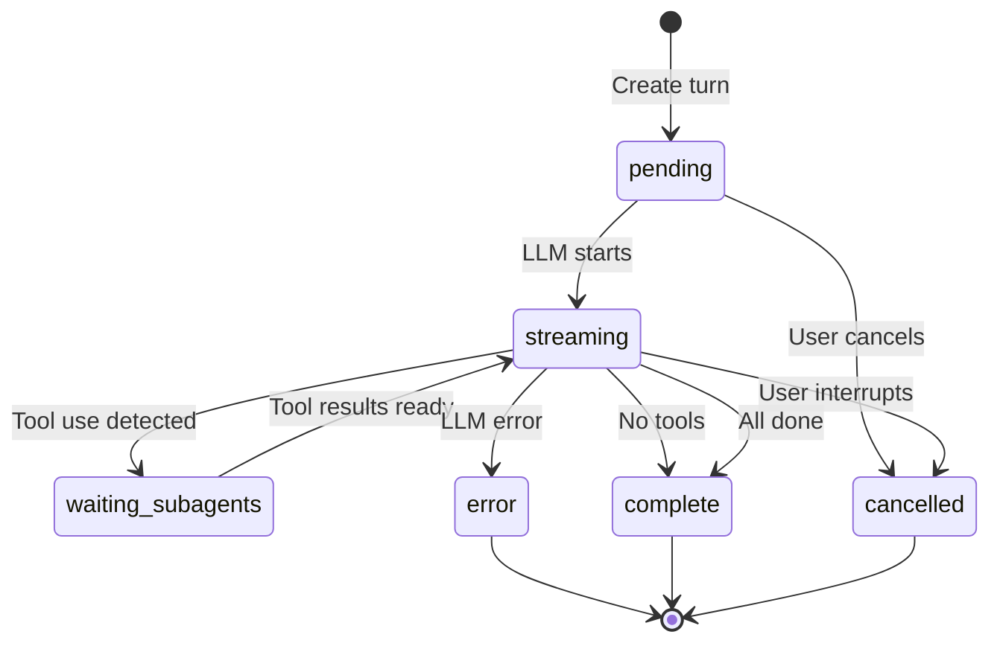
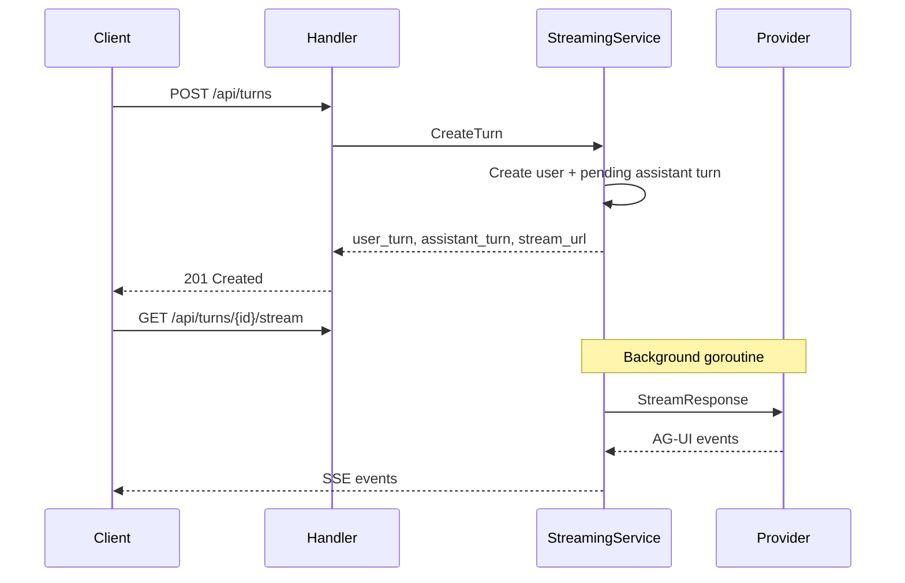

# Thread System Overview

Multi-turn LLM conversations with branching support, streaming responses, and unified JSONB turn blocks.

## Tree Structure

Conversations form a tree via `prev_turn_id` self-referencing, enabling branching:

- Root turns have `prev_turn_id IS NULL`
- Multiple turns referencing the same parent = branching
- Deleting a turn cascades to the entire downstream branch

## Service Architecture

Three focused services (SRP compliance). See [service-layer.md](../architecture/service-layer.md) for rationale.

| Service | Responsibility | Interface |
|---------|---------------|-----------|
| ThreadService | Thread session CRUD | `domain/services/llm/thread.go` |
| ThreadHistoryService | Turn path, siblings, tree, pagination, token usage | `domain/services/llm/thread_history.go` |
| StreamingService | Turn creation, streaming orchestration, interjections | `domain/services/llm/streaming.go` |

## API Routes

Routes are defined in `cmd/server/main.go`. Handler: `internal/handler/thread.go`.

**Thread CRUD:** `POST/GET/PATCH/DELETE /api/threads`, `PATCH .../last-viewed-turn`

**Turn & Pagination:** `POST /api/turns`, `GET /api/threads/{id}/turns`, `GET /api/turns/{id}/path`, `GET /api/turns/{id}/siblings`

**Streaming:** `GET /api/turns/{id}/stream` (SSE), `GET .../blocks`, `GET .../token-usage`, `POST .../interrupt`

**Interjections:** `POST/GET/DELETE /api/turns/{id}/interjection`

**Debug (dev only):** `POST/GET /debug/api/threads/{id}/turns`, `GET .../tree`, `POST .../llm-request`

## Status Lifecycle

## Streaming Flow

`POST /api/turns` triggers async LLM generation. The response includes a `stream_url` for SSE connection.

Key features: AG-UI protocol events, partial block persistence on interruption, soft/hard cancel, reconnection via `GET /api/turns/{id}/blocks`. See `_docs/technical/llm/streaming/README.md`.

## Interjections

Users can submit messages while the assistant is streaming. Content is buffered and injected at the next safe boundary (after tool execution or at stream completion). If the turn is no longer streaming, a new follow-up turn is created instead.

Modes: `append` (add to existing) or `replace` (overwrite existing).

## References

- [Turn Blocks](turn-blocks.md) -- JSONB schemas
- [LLM Providers](llm-providers.md) -- Provider architecture
- [Pagination](pagination.md) -- Pagination implementation
- Domain models: `internal/domain/models/llm/`
- Handler: `internal/handler/thread.go`
