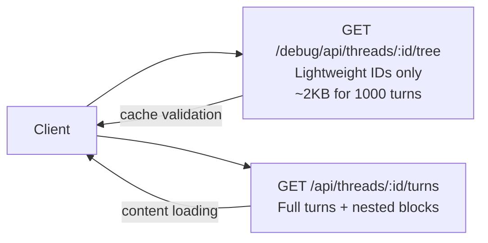
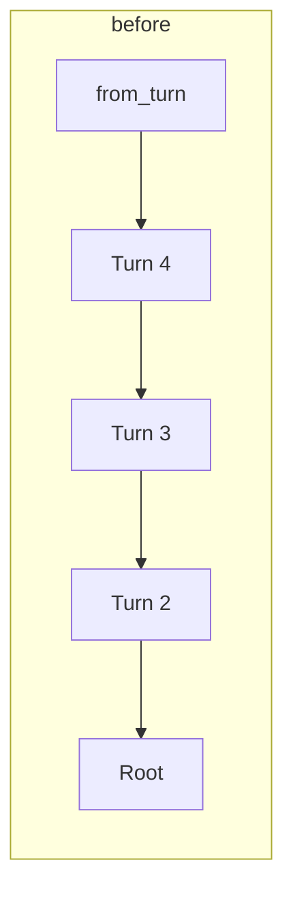
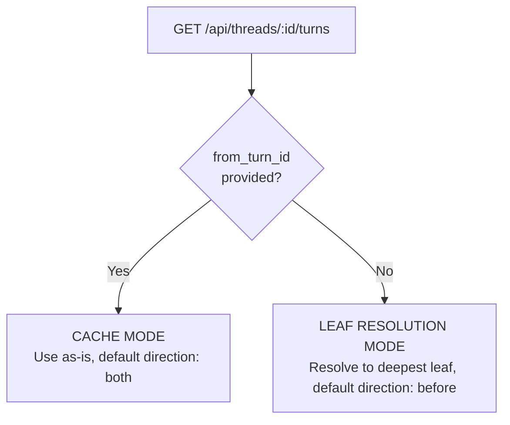

# Thread Pagination

Efficient pagination for large threads (1000+ turns) using a two-endpoint strategy.

## Strategy Overview

## Design Decisions

### Why Path-Based (Not Count-Based) Pagination

Total turn count across all branches is misleading -- a thread with 200 turns might have a 50-turn active path. Path-based pagination follows the `prev_turn_id` chain, matching natural conversation flow. This avoids maintaining a `turn_count` column with triggers.

### Why Tree Endpoint for Cache Validation

Frontend fetches lightweight tree structure (IDs + parent references only), compares with its IndexedDB cache, identifies gaps/new branches, then fetches only missing content. 95% of thread opens only need the tree check if cache is fresh, yielding ~79% bandwidth reduction.

### Why 25%/75% Split for "both" Direction

Users opening a thread typically care more about continuation than history. Scrolling up for more context is easy (infinite scroll). Testing confirmed users prefer seeing more future context.

### Why N+1 Query Elimination

Blocks are batch-loaded in a single query using `ANY(array)` instead of per-turn queries. For 100 turns: 2 queries instead of 101, ~50x query reduction.

## Pagination Endpoint

**Endpoint:** `GET /api/threads/{id}/turns`

| Parameter | Default | Description |
|-----------|---------|-------------|
| `from_turn_id` | `last_viewed_turn_id` | Starting point |
| `limit` | 100 (handler), 50 (repo fallback) | Max turns (hard max: 200) |
| `direction` | auto | `before`, `after`, or `both` |
| `update_last_viewed` | false | Persist scroll position |

**Constants** (defined in `internal/repository/postgres/llm/turn.go`):

| Constant | Value | Purpose |
|----------|-------|---------|
| `PaginationBeforeRatio` | 0.25 | History portion in "both" mode |
| `PaginationAfterRatio` | 0.75 | Future portion in "both" mode |
| `MaxPaginationLimit` | 200 | Hard upper bound |
| `DefaultPaginationLimit` | 50 | Repo fallback when limit=0 |

## Direction Modes

- **before**: Follow `prev_turn_id` chain backwards. Use case: infinite scroll up.
- **after**: Find children, pick most recent branch, repeat forward. Use case: following conversation forward.
- **both**: Split limit 25%/75%, fetch backwards then forwards. Use case: initial load around `last_viewed_turn_id`.

## last_viewed_turn_id: Two Modes

**Cache mode** (active session): Client provides explicit position; no leaf resolution.

**Leaf resolution** (cold start): Server resolves `last_viewed_turn_id` to the deepest descendant on the most recent branch, ensuring users see the end of the active conversation.

The `update_last_viewed` parameter controls whether the server persists the position. A dedicated `PATCH /api/threads/{id}/last-viewed-turn` endpoint also exists.

## References

- Repository: `internal/repository/postgres/llm/turn.go`
- Service: `internal/service/llm/thread_history/service.go`
- Handler: `internal/handler/thread.go`
- Frontend guide: `_docs/technical/frontend/thread-pagination-guide.md`
