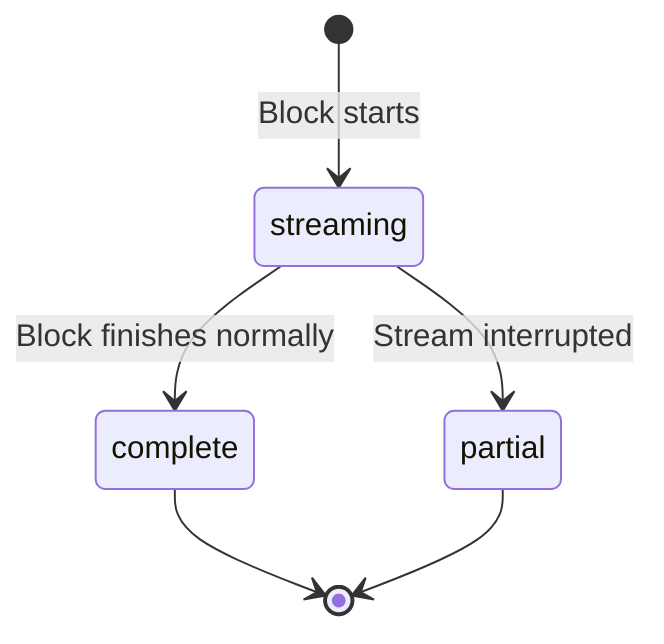

# Turn Block Schemas

JSONB schema reference for content block types. For full streaming behavior, see `_docs/technical/llm/streaming/block-types-reference.md`.

## Storage Design

Content blocks split storage across two fields to avoid JSONB parsing for common text queries:

| Field | Type | Usage |
|-------|------|-------|
| `text_content` | TEXT | Plain text (text, thinking, tool_result) |
| `content` | JSONB | Type-specific structured data |

See `internal/domain/models/llm/turn_block.go` for the full model.

## Block Type Matrix

| Block Type | User | Assistant | text_content | content |
|------------|------|-----------|--------------|---------|
| text | Y | Y | Message text | null |
| thinking | - | Y | Reasoning | signature in provider_data |
| tool_use | - | Y | null | tool_use_id, tool_name, input |
| tool_result | Y | - | Result text | tool_use_id, is_error |
| image | Y | - | null | url, mime_type |
| reference | Y | - | null | ref_id, ref_type |
| partial_reference | Y | - | null | ref_id + selection offsets |
| web_search_use | - | Y | null | Provider-side search invocation |
| web_search_result | - | Y | null | Provider-side search results |

## Partial Blocks (Streaming Interruption)

When a stream is interrupted, in-progress blocks are persisted as **partial blocks** -- a non-obvious pattern worth understanding.

Key rules:
- Only `text` and `thinking` blocks are persisted as partial (human-readable content worth saving)
- `tool_use` blocks with incomplete JSON are discarded (unparseable)
- Partial blocks have `status = "partial"` and use `UpsertPartialBlock()` for idempotent persistence

## Execution Side

The `execution_side` field on `tool_use` blocks indicates where the tool runs:

| Value | Meaning | Example |
|-------|---------|---------|
| `"provider"` | LLM provider | Anthropic's built-in web_search |
| `"local"` or nil | Backend | str_replace_based_edit_tool, doc_search |
| `"client"` | Frontend | (future) |

## Streaming Deltas

Turn blocks are built from `TurnBlockDelta` events. Deltas are **not persisted** -- they accumulate in memory until a complete block is emitted. See `internal/domain/models/llm/turn_block_delta.go`.

## References

- Domain model: `internal/domain/models/llm/turn_block.go`
- Delta model: `internal/domain/models/llm/turn_block_delta.go`
- Block processor: `internal/service/llm/streaming/block_processor.go`
- Database schema: see `backend/schema.sql` for CHECK constraints and indexes
