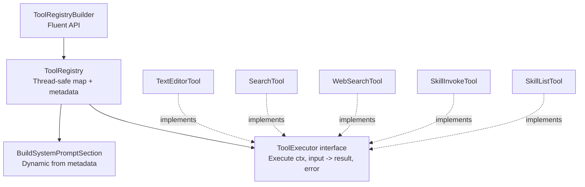

# Tool System Architecture

## Overview

## Tool Types

| Tool | Name | Execution | Purpose |
|------|------|-----------|---------|
| Text Editor | `str_replace_based_edit_tool` | Server | View/edit documents, matching Anthropic's text_editor API |
| Doc Search | `doc_search` | Server | Full-text search across project documents |
| Web Search | `web_search` | Server | External search via Tavily API |
| Skill Invoke | `skill_invoke` | Server | Execute reusable prompt templates |
| Skill List | `skill_list` | Server | List available project skills |

## Registry Pattern (OCP)

Tools self-describe via `ToolMetadata`. The registry generates system prompt sections dynamically -- adding a new tool requires no modification to existing code. Just implement `ToolExecutor`, create metadata, and add a `With*()` method to the builder.

The builder supports selective registration for frontend-controlled tool policy. See `internal/service/llm/streaming/tool_policy.go` for server-side tool resolution.

## Document Mutation Strategy

**Why this exists:** AI edits need to go through the collaboration proposal review flow rather than writing directly to the database.

The `DocumentMutationStrategy` interface separates persistence strategy from tool logic. The default `CollabProposalStrategy` creates collaboration proposals with Yjs updates and WebSocket broadcasting.

`AIContentReader` provides projected content (base + pending proposals) so sequential tool calls within a single turn see prior edits rather than stale content. Without this, a multi-tool turn where the second edit depends on the first would operate on outdated text.

## Tool Definition Auto-Mapping

The backend converts tool definitions to provider-specific formats via `ToolDefinition.ToLibraryTool()`:

| Input | Resolution |
|-------|-----------|
| `Function` field present | Custom tool (OpenAI format, pass through) |
| Name is a web search variant | Resolve full schema |
| Name is a known built-in | Auto-map via library `MapToolByName()` |

Server-side tool policy resolves available tools per-request based on project preferences and API key presence. See `internal/service/llm/streaming/tool_policy.go`.

## External APIs

Web search uses the `SearchClient` interface. Only Tavily is currently wired.

| Config | Value |
|--------|-------|
| `SEARCH_API_KEY` | Tavily API key |
| `SEARCH_API_PROVIDER` | `tavily` |

See `internal/service/llm/tools/external/tavily_client.go`.

## SOLID Compliance

- **SRP**: One file per tool, PathResolver extracts shared logic
- **OCP**: Builder + ToolMetadata for extension without modification
- **LSP**: All tools substitutable via ToolExecutor
- **ISP**: Minimal ToolExecutor interface (1 method), DocumentMutationStrategy separates persistence
- **DIP**: Tools depend on service interfaces, SearchClient abstracts external APIs

## References

- Registry: `internal/service/llm/tools/registry.go`
- Builder: `internal/service/llm/tools/builder.go`
- Tool definitions: `internal/domain/models/llm/tool_definition.go`
- Mutation strategy: `internal/service/llm/tools/mutation_strategy.go`
