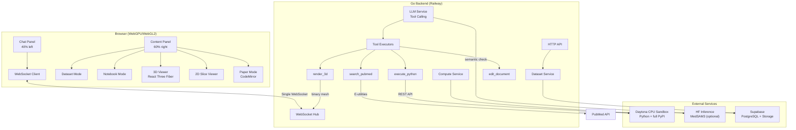
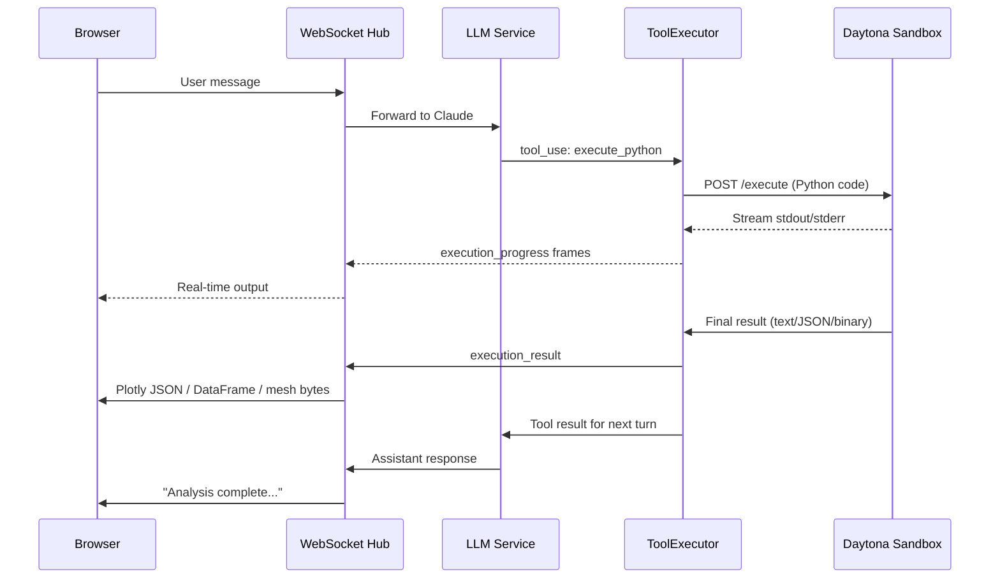
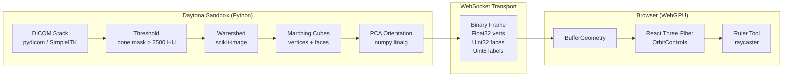
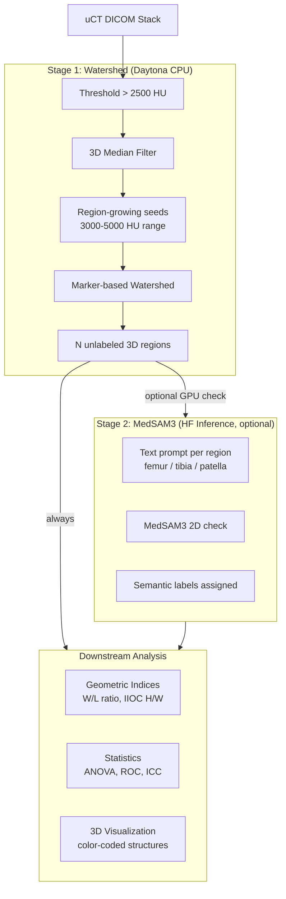
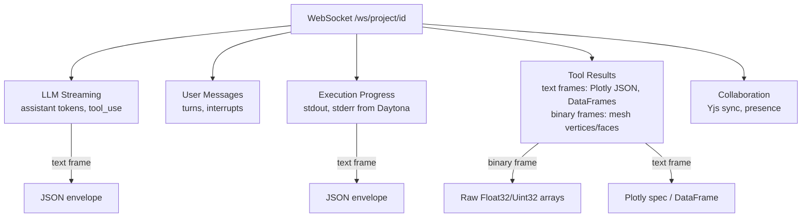
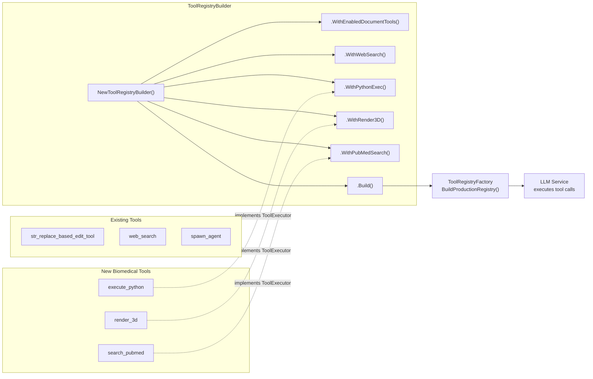
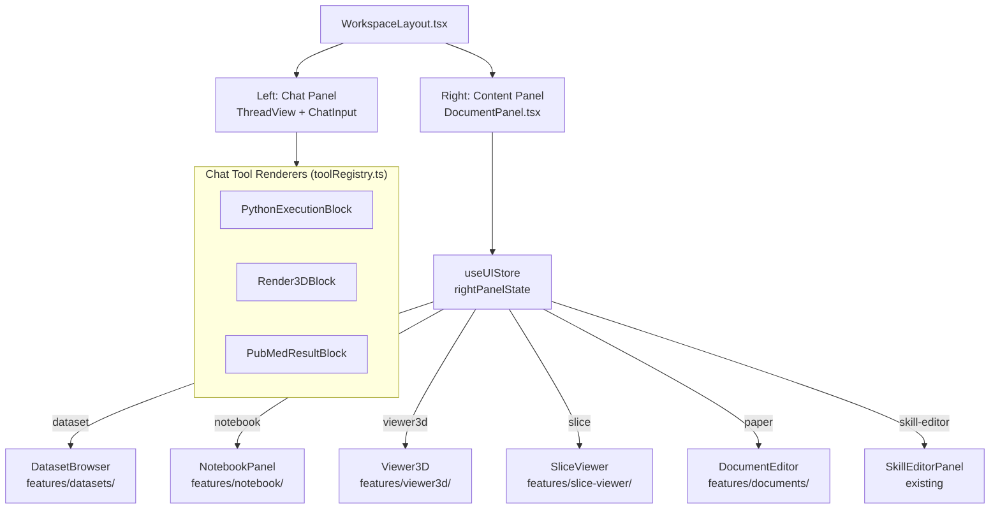
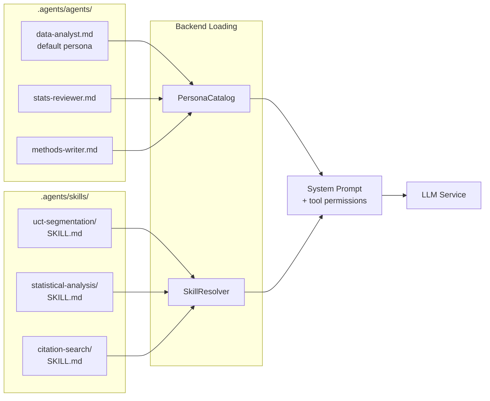
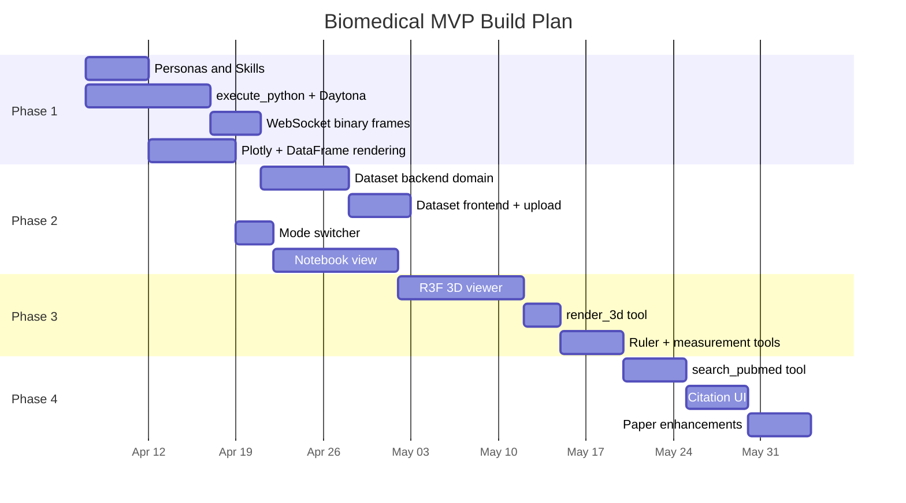

# Biomedical Platform Architecture

Architecture diagrams for the Meridian biomedical data platform pivot. See `_docs/plans/biomedical-mvp-spec.md` for full spec and `_docs/plans/biomedical-platform-pivot.md` for design rationale.

## System Overview

## Python Execution Flow

How `execute_python` tool calls flow from LLM through Daytona back to the browser.

## 3D Mesh Data Pipeline

From DICOM in Daytona to interactive 3D model in the browser.

## Two-Stage Segmentation

Threshold + watershed for WHERE boundaries are, optional MedSAM3 for WHAT each region is.

## WebSocket Protocol

Single connection per project session multiplexes all communication.

## Tool Registry Integration

How new biomedical tools plug into the existing Meridian tool system.

## Frontend Panel Architecture

How content panel modes integrate with the existing workspace layout.

## Persona and Skill System

Biomedical personas replace fiction personas using the same `.agents/` file system.

## Implementation Phases

