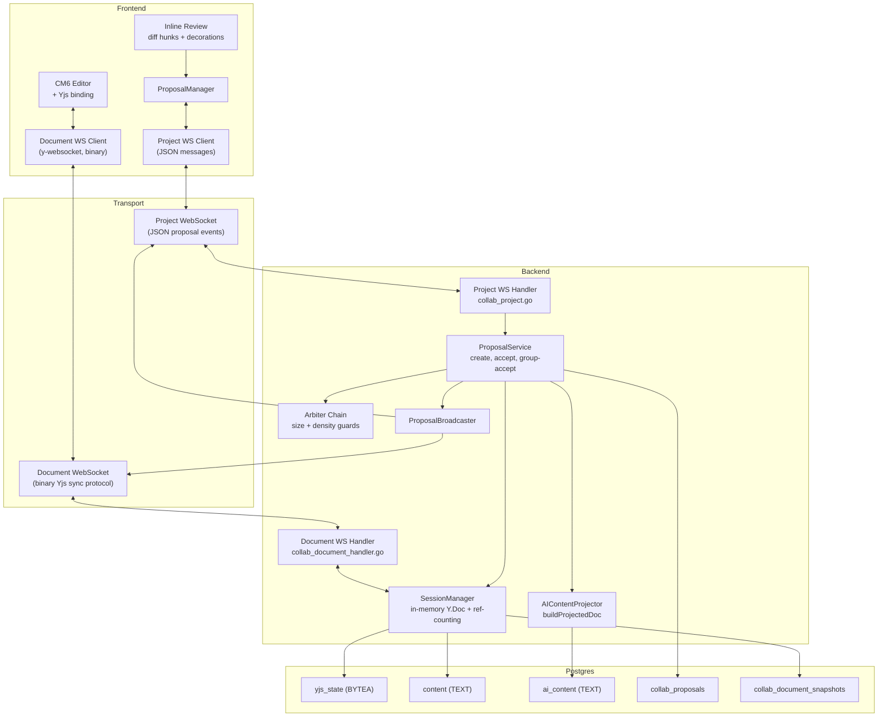

# Collab System: Technical Documentation

Meridian uses a Yjs-based CRDT collaboration layer for real-time document editing. Human keystrokes and AI-generated edits both flow through the same Yjs document, with AI edits wrapped in a proposal system that supports auto-accept or hunk-by-hunk writer review. Two WebSocket connections separate binary CRDT sync from JSON-based proposal events.

## Architecture Overview

## Document Index

| Document | Purpose | Key Topics |
|----------|---------|------------|
| [ai-edit-flow.md](ai-edit-flow.md) | End-to-end AI edit pipeline | LLM tool call, Yjs update generation, auto-accept cascade, arbiter chain, hunk-by-hunk review, GroupAccept |
| [yjs-state-lifecycle.md](yjs-state-lifecycle.md) | Backend Yjs state management | In-memory sessions, ref-counting, singleflight, persistence (debounce 2s, snapshot every 500 updates), offline apply, bootstrap from markdown |
| [ai-content-projection.md](ai-content-projection.md) | How the AI sees pending edits | Three DB columns, buildProjectedDoc, Recompute triggers, consecutive tool call visibility, REST bootstrap |
| [inline-review.md](inline-review.md) | Frontend inline review derivation | Yjs delta to positioned ops to merged ops to grouped hunks to CM6 decorations, partial apply (buildPartialUpdate), useInlineReview |
| [ideal-state.md](ideal-state.md) | Target architecture for realtime writing collaboration | Presence, AI suggestion mode, transport unification, version history, permissions, observability |
| [human-editing-flow.md](human-editing-flow.md) | Human editing path | Keystroke to CM6 to Yjs to WS to backend to broadcast, awareness protocol, offline durability |
| [websocket-transport.md](websocket-transport.md) | WebSocket transport details | Two connections (document binary, project JSON), auth, rate limiting, framing, reconnection |

## Reading Order

**How does real-time editing work?**
[human-editing-flow.md](human-editing-flow.md) -> [websocket-transport.md](websocket-transport.md) -> [yjs-state-lifecycle.md](yjs-state-lifecycle.md)

**How do AI edits work?**
[ai-edit-flow.md](ai-edit-flow.md) -> [ai-content-projection.md](ai-content-projection.md) -> [inline-review.md](inline-review.md)

**How does the review UI work?**
[inline-review.md](inline-review.md) -> [ai-edit-flow.md](ai-edit-flow.md) (review path section)

## Related

- [fb-collab-ai-bridge](../../features/fb-collab-ai-bridge/) -- Feature status for the AI collaboration bridge
- [b-collab-arbitration](../../features/b-collab-arbitration/) -- Arbiter chain and proposal guardrails
- [sync-system](../frontend/architecture/sync-system.md) -- Frontend transport layer (WS, HTTP, offline)
