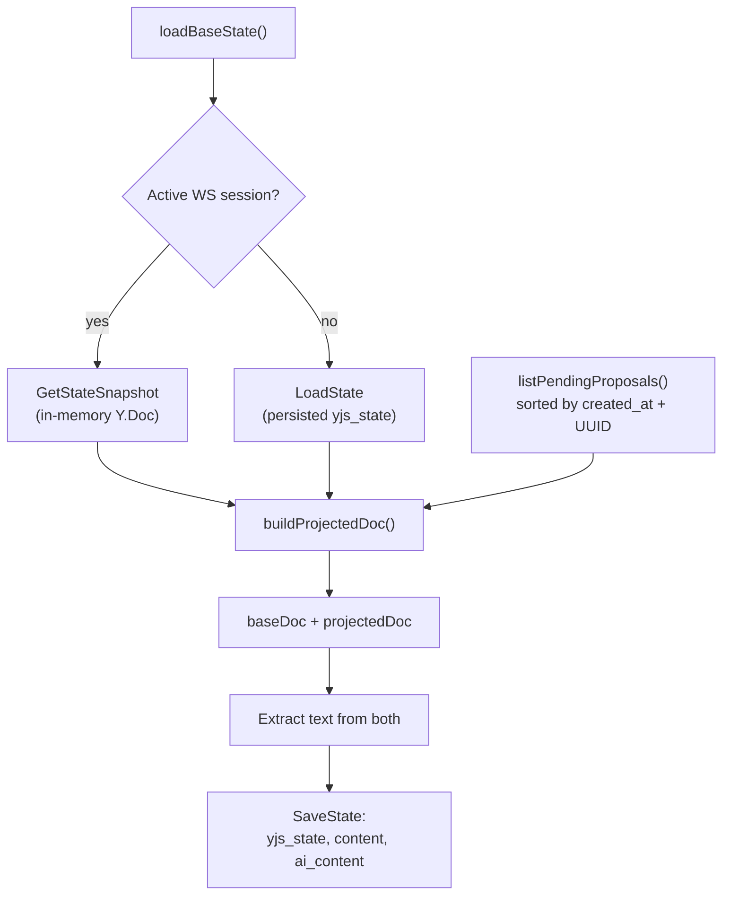
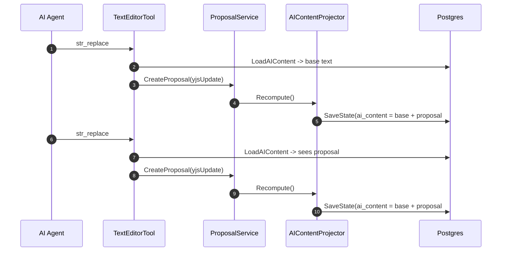
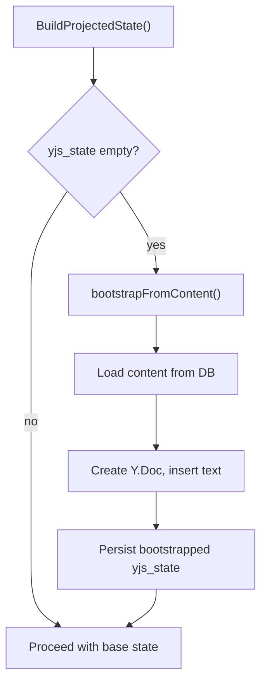

# AI Content Projection

How the `ai_content` field works: the projected text view that lets the AI see its own pending edits.

## The Problem

When the AI makes multiple edits in a single turn, each `str_replace` call needs to see the effect of prior edits. But those edits are proposals -- they haven't been accepted by the writer yet. The AI can't read the base document because it wouldn't contain its own changes.

## The Solution: ai_content

Three columns on the `documents` table:

| Column | What it contains | Who reads it |
|--------|-----------------|--------------|
| `yjs_state` | Yjs binary of the base document (accepted state only) | Collab runtime, session bootstrap |
| `content` | Plaintext extracted from `yjs_state` | Human-facing views, search, word count |
| `ai_content` | Plaintext of base + all pending proposals applied | AI tool calls (view, str_replace, insert) |

When no pending proposals exist, `content == ai_content`.

---

## How It's Built



### buildProjectedDoc

1. Create `baseDoc` from base state bytes
2. Clone into `projectedDoc` (encode base, apply to fresh doc)
3. Apply each pending proposal's `YjsUpdate` to `projectedDoc` in sorted order
4. Return both docs

See `service/collab/ai_content_projector.go:187-213`.

### Proposal Sort Order

Deterministic ordering is critical -- different sort orders produce different projected text:

- Primary: `created_at` ascending
- Tiebreaker: UUID string lexicographic order
- Loaded in pages of 200, sorted in-memory after collection

See `service/collab/ai_content_projector.go:215-240`.

---

## How the AI Reads It

The `TextEditorTool` swaps `doc.Content` for `ai_content` before processing:

```
base := doc.Content
if aiContentReader != nil {
    if aiContent, err := aiContentReader.LoadAIContent(ctx, doc.ID); err == nil {
        base = aiContent
    }
}
```

This happens in `view`, `str_replace`, and `insert` commands. The AI sees the projected state transparently.

`LoadAIContent` uses `COALESCE(ai_content, content, '')` for backward compatibility with documents that pre-date the column.

See `service/llm/tools/text_editor.go:139-143` (view), `:296-303` (str_replace), `:388-395` (insert).

---

## Consecutive Tool Calls in One Turn



Each `CreateProposal` triggers `Recompute`, which updates `ai_content` in the DB. The next tool call's `LoadAIContent` reads the updated value. This chain ensures cumulative visibility within a single turn.

---

## Recompute Triggers

Every proposal state transition triggers `Recompute`:

| Event | Where | Why |
|-------|-------|-----|
| CreateProposal (review path) | `createAndRecompute()` | New pending proposal added to projection |
| CreateProposal (auto-accept) | Called twice: create + after accept | First adds pending, second removes it (folded into base) |
| AcceptProposal | After `MarkAccepted` | Proposal moves from pending to accepted |
| RejectProposal | After `MarkRejected` | Proposal removed from pending set |
| GroupAccept | After all proposals marked | Single recompute for the batch |

All calls happen inside the same DB transaction as the state change.

See `service/collab/proposal_service.go:138` (create), `:175` (auto-accept), `:244` (accept), `:323` (reject), `:470` (group).

---

## Bootstrap: REST-Created Documents

Documents created via REST API have `content` text but no `yjs_state`. On first `BuildProjectedState`:



This establishes CRDT ancestry so subsequent Yjs updates compose correctly. Without it, updates would become no-ops against an empty base.

See `service/collab/ai_content_projector.go:108-154`.

---

## BuildProjectedState vs Recompute

| Method | Returns | Persists | Used by |
|--------|---------|----------|---------|
| `BuildProjectedState` | Yjs bytes (projected) | Only if bootstrap needed | `CollabProposalStrategy` (for `TextToUpdate`) |
| `Recompute` | Nothing (side effect) | Always (yjs_state + content + ai_content) | `ProposalService` (after every state change) |

Both call `buildProjectedDoc` internally. `BuildProjectedState` is a read-mostly operation; `Recompute` is the write path.

---

## Related

- [ai-edit-flow](ai-edit-flow.md) -- End-to-end flow including projection
- [yjs-state-lifecycle](yjs-state-lifecycle.md) -- Session manager and persistence
- [fb-collab-ai-bridge](../../features/fb-collab-ai-bridge/) -- Feature overview
