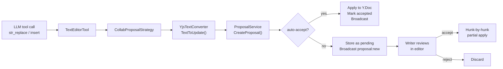
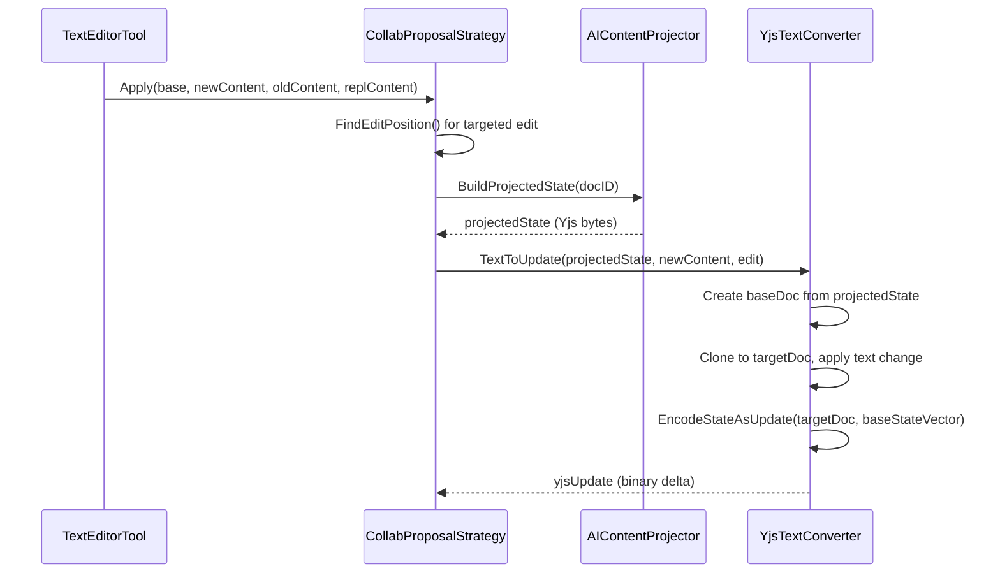
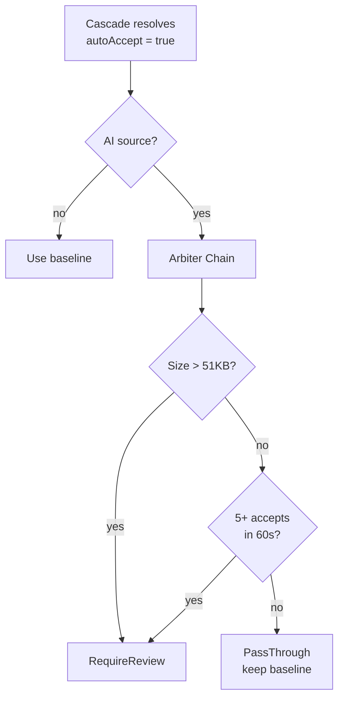
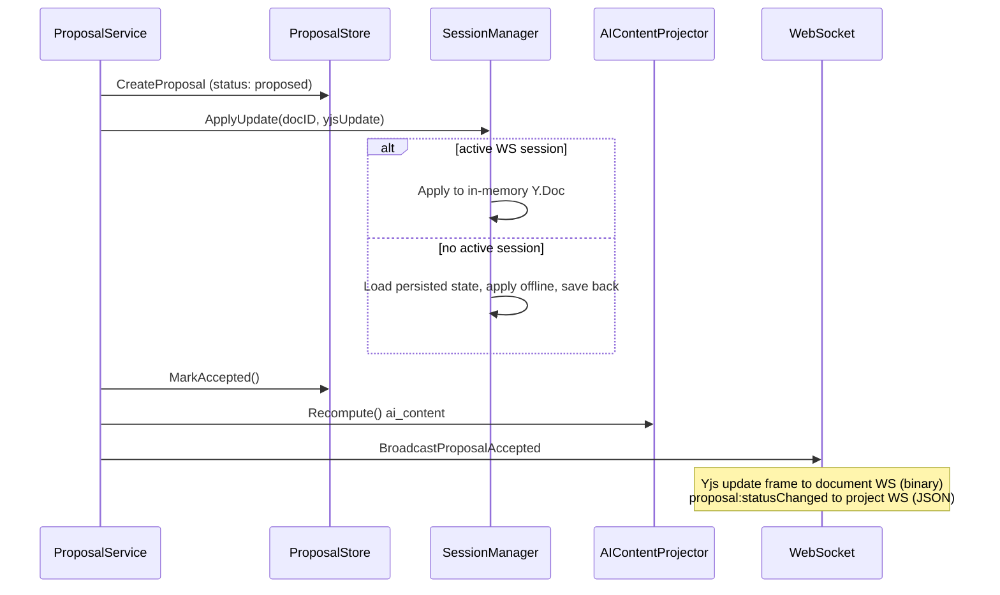
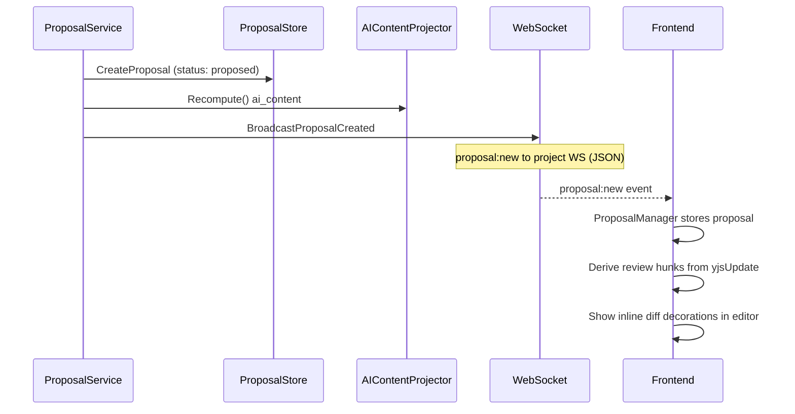
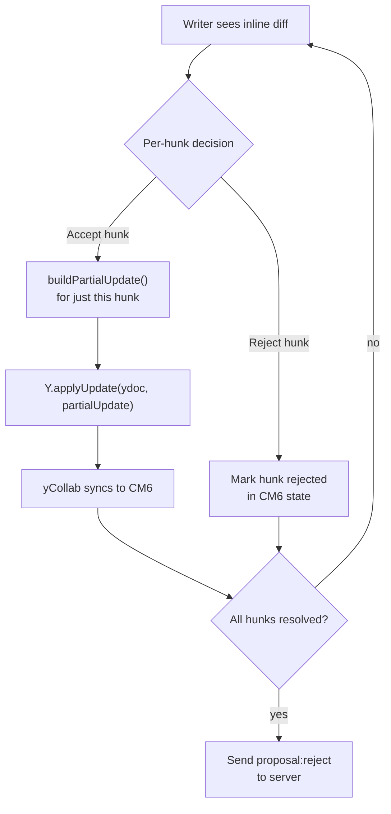
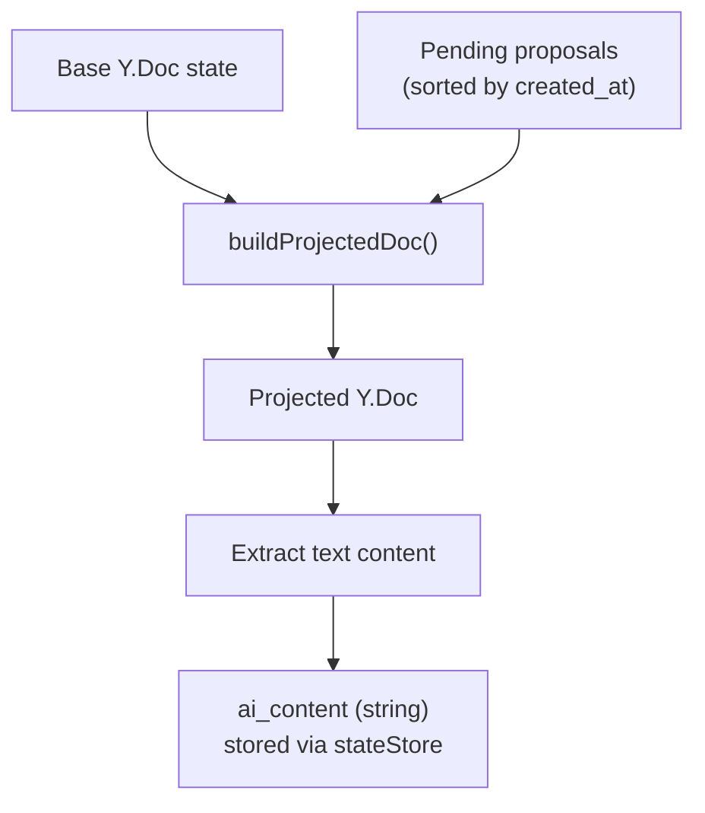
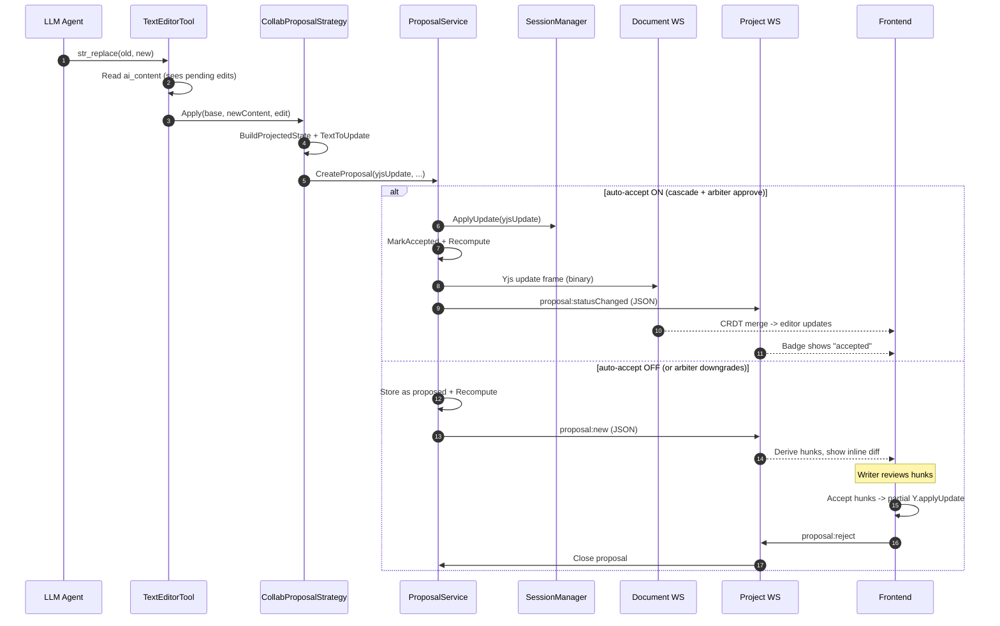

# AI Edit Flow: End-to-End

How an AI-generated text edit travels from LLM tool call to the writer's editor.

## Overview



---

## Phase 1: LLM Generates an Edit

The AI agent uses `str_replace_based_edit_tool` (or `insert`/`create`) during a turn. The tool reads `ai_content` -- the document projected with all pending proposals -- so consecutive edits in the same turn see each other's changes.

See `service/llm/tools/text_editor.go:299-303` (ai_content read) and `service/llm/tools/mutation_strategy.go` (strategy interface).

---

## Phase 2: Yjs Update Generation

`CollabProposalStrategy.Apply()` converts the text edit into a binary Yjs CRDT update:



**Targeted vs full-doc**: When `oldContent` is provided (str_replace), `FindEditPosition()` locates the exact text position. This produces a minimal Yjs update. Falls back to full-doc replacement if position lookup fails.

**Projected state**: `BuildProjectedState()` returns Yjs bytes = base document + all pending proposals applied on top. This ensures the Yjs update is relative to the same content the AI saw via `ai_content`.

See `service/llm/tools/mutation_strategy_collab.go:51-172`, `service/collab/yjs_text_converter.go:36-112`, `service/collab/ai_content_projector.go:100-157`.

---

## Phase 3: Proposal Creation + Auto-Accept Resolution

`ProposalService.CreateProposal()` persists the proposal and decides whether to auto-accept or require review.

### Auto-Accept Cascade

Resolution order (first non-nil wins):

```
agent override  -->  project policy  -->  user policy  -->  system default
```

| Level | Source | Storage | Who sets it |
|-------|--------|---------|-------------|
| Agent override | `req.AgentAutoAccept` | Passed per-request | Backend agent config |
| Project policy | `projects.auto_accept_proposals` | Database (nullable bool) | Writer in Project Settings |
| User policy | `user_preferences.collab.auto_accept_proposals` | JSONB in user_preferences table | Writer in User Settings |
| System default | `MERIDIAN_COLLAB_DEFAULT_AUTO_ACCEPT` | Environment variable | Deployment config (default: `true`) |

All levels use tri-state logic: `true` = explicitly on, `false` = explicitly off, `nil` = no opinion (skip to next level).

**Optimization**: If agent override is set, the database query for project/user policies is skipped entirely.

See `service/collab/proposal_service_helpers.go:121-134` (resolveAutoAccept), `repository/postgres/collab/auto_accept_store.go:30-65` (GetPolicyInputs).

### Arbiter Downgrade (AI proposals only)

After cascade resolution, if baseline is `true` and source is AI, the arbiter chain can **downgrade** to `require_review`. It cannot upgrade `false` to `true`.



| Strategy | Threshold | Trigger |
|----------|-----------|---------|
| Size | 51,200 bytes | Single large Yjs update |
| Recent change density | 5 accepted proposals in 60s | Rapid-fire AI edits |

Arbiter errors are **non-fatal** -- on panic or error, degrades to `RequireReview` (writer safety).

See `service/collab/agent_arbiter.go`, `arbiter_strategy_size.go`, `arbiter_strategy_density.go`.

---

## Phase 4A: Auto-Accept Path (auto-accept = true)



The proposal is created, applied to the live Y.Doc, marked accepted, and broadcast -- all in one transaction. The frontend receives it as a Yjs sync update (editor updates automatically via CRDT merge) plus a status event (badge shows "accepted").

See `service/collab/proposal_service.go:154-182`, `service/collab/session_manager.go:189-254`.

---

## Phase 4B: Review Path (auto-accept = false)



The proposal is stored as pending. The Yjs update is NOT applied to the live document -- it stays in the proposal record. The frontend receives the proposal metadata via the project WebSocket and derives inline diff hunks from the yjsUpdate bytes.

See `service/collab/proposal_service.go:116-151`.

### Writer Accept/Reject (Frontend)

The writer reviews proposals hunk-by-hunk in the editor:



**Key design**: The frontend always sends `proposal:reject` to the server, even after accepting hunks. This is because hunk accepts are applied as **partial Yjs updates** directly to the local Y.Doc. The Yjs CRDT sync protocol automatically propagates these changes to the server. Sending a full `proposal:accept` would duplicate the already-applied changes.

See `features/documents/hooks/useInlineReview.ts:288-341` (hunk accept/reject), `core/cm6-collab/review/partial-apply.ts` (partial update builder).

### Server-Side Accept (Single + Group)

For server-initiated accepts (API or auto-accept), the server applies the full proposal yjsUpdate:

| Operation | What happens | Key difference |
|-----------|-------------|----------------|
| Single accept | `ApplyUpdate(yjsUpdate)` + `MarkAccepted()` + `Recompute()` | One proposal at a time |
| GroupAccept | Compose all updates into single composite via temp Y.Doc, apply once | Prevents sequential-apply bugs (IL-22) |

GroupAccept composes updates to avoid applying Yjs updates built against progressively-stale state:

```
tempDoc = new Y.Doc(baseState)
baseVector = EncodeStateVector(tempDoc)
for each proposal: safeApplyUpdate(tempDoc, proposal.yjsUpdate)
composite = EncodeStateAsUpdate(tempDoc, baseVector)
runtime.ApplyUpdate(composite)  // single apply
```

Both operations are idempotent via `IdempotencyStore` (request hash + 24h TTL).

See `service/collab/proposal_service.go:196-291` (single), `346-512` (group), `524-564` (composeProposalUpdates).

---

## AI Content Projection

The `ai_content` field is a text projection of the document with all pending proposals applied. It exists so the AI "sees" its own pending edits when making consecutive changes in a single turn.



**Recompute triggers**: After every `CreateProposal()` and every `Accept/GroupAccept`. This keeps `ai_content` current with the latest pending + accepted state.

**Bootstrap**: Documents created via REST API (no Yjs state) are bootstrapped from markdown content on first projection. See `ai_content_projector.go:109-154`.

See `service/collab/ai_content_projector.go:58-94` (Recompute), `:100-157` (BuildProjectedState), `:187-213` (buildProjectedDoc).

---

## Complete Flow Diagram



---

## Related

- [fb-collab-ai-bridge](../../features/fb-collab-ai-bridge/) -- Feature status and high-level architecture
- [b-collab-arbitration](../../features/b-collab-arbitration/) -- Arbiter chain, guardrails, serialization gates
- [sync-system](../frontend/architecture/sync-system.md) -- Frontend transport layer (WS, HTTP, offline)
- [ws-transport-v2 plan](../../plans/ws-transport-v2/spec/architecture.md) -- WebSocket transport design
