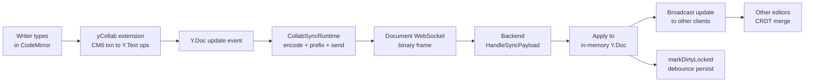
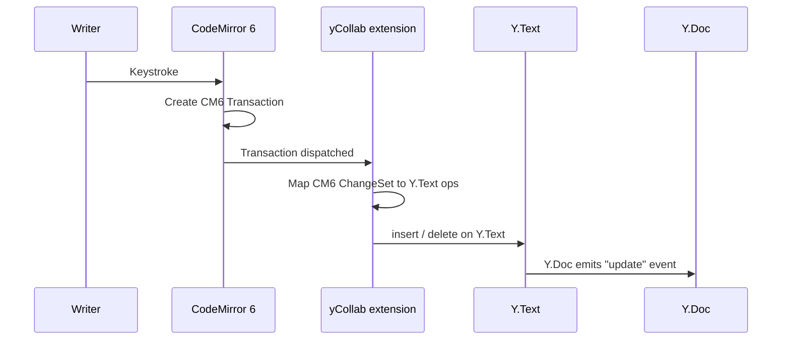
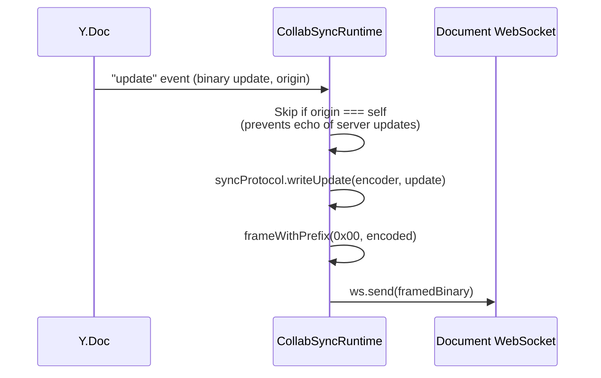
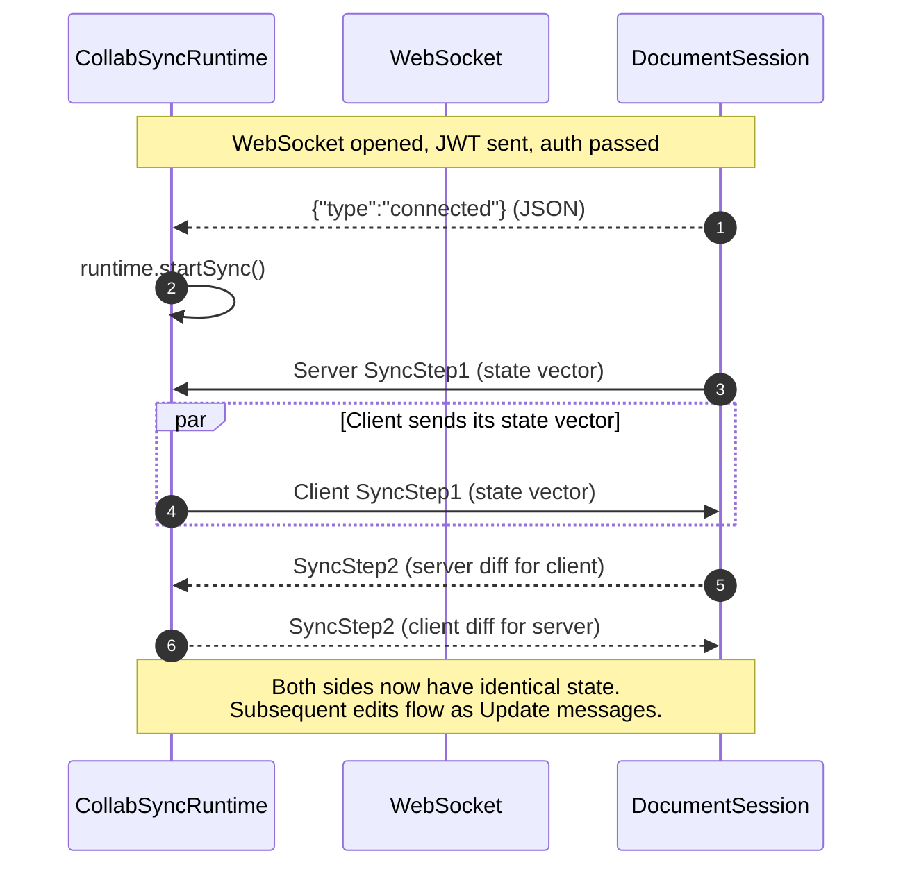
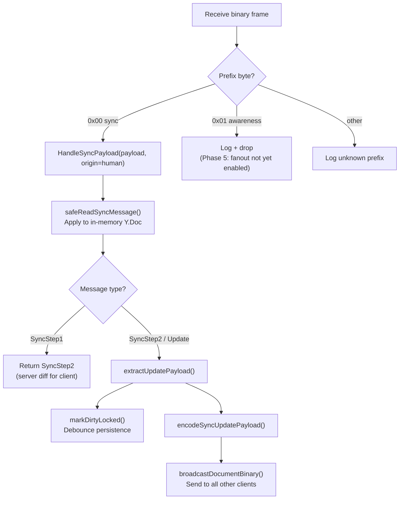
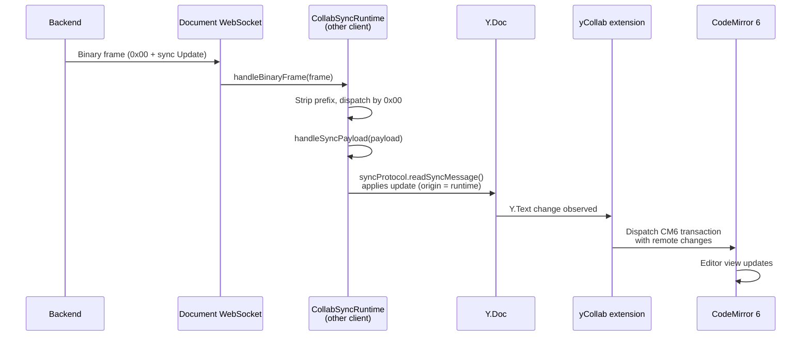
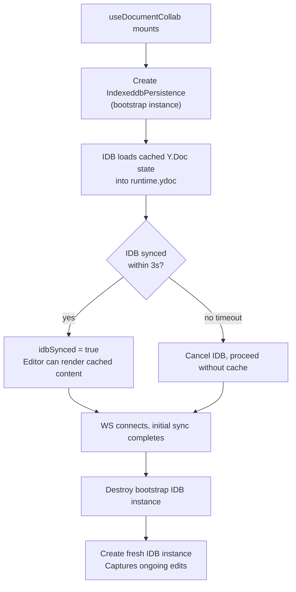
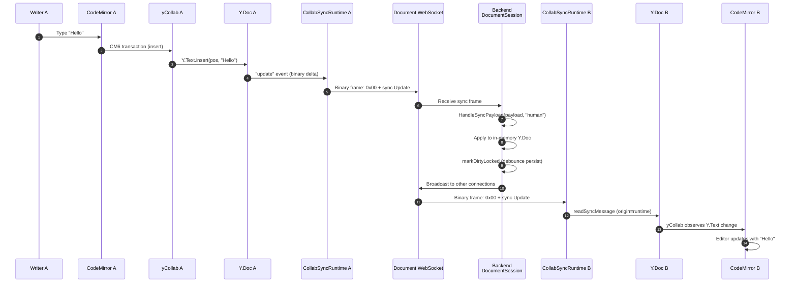

# Human Editing Flow

How a writer's keystroke in CodeMirror propagates through the collab system to the backend and other connected clients.

## Overview

---

## Stage 1: CodeMirror to Yjs

The `y-codemirror.next` library's `yCollab` extension bridges CM6 and Yjs. It is instantiated once per document session and registered as a CM6 extension.

**How it works**: `yCollab` observes CM6 transactions. When the writer edits text, the extension converts the CM6 `ChangeSet` (character-level insertions/deletions with positions) into equivalent `Y.Text` operations. These operations are applied inside a Yjs transaction, which produces a binary Yjs update containing the CRDT delta.

**Undo manager**: A `Y.UndoManager` is bound to the `Y.Text` so Ctrl+Z/Cmd+Z operates on Yjs-level undo stacks rather than CM6's built-in undo. This ensures undo works correctly with CRDT merge semantics.

See `core/cm6-collab/sync/runtime.ts:94-103` (yCollab setup, awareness binding, undo manager).

---

## Stage 2: Yjs Update to WebSocket

When the Y.Doc emits an `"update"` event, `CollabSyncRuntime` encodes and sends it over the document WebSocket.

### Binary Frame Format

Every binary frame on the document WebSocket uses a 1-byte prefix:

| Prefix | Meaning | Payload |
|--------|---------|---------|
| `0x00` | Sync protocol | Yjs sync message (SyncStep1, SyncStep2, or Update) |
| `0x01` | Awareness | Awareness state update (cursor positions, presence) |

The sync payload itself follows the standard `y-protocols/sync` wire format: a varint message type followed by the update bytes.

**Origin filtering**: The `onDocUpdate` handler skips updates where `origin === this` (the runtime instance). This prevents echoing server-originated updates back to the server. When `yCollab` applies a local edit, the origin is the yCollab plugin (not the runtime), so local edits pass through.

See `core/cm6-collab/sync/runtime.ts:105-118` (update handler), `:240-245` (frame prefix helper).

### Transport: DocumentSessionManager

`DocumentSessionManager` owns the WebSocket lifecycle. The runtime's `sendBinary` callback routes through the manager, which checks socket readiness before sending.

| Concern | Implementation |
|---------|---------------|
| Connection | `new WebSocket(wss://...host/ws/documents/{docId})` |
| Auth | First message after `onopen` is the Supabase JWT (text) |
| Ready signal | Server sends `{"type":"connected"}` JSON after auth succeeds |
| Reconnect | Exponential backoff: `min(5s, 250ms * 2^attempt)` with 15% jitter |
| Binary mode | `ws.binaryType = "arraybuffer"` |

See `core/cm6-collab/sync/DocumentSessionManager.ts:84-103` (acquire + WS creation), `:196-267` (socket attachment), `:305-331` (reconnect logic).

---

## Stage 3: Initial Sync Handshake

Before edits flow, the client and server perform the Yjs sync protocol handshake to reconcile state.

**Server-initiated SyncStep1**: Immediately after sending the `connected` JSON event, the server builds and sends its own SyncStep1 (state vector) to the client. The client's `handleSyncPayload` processes this and responds with a SyncStep2 containing any state the server is missing.

**Client-initiated SyncStep1**: When the runtime receives the `connected` event, `startSync()` sends the client's state vector as a SyncStep1. The server responds with a SyncStep2 containing any state the client is missing.

**Duplicate guard**: `didStartSync` prevents sending SyncStep1 more than once per socket lifecycle.

See `core/cm6-collab/sync/runtime.ts:146-161` (startSync), `:205-218` (handleSyncPayload). Backend: `service/collab/session_manager.go:304-311` (BuildSyncStep1Payload), `:314-343` (HandleSyncPayload).

---

## Stage 4: Backend Processing

When the backend receives a binary sync frame from a client:

### HandleSyncPayload

`DocumentSession.HandleSyncPayload()` is the core entry point. It holds the session mutex, decodes the sync message, applies it to the in-memory `Y.Doc`, and returns:

| Return value | Purpose |
|--------------|---------|
| `responsePayload` | Protocol response (SyncStep2 reply to a SyncStep1) sent back to the sender |
| `updatePayload` | Raw update bytes extracted from SyncStep2/Update messages, broadcast to other clients |

The update payload is re-encoded via `encodeSyncUpdatePayload()` into a proper sync Update message before broadcast. This re-encoding ensures the wire format is a well-formed `y-protocols/sync` Update message that remote clients can process.

See `handler/collab_document_handler.go:351-384` (sync dispatch), `service/collab/session_manager.go:314-343` (HandleSyncPayload), `handler/collab_document_handler.go:620-632` (encodeSyncUpdatePayload).

### Broadcast

`broadcastDocumentBinary()` fans out the encoded update to all WebSocket connections for the same document, **excluding the sender**. Each document maintains a `map[*websocket.Conn]struct{}` of active connections.

The sender exclusion is important: the sender's Y.Doc already contains the update (it originated there). Sending it back would be redundant and the CRDT would no-op it, but it wastes bandwidth.

See `handler/collab_document_handler.go:553-581` (broadcastDocumentBinary), `:527-551` (connection registry).

### Rate Limiting + Frame Size

| Guard | Threshold | Action |
|-------|-----------|--------|
| Inbound rate limiter | 30 messages/second | `RATE_LIMITED` error, message dropped |
| App-level frame size | 256 KB | `FRAME_TOO_LARGE` error, connection closed |
| Library-level read limit | 2 MB | Safety net at WebSocket library level |

See `handler/collab_document_handler.go:42-53` (constants), `:277-309` (rate + size checks).

---

## Stage 5: Persistence

Backend persistence is triggered by `markDirtyLocked()` after every update. This is already documented in detail in [yjs-state-lifecycle](yjs-state-lifecycle.md). Key points for the human editing path:

- **Debounce**: 2 seconds after last update (rapid typing delays writes)
- **Snapshot interval**: Every 500 updates, snapshot is created with type `"auto_human"` (tracked via `lastOrigin = "human"` set in HandleSyncPayload)
- **Last-disconnect flush**: Full persist + snapshot when final WebSocket disconnects
- **Three columns**: `yjs_state` (binary), `content` (plaintext), `ai_content` (projected text)

See [yjs-state-lifecycle](yjs-state-lifecycle.md) for the full persistence model.

---

## Stage 6: Multi-Client Sync

When another connected editor receives the broadcast update:

**CRDT merge**: Yjs CRDTs handle concurrent edits automatically. If two writers type at the same position simultaneously, the CRDT resolves the conflict deterministically (by client ID ordering) without any application-level conflict resolution.

**No echo loop**: When the remote update is applied to the local Y.Doc, the origin is set to the `CollabSyncRuntime` instance (`this`). The `onDocUpdate` handler checks `if (origin === this) return`, preventing the received update from being sent back to the server.

See `core/cm6-collab/sync/runtime.ts:169-193` (handleBinaryFrame), `:205-218` (handleSyncPayload), `:105-108` (origin guard).

---

## Awareness Protocol (Cursor/Presence)

The awareness protocol is **wired but not yet active for multi-user features** (Phase 5 in the codebase). The infrastructure exists end-to-end:

| Layer | Status | Implementation |
|-------|--------|---------------|
| Frontend: `Awareness` instance | Created | `runtime.ts:97` |
| Frontend: encode + send on local change | Wired | `runtime.ts:120-132` (prefix `0x01`) |
| Frontend: decode incoming awareness | Wired | `runtime.ts:188-190` |
| Frontend: `yCollab` cursor rendering | Wired | `runtime.ts:101` (awareness passed to yCollab) |
| Backend: receive awareness frames | Logged only | `collab_document_handler.go:386-393` |
| Backend: awareness fanout | Not implemented | Comment: "Phase 5: awareness fanout" |
| Frontend: `setLocalAwarenessState` | Exposed, not called | `useDocumentCollab.ts:381-383` |

When Phase 5 is implemented, the backend will broadcast awareness frames to other clients (same fanout pattern as sync frames), and the frontend will call `setLocalAwarenessState` with user name and cursor color.

---

## IndexedDB Offline Durability

`y-indexeddb` (`IndexeddbPersistence`) provides local durability for the Yjs document state, enabling faster initial loads and offline resilience.

### Lifecycle

1. **Bootstrap**: On mount, an `IndexeddbPersistence` is created immediately. It loads any cached Yjs state into the Y.Doc so the editor can show content before the WebSocket connects.

2. **Timeout**: If IDB fails to sync within 3 seconds (corruption, quota issues), it is canceled and the editor proceeds without cached content.

3. **Post-sync handoff**: Once the WebSocket initial sync completes (first `connected` status), the bootstrap IDB instance is destroyed (server state is now authoritative). A fresh IDB instance is then created to persist ongoing edits for future page loads.

4. **Cleanup**: On unmount, the IDB persistence is destroyed.

The IDB key is `meridian-collab:{documentId}`.

See `features/documents/hooks/useDocumentCollab.ts:107-113` (idbSynced state), `:317-346` (bootstrap + timeout), `:211-221` (post-sync handoff).

---

## Complete Flow: Keystroke to All Editors

---

## Related

- [ai-edit-flow](ai-edit-flow.md) -- AI edit pipeline (contrasts with human edits: proposals vs direct apply)
- [yjs-state-lifecycle](yjs-state-lifecycle.md) -- Backend session management, persistence, snapshots
- [inline-review](inline-review.md) -- How AI proposals appear as inline diffs (review UI that human edits interact with)
- [ai-content-projection](ai-content-projection.md) -- How human edits affect `ai_content` via persistence
- [sync-system](../frontend/architecture/sync-system.md) -- Frontend transport architecture (all five sync subsystems)
