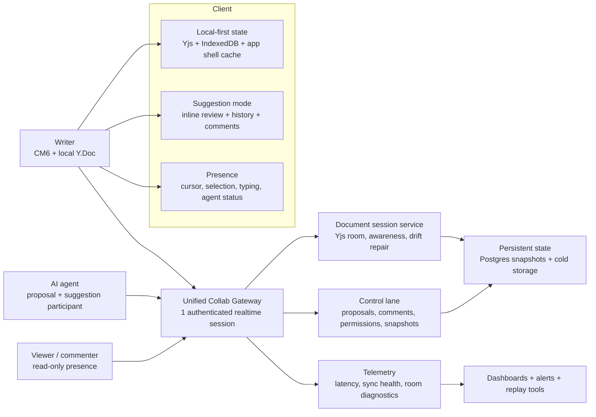

# Meridian Collab: Ideal State

This note defines the target shape for Meridian's real-time writing stack: Yjs for document state, CodeMirror 6 for editing, Go for transport/persistence, and AI edits that behave like first-class collaborators instead of side-channel mutations.

## Verified Current State

The repo is slightly ahead of the prompt in three areas:

| Area | Verified state | Evidence |
|---|---|---|
| Offline Yjs cache | Already uses `y-indexeddb` during bootstrap and steady-state caching | `frontend/src/features/documents/hooks/useDocumentCollab.ts` |
| Presence runtime | Frontend creates a Yjs awareness instance, but backend currently logs awareness frames instead of relaying them | `frontend/src/core/cm6-collab/sync/runtime.ts`, `backend/internal/handler/collab_document_handler.go` |
| Version history | Snapshot REST + version-history panel already exist | `backend/internal/handler/collab_snapshot.go`, `frontend/src/features/documents/components/VersionHistoryPanel.tsx` |

What is still materially true:

| Area | Current state | Assessment |
|---|---|---|
| Core sync | Yjs binary sync over document-scoped WS with in-memory server sessions | Sound foundation |
| AI edit path | Proposal-based review with auto-accept arbitration and partial hunk apply | Strong differentiator |
| Transport shape | Two WS connections, two Go websocket stacks, two auth/reconnect paths | Main architectural drag |
| Multi-user UX | No real presence/cursor UX yet; no shared commenting mode | High-value gap |
| Access control | Ownership-based only; no viewer/commenter/editor roles | Blocks safe sharing |
| Observability | Logs/tests exist, but no explicit CRDT health model or operator tooling | Reliability risk |

## North Star

The ideal Meridian experience is:

1. One realtime session per workspace, logically multiplexed into document channels.
2. Local-first startup from IndexedDB, then fast server reconciliation.
3. AI suggestions shown as reviewable changes, not surprising document jumps.
4. Lightweight presence that helps collaboration without turning writing into a noisy multiplayer game.
5. Version history that feels like Google Docs for prose and checkpoints that feel like Cursor for AI actions.

## Ideal State By Area

| Area | Ideal state | Patterns to adopt |
|---|---|---|
| Real-time collaboration | Keep Yjs as the source of truth for text, but expose human collaboration primitives: presence, selections, typed-but-not-persisted status, comment anchors, role-aware read-only sessions | Figma's "multiplayer is default", Google Docs/Linear live cursors, Liveblocks-style presence primitives |
| Yjs usage | Keep `y-indexeddb`; add cross-tab coordination, awareness relay, explicit room lifecycle, periodic compaction/snapshot repair, and selective undo origins for AI vs human changes | Yjs offline support, awareness CRDT, `trackedOrigins`, y-websocket cross-tab pattern |
| AI editing UX | Evolve from "proposal list + hunk accept" to "suggestion mode for prose": inline diff, side summary, batch accept/reject, AI identity, AI checkpoints, optional comment-thread rationale per suggestion | Word Track Changes, Google-style suggestions, Cursor/Windsurf diff acceptance, Copilot inline review |
| Transport | One websocket connection per workspace/session with logical channels: `doc-sync`, `awareness`, `proposal`, `comment`, `history`, `presence`; keep binary for Yjs payloads and JSON/CBOR envelopes for control traffic | Single authenticated multiplexed gateway; keep logical separation, remove physical split |
| Offline & resilience | Startup from IndexedDB in <100ms for cached docs, queue local intent while offline, reconcile on reconnect, and detect drift explicitly instead of assuming sync correctness | Local-first Yjs + service-worker app shell when desired; sampled drift checks |
| Version history & undo | Keep Yjs undo for local editing, but add named snapshots, AI checkpoints, timeline diff preview, restore without reload, and "branch from snapshot" for experimental rewrites | Google Docs version history, Cursor checkpoints, Figma-style restore points |
| Scale for 100+ chapters | Treat each chapter as the primary room boundary. Load only active chapters, prefetch adjacent metadata, and use subdocuments only when a parent artifact truly needs nested live state | Yjs subdocuments for lazy loading, not as the default for every document |
| Security & access | Room tokens should encode document/project role, mode (`edit`, `comment`, `view`), and expiry. Server must enforce write denial, comment-only behavior, and live permission downgrades | Google viewer/commenter/editor, Liveblocks-style room auth |
| Observability | Add room-level metrics, reconnect traces, state-vector mismatch detection, update decode failures, awareness fanout stats, and an internal inspector for room state | Liveblocks DevTools style room inspector, explicit sync-health SLOs |

## Gap Analysis

| Gap | Impact | Why it matters |
|---|---|---|
| Awareness is not relayed end-to-end | High | Multi-user writing without cursor/presence awareness feels broken, and AI-as-collaborator UX cannot become visible |
| Two realtime transports | High | Doubles auth, reconnect, heartbeat, error handling, and operational debugging |
| No cross-tab optimization for same doc | Medium | Same-browser duplicate tabs open duplicate sockets and miss the `BroadcastChannel` optimization common in Yjs providers |
| No role-aware realtime permissions | High | Blocks safe sharing, read-only viewers, and comment-only collaborators |
| AI edits are proposals, but not yet "suggestion mode" | High | Writers need prose-native review, rationale, and checkpoint recovery more than raw diff hunks |
| Observability is mostly logs/tests | High | Sync drift, replay loops, or dropped proposal events will be hard to diagnose in production |
| History exists but is not yet a full narrative workflow | Medium | Fiction writers need restore, compare, branch, and milestone naming at chapter scale |
| No explicit drift repair flow | Medium | CRDTs converge eventually, but bugs, persistence failures, or partial reconnect bugs still need detection and repair |
| No shared comments/annotations lane | Medium | Comment-only collaboration is often safer than live co-editing for editors/beta readers |
| No multi-instance scaling story for hot documents | Medium | Fine for MVP, but shared docs or agent-heavy traffic will outgrow single-process fanout |

## Recommendations

### Priority 0: Correct the architecture narrative

Document the actual state before new work:

| Action | Why |
|---|---|
| Treat offline Yjs as shipped, not future | Prevent duplicate work |
| Treat version history as partially shipped | Focus effort on restore/branching UX instead of raw storage |
| Treat awareness as half-built | Frontend/runtime exists; backend relay and UX are the real gap |

### Priority 1: Finish the collaboration baseline

| Recommendation | Why first |
|---|---|
| Relay awareness end-to-end and render remote cursors/selections conservatively | Highest visible multi-user win for lowest system risk |
| Add role-aware room auth (`viewer`, `commenter`, `editor`) | Required before external sharing |
| Add sync-health telemetry: connect latency, initial sync duration, decode failures, resync loops, drift detections | Prevents blind operation of a realtime system |
| Add sampled drift repair command: compare state digest after sync and force re-bootstrap when mismatched | Gives operators a recovery lever |

### Priority 2: Collapse transport complexity

Recommended target: one websocket, many logical channels.

| Decision | Recommendation |
|---|---|
| Two websocket connections | Replace with one authenticated collab session |
| Binary Yjs sync | Keep it |
| Proposal/control messages | Keep as separate logical message families on the same socket |
| WebTransport | Do not adopt yet |
| SSE | Use only for passive feeds or non-interactive observers |

Why:

| Benefit | Outcome |
|---|---|
| One auth handshake | Fewer reconnect bugs |
| One heartbeat/backoff strategy | Cleaner client state machine |
| One session ID across doc/proposal/history events | Better tracing |
| One permission envelope | Easier runtime downgrades |

Do not collapse the protocol semantics. Collapse the transport plumbing.

### Priority 3: Make AI edits feel native to writing

The current proposal model is correct. The UX needs to become more writer-native.

| Recommendation | Concrete behavior |
|---|---|
| Add suggestion mode | Render AI edits as insert/delete suggestions in-flow, not only as detached review hunks |
| Add AI rationale affordance | Optional collapsible note: "why this was suggested" |
| Add AI checkpoints | Every agent edit batch creates a reversible checkpoint separate from long-term version history |
| Add batch commands | Accept all in selection, accept by section, reject by suggestion source, revert last AI batch |
| Add visible AI presence | "Agent drafting paragraph 3" is better than silent background mutation |

Best fit for Meridian:

1. Keep CRDT state canonical.
2. Keep proposals as the server-side review unit.
3. Add a UI layer that presents those proposals like tracked changes plus section-aware summary.

### Priority 4: Productize history for fiction writers

Writers need more than auto snapshots.

| Capability | Ideal behavior |
|---|---|
| Named milestones | "Chapter 12 before rewrite", "Agent pass 3", "Editor notes applied" |
| Timeline preview | Read-only diff against current text before restore |
| Branch from snapshot | Fork a chapter rewrite without destroying current draft |
| Restore without reload | Keep editor/runtime alive; apply restored Yjs state as a controlled reset |
| AI vs human filters | Let writers inspect which versions were created by people vs accepted AI changes |

The key distinction:

| Mechanism | Purpose |
|---|---|
| Undo/redo | Short-horizon personal editing |
| Checkpoints | Short-horizon AI safety net |
| Snapshots/version history | Long-horizon narrative milestones |
| Branches | Experimental rewrites and alternate scenes |

### Priority 5: Prepare for scale without premature complexity

For a small team, chapter-per-room is the right default.

| Pattern | Recommendation |
|---|---|
| One novel as one giant Y.Doc | Avoid |
| One chapter/document per room | Default |
| Prefetch nearby chapters | Yes, metadata only |
| Yjs subdocuments | Use later for nested artifacts like book outlines or scene bundles |
| Multi-instance fanout | Add when needed via pub/sub or a managed sync layer |

Subdocuments are attractive, but they add lifecycle and provider complexity. Use them only when a parent artifact truly benefits from lazily loaded nested live docs.

## Industry Patterns Worth Adopting

| Product / ecosystem | Worth copying | Meridian adaptation |
|---|---|---|
| Figma | Multiplayer is default; reconnect path is simple; offline edits are replayed onto fresh state | Keep reconnect simple: local state + fresh authoritative state + replay/merge |
| Google Docs | Suggestion mode, comments, version history, viewer/commenter/editor roles | Build prose-native AI review and sharing modes |
| Microsoft Word | Track Changes offers explicit accept/reject semantics and reviewer attribution | Use this mental model for AI + human editor suggestions |
| Linear | Live cursors in docs, inline comments, realtime autosave, revert to previous content | Light presence and comment workflows fit writers better than heavy multiplayer chrome |
| Cursor | Automatic checkpoints after agent changes | Create AI batch checkpoints for reversible editing |
| Windsurf / Copilot | Inline edit diffs with accept/reject/follow-up | Keep AI review inside the editor surface, not only in a side panel |
| Liveblocks | Presence primitives, room auth, devtools/monitoring | Build internal room inspector and clearer auth boundaries |
| Yjs docs | `y-indexeddb`, awareness, selective undo origins, subdocument lazy loading, provider meshing | Stay close to ecosystem defaults unless there is a Meridian-specific reason to diverge |

## Recommended End State

| Layer | Ideal Meridian state |
|---|---|
| Editor runtime | CM6 + Yjs + awareness + selective undo + local-first cache |
| Realtime session | One multiplexed authenticated WS session per workspace |
| Document model | Chapter/document room boundary; optional subdocs for nested live artifacts |
| AI review model | Proposal-backed suggestion mode with AI checkpoints |
| Collaboration modes | View, comment, edit, agent |
| Persistence | Debounced state writes, snapshots, named milestones, cold history archive |
| Recovery | Drift detection, force-resync, restore without reload |
| Observability | Room inspector, traces, room metrics, alerting on sync failures |

## Build Order

| Order | Build | Expected payoff |
|---|---|---|
| 1 | Awareness relay + remote cursor UX + role-aware auth | Immediate collaboration credibility |
| 2 | Realtime observability + drift repair | Reliability foundation |
| 3 | Single multiplexed collab websocket | Simplifies all future work |
| 4 | Suggestion-mode AI UX + AI checkpoints | Biggest writer-facing differentiator |
| 5 | Comments / comment-only mode | Safer collaboration for editors and beta readers |
| 6 | Restore-without-reload + branch-from-snapshot | Strong long-form writing workflow |
| 7 | Cross-tab optimization + multi-instance scaling | Efficiency and future headroom |
| 8 | Subdocuments / advanced sharding | Only when chapter-per-room is insufficient |

## Anti-Recommendations

| Tempting move | Why not now |
|---|---|
| Switch away from Yjs | No evidence the core CRDT choice is the problem |
| Adopt WebTransport immediately | Browser availability and ecosystem maturity are not strong enough for a small team shipping text collaboration |
| Model the whole novel as one live CRDT room | Unnecessary memory/load complexity for 100+ chapter serials |
| Build OT fallback | Adds major complexity without a concrete product win |
| Overbuild presence | Writers need helpful signals, not a multiplayer arcade |

## External References

| Topic | Source |
|---|---|
| Yjs offline support | https://docs.yjs.dev/getting-started/allowing-offline-editing |
| Yjs awareness | https://docs.yjs.dev/getting-started/adding-awareness |
| y-websocket transport, cross-tab, scaling notes | https://docs.yjs.dev/ecosystem/connection-provider/y-websocket |
| Yjs undo manager | https://docs.yjs.dev/api/undo-manager |
| Yjs subdocuments | https://docs.yjs.dev/api/subdocuments |
| Figma multiplayer architecture | https://www.figma.com/blog/how-figmas-multiplayer-technology-works/ |
| Google sharing roles + version history workflow | https://support.google.com/a/users/answer/9296687 |
| Microsoft Word track changes | https://support.microsoft.com/en-us/office/track-changes-in-word-197ba630-0f5f-4a8e-9a77-3712475e806a |
| Microsoft Word accept/reject flow | https://support.microsoft.com/en-us/office/accept-or-reject-tracked-changes-in-word-b2dac7d8-f497-4e94-81bd-d64e62eee0e8 |
| Microsoft 365 version history | https://support.microsoft.com/en-us/office/view-previous-versions-of-office-files-5c1e076f-a9c9-41b8-8ace-f77b9642e2c2 |
| Linear collaborative docs | https://linear.app/docs/issue-documents |
| Linear comments | https://linear.app/docs/comment-on-issues |
| Cursor checkpoints | https://docs.cursor.com/en/agent/chat/checkpoints |
| Cursor multiline diff suggestions | https://docs.cursor.com/tab/overview |
| Windsurf inline edit diffs | https://docs.windsurf.com/command/plugins-overview |
| Copilot next edit suggestions | https://code.visualstudio.com/updates/v1_100 |
| Copilot inline review / apply-discard flow | https://docs.github.com/copilot/how-tos/use-copilot-agents/request-a-code-review/use-code-review |
| MDN WebSocket | https://developer.mozilla.org/en-US/docs/Web/API/WebSockets_API/index.html |
| MDN WebTransport | https://developer.mozilla.org/en-US/docs/Web/API/WebTransport_API |
| MDN SSE / EventSource | https://developer.mozilla.org/en-US/docs/Web/API/EventSource |
| Liveblocks DevTools | https://liveblocks.io/docs/tools/devtools |
| Liveblocks collaboration + version history / presence examples | https://liveblocks.io/presence |
